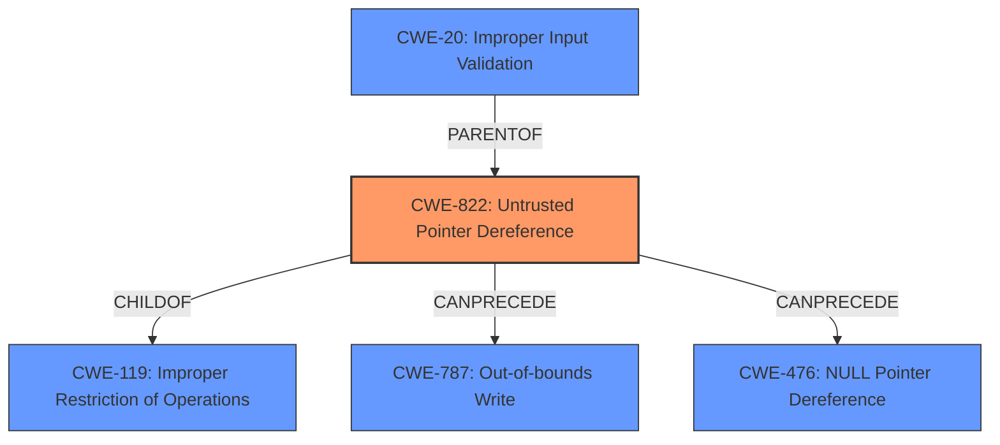

# Enhanced Analysis for CVE-2020-12985

# Summary
| CWE ID    | CWE Name                                                                              | Confidence | CWE Abstraction Level | CWE Vulnerability Mapping Label | CWE-Vulnerability Mapping Notes |
| :-------- | :------------------------------------------------------------------------------------ | :--------- | :-------------------- | :------------------------------ | :---------------------------- |
| **CWE-822** | **Untrusted Pointer Dereference**                                                     | 0.85       | Base                  | Primary                         | Allowed                       |
| CWE-20    | Improper Input Validation                                                               | 0.60       | Class                 | Secondary                       | Discouraged                   |
| CWE-476   | NULL Pointer Dereference                                                              | 0.50       | Base                  | Secondary                       | Allowed                       |
| CWE-787   | Out-of-bounds Write                                                                   | 0.50       | Base                  | Secondary                       | Allowed                       |

## Evidence and Confidence

*   **Confidence Score:** 0.80
*   **Evidence Strength:** HIGH

## Relationship Analysis
The primary CWE is CWE-822 **Untrusted Pointer Dereference**, which is a base level CWE. CWE-822 is related to CWE-119 **Improper Restriction of Operations within the Bounds of a Memory Buffer**, as dereferencing an untrusted pointer can lead to memory corruption. CWE-822 can also precede CWE-787 **Out-of-bounds Write** or CWE-125 **Out-of-bounds Read**. CWE-20 **Improper Input Validation** is a class level CWE and is a parent of CWE-822 which makes it less specific than CWE-822. CWE-476 **NULL Pointer Dereference** and CWE-787 **Out-of-bounds Write** are also possible outcomes of the **insufficient pointer validation**.



## Vulnerability Chain
The vulnerability chain starts with the **insufficient pointer validation**, which leads to an **untrusted pointer dereference** (CWE-822). Dereferencing this pointer can then lead to out-of-bounds write (CWE-787), a NULL pointer dereference (CWE-476), or other memory corruption issues.

## Summary of Analysis
The vulnerability description clearly states the root cause as "**insufficient pointer validation**" in the AMD Graphics Driver. The CVE Reference Links Content Summary reinforces this by stating, "Insufficient pointer validation in the AMD Graphics Driver for Windows 10." The most appropriate CWE to map to this vulnerability is CWE-822 **Untrusted Pointer Dereference** because the product obtains a value from an untrusted source, converts this value to a pointer, and dereferences the resulting pointer. This aligns well with the description of CWE-822. The retriever results also list CWE-822.

CWE-20 **Improper Input Validation** was considered but is too general. The description mentions "**insufficient pointer validation**" making CWE-822 a more specific match. While input validation is a part of the problem, the core issue is that a pointer from an untrusted source is being dereferenced. CWE-20 is also discouraged as it is a Class level CWE.

CWE-476 **NULL Pointer Dereference** and CWE-787 **Out-of-bounds Write** were considered as possible consequences of the **insufficient pointer validation**, but they are impacts, not root causes. They are also contingent: dereferencing an invalid pointer *might* lead to a NULL pointer dereference or an out-of-bounds write, but it doesn't necessarily have to. Therefore, they are secondary concerns.

The selection of CWE-822 is at the optimal level of specificity because it accurately captures the root cause of the vulnerability (an untrusted pointer is being dereferenced) based on the provided evidence.


## CWE Relationship Analysis

Current CWEs represent these abstraction levels: .


### Vulnerability Chain Analysis

**Chain starting from CWE-476:**
- 476 (NULL Pointer Dereference) - ROOT


**Chain starting from CWE-787:**
- 787 (Out-of-bounds Write) - ROOT


### CWE Relationship Diagram

```mermaid
graph TD
    classDef primary fill:#f96,stroke:#333,stroke-width:2px
    classDef secondary fill:#69f,stroke:#333
    classDef tertiary fill:#9e9,stroke:#333
```