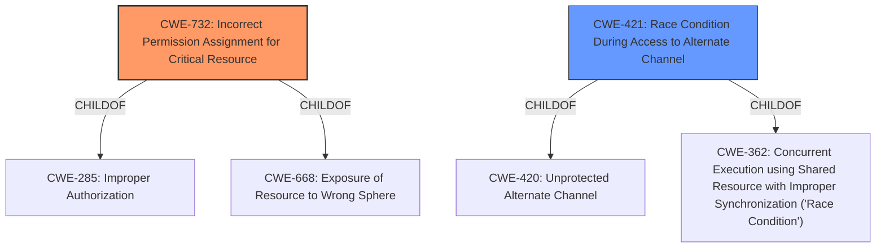

# Raw Analyzer Response for CVE-2020-13173

# Summary
| CWE ID | CWE Name | Confidence | CWE Abstraction Level | CWE Vulnerability Mapping Label | CWE-Vulnerability Mapping Notes |
|---|---|---|---|---|---|
| CWE-732 | Incorrect Permission Assignment for Critical Resource | 0.9 | Class | Primary CWE | Allowed-with-Review |
| CWE-421 | Race Condition During Access to Alternate Channel | 0.7 | Base | Secondary Candidate | Allowed |

## Evidence and Confidence

*   **Confidence Score:** 0.8
*   **Evidence Strength:** HIGH

## Relationship Analysis
The primary CWE selected is CWE-732 (Incorrect Permission Assignment for Critical Resource), which is a Class-level CWE. It is related to CWE-285 (Improper Authorization) and CWE-668 (Exposure of Resource to Wrong Sphere) as a child. A secondary CWE considered is CWE-421 (Race Condition During Access to Alternate Channel), which is a Base-level CWE and is a child of CWE-420 and CWE-362. The relationship between CWE-421 and CWE-732 suggests that the race condition might enable access to a resource that has been assigned incorrect permissions.

## Vulnerability Chain
The vulnerability chain starts with the creation of an **insecure named pipe** (CWE-732), which can be exploited by an attacker pre-installing an application. If the attacker wins the race condition (CWE-421), they can intercept sensitive information and potentially elevate privileges.

## Summary of Analysis
The vulnerability description indicates that the Teradici PCoIP Standard Agent for Windows and PCoIP Graphics Agent for Windows creates an **insecure named pipe**. This **insecure named pipe** allows an attacker to intercept sensitive information or possibly elevate privileges.

The primary CWE is CWE-732 (Incorrect Permission Assignment for Critical Resource). The vulnerability description states that the **insecure named pipe** is created during the initialization of the pcoip_credential_provider. This aligns with the description of CWE-732, which states that the product specifies permissions for a security-critical resource in a way that allows that resource to be read or modified by unintended actors. The "**insecure named pipe**" directly implies an issue with how permissions or access controls were assigned.

The retriever also listed CWE-421 (Race Condition During Access to Alternate Channel) as a high scoring CWE. The vulnerability description mentions that an attacker can "intercept sensitive information or possibly elevate privileges via pre-installing an application which acquires that named pipe." The "**pre-installing an application which acquires that named pipe**" part indicates a race condition where the attacker tries to acquire the named pipe before the legitimate application does. This aligns with the description of CWE-421, which states that the product opens an alternate channel to communicate with an authorized user, but the channel is accessible to other actors. The "pre-installing" of the malicious application before the authorized application suggests a race condition in accessing the named pipe.

CWE-732 is chosen as the primary weakness because the root cause lies in the **incorrect assignment of permissions** to the named pipe, making it accessible to unintended actors. While CWE-421 describes a race condition that *could* occur, it is secondary to the fact that the named pipe should not have been accessible to the attacker in the first place.

The selection of CWE-732 is further supported by the Mapping Guidance, which notes that CWE-732 is often misused for vulnerabilities in which "permissions" are not checked. In this case, the **insecure named pipe** strongly indicates a failure to properly assign permissions, fitting the intended use of CWE-732.

Other CWEs were considered but ultimately rejected. CWE-285 (Improper Authorization) is a Class-level CWE and is too general. CWE-250 (Execution with Unnecessary Privileges) does not fit the scenario, as the issue is not about executing with unnecessary privileges but about the **incorrect permissions** on the named pipe. CWE-427 (Uncontrolled Search Path Element) is not relevant, as the vulnerability is not related to search paths.

The final decision is based on the available evidence, relationship analysis, and mapping guidance, with a focus on identifying the root cause of the vulnerability.