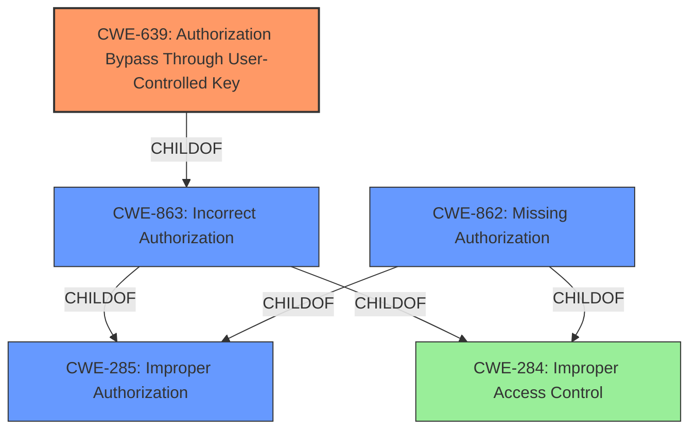

# Analysis for CVE-2020-13263

# Summary
| CWE ID | CWE Name | Confidence | CWE Abstraction Level | CWE Vulnerability Mapping Label | CWE-Vulnerability Mapping Notes |
|---|---|---|---|---|---|
| CWE-639 | Authorization Bypass Through User-Controlled Key | 0.9 | Base | Allowed | Primary CWE |
| CWE-863 | Incorrect Authorization | 0.7 | Class | Allowed-with-Review | Secondary Candidate |
| CWE-285 | Improper Authorization | 0.6 | Class | Discouraged | Secondary Candidate |
| CWE-862 | Missing Authorization | 0.5 | Class | Allowed-with-Review | Secondary Candidate |

## Evidence and Confidence

*   **Confidence Score:** 0.9
*   **Evidence Strength:** HIGH

## Relationship Analysis
The primary CWE selected is CWE-639, which is a child of CWE-863, which in turn is a child of CWE-285 and CWE-284. The relationships indicate that the vulnerability involves an authorization issue at its core, and CWE-639 represents a specific type of authorization bypass. CWE-862 is a peer of CWE-863 and could also be considered, but the specific mechanism described in CWE-639 makes it a better fit. The abstraction levels influenced the selection by favoring the more specific Base level CWE-639 over the broader Class level CWEs.

## Vulnerability Chain
The vulnerability chain begins with an **authorization issue** stemming from the failure to remove the `project.mirror_user` relationship when a project mirror is removed. This **inconsistent state management** allows a maintainer to create a new pull mirror and assign the old mirror user to it, leading to **inadequate access control**. This allows a temporary maintainer to set up a mirror using a permanent maintainer's account, enabling **backdoor access** and the ability to push commits with maintainer privileges, ultimately resulting in **privilege escalation**.

## Summary of Analysis
The initial assessment identified an **authorization issue** that allows unauthorized users to impersonate a maintainer. The key evidence supporting this assessment is the "Vulnerability Description Key Phrases" which identifies "**authorization issue**" as a rootcause. The "CVE Reference Links Content Summary" confirms that the vulnerability is due to **inconsistent state management** and **inadequate access control**, where the system **fails to properly clear the association** between a project and its mirror user when the mirror is removed.

The graph relationships influenced the final selection by highlighting that the vulnerability involved a chain of authorization weaknesses, with CWE-639 being the most specific and relevant to the identified mechanism. The decision to select CWE-639 is based on the evidence that a user-controlled key (the assignment of the old mirror user) is used to bypass authorization checks, allowing impersonation.

The selected CWEs are at the optimal level of specificity because CWE-639 directly describes the authorization bypass mechanism, while the other CWEs represent broader categories of authorization failures.
Relevant CWE Information:

# Enhanced Context (25 CWEs)
The following CWEs were identified as potentially relevant to this vulnerability:

## CWE-639: Authorization Bypass Through User-Controlled Key
**Abstraction Level**: Base
**Similarity Score**: 0.78
**Source**: dense

**Description**:
The system's authorization functionality does not prevent one user from gaining access to another user's data or record by modifying the key value identifying the data.

**Mapping Guidance**:
- Usage: Allowed
- Rationale: This CWE entry is at the Base level of abstraction, which is a preferred level of abstraction for mapping to the root causes of vulnerabilities.

**Rationale:**
CWE-639 accurately describes the vulnerability: The system's authorization functionality does not prevent one user from gaining access to another user's data or record by modifying the key value identifying the data. A maintainer can assign a mirror user other than themselves, violating the intended restriction that only they can be the mirror user.

## CWE-863: Incorrect Authorization
**Abstraction Level**: Class
**Similarity Score**: 5744.69
**Source**: sparse

**Description**:
The product performs an authorization check when an actor attempts to access a resource or perform an action, but it does not correctly perform the check.

**Mapping Guidance**:
- Usage: Allowed-with-Review
- Rationale: This CWE entry is a Class and might have Base-level children that would be more appropriate

**Rationale:**
CWE-863 could be applicable as the authorization check is not correctly performed, allowing the bypass. However, CWE-639 provides a more specific description of the **incorrect authorization** mechanism.

## CWE-285: Improper Authorization
**Abstraction Level**: Class
**Similarity Score**: 5717.96
**Source**: sparse

**Description**:
The product does not perform or incorrectly performs an authorization check when an actor attempts to access a resource or perform an action.

**Mapping Guidance**:
- Usage: Discouraged
- Rationale: CWE-285 is high-level and lower-level CWEs can frequently be used instead. It is a level-1 Class (i.e., a child of a Pillar).

**Rationale:**
CWE-285 is a more general classification of **improper authorization**. While accurate, it is less descriptive than CWE-639.

## CWE-862: Missing Authorization
**Abstraction Level**: Class
**Similarity Score**: 5298.49
**Source**: sparse

**Description**:
The product does not perform an authorization check when an actor attempts to access a resource or perform an action.

**Mapping Guidance**:
- Usage: Allowed-with-Review
- Rationale: This CWE entry is a Class and might have Base-level children that would be more appropriate

**Rationale:**
CWE-862 is less applicable because an authorization check *is* performed, but it is performed incorrectly, not missing entirely.