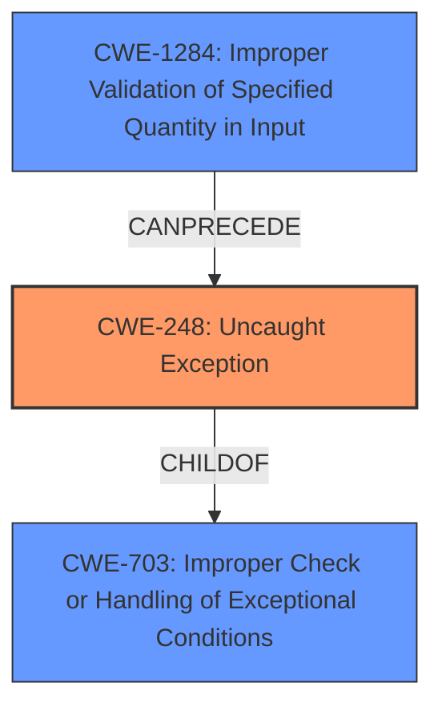

# Analysis for CVE-2020-13410

# Summary
| CWE ID    | CWE Name                                                     | Confidence | CWE Abstraction Level | CWE Vulnerability Mapping Label | CWE-Vulnerability Mapping Notes |
| :-------- | :----------------------------------------------------------- | :--------- | :---------------------- | :------------------------------ | :------------------------------ |
| CWE-248   | Uncaught Exception                                           | 0.9        | Base                    | Primary                         | Allowed                       |
| CWE-703   | Improper Check or Handling of Exceptional Conditions        | 0.7        | Pillar                    | Secondary                        | Discouraged                     |
| CWE-1284  | Improper Validation of Specified Quantity in Input | 0.6        | Base                    | Secondary                        | Allowed                     |

## Evidence and Confidence

*   **Confidence Score:** 0.8
*   **Evidence Strength:** HIGH

## Relationship Analysis
The primary relationship that impacts the CWE selection is that CWE-248 (Uncaught Exception) is a child of CWE-703 (Improper Check or Handling of Exceptional Conditions). While CWE-703 is broader, CWE-248 provides a more specific classification of the vulnerability, aligning with the vulnerability description that emphasizes the exception not being caught.
CWE-1284 can precede CWE-248, so the lack of input validation can lead to an uncaught exception.

## Vulnerability Chain
The vulnerability chain starts with the receipt of an invalid MQTT packet. The **lack of input validation (CWE-1284)** leads to the execution of code that attempts to write this invalid packet to a stream. During this write operation, an exception is thrown, but it is not caught, leading to the **uncaught exception (CWE-248)**, which results in a crash of the MQTT broker. The final impact is a denial of service.

## Summary of Analysis
The initial assessment identified a vulnerability in MoscaJS Aedes where an invalid packet leads to a crash due to an uncaught exception. The analysis centered on identifying the root cause and weaknesses that contribute to this vulnerability.

The primary CWE, CWE-248 (Uncaught Exception), was selected because the core issue is that the application does not catch an exception thrown during the writing of an invalid packet, leading to a crash. This is directly supported by the vulnerability description and the CVE Reference Links Content Summary.

The relationship analysis shows that CWE-248 is a child of CWE-703 (Improper Check or Handling of Exceptional Conditions). While CWE-703 is a broader category, CWE-248 is more specific and accurately describes the vulnerability. The CVE Reference Links Content Summary also mentions that the application does not validate the header and message length before processing, which maps to CWE-1284 (Improper Validation of Specified Quantity in Input). The fact that the input is not validated properly leads to the exception.

The evidence for CWE-248 is extracted from the CVE Reference Links Content Summary: "The vulnerability stems from improper error handling within the `writeNumberCached` function of the aedes MQTT broker when processing a crafted payload...the stream.write() function fails because the datatype becomes an undefined array with -1 as the packet ID." This shows that an error occurs during the writing of the packet, but it is not handled, resulting in the crash.

The selected CWEs are at the optimal level of specificity. CWE-248 directly describes the uncaught exception, while CWE-1284 explains the cause of the exception which is the lack of proper validation.

Relevant CWE Information:

# Enhanced Context (25 CWEs)
The following CWEs were identified as potentially relevant to this vulnerability:

## CWE-789: Memory Allocation with Excessive Size Value
**Abstraction Level**: Variant
**Similarity Score**: 0.78
**Source**: dense

**Description**:
The product allocates memory based on an untrusted, large size value, but it does not ensure that the size is within expected limits, allowing arbitrary amounts of memory to be allocated.

**Mapping Guidance**:
- Usage: Allowed
- Rationale: This CWE entry is at the Variant level of abstraction, which is a preferred level of abstraction for mapping to the root causes of vulnerabilities.

## CWE-191: Integer Underflow (Wrap or Wraparound)
**Abstraction Level**: Base
**Similarity Score**: 0.77
**Source**: dense

**Description**:
The product subtracts one value from another, such that the result is less than the minimum allowable integer value, which produces a value that is not equal to the correct result.

**Mapping Guidance**:
- Usage: Allowed
- Rationale: This CWE entry is at the Base level of abstraction, which is a preferred level of abstraction for mapping to the root causes of vulnerabilities.

## CWE-131: Incorrect Calculation of Buffer Size
**Abstraction Level**: Base
**Similarity Score**: 0.77
**Source**: dense

**Description**:
The product does not correctly calculate the size to be used when allocating a buffer, which could lead to a buffer overflow.

**Mapping Guidance**:
- Usage: Allowed
- Rationale: This CWE entry is at the Base level of abstraction, which is a preferred level of abstraction for mapping to the root causes of vulnerabilities.

## CWE-703: Improper Check or Handling of Exceptional Conditions
**Abstraction Level**: Pillar
**Similarity Score**: 0.77
**Source**: dense

**Description**:
The product does not properly anticipate or handle exceptional conditions that rarely occur during normal operation of the product.

**Mapping Guidance**:
- Usage: Discouraged
- Rationale: This CWE entry is extremely high-level, a Pillar.

## CWE-667: Improper Locking
**Abstraction Level**: Class
**Similarity Score**: 0.76
**Source**: dense

**Description**:
The product does not properly acquire or release a lock on a resource, leading to unexpected resource state changes and behaviors.

**Mapping Guidance**:
- Usage: Allowed-with-Review
- Rationale: This CWE entry is a Class and might have Base-level children that would be more appropriate

## CWE-404: Improper Resource Shutdown or Release
**Abstraction Level**: Class
**Similarity Score**: 0.76
**Source**: dense

**Description**:
The product does not release or incorrectly releases a resource before it is made available for re-use.

**Mapping Guidance**:
- Usage: Allowed-with-Review
- Rationale: This CWE entry is a Class and might have Base-level children that would be more appropriate

## CWE-193: Off-by-one Error
**Abstraction Level**: Base
**Similarity Score**: 0.76
**Source**: dense

**Description**:
A product calculates or uses an incorrect maximum or minimum value that is 1 more, or 1 less, than the correct value.

**Mapping Guidance**:
- Usage: Allowed
- Rationale: This CWE entry is at the Base level of abstraction, which is a preferred level of abstraction for mapping to the root causes of vulnerabilities.

## CWE-407: Inefficient Algorithmic Complexity
**Abstraction Level**: Class
**Similarity Score**: 0.76
**Source**: dense

**Description**:
An algorithm in a product has an inefficient worst-case computational complexity that may be detrimental to system performance and can be triggered by an attacker, typically using crafted manipulations that ensure that the worst case is being reached.

**Mapping Guidance**:
- Usage: Allowed-with-Review
- Rationale: This CWE entry is a Class and might have Base-level children that would be more appropriate

## CWE-125: Out-of-bounds Read
**Abstraction Level**: Base
**Similarity Score**: 0.76
**Source**: dense

**Description**:
The product reads data past the end, or before the beginning, of the intended buffer.

**Mapping Guidance**:
- Usage: Allowed
- Rationale: This CWE entry is at the Base level of abstraction, which is a preferred level of abstraction for mapping to the root causes of vulnerabilities.

## CWE-129: Improper Validation of Array Index
**Abstraction Level**: Variant
**Similarity Score**: 0.76
**Source**: dense

**Description**:
The product uses untrusted input when calculating or using an array index, but the product does not validate or incorrectly validates the index to ensure the index references a valid position within the array.

**Mapping Guidance**:
- Usage: Allowed
- Rationale: This CWE entry is at the Variant level of abstraction, which is a preferred level of abstraction for mapping to the root causes of vulnerabilities.

## CWE-1284: Improper Validation of Specified Quantity in Input
**

# Enhanced Query for CVE-2020-13410

## Vulnerability Description
An issue was discovered in MoscaJS Aedes 0.42.0. lib/write.js does not properly consider exceptions during the writing of an invalid packet to a stream.

### Vulnerability Description Key Phrases
- **vector:** invalid packet
- **product:** MoscaJS Aedes
- **version:** 0.42.0
- **component:** lib/write.js

## CVE Reference Links Content Summary
Based on the provided content, here's the breakdown of CVE-2020-13410:

**Root Cause of Vulnerability:**
The vulnerability stems from improper error handling within the `writeNumberCached` function of the aedes MQTT broker when processing a crafted payload. This payload has a published header and message length of 0. Specifically, when trying to create a packet for Publish Release, the stream.write() function fails because the datatype becomes an undefined array with -1 as the packet ID.

**Weaknesses/Vulnerabilities Present:**
- Improper error handling: The application fails to manage errors correctly when processing specific invalid MQTT packets.
- Lack of input validation: The application doesn't validate the header and message length before processing.

**Impact of Exploitation:**
- Denial of Service (DoS): The vulnerability allows an attacker to crash the aedes MQTT broker, making it unavailable to legitimate users.

**Attack Vectors:**
- Sending a specifically crafted MQTT payload: An attacker sends a malformed MQTT packet with a published header and message length set to 0.

**Required Attacker Capabilities/Position:**
- Network Access: The attacker needs to be able to send network packets to the MQTT broker.
- Knowledge of MQTT Protocol: The attacker needs some knowledge of the MQTT protocol to craft the specific malicious payload.

**Additional Notes:**
- The fix for this issue was implemented in this commit: https://github.com/moscajs/aedes/pull/493. The fix includes catching writeToStream errors, which prevents the server from crashing.
- The vulnerability was reported on May 18, 2020, and fixed on May 22, 2020.
- The vulnerability was discovered by Arun Magesh.

## Retriever Results

### Top Combined Results

| Rank | CWE ID | Name | Abstraction | Usage  | Retrievers | Individual Scores |
|------|--------|------|-------------|-------|------------|-------------------|
| 1 | 248 | Uncaught Exception | Base | Allowed | sparse | 0.078 |
| 2 | 703 | Improper Check or Handling of Exceptional Conditions | Pillar | Discouraged | sparse | 0.056 |
| 3 | 833 | Deadlock | Base | Allowed | sparse | 0.050 |
| 4 | 606 | Unchecked Input for Loop Condition | Base | Allowed | sparse | 0.047 |
| 5 | 1284 | Improper Validation of Specified Quantity in Input | Base | Allowed | sparse | 0.046 |
| 6 | 770 | Allocation of Resources Without Limits or Throttling | Base | Allowed | dense | 0.474 |
| 7 | 390 | Detection of Error Condition Without Action | Base | Allowed | graph | 0.003 |
| 8 | 787 | Out-of-bounds Write | Base | Allowed | sparse | 0.046 |
| 9 | 407 | Inefficient Algorithmic Complexity | Class | Allowed-with-Review | sparse | 0.046 |
| 10 | 122 | Heap-based Buffer Overflow | Variant | Allowed | sparse | 0.046 |

# Complete CWE Specifications

## CWE-248: Uncaught Exception
**Abstraction:** Base
**Status:** Draft

### Description
An exception is thrown from a function, but it is not caught.

### Extended Description
When an exception is not caught, it may cause the program to crash or expose sensitive information.

### Alternative Terms
None

### Relationships
ChildOf -> CWE-705
ChildOf -> CWE-755
ChildOf -> CWE-703
ChildOf -> CWE-703

### Mapping Guidance
**Usage:** Allowed
**Rationale:** This CWE entry is at the Base level of abstraction, which is a preferred level of abstraction for mapping to the root causes of vulnerabilities.
**Comments:** Carefully read both the name and description to ensure that this mapping is an appropriate fit. Do not try to 'force' a mapping to a lower-level Base/Variant simply to comply with this preferred level of abstraction.
**Reasons:**
- Acceptable-Use

### Observed Examples
- **CVE-2023-41151:** SDK for OPC Unified Architecture (OPC UA) server has uncaught exception when a socket is blocked for writing but the server tries to send an error
- **CVE-2023-21087:** Java code in a smartphone OS can encounter a "boot loop" due to an uncaught exception

## CWE-703: Improper Check or Handling of Exceptional Conditions
**Abstraction:** Pillar
**Status:** Incomplete

### Description
The product does not properly anticipate or handle exceptional conditions that rarely occur during normal operation of the product.

### Extended Description
Not provided

### Alternative Terms
None

### Relationships
None

### Mapping Guidance
**Usage:** Discouraged
**Rationale:** This CWE entry is extremely high-level, a Pillar.
**Comments:** Consider children or descendants of this entry instead.
**Reasons:**
- Abstraction

### Additional Notes
**[Relationship]** This is a high-level class that might have some overlap with other classes. It could be argued that even "normal" weaknesses such as buffer overflows involve unusual or exceptional conditions. In that sense, this might be an inherent aspect of most other weaknesses within CWE, similar to API Abuse (CWE-227) and Indicator of Poor Code Quality (CWE-398). However, this entry is currently intended to unify disparate concepts that do not have other places within the Research Concepts view (CWE-1000).

### Observed Examples
- **[REF-1374]:** Chain: JavaScript-based cryptocurrency library can fall back to the insecure Math.random() function instead of reporting a failure (CWE-392), thus reducing the entropy (CWE-332) and leading to generation of non-unique cryptographic keys for Bitcoin wallets (CWE-1391)
- **CVE-2022-22224:** Chain: an operating system does not properly process malformed Open Shortest Path First (OSPF) Type/Length/Value Identifiers (TLV) (CWE-703), which can cause the process to enter an infinite loop (CWE-835)

## CWE-833: Deadlock
**Abstraction:** Base
**Status:** Incomplete

### Description
The product contains multiple threads or executable segments that are waiting for each other to release a necessary lock, resulting in deadlock.

### Extended Description
Not provided

### Alternative Terms
None

### Relationships
ChildOf -> CWE-667
ChildOf -> CWE-662

### Mapping Guidance
**Usage:** Allowed
**Rationale:** This CWE entry is at the Base level of abstraction, which is a preferred level of abstraction for mapping to the root causes of vulnerabilities.
**Comments:** Carefully read both the name and description to ensure that this mapping is an appropriate fit. Do not try to 'force' a mapping to a lower-level Base/Variant simply to comply with this preferred level of abstraction.
**Reasons:**
- Acceptable-Use

### Observed Examples
- **CVE-1999-1476:** A bug in some Intel Pentium processors allow DoS (hang) via an invalid "CMPXCHG8B" instruction, causing a deadlock
- **CVE-2009-2857:** OS deadlock
- **CVE-2009-1961:** OS deadlock involving 3 separate functions

## CWE-606: Unchecked Input for Loop Condition
**Abstraction:** Base
**Status:** Draft

### Description
The product does not properly check inputs that are used for loop conditions, potentially leading to a denial of service or other consequences because of excessive looping.

### Extended Description
Not provided

### Alternative Terms
None

### Relationships
ChildOf -> CWE-1284
CanPrecede -> CWE-834

### Mapping Guidance
**Usage:** Allowed
**Rationale:** This CWE entry is at the Base level of abstraction, which is a preferred level of abstraction for mapping to the root causes of vulnerabilities.
**Comments:** Carefully read both the name and description to ensure that this mapping is an appropriate fit. Do not try to 'force' a mapping to a lower-level Base/Variant simply to comply with this preferred level of abstraction.
**Reasons:**
- Acceptable-Use

## CWE-1284: Improper Validation of Specified Quantity in Input
**Abstraction:** Base
**Status:** Incomplete

### Description
The product receives input that is expected to specify a quantity (such as size or length), but it does not validate or incorrectly validates that the quantity has the required properties.

### Extended Description

Specified quantities include size, length, frequency, price, rate, number of operations, time, and others. Code may rely on specified quantities to allocate resources, perform calculations, control iteration, etc. When the quantity is not properly validated, then attackers can specify malicious quantities to cause excessive resource allocation, trigger unexpected failures, enable buffer overflows, etc.

### Alternative Terms
None

### Relationships
ChildOf -> CWE-20
ChildOf -> CWE-20
CanPrecede -> CWE-789

### Mapping Guidance
**Usage:** Allowed
**Rationale:** This CWE entry is at the Base level of abstraction, which is a preferred level of abstraction for mapping to the root causes of vulnerabilities.
**Comments:** Carefully read both the name and description to ensure that this mapping is an appropriate fit. Do not try to 'force' a mapping to a lower-level Base/Variant simply to comply with this preferred level of abstraction.
**Reasons:**
- Acceptable-Use

### Additional Notes
**[Maintenance]** This entry is still under development and will continue to see updates and content improvements.

### Observed Examples
- **CVE-2022-21668:** Chain: Python library does not limit the resources used to process images that specify a very large number of bands (CWE-1284), leading to excessive memory consumption (CWE-789) or an integer overflow (CWE-190).
- **CVE-2008-1440:** lack of validation of length field leads to infinite loop
- **CVE-2008-2374:** lack of validation of string length fields allows memory consumption or buffer over-read

## CWE-770: Allocation of Resources Without Limits or Throttling
**Abstraction:** Base
**Status:** Incomplete

### Description
The product allocates a reusable resource or group of resources on behalf of an actor without imposing any restrictions on the size or number of resources that can be allocated, in violation of the intended security policy for that actor.

### Extended Description

Code frequently has to work with limited resources, so programmers must be careful to ensure that resources are not consumed too quickly, or too easily. Without use of quotas, resource limits, or other protection mechanisms, it can be easy for an attacker to consume many resources by rapidly making many requests, or causing larger resources to be used than is needed. When too many resources are allocated, or if a single resource is too large, then it can prevent the code from working correctly, possibly leading to a denial of service.

### Alternative Terms
None

### Relationships
ChildOf -> CWE-400
ChildOf -> CWE-665
ChildOf -> CWE-400

### Mapping Guidance
**Usage:** Allowed
**Rationale:** This CWE entry is at the Base level of abstraction, which is a preferred level of abstraction for mapping to the root causes of vulnerabilities.
**Comments:** Carefully read both the name and description to ensure that this mapping is an appropriate fit. Do not try to 'force' a mapping to a lower-level Base/Variant simply to comply with this preferred level of abstraction.
**Reasons:**
- Acceptable-Use

### Additional Notes
**[Relationship]** This entry is different from uncontrolled resource consumption (CWE-400) in that there are other weaknesses that are related to inability to control resource consumption, such as holding on to a resource too long after use, or not correctly keeping track of active resources so that they can be managed and released when they are finished (CWE-771).

**[Theoretical]** Vulnerability theory is largely about how behaviors and resources interact. "Resource exhaustion" can be regarded as either a consequence or an attack, depending on the perspective. This entry is an attempt to reflect one of the underlying weaknesses that enable these attacks (or consequences) to take place.

### Observed Examples
- **CVE-2022-21668:** Chain: Python library does not limit the resources used to process images that specify a very large number of bands (CWE-1284), leading to excessive memory consumption (CWE-789) or an integer overflow (CWE-190).
- **CVE-2009-4017:** Language interpreter does not restrict the number of temporary files being created when handling a MIME request with a large number of parts..
- **CVE-2009-2726:** Driver does not use a maximum width when invoking sscanf style functions, causing stack consumption.

## CWE-390: Detection of Error Condition Without Action
**Abstraction:** Base
**Status:** Draft

### Description
The product detects a specific error, but takes no actions to handle the error.

### Extended Description
Not provided

### Alternative Terms
None

### Relationships
ChildOf -> CWE-755
CanPrecede -> CWE-401

### Mapping Guidance
**Usage:** Allowed
**Rationale:** This CWE entry is at the Base level of abstraction, which is a preferred level of abstraction for mapping to the root causes of vulnerabilities.
**Comments:** Carefully read both the name and description to ensure that this mapping is an appropriate fit. Do not try to 'force' a mapping to a lower-level Base/Variant simply to comply with this preferred level of abstraction.
**Reasons:**
- Acceptable-Use

### Observed Examples
- **CVE-2022-21820:** A GPU data center manager detects an error due to a malformed request but does not act on it, leading to memory corruption.

## CWE-787: Out-of-bounds Write
**Abstraction:** Base
**Status:** Draft

### Description
The product writes data past the end, or before the beginning, of the intended buffer.

### Extended Description
Not provided

### Alternative Terms
Memory Corruption: Often used to describe the consequences of writing to memory outside the bounds of a buffer, or to memory that is otherwise invalid.

### Relationships
ChildOf -> CWE-119
ChildOf -> CWE-119
ChildOf -> CWE-119
ChildOf -> CWE-119

### Mapping Guidance
**Usage:** Allowed
**Rationale:** This CWE entry is at the Base level of abstraction, which is a preferred level of abstraction for mapping to the root causes of vulnerabilities.
**Comments:** Carefully read both the name and description to ensure that this mapping is an appropriate fit. Do not try to 'force' a mapping to a lower-level Base/Variant simply to comply with this preferred level of abstraction.
**Reasons:**
- Acceptable-Use

### Observed Examples
- **CVE-2023-1017:** The reference implementation code for a Trusted Platform Module does not implement length checks on data, allowing for an attacker to write 2 bytes past the end of a buffer.
- **CVE-2021-21220:** Chain: insufficient input validation (CWE-20) in browser allows heap corruption (CWE-787), as exploited in the wild per CISA KEV.
- **CVE-2021-28664:** GPU kernel driver allows memory corruption because a user can obtain read/write access to read-only pages, as exploited in the wild per CISA KEV.

## CWE-407: Inefficient Algorithmic Complexity
**Abstraction:** Class
**Status:** Incomplete

### Description
An algorithm in a product has an inefficient worst-case computational complexity that may be detrimental to system performance and can be triggered by an attacker, typically using crafted manipulations that ensure that the worst case is being reached.

### Extended Description
Not provided

### Alternative Terms
Quadratic Complexity: Used when the algorithmic complexity is related to the square of the number of inputs (N^2)

### Relationships
ChildOf -> CWE-405

### Mapping Guidance
**Usage:** Allowed-with-Review
**Rationale:** This CWE entry is a Class and might have Base-level children that would be more appropriate
**Comments:** Examine children of this entry to see if there is a better fit
**Reasons:**
- Abstraction

### Observed Examples
- **CVE-2021-32617:** C++ library for image metadata has "quadratic complexity" issue with unnecessarily repetitive parsing each time an invalid character is encountered
- **CVE-2020-10735:** Python has "quadratic complexity" issue when converting string to int with many digits in unexpected bases
- **CVE-2020-5243:** server allows ReDOS with crafted User-Agent strings, due to overlapping capture groups that cause excessive backtracking.

## CWE-122: Heap-based Buffer Overflow
**Abstraction:** Variant
**Status:** Draft

### Description
A heap overflow condition is a buffer overflow, where the buffer that can be overwritten is allocated in the heap portion of memory, generally meaning that the buffer was allocated using a routine such as malloc().

### Extended Description
Not provided

### Alternative Terms
None

### Relationships
ChildOf -> CWE-788
ChildOf -> CWE-787

### Mapping Guidance
**Usage:** Allowed
**Rationale:** This CWE entry is at the Variant level of abstraction, which is a preferred level of abstraction for mapping to the root causes of vulnerabilities.
**Comments:** Carefully read both the name and description to ensure that this mapping is an appropriate fit. Do not try to 'force' a mapping to a lower-level Base/Variant simply to comply with this preferred level of abstraction.
**Reasons:**
- Acceptable-Use

### Additional Notes
**[Relationship]** Heap-based buffer overflows are usually just as dangerous as stack-based buffer overflows.

### Observed Examples
- **CVE-2021-43537:** Chain: in a web browser, an unsigned 64-bit integer is forcibly cast to a 32-bit integer (CWE-681) and potentially leading to an integer overflow (CWE-190). If an integer overflow occurs, this can cause heap memory corruption (CWE-122)
- **CVE-2007-4268:** Chain: integer signedness error (CWE-195) passes signed comparison, leading to heap overflow (CWE-122)
- **CVE-2009-2523:** Chain: product does not handle when an input string is not NULL terminated (CWE-170), leading to buffer over-read (CWE-125) or heap-based buffer overflow (CWE-122).

