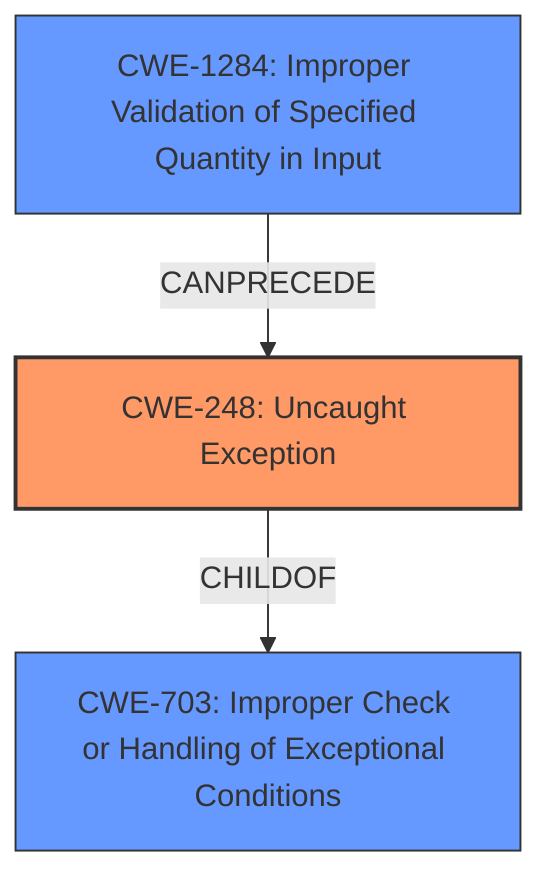

# Analysis Report for CVE-2020-13410

# Vulnerability Analysis Report: CVE-2020-13410

## Description


## Analysis (with Relationship Data)

# Summary
| CWE ID    | CWE Name                                                     | Confidence | CWE Abstraction Level | CWE Vulnerability Mapping Label | CWE-Vulnerability Mapping Notes |
| :-------- | :----------------------------------------------------------- | :--------- | :---------------------- | :------------------------------ | :------------------------------ |
| CWE-248   | Uncaught Exception                                           | 0.9        | Base                    | Primary                         | Allowed                       |
| CWE-703   | Improper Check or Handling of Exceptional Conditions        | 0.7        | Pillar                    | Secondary                        | Discouraged                     |
| CWE-1284  | Improper Validation of Specified Quantity in Input | 0.6        | Base                    | Secondary                        | Allowed                     |

## Evidence and Confidence

*   **Confidence Score:** 0.8
*   **Evidence Strength:** HIGH

## Relationship Analysis
The primary relationship that impacts the CWE selection is that CWE-248 (Uncaught Exception) is a child of CWE-703 (Improper Check or Handling of Exceptional Conditions). While CWE-703 is broader, CWE-248 provides a more specific classification of the vulnerability, aligning with the vulnerability description that emphasizes the exception not being caught.
CWE-1284 can precede CWE-248, so the lack of input validation can lead to an uncaught exception.



## Vulnerability Chain
The vulnerability chain starts with the receipt of an invalid MQTT packet. The **lack of input validation (CWE-1284)** leads to the execution of code that attempts to write this invalid packet to a stream. During this write operation, an exception is thrown, but it is not caught, leading to the **uncaught exception (CWE-248)**, which results in a crash of the MQTT broker. The final impact is a denial of service.

## Summary of Analysis
The initial assessment identified a vulnerability in MoscaJS Aedes where an invalid packet leads to a crash due to an uncaught exception. The analysis centered on identifying the root cause and weaknesses that contribute to this vulnerability.

The primary CWE, CWE-248 (Uncaught Exception), was selected because the core issue is that the application does not catch an exception thrown during the writing of an invalid packet, leading to a crash. This is directly supported by the vulnerability description and the CVE Reference Links Content Summary.

The relationship analysis shows that CWE-248 is a child of CWE-703 (Improper Check or Handling of Exceptional Conditions). While CWE-703 is a broader category, CWE-248 is more specific and accurately describes the vulnerability. The CVE Reference Links Content Summary also mentions that the application does not validate the header and message length before processing, which maps to CWE-1284 (Improper Validation of Specified Quantity in Input). The fact that the input is not validated properly leads to the exception.

The evidence for CWE-248 is extracted from the CVE Reference Links Content Summary: "The vulnerability stems from improper error handling within the `writeNumberCached` function of the aedes MQTT broker when processing a crafted payload...the stream.write() function fails because the datatype becomes an undefined array with -1 as the packet ID." This shows that an error occurs during the writing of the packet, but it is not handled, resulting in the crash.

The selected CWEs are at the optimal level of specificity. CWE-248 directly describes the uncaught exception, while CWE-1284 explains the cause of the exception which is the lack of proper validation.

Relevant CWE Information:

# Enhanced Context (25 CWEs)
The following CWEs were identified as potentially relevant to this vulnerability:

## CWE-789: Memory Allocation with Excessive Size Value
**Abstraction Level**: Variant
**Similarity Score**: 0.78
**Source**: dense

**Description**:
The product allocates memory based on an untrusted, large size value, but it does not ensure that the size is within expected limits, allowing arbitrary amounts of memory to be allocated.

**Mapping Guidance**:
- Usage: Allowed
- Rationale: This CWE entry is at the Variant level of abstraction, which is a preferred level of abstraction for mapping to the root causes of vulnerabilities.

## CWE-191: Integer Underflow (Wrap or Wraparound)
**Abstraction Level**: Base
**Similarity Score**: 0.77
**Source**: dense

**Description**:
The product subtracts one value from another, such that the result is less than the minimum allowable integer value, which produces a value that is not equal to the correct result.

**Mapping Guidance**:
- Usage: Allowed
- Rationale: This CWE entry is at the Base level of abstraction, which is a preferred level of abstraction for mapping to the root causes of vulnerabilities.

## CWE-131: Incorrect Calculation of Buffer Size
**Abstraction Level**: Base
**Similarity Score**: 0.77
**Source**: dense

**Description**:
The product does not correctly calculate the size to be used when allocating a buffer, which could lead to a buffer overflow.

**Mapping Guidance**:
- Usage: Allowed
- Rationale: This CWE entry is at the Base level of abstraction, which is a preferred level of abstraction for mapping to the root causes of vulnerabilities.

## CWE-703: Improper Check or Handling of Exceptional Conditions
**Abstraction Level**: Pillar
**Similarity Score**: 0.77
**Source**: dense

**Description**:
The product does not properly anticipate or handle exceptional conditions that rarely occur during normal operation of the product.

**Mapping Guidance**:
- Usage: Discouraged
- Rationale: This CWE entry is extremely high-level, a Pillar.

## CWE-667: Improper Locking
**Abstraction Level**: Class
**Similarity Score**: 0.76
**Source**: dense

**Description**:
The product does not properly acquire or release a lock on a resource, leading to unexpected resource state changes and behaviors.

**Mapping Guidance**:
- Usage: Allowed-with-Review
- Rationale: This CWE entry is a Class and might have Base-level children that would be more appropriate

## CWE-404: Improper Resource Shutdown or Release
**Abstraction Level**: Class
**Similarity Score**: 0.76
**Source**: dense

**Description**:
The product does not release or incorrectly releases a resource before it is made available for re-use.

**Mapping Guidance**:
- Usage: Allowed-with-Review
- Rationale: This CWE entry is a Class and might have Base-level children that would be more appropriate

## CWE-193: Off-by-one Error
**Abstraction Level**: Base
**Similarity Score**: 0.76
**Source**: dense

**Description**:
A product calculates or uses an incorrect maximum or minimum value that is 1 more, or 1 less, than the correct value.

**Mapping Guidance**:
- Usage: Allowed
- Rationale: This CWE entry is at the Base level of abstraction, which is a preferred level of abstraction for mapping to the root causes of vulnerabilities.

## CWE-407: Inefficient Algorithmic Complexity
**Abstraction Level**: Class
**Similarity Score**: 0.76
**Source**: dense

**Description**:
An algorithm in a product has an inefficient worst-case computational complexity that may be detrimental to system performance and can be triggered by an attacker, typically using crafted manipulations that ensure that the worst case is being reached.

**Mapping Guidance**:
- Usage: Allowed-with-Review
- Rationale: This CWE entry is a Class and might have Base-level children that would be more appropriate

## CWE-125: Out-of-bounds Read
**Abstraction Level**: Base
**Similarity Score**: 0.76
**Source**: dense

**Description**:
The product reads data past the end, or before the beginning, of the intended buffer.

**Mapping Guidance**:
- Usage: Allowed
- Rationale: This CWE entry is at the Base level of abstraction, which is a preferred level of abstraction for mapping to the root causes of vulnerabilities.

## CWE-129: Improper Validation of Array Index
**Abstraction Level**: Variant
**Similarity Score**: 0.76
**Source**: dense

**Description**:
The product uses untrusted input when calculating or using an array index, but the product does not validate or incorrectly validates the index to ensure the index references a valid position within the array.

**Mapping Guidance**:
- Usage: Allowed
- Rationale: This CWE entry is at the Variant level of abstraction, which is a preferred level of abstraction for mapping to the root causes of vulnerabilities.

## CWE-1284: Improper Validation of Specified Quantity in Input
**


## CWE Relationship Analysis

Current CWEs represent these abstraction levels: .


### Vulnerability Chain Analysis

**Chain starting from CWE-248:**
- 248 (Uncaught Exception) - ROOT


**Chain starting from CWE-667:**
- 667 (Improper Locking) - ROOT


### CWE Relationship Diagram

```mermaid
graph TD
    classDef primary fill:#f96,stroke:#333,stroke-width:2px
    classDef secondary fill:#69f,stroke:#333
    classDef tertiary fill:#9e9,stroke:#333
```


*Report generated on 2025-04-02 01:40:50*
