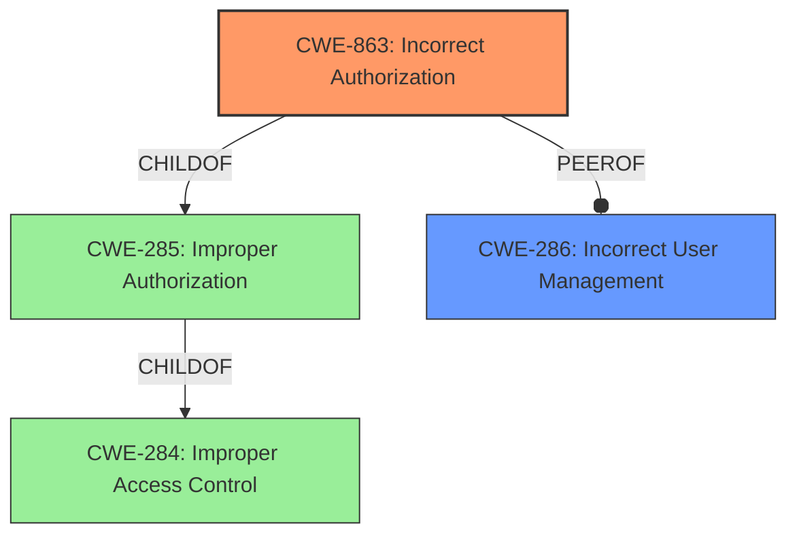

# Analysis Report for CVE-2020-13421

# Vulnerability Analysis Report: CVE-2020-13421

## Description


## Analysis (with Relationship Data)

# Summary

| CWE ID  | CWE Name                                                      | Confidence | CWE Abstraction Level | CWE Vulnerability Mapping Label | CWE-Vulnerability Mapping Notes |
| :-------- | :------------------------------------------------------------ | :--------- | :---------------------- | :------------------------------ | :------------------------------ |
| CWE-863   | Incorrect Authorization                                       | 0.9        | Class                   | Primary CWE                     | Allowed-with-Review             |
| CWE-286   | Incorrect User Management                                   | 0.6        | Class                   | Secondary Candidate             | Allowed-with-Review             |

## Evidence and Confidence

*   **Confidence Score:** 0.8
*   **Evidence Strength:** MEDIUM

## Relationship Analysis

The primary CWE selected is CWE-863, "Incorrect Authorization," which is a Class-level CWE. It is a child of CWE-285, "Improper Authorization," and CWE-284, "Improper Access Control," which are higher-level abstractions. CWE-286, "Incorrect User Management" is a peer of CWE-863. While CWE-639, "Authorization Bypass Through User-Controlled Key," is a child of CWE-863 and would be more specific, there isn't sufficient evidence to support that a user-controlled key is involved. The abstraction level of CWE-863 is appropriate because the vulnerability stems from the authorization check not being correctly performed.



## Vulnerability Chain

The vulnerability chain begins with the **incorrect access control** which is the root cause, leading to the ability to perform actions beyond the designated role, resulting in privilege escalation.

## Summary of Analysis

The initial assessment identified **incorrect access control** as the root cause of the vulnerability in OpenIAM before 4.2.0.3. The vulnerability description states that there's **incorrect access control** for Create User, Modify User Permissions, and Password Reset actions. The CVE reference link summary mentions **missing role segregation** leading to privilege escalation.

CWE-863, "Incorrect Authorization," is the primary CWE because the product performs an authorization check, but it does not correctly perform the check. This aligns with the root cause of **incorrect access control** as stated in the vulnerability description and the **missing role segregation** as mentioned in the CVE reference. CWE-863 is also a top CWE from the Retriever Results.

CWE-286, "Incorrect User Management," is a secondary candidate because the vulnerability involves actions related to user management, such as creating and modifying user permissions. However, the primary issue is with the authorization process itself, making CWE-863 a better fit.

The evidence from the Vulnerability Description Key Phrases: **rootcause:** **incorrect access control** and CVE Reference Links Content Summary: **Root cause of vulnerability:** The vulnerability stems from a lack of proper role segregation within the OpenIAM software, supports the selection of CWE-863.

CWE-639 "Authorization Bypass Through User-Controlled Key" was considered but not selected. While this is a more specific CWE, there isn't sufficient evidence to indicate that a user-controlled key is being manipulated to bypass authorization. The provided information lacks details about how the authorization bypass is achieved, making it difficult to confirm whether it involves a user-controlled key.

The selected CWEs are at the optimal level of specificity based on the available evidence. CWE-863 accurately captures the core issue of **incorrect authorization**, while CWE-286 is a related weakness in user management.


## CWE Relationship Analysis

Current CWEs represent these abstraction levels: .


### Vulnerability Chain Analysis

**Chain starting from CWE-286:**
- 286 (Incorrect User Management) - ROOT


**Chain starting from CWE-284:**
- 284 (Improper Access Control) - ROOT


### CWE Relationship Diagram

```mermaid
graph TD
    classDef primary fill:#f96,stroke:#333,stroke-width:2px
    classDef secondary fill:#69f,stroke:#333
    classDef tertiary fill:#9e9,stroke:#333
```


*Report generated on 2025-04-02 11:43:58*
