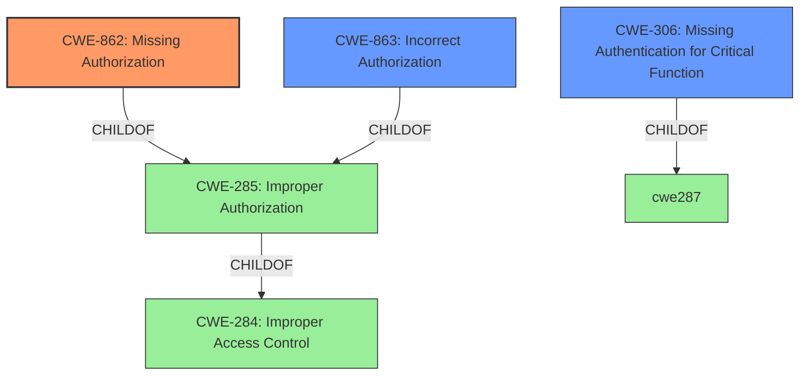

# Raw Analyzer Response for CVE-2020-13422

# Summary
| CWE ID | CWE Name | Confidence | CWE Abstraction Level | CWE Vulnerability Mapping Label | CWE-Vulnerability Mapping Notes |
|---|---|---|---|---|---|
| CWE-862 | Missing Authorization | 0.9 | Class | Primary | Allowed-with-Review |
| CWE-863 | Incorrect Authorization | 0.7 | Class | Secondary | Allowed-with-Review |
| CWE-306 | Missing Authentication for Critical Function | 0.6 | Base | Secondary | Allowed |

## Evidence and Confidence

*   **Confidence Score:** 0.8
*   **Evidence Strength:** MEDIUM

## Relationship Analysis
The primary relationship influencing the decision is the ChildOf relationship between CWE-862, CWE-863 and CWE-285 (Improper Authorization). CWE-862 and CWE-863 are more specific than CWE-285, which is discouraged. CWE-306 is related to authentication, and while authentication is a prerequisite for authorization, the **missing authorization** is the more direct cause of the vulnerability.

## Vulnerability Chain
The vulnerability chain starts with the **missing authorization** check, leading to the ability to perform administrative actions without proper permissions.

## Summary of Analysis
The analysis is based on the vulnerability description and CVE reference summary, which indicates that the OpenIAM software **does not verify** if a user has permissions to perform administrative actions. This directly points to a **missing authorization** check.

The selection of CWE-862 is based on the evidence that the software **does not perform authorization** checks.

CWE-863 (Incorrect Authorization) is considered a secondary candidate because while the description focuses on missing authorization, it's possible that some authorization checks are present but are not sufficient or correctly implemented.

CWE-306 (Missing Authentication for Critical Function) is also considered as a potential contributing factor, but the core issue is the lack of authorization for administrative actions, which is why it is a secondary consideration. The evidence states that the software **does not verify if a user has permissions** implying that authentication might be present, but authorization is missing.

The selected CWEs are at an appropriate level of specificity (Class for CWE-862, CWE-863 and Base for CWE-306).

Relevant CWE Information:

# Enhanced Context (25 CWEs)

## CWE-345: Insufficient Verification of Data Authenticity
**Abstraction Level**: Class
**Similarity Score**: 0.79
**Source**: dense
**Description**:
The product does not sufficiently verify the origin or authenticity of data, in a way that causes it to accept invalid data.
**Why Not Used**: Not related to missing authorization.

## CWE-274: Improper Handling of Insufficient Privileges
**Abstraction Level**: Base
**Similarity Score**: 0.79
**Source**: dense
**Description**:
The product does not handle or incorrectly handles when it has insufficient privileges to perform an operation, leading to resultant weaknesses.
**Why Not Used**: This is more about handling after the fact, not preventing the action.

## CWE-295: Improper Certificate Validation
**Abstraction Level**: Base
**Similarity Score**: 0.78
**Source**: dense
**Description**:
The product does not validate, or incorrectly validates, a certificate.
**Why Not Used**: Not related to missing authorization.

## CWE-807: Reliance on Untrusted Inputs in a Security Decision
**Abstraction Level**: Base
**Similarity Score**: 0.78
**Source**: dense
**Description**:
The product uses a protection mechanism that relies on the existence or values of an input, but the input can be modified by an untrusted actor in a way that bypasses the protection mechanism.
**Why Not Used**: Not applicable to the root cause of missing authorization.

## CWE-1289: Improper Validation of Unsafe Equivalence in Input
**Abstraction Level**: Base
**Similarity Score**: 0.78
**Source**: dense
**Description**:
The product receives an input value that is used as a resource identifier or other type of reference, but it does not validate or incorrectly validates that the input is equivalent to a potentially-unsafe value.
**Why Not Used**: Not applicable to the root cause of missing authorization.

## CWE-668: Exposure of Resource to Wrong Sphere
**Abstraction Level**: Class
**Similarity Score**: 0.78
**Source**: dense
**Description**:
The product exposes a resource to the wrong control sphere, providing unintended actors with inappropriate access to the resource.
**Why Not Used**: Too high-level.

## CWE-267: Privilege Defined With Unsafe Actions
**Abstraction Level**: Base
**Similarity Score**: 0.77
**Source**: dense
**Description**:
A particular privilege, role, capability, or right can be used to perform unsafe actions that were not intended, even when it is assigned to the correct entity.
**Why Not Used**: This is more about the definition of the privilege, not the authorization check.

## CWE-280: Improper Handling of Insufficient Permissions or Privileges
**Abstraction Level**: Base
**Similarity Score**: 0.77
**Source**: dense
**Description**:
The product does not handle or incorrectly handles when it has insufficient privileges to access resources or functionality as specified by their permissions. This may cause it to follow unexpected code paths that may leave the product in an invalid state.
**Why Not Used**: Similar to CWE-274, this is about the handling of insufficient privileges, not preventing the action.

## CWE-303: Incorrect Implementation of Authentication Algorithm
**Abstraction Level**: Base
**Similarity Score**: 0.77
**Source**: dense
**Description**:
The requirements for the product dictate the use of an established authentication algorithm, but the implementation of the algorithm is incorrect.
**Why Not Used**: Not applicable to the root cause of missing authorization.

## CWE-297: Improper Validation of Certificate with Host Mismatch
**Abstraction Level**: Variant
**Similarity Score**: 0.77
**Source**: dense
**Description**:
The product communicates with a host that provides a certificate, but the product does not properly ensure that the certificate is actually associated with that host.
**Why Not Used**: Not related to missing authorization.

## CWE-863: Incorrect Authorization
**Abstraction Level**: Class
**Similarity Score**: 4338.82
**Source**: sparse
**Description**:
The product performs an authorization check when an actor attempts to access a resource or perform an action, but it does not correctly perform the check.
**Why Used**: Considered as a secondary candidate because the description focuses on missing authorization, it's possible that some authorization checks are present but are not sufficient or correctly implemented.

## CWE-295: Improper Certificate Validation
**Abstraction Level**: Base
**Similarity Score**: 4334.56
**Source**: sparse
**Description**:
The product does not validate, or incorrectly validates, a certificate.
**Why Not Used**: Not related to missing authorization.

## CWE-285: Improper Authorization
**Abstraction Level**: Class
**Similarity Score**: 4320.16
**Source**: sparse
**Description**:
The product does not perform or incorrectly performs an authorization check when an actor attempts to access a resource or perform an action.
**Why Not Used**: Too high-level; CWE-862 and CWE-863 are more specific.

## CWE-639: Authorization Bypass Through User-Controlled Key
**Abstraction Level**: Base
**Similarity Score**: 4158.67
**Source**: sparse
**Description**:
The system's authorization functionality does not prevent one user from gaining access to another user's data or record by modifying the key value identifying the data.
**Why Not Used**: Not enough information to determine if a user-controlled key is involved.

## CWE-347: Improper Verification of Cryptographic Signature
**Abstraction Level**: Base
**Similarity Score**: 4123.45
**Source**: sparse
**Description**:
The product does not verify, or incorrectly verifies,