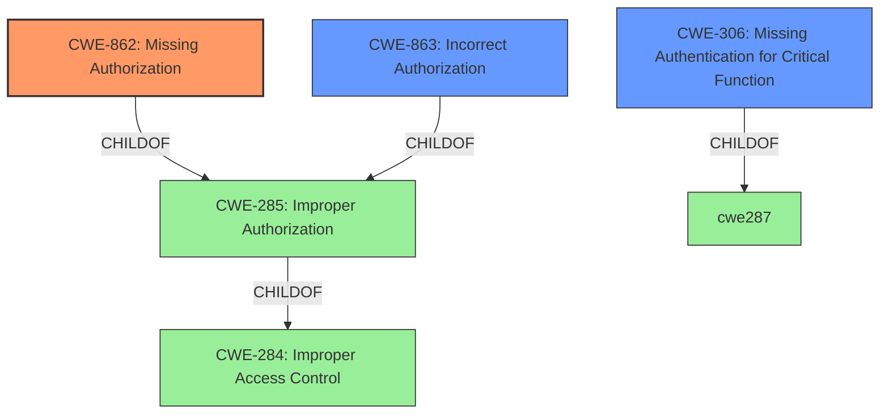

# Analysis for CVE-2020-13422

# Summary
| CWE ID | CWE Name | Confidence | CWE Abstraction Level | CWE Vulnerability Mapping Label | CWE-Vulnerability Mapping Notes |
|---|---|---|---|---|---|
| CWE-862 | Missing Authorization | 0.9 | Class | Primary | Allowed-with-Review |
| CWE-863 | Incorrect Authorization | 0.7 | Class | Secondary | Allowed-with-Review |
| CWE-306 | Missing Authentication for Critical Function | 0.6 | Base | Secondary | Allowed |

## Evidence and Confidence

*   **Confidence Score:** 0.8
*   **Evidence Strength:** MEDIUM

## Relationship Analysis
The primary relationship influencing the decision is the ChildOf relationship between CWE-862, CWE-863 and CWE-285 (Improper Authorization). CWE-862 and CWE-863 are more specific than CWE-285, which is discouraged. CWE-306 is related to authentication, and while authentication is a prerequisite for authorization, the **missing authorization** is the more direct cause of the vulnerability.



## Vulnerability Chain
The vulnerability chain starts with the **missing authorization** check, leading to the ability to perform administrative actions without proper permissions.

## Summary of Analysis
The analysis is based on the vulnerability description and CVE reference summary, which indicates that the OpenIAM software **does not verify** if a user has permissions to perform administrative actions. This directly points to a **missing authorization** check.

The selection of CWE-862 is based on the evidence that the software **does not perform authorization** checks.

CWE-863 (Incorrect Authorization) is considered a secondary candidate because while the description focuses on missing authorization, it's possible that some authorization checks are present but are not sufficient or correctly implemented.

CWE-306 (Missing Authentication for Critical Function) is also considered as a potential contributing factor, but the core issue is the lack of authorization for administrative actions, which is why it is a secondary consideration. The evidence states that the software **does not verify if a user has permissions** implying that authentication might be present, but authorization is missing.

The selected CWEs are at an appropriate level of specificity (Class for CWE-862, CWE-863 and Base for CWE-306).

Relevant CWE Information:

# Enhanced Context (25 CWEs)

## CWE-345: Insufficient Verification of Data Authenticity
**Abstraction Level**: Class
**Similarity Score**: 0.79
**Source**: dense
**Description**:
The product does not sufficiently verify the origin or authenticity of data, in a way that causes it to accept invalid data.
**Why Not Used**: Not related to missing authorization.

## CWE-274: Improper Handling of Insufficient Privileges
**Abstraction Level**: Base
**Similarity Score**: 0.79
**Source**: dense
**Description**:
The product does not handle or incorrectly handles when it has insufficient privileges to perform an operation, leading to resultant weaknesses.
**Why Not Used**: This is more about handling after the fact, not preventing the action.

## CWE-295: Improper Certificate Validation
**Abstraction Level**: Base
**Similarity Score**: 0.78
**Source**: dense
**Description**:
The product does not validate, or incorrectly validates, a certificate.
**Why Not Used**: Not related to missing authorization.

## CWE-807: Reliance on Untrusted Inputs in a Security Decision
**Abstraction Level**: Base
**Similarity Score**: 0.78
**Source**: dense
**Description**:
The product uses a protection mechanism that relies on the existence or values of an input, but the input can be modified by an untrusted actor in a way that bypasses the protection mechanism.
**Why Not Used**: Not applicable to the root cause of missing authorization.

## CWE-1289: Improper Validation of Unsafe Equivalence in Input
**Abstraction Level**: Base
**Similarity Score**: 0.78
**Source**: dense
**Description**:
The product receives an input value that is used as a resource identifier or other type of reference, but it does not validate or incorrectly validates that the input is equivalent to a potentially-unsafe value.
**Why Not Used**: Not applicable to the root cause of missing authorization.

## CWE-668: Exposure of Resource to Wrong Sphere
**Abstraction Level**: Class
**Similarity Score**: 0.78
**Source**: dense
**Description**:
The product exposes a resource to the wrong control sphere, providing unintended actors with inappropriate access to the resource.
**Why Not Used**: Too high-level.

## CWE-267: Privilege Defined With Unsafe Actions
**Abstraction Level**: Base
**Similarity Score**: 0.77
**Source**: dense
**Description**:
A particular privilege, role, capability, or right can be used to perform unsafe actions that were not intended, even when it is assigned to the correct entity.
**Why Not Used**: This is more about the definition of the privilege, not the authorization check.

## CWE-280: Improper Handling of Insufficient Permissions or Privileges
**Abstraction Level**: Base
**Similarity Score**: 0.77
**Source**: dense
**Description**:
The product does not handle or incorrectly handles when it has insufficient privileges to access resources or functionality as specified by their permissions. This may cause it to follow unexpected code paths that may leave the product in an invalid state.
**Why Not Used**: Similar to CWE-274, this is about the handling of insufficient privileges, not preventing the action.

## CWE-303: Incorrect Implementation of Authentication Algorithm
**Abstraction Level**: Base
**Similarity Score**: 0.77
**Source**: dense
**Description**:
The requirements for the product dictate the use of an established authentication algorithm, but the implementation of the algorithm is incorrect.
**Why Not Used**: Not applicable to the root cause of missing authorization.

## CWE-297: Improper Validation of Certificate with Host Mismatch
**Abstraction Level**: Variant
**Similarity Score**: 0.77
**Source**: dense
**Description**:
The product communicates with a host that provides a certificate, but the product does not properly ensure that the certificate is actually associated with that host.
**Why Not Used**: Not related to missing authorization.

## CWE-863: Incorrect Authorization
**Abstraction Level**: Class
**Similarity Score**: 4338.82
**Source**: sparse
**Description**:
The product performs an authorization check when an actor attempts to access a resource or perform an action, but it does not correctly perform the check.
**Why Used**: Considered as a secondary candidate because the description focuses on missing authorization, it's possible that some authorization checks are present but are not sufficient or correctly implemented.

## CWE-295: Improper Certificate Validation
**Abstraction Level**: Base
**Similarity Score**: 4334.56
**Source**: sparse
**Description**:
The product does not validate, or incorrectly validates, a certificate.
**Why Not Used**: Not related to missing authorization.

## CWE-285: Improper Authorization
**Abstraction Level**: Class
**Similarity Score**: 4320.16
**Source**: sparse
**Description**:
The product does not perform or incorrectly performs an authorization check when an actor attempts to access a resource or perform an action.
**Why Not Used**: Too high-level; CWE-862 and CWE-863 are more specific.

## CWE-639: Authorization Bypass Through User-Controlled Key
**Abstraction Level**: Base
**Similarity Score**: 4158.67
**Source**: sparse
**Description**:
The system's authorization functionality does not prevent one user from gaining access to another user's data or record by modifying the key value identifying the data.
**Why Not Used**: Not enough information to determine if a user-controlled key is involved.

## CWE-347: Improper Verification of Cryptographic Signature
**Abstraction Level**: Base
**Similarity Score**: 4123.45
**Source**: sparse
**Description**:
The product does not verify, or incorrectly verifies,

# Enhanced Query for CVE-2020-13422

## Vulnerability Description
OpenIAM before 4.2.0.3 does not verify if a user has permissions to perform /webconsole/rest/api/* administrative actions.

### Vulnerability Description Key Phrases
- **impact:** perform administrative actions
- **product:** OpenIAM
- **version:** before 4.2.0.3
- **component:** /webconsole/rest/api/*

## CVE Reference Links Content Summary
Based on the provided content, here's the information related to CVE-2020-13422:

*   **Root cause of vulnerability:** The vulnerability stems from a privilege escalation issue within the OpenIAM software.
*   **Weaknesses/vulnerabilities present:** The software has a flaw that allows for privilege escalation.
*   **Impact of exploitation:** Successful exploitation of this vulnerability could allow an attacker to gain higher privileges within the system.
*  **Attack vectors:** The specific attack vector is not detailed, but the vulnerability resides within the OpenIAM software.
*   **Required attacker capabilities/position:** An attacker would likely require some level of access to the OpenIAM system to exploit this vulnerability.

The provided information is more detailed than the official CVE description which is a placeholder.

## Retriever Results

### Top Combined Results

| Rank | CWE ID | Name | Abstraction | Usage  | Retrievers | Individual Scores |
|------|--------|------|-------------|-------|------------|-------------------|
| 1 | 1188 | Initialization of a Resource with an Insecure Default | Base | Allowed | sparse | 0.037 |
| 2 | 863 | Incorrect Authorization | Class | Allowed-with-Review | sparse | 0.035 |
| 3 | 285 | Improper Authorization | Class | Discouraged | sparse | 0.035 |
| 4 | 862 | Missing Authorization | Class | Allowed-with-Review | sparse | 0.035 |
| 5 | 306 | Missing Authentication for Critical Function | Base | Allowed | sparse | 0.034 |
| 6 | 449 | The UI Performs the Wrong Action | Base | Allowed | dense | 0.435 |
| 7 | 612 | Improper Authorization of Index Containing Sensitive Information | Base | Allowed | graph | 0.002 |
| 8 | 347 | Improper Verification of Cryptographic Signature | Base | Allowed | sparse | 0.034 |
| 9 | 267 | Privilege Defined With Unsafe Actions | Base | Allowed | sparse | 0.033 |
| 10 | 295 | Improper Certificate Validation | Base | Allowed | sparse | 0.032 |


# Complete CWE Specifications


## CWE-1188: Initialization of a Resource with an Insecure Default
**Abstraction:** Base
**Status:** Incomplete

### Description
The product initializes or sets a resource with a default that is intended to be changed by the administrator, but the default is not secure.

### Extended Description


Developers often choose default values that leave the product as open and easy to use as possible out-of-the-box, under the assumption that the administrator can (or should) change the default value. However, this ease-of-use comes at a cost when the default is insecure and the administrator does not change it.


### Alternative Terms
None

### Relationships
ChildOf -> CWE-1419
ChildOf -> CWE-665

### Mapping Guidance
**Usage:** Allowed
**Rationale:** This CWE entry is at the Base level of abstraction, which is a preferred level of abstraction for mapping to the root causes of vulnerabilities.
**Comments:** Carefully read both the name and description to ensure that this mapping is an appropriate fit. Do not try to 'force' a mapping to a lower-level Base/Variant simply to comply with this preferred level of abstraction.
**Reasons:**
- Acceptable-Use


### Additional Notes
**[Maintenance]** This entry improves organization of concepts under initialization. The typical CWE model is to cover "Missing" and "Incorrect" behaviors. Arguably, this entry could be named as "Incorrect" instead of "Insecure." This might be changed in the near future.


### Observed Examples
- **CVE-2022-36349:** insecure default variable initialization in BIOS firmware for a hardware board allows DoS
- **CVE-2022-42467:** A generic database browser interface has a default mode that exposes a web server to the network, allowing queries to the database.


## CWE-863: Incorrect Authorization
**Abstraction:** Class
**Status:** Incomplete

### Description
The product performs an authorization check when an actor attempts to access a resource or perform an action, but it does not correctly perform the check.

### Extended Description
Not provided

### Alternative Terms
AuthZ: "AuthZ" is typically used as an abbreviation of "authorization" within the web application security community. It is distinct from "AuthN" (or, sometimes, "AuthC") which is an abbreviation of "authentication." The use of "Auth" as an abbreviation is discouraged, since it could be used for either authentication or authorization.

### Relationships
ChildOf -> CWE-285
ChildOf -> CWE-284

### Mapping Guidance
**Usage:** Allowed-with-Review
**Rationale:** This CWE entry is a Class and might have Base-level children that would be more appropriate
**Comments:** Examine children of this entry to see if there is a better fit
**Reasons:**
- Abstraction


### Additional Notes
**[Terminology]** 

Assuming a user with a given identity, authorization is the process of determining whether that user can access a given resource, based on the user's privileges and any permissions or other access-control specifications that apply to the resource.


### Observed Examples
- **CVE-2021-39155:** Chain: A microservice integration and management platform compares the hostname in the HTTP Host header in a case-sensitive way (CWE-178, CWE-1289), allowing bypass of the authorization policy (CWE-863) using a hostname with mixed case or other variations.
- **CVE-2019-15900:** Chain: sscanf() call is used to check if a username and group exists, but the return value of sscanf() call is not checked (CWE-252), causing an uninitialized variable to be checked (CWE-457), returning success to allow authorization bypass for executing a privileged (CWE-863).
- **CVE-2009-2213:** Gateway uses default "Allow" configuration for its authorization settings.


## CWE-285: Improper Authorization
**Abstraction:** Class
**Status:** Draft

### Description
The product does not perform or incorrectly performs an authorization check when an actor attempts to access a resource or perform an action.

### Extended Description


Assuming a user with a given identity, authorization is the process of determining whether that user can access a given resource, based on the user's privileges and any permissions or other access-control specifications that apply to the resource.


When access control checks are not applied consistently - or not at all - users are able to access data or perform actions that they should not be allowed to perform. This can lead to a wide range of problems, including information exposures, denial of service, and arbitrary code execution.


### Alternative Terms
AuthZ: "AuthZ" is typically used as an abbreviation of "authorization" within the web application security community. It is distinct from "AuthN" (or, sometimes, "AuthC") which is an abbreviation of "authentication." The use of "Auth" as an abbreviation is discouraged, since it could be used for either authentication or authorization.

### Relationships
ChildOf -> CWE-284
ChildOf -> CWE-284

### Mapping Guidance
**Usage:** Discouraged
**Rationale:** CWE-285 is high-level and lower-level CWEs can frequently be used instead. It is a level-1 Class (i.e., a child of a Pillar).
**Comments:** Look at CWE-285's children and consider mapping to CWEs such as CWE-862: Missing Authorization, CWE-863: Incorrect Authorization, CWE-732: Incorrect Permission Assignment for Critical Resource, or others.
**Reasons:**
- Abstraction
**Suggested Alternatives:**
- CWE-862: Missing Authorization
- CWE-863: Incorrect Authorization
- CWE-732: Incorrect Permission Assignment for Critical Resource


### Observed Examples
- **CVE-2022-24730:** Go-based continuous deployment product does not check that a user has certain privileges to update or create an app, allowing adversaries to read sensitive repository information
- **CVE-2009-3168:** Web application does not restrict access to admin scripts, allowing authenticated users to reset administrative passwords.
- **CVE-2009-2960:** Web application does not restrict access to admin scripts, allowing authenticated users to modify passwords of other users.


## CWE-862: Missing Authorization
**Abstraction:** Class
**Status:** Incomplete

### Description
The product does not perform an authorization check when an actor attempts to access a resource or perform an action.

### Extended Description
Not provided

### Alternative Terms
AuthZ: "AuthZ" is typically used as an abbreviation of "authorization" within the web application security community. It is distinct from "AuthN" (or, sometimes, "AuthC") which is an abbreviation of "authentication." The use of "Auth" as an abbreviation is discouraged, since it could be used for either authentication or authorization.

### Relationships
ChildOf -> CWE-285
ChildOf -> CWE-284

### Mapping Guidance
**Usage:** Allowed-with-Review
**Rationale:** This CWE entry is a Class and might have Base-level children that would be more appropriate
**Comments:** Examine children of this entry to see if there is a better fit
**Reasons:**
- Abstraction


### Additional Notes
**[Terminology]** Assuming a user with a given identity, authorization is the process of determining whether that user can access a given resource, based on the user's privileges and any permissions or other access-control specifications that apply to the resource.


### Observed Examples
- **CVE-2022-24730:** Go-based continuous deployment product does not check that a user has certain privileges to update or create an app, allowing adversaries to read sensitive repository information
- **CVE-2009-3168:** Web application does not restrict access to admin scripts, allowing authenticated users to reset administrative passwords.
- **CVE-2009-3597:** Web application stores database file under the web root with insufficient access control (CWE-219), allowing direct request.


## CWE-306: Missing Authentication for Critical Function
**Abstraction:** Base
**Status:** Draft

### Description
The product does not perform any authentication for functionality that requires a provable user identity or consumes a significant amount of resources.

### Extended Description
Not provided

### Alternative Terms
None

### Relationships
ChildOf -> CWE-287
ChildOf -> CWE-287

### Mapping Guidance
**Usage:** Allowed
**Rationale:** This CWE entry is at the Base level of abstraction, which is a preferred level of abstraction for mapping to the root causes of vulnerabilities.
**Comments:** Carefully read both the name and description to ensure that this mapping is an appropriate fit. Do not try to 'force' a mapping to a lower-level Base/Variant simply to comply with this preferred level of abstraction.
**Reasons:**
- Acceptable-Use


### Observed Examples
- **CVE-2022-31260:** Chain: a digital asset management program has an undisclosed backdoor in the legacy version of a PHP script (CWE-912) that could allow an unauthenticated user to export metadata (CWE-306)
- **CVE-2022-29951:** TCP-based protocol in Programmable Logic Controller (PLC) has no authentication.
- **CVE-2022-29952:** Condition Monitor firmware uses a protocol that does not require authentication.


## CWE-449: The UI Performs the Wrong Action
**Abstraction:** Base
**Status:** Incomplete

### Description
The UI performs the wrong action with respect to the user's request.

### Extended Description
Not provided

### Alternative Terms
None

### Relationships
ChildOf -> CWE-446

### Mapping Guidance
**Usage:** Allowed
**Rationale:** This CWE entry is at the Base level of abstraction, which is a preferred level of abstraction for mapping to the root causes of vulnerabilities.
**Comments:** Carefully read both the name and description to ensure that this mapping is an appropriate fit. Do not try to 'force' a mapping to a lower-level Base/Variant simply to comply with this preferred level of abstraction.
**Reasons:**
- Acceptable-Use


### Observed Examples
- **CVE-2001-1387:** Network firewall accidentally implements one command line option as if it were another, possibly leading to behavioral infoleak.
- **CVE-2001-0081:** Command line option correctly suppresses a user prompt but does not properly disable a feature, although when the product prompts the user, the feature is properly disabled.
- **CVE-2002-1977:** Product does not "time out" according to user specification, leaving sensitive data available after it has expired.


## CWE-612: Improper Authorization of Index Containing Sensitive Information
**Abstraction:** Base
**Status:** Draft

### Description
The product creates a search index of private or sensitive documents, but it does not properly limit index access to actors who are authorized to see the original information.

### Extended Description
Web sites and other document repositories may apply an indexing routine against a group of private documents to facilitate search. If the index's results are available to parties who do not have access to the documents being indexed, then attackers could obtain portions of the documents by conducting targeted searches and reading the results. The risk is especially dangerous if search results include surrounding text that was not part of the search query. This issue can appear in search engines that are not configured (or implemented) to ignore critical files that should remain hidden; even without permissions to download these files directly, the remote user could read them.

### Alternative Terms
None

### Relationships
ChildOf -> CWE-1230

### Mapping Guidance
**Usage:** Allowed
**Rationale:** This CWE entry is at the Base level of abstraction, which is a preferred level of abstraction for mapping to the root causes of vulnerabilities.
**Comments:** Carefully read both the name and description to ensure that this mapping is an appropriate fit. Do not try to 'force' a mapping to a lower-level Base/Variant simply to comply with this preferred level of abstraction.
**Reasons:**
- Acceptable-Use


### Additional Notes
**[Research Gap]** This weakness is probably under-studied and under-reported.


### Observed Examples
- **CVE-2022-41918:** A search application's access control rules are not properly applied to indices for data streams, allowing for the viewing of sensitive information.


## CWE-347: Improper Verification of Cryptographic Signature
**Abstraction:** Base
**Status:** Draft

### Description
The product does not verify, or incorrectly verifies, the cryptographic signature for data.

### Extended Description
Not provided

### Alternative Terms
None

### Relationships
ChildOf -> CWE-345
ChildOf -> CWE-345

### Mapping Guidance
**Usage:** Allowed
**Rationale:** This CWE entry is at the Base level of abstraction, which is a preferred level of abstraction for mapping to the root causes of vulnerabilities.
**Comments:** Carefully read both the name and description to ensure that this mapping is an appropriate fit. Do not try to 'force' a mapping to a lower-level Base/Variant simply to comply with this preferred level of abstraction.
**Reasons:**
- Acceptable-Use


### Observed Examples
- **CVE-2002-1796:** Does not properly verify signatures for "trusted" entities.
- **CVE-2005-2181:** Insufficient verification allows spoofing.
- **CVE-2005-2182:** Insufficient verification allows spoofing.


## CWE-267: Privilege Defined With Unsafe Actions
**Abstraction:** Base
**Status:** Incomplete

### Description
A particular privilege, role, capability, or right can be used to perform unsafe actions that were not intended, even when it is assigned to the correct entity.

### Extended Description
Not provided

### Alternative Terms
None

### Relationships
ChildOf -> CWE-269

### Mapping Guidance
**Usage:** Allowed
**Rationale:** This CWE entry is at the Base level of abstraction, which is a preferred level of abstraction for mapping to the root causes of vulnerabilities.
**Comments:** Carefully read both the name and description to ensure that this mapping is an appropriate fit. Do not try to 'force' a mapping to a lower-level Base/Variant simply to comply with this preferred level of abstraction.
**Reasons:**
- Acceptable-Use


### Additional Notes
**[Maintenance]** 

Note: there are 2 separate sub-categories here:

```
		- privilege incorrectly allows entities to perform certain actions
		- object is incorrectly accessible to entities with a given privilege
```


### Observed Examples
- **CVE-2002-1981:** Roles have access to dangerous procedures (Accessible entities).
- **CVE-2002-1671:** Untrusted object/method gets access to clipboard (Accessible entities).
- **CVE-2004-2204:** Gain privileges using functions/tags that should be restricted (Accessible entities).


## CWE-295: Improper Certificate Validation
**Abstraction:** Base
**Status:** Draft

### Description
The product does not validate, or incorrectly validates, a certificate.

### Extended Description
When a certificate is invalid or malicious, it might allow an attacker to spoof a trusted entity by interfering in the communication path between the host and client. The product might connect to a malicious host while believing it is a trusted host, or the product might be deceived into accepting spoofed data that appears to originate from a trusted host.

### Alternative Terms
None

### Relationships
ChildOf -> CWE-287
ChildOf -> CWE-287
PeerOf -> CWE-322

### Mapping Guidance
**Usage:** Allowed
**Rationale:** This CWE entry is at the Base level of abstraction, which is a preferred level of abstraction for mapping to the root causes of vulnerabilities.
**Comments:** Carefully read both the name and description to ensure that this mapping is an appropriate fit. Do not try to 'force' a mapping to a lower-level Base/Variant simply to comply with this preferred level of abstraction.
**Reasons:**
- Acceptable-Use


### Observed Examples
- **CVE-2019-12496:** A Go framework for robotics, drones, and IoT devices skips verification of root CA certificates by default.
- **CVE-2014-1266:** chain: incorrect "goto" in Apple SSL product bypasses certificate validation, allowing Adversary-in-the-Middle (AITM) attack (Apple "goto fail" bug). CWE-705 (Incorrect Control Flow Scoping) -> CWE-561 (Dead Code) -> CWE-295 (Improper Certificate Validation) -> CWE-393 (Return of Wrong Status Code) -> CWE-300 (Channel Accessible by Non-Endpoint).
- **CVE-2021-22909:** Chain: router's firmware update procedure uses curl with "-k" (insecure) option that disables certificate validation (CWE-295), allowing adversary-in-the-middle (AITM) compromise with a malicious firmware image (CWE-494).

