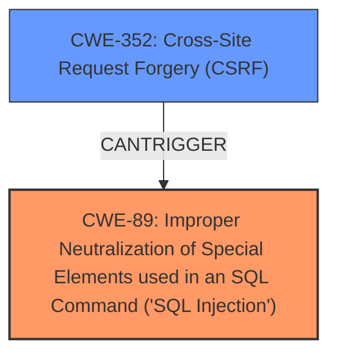

# Enhanced Analysis for CVE-2020-13588

# Summary
| CWE ID | CWE Name | Confidence | CWE Abstraction Level | CWE Vulnerability Mapping Label | CWE-Vulnerability Mapping Notes |
|---|---|---|---|---|---|
| CWE-89 | Improper Neutralization of Special Elements used in an SQL Command ('SQL Injection') | 1.0 | Base | Allowed | Primary CWE. The **root cause** is the **lack of proper sanitization of user-supplied input** when constructing SQL queries, leading to **SQL injection**. |
| CWE-352 | Cross-Site Request Forgery (CSRF) | 0.7 | Compound | Allowed | Secondary CWE. The vulnerability description mentions that the **SQL injection** can be triggered either with administrator credentials or through **cross-site request forgery**. |

## Evidence and Confidence

*   **Confidence Score:** 0.85
*   **Evidence Strength:** HIGH

## Relationship Analysis
The primary weakness is CWE-89 [CWE-89: Improper Neutralization of Special Elements used in an SQL Command ('SQL Injection')], a Base-level CWE that directly addresses the **SQL injection** vulnerability. The vulnerability can also be triggered via CWE-352 [CWE-352: Cross-Site Request Forgery (CSRF)], which is a Compound CWE. CWE-352 requires the attacker to trick a user into making an unintentional request, which can then trigger the SQL injection. CWE-352 is related to CWE-89 because it is one of the attack vectors that can be used to exploit the **SQL injection** vulnerability.



## Vulnerability Chain
The chain of events is as follows:
1.  **Root Cause:** **Lack of proper sanitization** of user-supplied input in SQL queries (CWE-89).
2.  **Attack Vector:** An attacker can either use administrator credentials or exploit a **Cross-Site Request Forgery (CSRF)** vulnerability (CWE-352).
3.  **Impact:** Unauthorized access to sensitive data, modification of data, and potential compromise of the application and server.

## Summary of Analysis
The primary **weakness** is the **SQL Injection** (CWE-89) due to **improper sanitization** of input. The description explicitly states that "The heading_field_id parameter in entities/fields page is vulnerable to authenticated **SQL injection**." This aligns perfectly with the description of CWE-89, which focuses on the **improper neutralization** of special elements used in an SQL command. The reference links confirm the **root cause** is the **lack of proper sanitization** of the `heading_field_id`, `entities_id`, and `selected_fields` parameters, leading to **SQL injection**.

The secondary CWE, CWE-352, is included because the description notes that the **SQL injection** can be triggered either with administrator credentials or through **cross-site request forgery**. This indicates that CSRF is a potential attack vector for exploiting the SQL injection vulnerability.

CWEs considered but not used:
*   CWE-79 [CWE-79: Improper Neutralization of Input During Web Page Generation ('Cross-site Scripting')] was considered due to the "Improper Neutralization" aspect, but the vulnerability is specifically an **SQL injection**, not a cross-site scripting issue.
*   CWE-116 [CWE-116: Improper Encoding or Escaping of Output] was considered because it also deals with **improper encoding**, but the core issue here is the construction of SQL commands, which is directly addressed by CWE-89.
*   CWE-611 [CWE-611: Improper Restriction of XML External Entity Reference] was considered because it involves **improper restriction**, but the vulnerability does not involve XML external entities.

The selected CWEs are at the optimal level of specificity because CWE-89 is a Base-level CWE that directly addresses the **SQL injection** vulnerability, and CWE-352 provides additional context about a potential attack vector. These CWEs provide the most accurate and detailed representation of the vulnerability based on the available evidence.

Relevant CWE Information:

# Enhanced Context (25 CWEs)
The following CWEs were identified as potentially relevant to this vulnerability:

## CWE-80: Improper Neutralization of Script-Related HTML Tags in a Web Page (Basic XSS)
**Abstraction Level**: Variant
**Similarity Score**: 0.79
**Source**: dense

**Description**:
The product receives input from an upstream component, but it does not neutralize or incorrectly neutralizes special characters such as "<", ">", and "&" that could be interpreted as web-scripting elements when they are sent to a downstream component that processes web pages.

**Mapping Guidance**:
- Usage: Allowed
- Rationale: This CWE entry is at the Variant level of abstraction, which is a preferred level of abstraction for mapping to the root causes of vulnerabilities.


## CWE-611: Improper Restriction of XML External Entity Reference
**Abstraction Level**: Base
**Similarity Score**: 0.78
**Source**: dense

**Description**:
The product processes an XML document that can contain XML entities with URIs that resolve to documents outside of the intended sphere of control, causing the product to embed incorrect documents into its output.

**Mapping Guidance**:
- Usage: Allowed
- Rationale: This CWE entry is at the Base level of abstraction, which is a preferred level of abstraction for mapping to the root causes of vulnerabilities.


## CWE-74: Improper Neutralization of Special Elements in Output Used by a Downstream Component ('Injection')
**Abstraction Level**: Class
**Similarity Score**: 0.77
**Source**: dense

**Description**:
The product constructs all or part of a command, data structure, or record using externally-influenced input from an upstream component, but it does not neutralize or incorrectly neutralizes special elements that could modify how it is parsed or interpreted when it is sent to a downstream component.

**Mapping Guidance**:
- Usage: Discouraged
- Rationale: CWE-74 is high-level and often misused when lower-level weaknesses are more appropriate.


## CWE-113: Improper Neutralization of CRLF Sequences in HTTP Headers ('HTTP Request/Response Splitting')
**Abstraction Level**: Variant
**Similarity Score**: 0.77
**Source**: dense

**Description**:
The product receives data from an HTTP agent/component (e.g., web server, proxy, browser, etc.), but it does not neutralize or incorrectly neutralizes CR and LF characters before the data is included in outgoing HTTP headers.

**Mapping Guidance**:
- Usage: Allowed
- Rationale: This CWE entry is at the Variant level of abstraction, which is a preferred level of abstraction for mapping to the root causes of vulnerabilities.


## CWE-184: Incomplete List of Disallowed Inputs
**Abstraction Level**: Base
**Similarity Score**: 0.76
**Source**: dense

**Description**:
The product implements a protection mechanism that relies on a list of inputs (or properties of inputs) that are not allowed by policy or otherwise require other action to neutralize before additional processing takes place, but the list is incomplete.

**Mapping Guidance**:
- Usage: Allowed
- Rationale: This CWE entry is at the Base level of abstraction, which is a preferred level of abstraction for mapping to the root causes of vulnerabilities.


## CWE-918: Server-Side Request Forgery (SSRF)
**Abstraction Level**: Base
**Similarity Score**: 0.76
**Source**: dense

**Description**:
The web server receives a URL or similar request from an upstream component and retrieves the contents of this URL, but it does not sufficiently ensure that the request is being sent to the expected destination.

**Mapping Guidance**:
- Usage: Allowed
- Rationale: This CWE entry is at the Base level of abstraction, which is a preferred level of abstraction for mapping to the root causes of vulnerabilities.


## CWE-1289: Improper Validation of Unsafe Equivalence in Input
**Abstraction Level**: Base
**Similarity Score**: 0.75
**Source**: dense

**Description**:
The product receives an input value that is used as a resource identifier or other type of reference, but it does not validate or incorrectly validates that the input is equivalent to a potentially-unsafe value.

**Mapping Guidance**:
- Usage: Allowed
- Rationale: This CWE entry is at the Base level of abstraction, which is a preferred level of abstraction for mapping to the root causes of vulnerabilities.


## CWE-116: Improper Encoding or Escaping of Output
**Abstraction Level**: Class
**Similarity Score**: 0.75
**Source**: dense

**Description**:
The product prepares a structured message for communication with another component, but encoding or escaping of the data is either missing or done incorrectly. As a result, the intended structure of the message is


## CWE Relationship Analysis

Current CWEs represent these abstraction levels: .


### Vulnerability Chain Analysis

**Chain starting from CWE-113:**
- 113 (Improper Neutralization of CRLF Sequences in HTTP Headers ('HTTP Request/Response Splitting')) - ROOT


**Chain starting from CWE-79:**
- 79 (Improper Neutralization of Input During Web Page Generation ('Cross-site Scripting')) - ROOT


### CWE Relationship Diagram

```mermaid
graph TD
    classDef primary fill:#f96,stroke:#333,stroke-width:2px
    classDef secondary fill:#69f,stroke:#333
    classDef tertiary fill:#9e9,stroke:#333
```