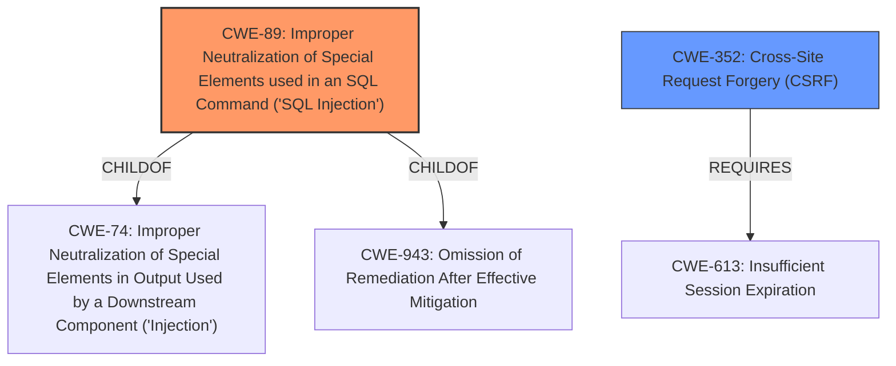

# Enhanced Analysis for CVE-2020-13589

# Summary
| CWE ID | CWE Name | Confidence | CWE Abstraction Level | CWE Vulnerability Mapping Label | CWE-Vulnerability Mapping Notes |
|---|---|---|---|---|---|
| CWE-89 | Improper Neutralization of Special Elements used in an SQL Command ('SQL Injection') | 1.00 | Base | Allowed | Primary CWE |
| CWE-352 | Cross-Site Request Forgery (CSRF) | 0.50 | Compound | Allowed | Secondary Candidate |

## Evidence and Confidence

*   **Confidence Score:** 0.75
*   **Evidence Strength:** HIGH

## Relationship Analysis
The primary relationship is that CWE-89 [Improper Neutralization of Special Elements used in an SQL Command ('SQL Injection')] is a base level CWE, which is desirable. It is a child of CWE-74 [Improper Neutralization of Special Elements in Output Used by a Downstream Component ('Injection')] and CWE-943 [Omission of Remediation After Effective Mitigation]. CWE-352 [Cross-Site Request Forgery (CSRF)] is a compound CWE, representing a combination of weaknesses, and it requires other CWEs to be present, such as CWE-613 [Insufficient Session Expiration].



## Vulnerability Chain
The vulnerability chain starts with **improper sanitization** of user-supplied input, leading to **SQL injection**. The potential for Cross-Site Request Forgery (CSRF) exists, which could allow an attacker to exploit the **SQL injection** vulnerability even without direct administrator credentials.

## Summary of Analysis
The initial assessment strongly points to CWE-89 [Improper Neutralization of Special Elements used in an SQL Command ('SQL Injection')] as the primary weakness. The vulnerability description clearly states a **SQL injection** vulnerability exists, and the CVE Reference Links Content Summary confirms that the root cause is **improper sanitization** of user-supplied input within SQL queries.

The possibility of CWE-352 [Cross-Site Request Forgery (CSRF)] is also mentioned, but it's a secondary factor. The attacker can exploit the **SQL injection** vulnerability either with administrator credentials or through cross-site request forgery. This indicates that CSRF could be a potential attack vector, but it's not the primary weakness in the code.

The relationship graph highlights that CWE-89 [Improper Neutralization of Special Elements used in an SQL Command ('SQL Injection')] is a base-level CWE, making it a good fit for the root cause. While CSRF is possible, it's more of a potential exploitation method.

The selected CWEs are at the optimal level of specificity. CWE-89 [Improper Neutralization of Special Elements used in an SQL Command ('SQL Injection')] directly addresses the **SQL injection** vulnerability, and CWE-352 [Cross-Site Request Forgery (CSRF)] identifies a potential way an attacker can trigger the vulnerability.

Relevant CWE Information:

# Enhanced Context (25 CWEs)
The following CWEs were identified as potentially relevant to this vulnerability:

## CWE-74: Improper Neutralization of Special Elements in Output Used by a Downstream Component ('Injection')
**Abstraction Level**: Class
**Similarity Score**: 0.78
**Source**: dense

**Description**:
The product constructs all or part of a command, data structure, or record using externally-influenced input from an upstream component, but it does not neutralize or incorrectly neutralizes special elements that could modify how it is parsed or interpreted when it is sent to a downstream component.

**Mapping Guidance**:
- Usage: Discouraged
- Rationale: CWE-74 is high-level and often misused when lower-level weaknesses are more appropriate.

## CWE-611: Improper Restriction of XML External Entity Reference
**Abstraction Level**: Base
**Similarity Score**: 0.77
**Source**: dense

**Description**:
The product processes an XML document that can contain XML entities with URIs that resolve to documents outside of the intended sphere of control, causing the product to embed incorrect documents into its output.

**Mapping Guidance**:
- Usage: Allowed
- Rationale: This CWE entry is at the Base level of abstraction, which is a preferred level of abstraction for mapping to the root causes of vulnerabilities.

## CWE-80: Improper Neutralization of Script-Related HTML Tags in a Web Page (Basic XSS)
**Abstraction Level**: Variant
**Similarity Score**: 0.77
**Source**: dense

**Description**:
The product receives input from an upstream component, but it does not neutralize or incorrectly neutralizes special characters such as "<", ">", and "&" that could be interpreted as web-scripting elements when they are sent to a downstream component that processes web pages.

**Mapping Guidance**:
- Usage: Allowed
- Rationale: This CWE entry is at the Variant level of abstraction, which is a preferred level of abstraction for mapping to the root causes of vulnerabilities.

## CWE-138: Improper Neutralization of Special Elements
**Abstraction Level**: Class
**Similarity Score**: 0.77
**Source**: dense

**Description**:
The product receives input from an upstream component, but it does not neutralize or incorrectly neutralizes special elements that could be interpreted as control elements or syntactic markers when they are sent to a downstream component.

**Mapping Guidance**:
- Usage: Discouraged
- Rationale: This CWE entry is a level-1 Class (i.e., a child of a Pillar). It might have lower-level children that would be more appropriate

## CWE-184: Incomplete List of Disallowed Inputs
**Abstraction Level**: Base
**Similarity Score**: 0.77
**Source**: dense

**Description**:
The product implements a protection mechanism that relies on a list of inputs (or properties of inputs) that are not allowed by policy or otherwise require other action to neutralize before additional processing takes place, but the list is incomplete.

**Mapping Guidance**:
- Usage: Allowed
- Rationale: This CWE entry is at the Base level of abstraction, which is a preferred level of abstraction for mapping to the root causes of vulnerabilities.

## CWE-1289: Improper Validation of Unsafe Equivalence in Input
**Abstraction Level**: Base
**Similarity Score**: 0.76
**Source**: dense

**Description**:
The product receives an input value that is used as a resource identifier or other type of reference, but it does not validate or incorrectly validates that the input is equivalent to a potentially-unsafe value.

**Mapping Guidance**:
- Usage: Allowed
- Rationale: This CWE entry is at the Base level of abstraction, which is a preferred level of abstraction for mapping to the root causes of vulnerabilities.

## CWE-113: Improper Neutralization of CRLF Sequences in HTTP Headers ('HTTP Request/Response Splitting')
**Abstraction Level**: Variant
**Similarity Score**: 0.76
**Source**: dense

**Description**:
The product receives data from an HTTP agent/component (e.g., web server, proxy, browser, etc.), but it does not neutralize or incorrectly neutralizes CR and LF characters before the data is included in outgoing HTTP headers.

**Mapping Guidance**:
- Usage: Allowed
- Rationale: This CWE entry is at the Variant level of abstraction, which is a preferred level of abstraction for mapping to the root causes of vulnerabilities.

## CWE-73: External Control of File Name or Path
**Abstraction Level**: Base
**Similarity Score**: 0.76
**Source**: dense

**Description**:
The product allows user input to control or influence paths or file names that are used in filesystem operations.

**Mapping Guidance**:
- Usage: Allowed
- Rationale: This CWE entry is at the Base level of abstraction, which is a preferred level of abstraction for mapping to the root causes of vulnerabilities.

## CWE-150: Improper Neutralization of Escape, Meta, or Control Sequences
**Abstraction Level**: Variant
**Similarity Score**: 0.76
**Source**: dense

**Description**:
The product receives input from an upstream component, but it does not neutralize or incorrectly neutralizes special elements that could be interpreted as escape, meta, or control character sequences when they are sent to a downstream component.

**Mapping Guidance**:
- Usage: Allowed
- Rationale: This CWE entry is


## CWE Relationship Analysis

Current CWEs represent these abstraction levels: .


### Vulnerability Chain Analysis

**Chain starting from CWE-113:**
- 113 (Improper Neutralization of CRLF Sequences in HTTP Headers ('HTTP Request/Response Splitting')) - ROOT


**Chain starting from CWE-943:**
- 943 (Improper Neutralization of Special Elements in Data Query Logic) - ROOT


### CWE Relationship Diagram

```mermaid
graph TD
    classDef primary fill:#f96,stroke:#333,stroke-width:2px
    classDef secondary fill:#69f,stroke:#333
    classDef tertiary fill:#9e9,stroke:#333
```