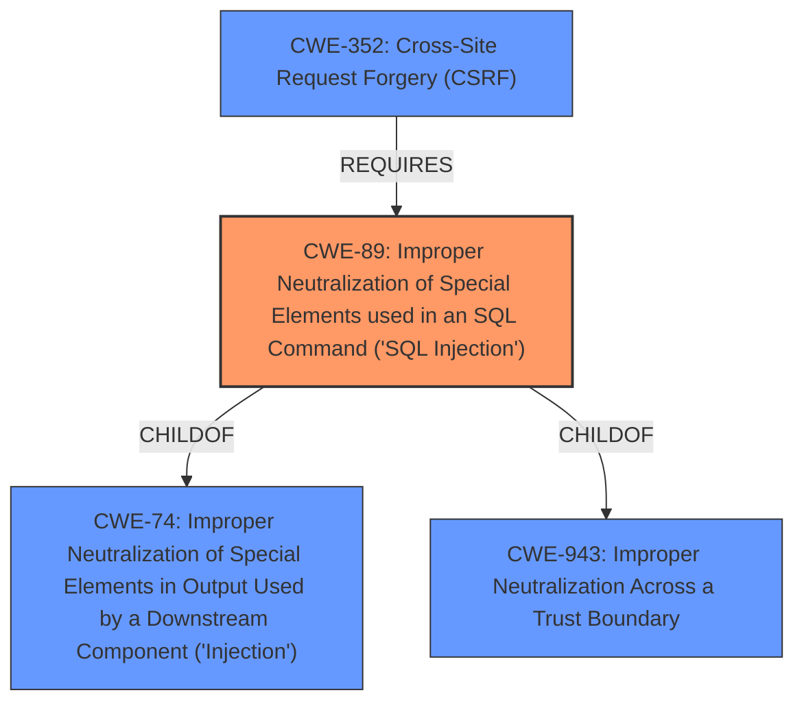

# Analysis for CVE-2020-13590

# Summary

| CWE ID | CWE Name | Confidence | CWE Abstraction Level | CWE Vulnerability Mapping Label | CWE-Vulnerability Mapping Notes |
|---|---|---|---|---|---|
| CWE-89 | Improper Neutralization of Special Elements used in an SQL Command ('SQL Injection') | 1.0 | Base | Allowed | Primary CWE |
| CWE-352 | Cross-Site Request Forgery (CSRF) | 0.7 | Compound | Allowed | Secondary Candidate |

## Evidence and Confidence

*   **Confidence Score:** 0.9
*   **Evidence Strength:** HIGH

## Relationship Analysis
The primary CWE is CWE-89 **('SQL Injection')**, which is a Base level CWE. It has a hierarchical relationship as a child of CWE-74 (Improper Neutralization of Special Elements in Output Used by a Downstream Component ('Injection')) and CWE-943 (Improper Neutralization Across a Trust Boundary). CWE-352 (Cross-Site Request Forgery (CSRF)) is included as a secondary CWE because the vulnerability description states that the **SQL injection** can be triggered either with administrator credentials or through cross-site request forgery.

## Vulnerability Chain
The vulnerability chain starts with the **improper sanitization** of user-supplied input within SQL queries (**SQL injection**), leading to the ability to execute arbitrary SQL queries. This can be exploited through HTTP POST requests, potentially leading to unauthorized data access, modification, or deletion. If the attacker leverages CSRF (CWE-352), the chain involves tricking an authenticated user into unknowingly triggering the **SQL injection**.

## Summary of Analysis
The primary weakness is clearly **SQL injection** (CWE-89), as the **root cause** is the **improper sanitization** of user-supplied input, specifically the `selected_fields` parameter, within SQL queries. The "CVE Reference Links Content Summary" explicitly states this, noting that the `selected_fields` parameter is directly injected into a SQL query without proper sanitization.
The vulnerability description includes the phrase "**SQL injection** vulnerabilities exist," which strongly supports the selection of CWE-89. The retriever results also list CWE-89 as the top combined result with a score of 1.000. The evidence supports CWE-89 being at the optimal level of specificity (Base).

CWE-352 (Cross-Site Request Forgery) is a secondary consideration. The vulnerability description mentions that the **SQL injection** can be triggered either with administrator credentials or through cross-site request forgery. This suggests that an attacker might use CSRF to induce a legitimate user to unknowingly trigger the **SQL injection** vulnerability. While CSRF itself doesn't directly cause the **SQL injection**, it can be a vector for exploiting it.

Other CWEs Considered and Rejected:

*   CWE-79 (Improper Neutralization of Input During Web Page Generation ('Cross-site Scripting')): While the retriever results include CWE-79, there is no evidence of XSS in the vulnerability description. The **vulnerability** stems from **SQL injection**, not from improper neutralization of input in web page generation.
*   CWE-611 (Improper Restriction of XML External Entity Reference): This CWE is not relevant as there is no mention of XML or external entities in the vulnerability description.
*   CWE-20 (Improper Input Validation): While improper input validation is a high-level issue that could be related, CWE-89 provides a more specific and accurate classification of the vulnerability. CWE-20 is also discouraged in favor of more specific CWEs.
* CWE-95 (Improper Neutralization of Directives in Dynamically Evaluated Code ('Eval Injection')): While this CWE was a strong candidate, the **rootcause** and **weakness** clearly points to SQL Injection, and not eval injection.

Relevant CWE Information:

# Enhanced Context (25 CWEs)

## CWE-113: Improper Neutralization of CRLF Sequences in HTTP Headers ('HTTP Request/Response Splitting')
**Abstraction Level**: Variant
**Similarity Score**: 0.77
**Source**: dense

**Description**:
The product receives data from an HTTP agent/component (e.g., web server, proxy, browser, etc.), but it does not neutralize or incorrectly neutralizes CR and LF characters before the data is included in outgoing HTTP headers.

**Mapping Guidance**:
- Usage: Allowed
- Rationale: This CWE entry is at the Variant level of abstraction, which is a preferred level of abstraction for mapping to the root causes of vulnerabilities.

## CWE-74: Improper Neutralization of Special Elements in Output Used by a Downstream Component ('Injection')
**Abstraction Level**: Class
**Similarity Score**: 0.76
**Source**: dense

**Description**:
The product constructs all or part of a command, data structure, or record using externally-influenced input from an upstream component, but it does not neutralize or incorrectly neutralizes special elements that could modify how it is parsed or interpreted when it is sent to a downstream component.

**Mapping Guidance**:
- Usage: Discouraged
- Rationale: CWE-74 is high-level and often misused when lower-level weaknesses are more appropriate.

## CWE-611: Improper Restriction of XML External Entity Reference
**Abstraction Level**: Base
**Similarity Score**: 0.75
**Source**: dense

**Description**:
The product processes an XML document that can contain XML entities with URIs that resolve to documents outside of the intended sphere of control, causing the product to embed incorrect documents into its output.

**Mapping Guidance**:
- Usage: Allowed
- Rationale: This CWE entry is at the Base level of abstraction, which is a preferred level of abstraction for mapping to the root causes of vulnerabilities.

## CWE-1289: Improper Validation of Unsafe Equivalence in Input
**Abstraction Level**: Base
**Similarity Score**: 0.75
**Source**: dense

**Description**:
The product receives an input value that is used as a resource identifier or other type of reference, but it does not validate or incorrectly validates that the input is equivalent to a potentially-unsafe value.

**Mapping Guidance**:
- Usage: Allowed
- Rationale: This CWE entry is at the Base level of abstraction, which is a preferred level of abstraction for mapping to the root causes of vulnerabilities.

## CWE-80: Improper Neutralization of Script-Related HTML Tags in a Web Page (Basic XSS)
**Abstraction Level**: Variant
**Similarity Score**: 0.75
**Source**: dense

**Description**:
The product receives input from an upstream component, but it does not neutralize or incorrectly neutralizes special characters such as "<", ">", and "&" that could be interpreted as web-scripting elements when they are sent to a downstream component that processes web pages.

**Mapping Guidance**:
- Usage: Allowed
- Rationale: This CWE entry is at the Variant level of abstraction, which is a preferred level of abstraction for mapping to the root causes of vulnerabilities.

## CWE-918: Server-Side Request Forgery (SSRF)
**Abstraction Level**: Base
**Similarity Score**: 0.74
**Source**: dense

**Description**:
The web server receives a URL or similar request from an upstream component and retrieves the contents of this URL, but it does not sufficiently ensure that the request is being sent to the expected destination.

**Mapping Guidance**:
- Usage: Allowed
- Rationale: This CWE entry is at the Base level of abstraction, which is a preferred level of abstraction for mapping to the root causes of vulnerabilities.

## CWE-444: Inconsistent Interpretation of HTTP Requests ('HTTP Request/Response Smuggling')
**Abstraction Level**: Base
**Similarity Score**: 0.74
**Source**: dense

**Description**:
The product acts as an intermediary HTTP agent
         (such as a proxy or firewall) in the data flow between two
         entities such as a client and server, but it does not
         interpret malformed HTTP requests or responses in ways that
         are consistent with how the messages will be processed by
         those entities that are at the ultimate destination.

**Mapping Guidance**:
- Usage: Allowed
- Rationale: This CWE entry is at the Base level of abstraction, which is a preferred level of abstraction for mapping to the root causes of vulnerabilities.

## CWE-184: Incomplete List of Disallowed Inputs
**Abstraction Level**: Base
**