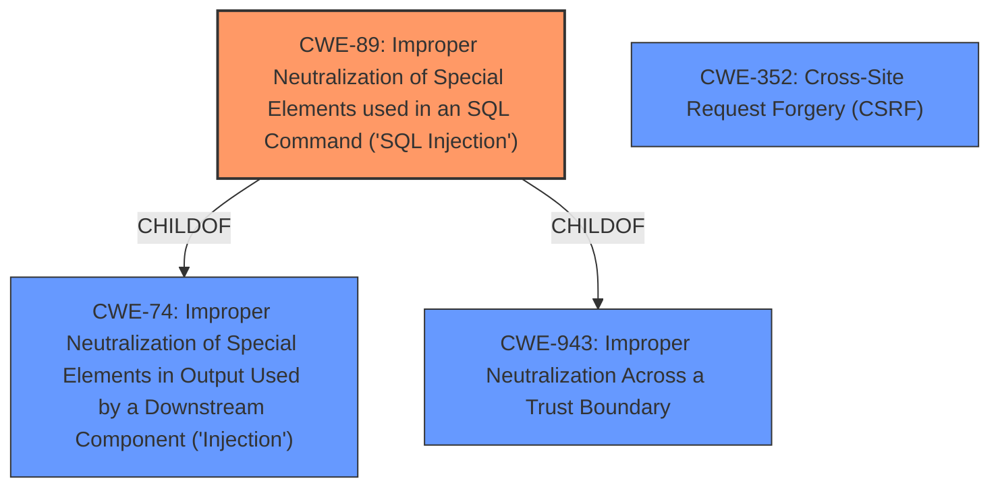

# Analysis for CVE-2020-13591

# Summary
| CWE ID | CWE Name | Confidence | CWE Abstraction Level | CWE Vulnerability Mapping Label | CWE-Vulnerability Mapping Notes |
|---|---|---|---|---|---|
| CWE-89 | Improper Neutralization of Special Elements used in an SQL Command ('SQL Injection') | 1.0 | Base | Allowed | Primary CWE |
| CWE-352 | Cross-Site Request Forgery (CSRF) | 0.7 | Compound | Allowed | Secondary CWE |

## Evidence and Confidence

*   **Confidence Score:** 0.9
*   **Evidence Strength:** HIGH

## Relationship Analysis
The primary CWE is CWE-89, which is a Base level CWE. The description mentions an **SQL injection** vulnerability. CWE-89 is directly related to **SQL injection**, fitting the vulnerability's root cause. CWE-89 is a child of CWE-74 (Improper Neutralization of Special Elements in Output Used by a Downstream Component ('Injection')) and CWE-943 (Improper Neutralization Across a Trust Boundary). CWE-352 is a compound weakness and not a direct cause of the **SQL injection**, but is present as a secondary attack vector.

## Vulnerability Chain
The vulnerability chain starts with the **improper neutralization** of the `entities_id` parameter, leading to **SQL injection**, which can be exploited via an authenticated request or through CSRF.

CWE-89 (Root Cause: Improper Neutralization) -> Impact: Data exfiltration, modification, or deletion.

## Summary of Analysis
The initial analysis correctly identifies the **SQL injection** vulnerability in the Rukovoditel Project Management App 2.7.2. The root cause is the **lack of sanitization** of the `entities_id` parameter before being used in a SQL query. This aligns with the description of CWE-89 (Improper Neutralization of Special Elements used in an SQL Command ('SQL Injection')). The vulnerability can be triggered via an authenticated request or via CSRF (CWE-352).

The primary CWE is CWE-89, as it directly reflects the **SQL injection** vulnerability described. The retriever results also strongly suggest CWE-89 as the best match, with a score of 1.0. The evidence from the CVE Reference Links Content Summary clearly states that the root cause is the `entities_id` parameter not being sanitized before being used in a SQL query, confirming the **improper neutralization**. The presence of CSRF as an attack vector makes CWE-352 a secondary concern.

The selection of CWE-89 is at the optimal level of specificity, as it is a Base level CWE that directly addresses the **SQL injection** vulnerability.

Relevant CWE Information:

# Enhanced Context (25 CWEs)
The following CWEs were identified as potentially relevant to this vulnerability:

## CWE-80: Improper Neutralization of Script-Related HTML Tags in a Web Page (Basic XSS)
**Abstraction Level**: Variant
**Similarity Score**: 0.80
**Source**: dense

**Description**:
The product receives input from an upstream component, but it does not neutralize or incorrectly neutralizes special characters such as "<", ">", and "&" that could be interpreted as web-scripting elements when they are sent to a downstream component that processes web pages.

**Mapping Guidance**:
- Usage: Allowed
- Rationale: This CWE entry is at the Variant level of abstraction, which is a preferred level of abstraction for mapping to the root causes of vulnerabilities.

**Rationale for not selecting:** This is related to XSS, not **SQL Injection**.

## CWE-74: Improper Neutralization of Special Elements in Output Used by a Downstream Component ('Injection')
**Abstraction Level**: Class
**Similarity Score**: 0.77
**Source**: dense

**Description**:
The product constructs all or part of a command, data structure, or record using externally-influenced input from an upstream component, but it does not neutralize or incorrectly neutralizes special elements that could modify how it is parsed or interpreted when it is sent to a downstream component.

**Mapping Guidance**:
- Usage: Discouraged
- Rationale: CWE-74 is high-level and often misused when lower-level weaknesses are more appropriate.

**Rationale for not selecting:** CWE-74 is too high level. CWE-89 is a more specific child that is a better fit.

## CWE-184: Incomplete List of Disallowed Inputs
**Abstraction Level**: Base
**Similarity Score**: 0.76
**Source**: dense

**Description**:
The product implements a protection mechanism that relies on a list of inputs (or properties of inputs) that are not allowed by policy or otherwise require other action to neutralize before additional processing takes place, but the list is incomplete.

**Mapping Guidance**:
- Usage: Allowed
- Rationale: This CWE entry is at the Base level of abstraction, which is a preferred level of abstraction for mapping to the root causes of vulnerabilities.

**Rationale for not selecting:** While an incomplete list of disallowed inputs *could* contribute to the **SQL Injection**, the description doesn't specifically mention that. The root cause is more directly related to the **improper neutralization** itself, as covered by CWE-89.

## CWE-1289: Improper Validation of Unsafe Equivalence in Input
**Abstraction Level**: Base
**Similarity Score**: 0.75
**Source**: dense

**Description**:
The product receives an input value that is used as a resource identifier or other type of reference, but it does not validate or incorrectly validates that the input is equivalent to a potentially-unsafe value.

**Mapping Guidance**:
- Usage: Allowed
- Rationale: This CWE entry is at the Base level of abstraction, which is a preferred level of abstraction for mapping to the root causes of vulnerabilities.

**Rationale for not selecting:** This is not a good fit for **SQL Injection**.

## CWE-138: Improper Neutralization of Special Elements
**Abstraction Level**: Class
**Similarity Score**: 0.75
**Source**: dense

**Description**:
The product receives input from an upstream component, but it does not neutralize or incorrectly neutralizes special elements that could be interpreted as control elements or syntactic markers when they are sent to a downstream component.

**Mapping Guidance**:
- Usage: Discouraged
- Rationale: This CWE entry is a level-1 Class (i.e., a child of a Pillar). It might have lower-level children that would be more appropriate

**Rationale for not selecting:** This is too high level. CWE-89 is a more specific child that is a better fit.

## CWE-113: Improper Neutralization of CRLF Sequences in HTTP Headers ('HTTP Request/Response Splitting')
**Abstraction Level**: Variant
**Similarity Score**: 0.75
**Source**: dense

**Description**:
The product receives data from an HTTP agent/component (e.g., web server, proxy, browser, etc.), but it does not neutralize or incorrectly neutralizes CR and LF characters before the data is included in outgoing HTTP headers.

**Mapping Guidance**:
- Usage: Allowed
- Rationale: This CWE entry is at the Variant level of abstraction, which is a preferred level of abstraction for mapping to the root causes of vulnerabilities.

**Rationale for not selecting:** This is not a good fit for **SQL Injection**.

## CWE-116: Improper Encoding or Escaping of Output
**Abstraction Level**: Class
**Similarity Score**: 0.74
**Source**: dense

**Description**:
The product prepares a structured message for communication with another component, but encoding or escaping of the data is either missing or done incorrectly. As a result, the intended structure of the message is not preserved.

**Mapping Guidance**:
- Usage: Allowed-with-Review
- Rationale: This CWE entry is a Class and might have Base-level children that would be more appropriate

**Rationale for not selecting:** This is too high level. CWE-89 is a more specific child that is a better fit.

## CWE-611: Improper Restriction of XML External Entity Reference
**Abstraction Level**: Base
**Similarity Score**: 0.74
**Source**: dense

**Description**:
The product processes an XML document that can contain XML entities with URIs that resolve to documents outside of the intended sphere of control, causing the product to embed incorrect documents into its output.

**Mapping Guidance**:
- Usage: Allowed
- Rationale: This CWE entry is at the Base level of abstraction