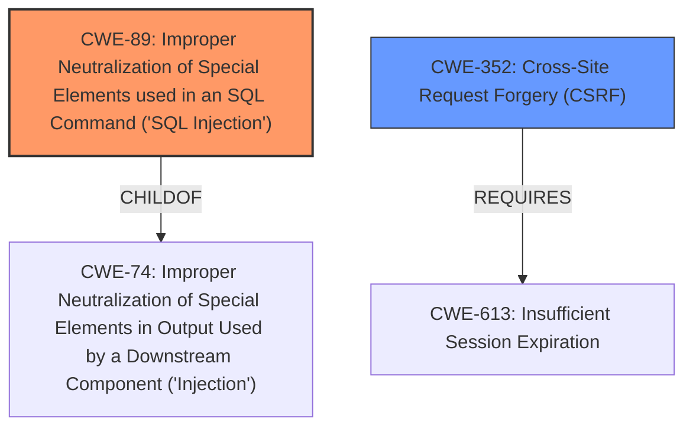

# Enhanced Analysis for CVE-2020-13592

# Summary
| CWE ID | CWE Name | Confidence | CWE Abstraction Level | CWE Vulnerability Mapping Label | CWE-Vulnerability Mapping Notes |
|---|---|---|---|---|---|
| CWE-89 | Improper Neutralization of Special Elements used in an SQL Command ('SQL Injection') | 1.0 | Base | Allowed | Primary CWE |
| CWE-352 | Cross-Site Request Forgery (CSRF) | 0.7 | Compound | Allowed | Secondary Candidate |

## Evidence and Confidence

*   **Confidence Score:** 0.9
*   **Evidence Strength:** HIGH

## Relationship Analysis
The primary relationship is that CWE-89 [CWE-89: Improper Neutralization of Special Elements used in an SQL Command ('SQL Injection')] is a base CWE that directly addresses the **SQL injection** vulnerability. CWE-352 [CWE-352: Cross-Site Request Forgery (CSRF)] is included as a secondary factor, because the vulnerability description mentions it as one of the ways that an attacker can send their crafted payload, but it's not the root cause.



## Vulnerability Chain
The vulnerability chain starts with the **lack of input sanitization** which leads to **SQL injection**.
  - Initial Flaw: **Lack of sanitization** of the `lists_id` parameter.
  - Weakness: **SQL Injection** (CWE-89)
  - Impact: An attacker can execute arbitrary SQL queries, potentially leading to data exfiltration, modification, or other unauthorized actions within the database.
  - CSRF (CWE-352) - as an attack vector to exploit the **SQL Injection**

## Summary of Analysis
The primary weakness identified is CWE-89 [CWE-89: Improper Neutralization of Special Elements used in an SQL Command ('SQL Injection')], supported by the explicit mention of **SQL injection** in the vulnerability description and the root cause analysis from CVE reference links. The "Root cause of vulnerability" section clearly states: "The `lists_id` parameter in the “global\_lists/choices” page of Rukovoditel Project Management App is vulnerable to SQL injection due to a **lack of sanitization** of user-supplied input." The description for CWE-89 matches perfectly: "The product constructs all or part of an SQL command using externally-influenced input from an upstream component, but it does not neutralize or incorrectly neutralizes special elements that could modify the intended SQL command".

CWE-352 [CWE-352: Cross-Site Request Forgery (CSRF)] is included as a secondary factor because the vulnerability description states, "An attacker can make an authenticated HTTP request to trigger this vulnerability, this can be done either with administrator credentials or through cross-site request forgery." This highlights CSRF as a potential attack vector. CWE-352 is a compound weakness, and while relevant to the attack vector, it's not the root cause.

Other CWEs like CWE-79 [CWE-79: Improper Neutralization of Input During Web Page Generation ('Cross-site Scripting')], CWE-502 [CWE-502: Deserialization of Untrusted Data], and CWE-116 [CWE-116: Improper Encoding or Escaping of Output] were considered based on retriever results, but they don't directly align with the described vulnerability which is specifically an **SQL injection** issue due to **lack of input sanitization**.

The selected CWEs are at the optimal level of specificity. CWE-89 [CWE-89: Improper Neutralization of Special Elements used in an SQL Command ('SQL Injection')] is a base CWE that directly describes the **SQL injection** vulnerability, while CWE-352 [CWE-352: Cross-Site Request Forgery (CSRF)] is a compound CWE that highlights an attack vector.

Relevant CWE Information:

# Enhanced Context (25 CWEs)
The following CWEs were identified as potentially relevant to this vulnerability:

## CWE-80: Improper Neutralization of Script-Related HTML Tags in a Web Page (Basic XSS)
**Abstraction Level**: Variant
**Similarity Score**: 0.81
**Source**: dense

**Description**:
The product receives input from an upstream component, but it does not neutralize or incorrectly neutralizes special characters such as "<", ">", and "&" that could be interpreted as web-scripting elements when they are sent to a downstream component that processes web pages.

**Mapping Guidance**:
- Usage: Allowed
- Rationale: This CWE entry is at the Variant level of abstraction, which is a preferred level of abstraction for mapping to the root causes of vulnerabilities.

## CWE-74: Improper Neutralization of Special Elements in Output Used by a Downstream Component ('Injection')
**Abstraction Level**: Class
**Similarity Score**: 0.77
**Source**: dense

**Description**:
The product constructs all or part of a command, data structure, or record using externally-influenced input from an upstream component, but it does not neutralize or incorrectly neutralizes special elements that could modify how it is parsed or interpreted when it is sent to a downstream component.

**Mapping Guidance**:
- Usage: Discouraged
- Rationale: CWE-74 is high-level and often misused when lower-level weaknesses are more appropriate.

## CWE-138: Improper Neutralization of Special Elements
**Abstraction Level**: Class
**Similarity Score**: 0.75
**Source**: dense

**Description**:
The product receives input from an upstream component, but it does not neutralize or incorrectly neutralizes special elements that could be interpreted as control elements or syntactic markers when they are sent to a downstream component.

**Mapping Guidance**:
- Usage: Discouraged
- Rationale: This CWE entry is a level-1 Class (i.e., a child of a Pillar). It might have lower-level children that would be more appropriate

## CWE-113: Improper Neutralization of CRLF Sequences in HTTP Headers ('HTTP Request/Response Splitting')
**Abstraction Level**: Variant
**Similarity Score**: 0.75
**Source**: dense

**Description**:
The product receives data from an HTTP agent/component (e.g., web server, proxy, browser, etc.), but it does not neutralize or incorrectly neutralizes CR and LF characters before the data is included in outgoing HTTP headers.

**Mapping Guidance**:
- Usage: Allowed
- Rationale: This CWE entry is at the Variant level of abstraction, which is a preferred level of abstraction for mapping to the root causes of vulnerabilities.

## CWE-184: Incomplete List of Disallowed Inputs
**Abstraction Level**: Base
**Similarity Score**: 0.75
**Source**: dense

**Description**:
The product implements a protection mechanism that relies on a list of inputs (or properties of inputs) that are not allowed by policy or otherwise require other action to neutralize before additional processing takes place, but the list is incomplete.

**Mapping Guidance**:
- Usage: Allowed
- Rationale: This CWE entry is at the Base level of abstraction, which is a preferred level of abstraction for mapping to the root causes of vulnerabilities.

## CWE-1289: Improper Validation of Unsafe Equivalence in Input
**Abstraction Level**: Base
**Similarity Score**: 0.75
**Source**: dense

**Description**:
The product receives an input value that is used as a resource identifier or other type of reference, but it does not validate or incorrectly validates that the input is equivalent to a potentially-unsafe value.

**Mapping Guidance**:
- Usage: Allowed
- Rationale: This CWE entry is at the Base level of abstraction, which is a preferred level of abstraction for mapping to the root causes of vulnerabilities.

## CWE-116: Improper Encoding or Escaping of Output
**Abstraction Level**: Class
**Similarity Score**: 0.75
**Source**: dense

**Description**:
The product prepares a structured message for communication with another component, but encoding or escaping of the data is either missing or done incorrectly. As a result, the intended structure of the message is not preserved.

**Mapping Guidance**:
- Usage: Allowed-with-Review
- Rationale: This CWE entry is a Class and might have Base-level children that would be more appropriate

## CWE-84: Improper Neutralization of Encoded URI Schemes in a Web Page
**Abstraction Level**: Variant
**Similarity Score**: 0.74
**Source**: dense

**Description**:
The web application improperly neutralizes user-controlled input for executable script disguised with URI encodings.

**Mapping Guidance**:
-


## CWE Relationship Analysis

Current CWEs represent these abstraction levels: .


### Vulnerability Chain Analysis

**Chain starting from CWE-502:**
- 502 (Deserialization of Untrusted Data) - ROOT


**Chain starting from CWE-113:**
- 113 (Improper Neutralization of CRLF Sequences in HTTP Headers ('HTTP Request/Response Splitting')) - ROOT


### CWE Relationship Diagram

```mermaid
graph TD
    classDef primary fill:#f96,stroke:#333,stroke-width:2px
    classDef secondary fill:#69f,stroke:#333
    classDef tertiary fill:#9e9,stroke:#333
```