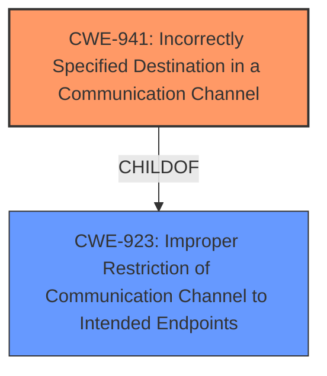

# Enhanced Analysis for CVE-2020-13597

# Summary
| CWE ID  | CWE Name                                                               | Confidence | CWE Abstraction Level | CWE Vulnerability Mapping Label | CWE-Vulnerability Mapping Notes |
| :-------- | :--------------------------------------------------------------------- | :--------- | :---------------------- | :------------------------------ | :------------------------------ |
| CWE-941 | Incorrectly Specified Destination in a Communication Channel | 0.85       | Base                    | Primary CWE                     | Allowed                       |
| CWE-923 | Improper Restriction of Communication Channel to Intended Endpoints | 0.75      | Class                    | Secondary Candidate              | Allowed-with-Review           |

## Evidence and Confidence

*   **Confidence Score:** 0.80
*   **Evidence Strength:** HIGH

## Relationship Analysis
The primary CWE is CWE-941 **Incorrectly Specified Destination in a Communication Channel** which is a child of CWE-923 **Improper Restriction of Communication Channel to Intended Endpoints**. The vulnerability stems from the node **accepting route advertisement by default**, which allows an attacker to redirect network traffic. This aligns with CWE-941 because the **node incorrectly specifies the destination** by accepting the route advertisement.



## Vulnerability Chain
The vulnerability chain starts with the **node accepting route advertisement by default**, leading to the ability to reconfigure the node's IPv6 interface. This allows an attacker to redirect network traffic.
1.  **Root Cause:** **Node accepting route advertisement by default** leading to IPv6 interface reconfiguration.
2.  **Weakness:** Incorrectly specified destination in a communication channel (CWE-941).
3.  **Impact:** Redirection of network traffic to a compromised pod, potentially leading to information disclosure.

## Summary of Analysis
The primary assessment is based on the provided evidence, which clearly indicates that the vulnerability is due to the **node accepting route advertisement by default**. This allows a compromised pod to reconfigure the node's IPv6 interface, leading to the redirection of network traffic.

> Vulnerability Description: Clusters using Calico (version 3.14.0 and below), Calico Enterprise (version 2.8.2 and below), may be vulnerable to information disclosure if IPv6 is enabled but unused. A compromised pod with sufficient privilege is able to reconfigure the nodes IPv6 interface due to the **node accepting route advertisement by default**, allowing the attacker to redirect full or partial network traffic from the node to the compromised pod.

The relationship between CWE-941 and CWE-923 influenced the selection, favoring CWE-941 as the more specific (Base) CWE.

CWE-941 is selected because it directly addresses the issue of an **incorrectly specified destination** due to the acceptance of route advertisements. This is at the optimal level of specificity, as it focuses on the root cause rather than a broader class of communication channel issues.

Relevant CWE Information:

# Enhanced Context (25 CWEs)
The following CWEs were identified as potentially relevant to this vulnerability:

## CWE-405: Asymmetric Resource Consumption (Amplification)
**Abstraction Level**: Class
**Similarity Score**: 0.79

**Description**:
The product does not properly control situations in which an adversary can cause the product to consume or produce excessive resources without requiring the adversary to invest equivalent work or otherwise prove authorization, i.e., the adversary's influence is "asymmetric."

**Mapping Guidance**:
- Usage: Allowed-with-Review
- Rationale: This CWE entry is a Class and might have Base-level children that would be more appropriate

*Reason not used:* This CWE does not align with the vulnerability, as it is not about resource consumption.

## CWE-404: Improper Resource Shutdown or Release
**Abstraction Level**: Class
**Similarity Score**: 0.78

**Description**:
The product does not release or incorrectly releases a resource before it is made available for re-use.

**Mapping Guidance**:
- Usage: Allowed-with-Review
- Rationale: This CWE entry is a Class and might have Base-level children that would be more appropriate

*Reason not used:* This CWE does not align with the vulnerability, as it is not about resource release.

## CWE-226: Sensitive Information in Resource Not Removed Before Reuse
**Abstraction Level**: Base
**Similarity Score**: 0.77

**Description**:
The product releases a resource such as memory or a file so that it can be made available for reuse, but it does not clear or "zeroize" the information contained in the resource before the product performs a critical state transition or makes the resource available for reuse by other entities.

**Mapping Guidance**:
- Usage: Allowed
- Rationale: This CWE entry is at the Base level of abstraction, which is a preferred level of abstraction for mapping to the root causes of vulnerabilities.

*Reason not used:* This CWE does not align with the vulnerability, as it is not about sensitive information in resource reuse.

## CWE-664: Improper Control of a Resource Through its Lifetime
**Abstraction Level**: Pillar
**Similarity Score**: 0.77

**Description**:
The product does not maintain or incorrectly maintains control over a resource throughout its lifetime of creation, use, and release.

**Mapping Guidance**:
- Usage: Discouraged
- Rationale: This CWE entry is high-level when lower-level children are available.

*Reason not used:* This CWE is too high-level and not directly related to the vulnerability.

## CWE-668: Exposure of Resource to Wrong Sphere
**Abstraction Level**: Class
**Similarity Score**: 0.76

**Description**:
The product exposes a resource to the wrong control sphere, providing unintended actors with inappropriate access to the resource.

**Mapping Guidance**:
- Usage: Discouraged
- Rationale: CWE-668 is high-level and is often misused as a catch-all when lower-level CWE IDs might be applicable. It is sometimes used for low-information vulnerability reports [REF-1287]. It is a level-1 Class (i.e., a child of a Pillar). It is not useful for trend analysis.

*Reason not used:* This CWE is too high-level and not directly related to the vulnerability.

## CWE-799: Improper Control of Interaction Frequency
**Abstraction Level**: Class
**Similarity Score**: 0.76

**Description**:
The product does not properly limit the number or frequency of interactions that it has with an actor, such as the number of incoming requests.

**Mapping Guidance**:
- Usage: Allowed-with-Review
- Rationale: This CWE entry is a Class and might have Base-level children that would be more appropriate

*Reason not used:* This CWE does not align with the vulnerability, as it is not about interaction frequency.

## CWE-789: Memory Allocation with Excessive Size Value
**Abstraction Level**: Variant
**Similarity Score**: 0.76

**Description**:
The product allocates memory based on an untrusted, large size value, but it does not ensure that the size is within expected limits, allowing arbitrary amounts of memory to be allocated.

**Mapping Guidance**:
- Usage: Allowed
- Rationale: This CWE entry is at the Variant level of abstraction, which is a preferred level of abstraction for mapping to the root causes of vulnerabilities.

*Reason not used:* This CWE does not align with the vulnerability, as it is not about memory allocation.

## CWE-400: Uncontrolled Resource Consumption
**Abstraction Level**: Class
**Similarity Score**: 0.76

**Description**:
The product does not properly control the allocation and maintenance of a limited resource, thereby enabling an actor to influence the amount of resources consumed, eventually leading to the exhaustion of available resources.

**Mapping Guidance**:
- Usage: Discouraged
- Rationale: CWE-400 is intended for incorrect behaviors in which the product is expected to track and restrict how many resources it consumes, but CWE-400 is often misused because it is conflated with the "technical impact" of vulnerabilities in which resource consumption occurs. It is sometimes used for low-information vulnerability reports. It is a level-1 Class (i.e., a child of a Pillar).

*Reason not used:* This CWE does not align with the vulnerability, as it is not about resource consumption.

## CWE-770: Allocation of Resources Without Limits or Throttling
**Abstraction Level**: Base
**Similarity Score**: 0.75

**Description**:
The product allocates a reusable resource or group of resources on behalf of an actor without imposing any restrictions on the size or number of resources that can be allocated, in violation of the intended security policy for that actor.

**Mapping Guidance**:
- Usage: Allowed
- Rationale: This CWE entry is at the Base level of abstraction, which is a preferred level of abstraction for mapping to the root causes of vulnerabilities.


## CWE Relationship Analysis

Current CWEs represent these abstraction levels: .


### Vulnerability Chain Analysis

**Chain starting from CWE-664:**
- 664 (Improper Control of a Resource Through its Lifetime) - ROOT


**Chain starting from CWE-404:**
- 404 (Improper Resource Shutdown or Release) - ROOT


### CWE Relationship Diagram

```mermaid
graph TD
    classDef primary fill:#f96,stroke:#333,stroke-width:2px
    classDef secondary fill:#69f,stroke:#333
    classDef tertiary fill:#9e9,stroke:#333
```