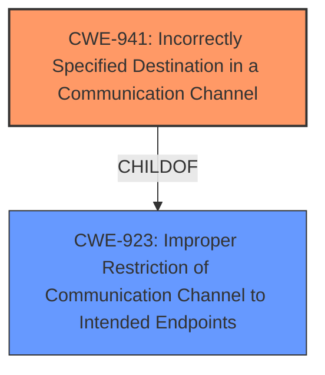

# Analysis for CVE-2020-13597

# Summary
| CWE ID  | CWE Name                                                               | Confidence | CWE Abstraction Level | CWE Vulnerability Mapping Label | CWE-Vulnerability Mapping Notes |
| :-------- | :--------------------------------------------------------------------- | :--------- | :---------------------- | :------------------------------ | :------------------------------ |
| CWE-941 | Incorrectly Specified Destination in a Communication Channel | 0.85       | Base                    | Primary CWE                     | Allowed                       |
| CWE-923 | Improper Restriction of Communication Channel to Intended Endpoints | 0.75      | Class                    | Secondary Candidate              | Allowed-with-Review           |

## Evidence and Confidence

*   **Confidence Score:** 0.80
*   **Evidence Strength:** HIGH

## Relationship Analysis
The primary CWE is CWE-941 **Incorrectly Specified Destination in a Communication Channel** which is a child of CWE-923 **Improper Restriction of Communication Channel to Intended Endpoints**. The vulnerability stems from the node **accepting route advertisement by default**, which allows an attacker to redirect network traffic. This aligns with CWE-941 because the **node incorrectly specifies the destination** by accepting the route advertisement.

## Vulnerability Chain
The vulnerability chain starts with the **node accepting route advertisement by default**, leading to the ability to reconfigure the node's IPv6 interface. This allows an attacker to redirect network traffic.
1.  **Root Cause:** **Node accepting route advertisement by default** leading to IPv6 interface reconfiguration.
2.  **Weakness:** Incorrectly specified destination in a communication channel (CWE-941).
3.  **Impact:** Redirection of network traffic to a compromised pod, potentially leading to information disclosure.

## Summary of Analysis
The primary assessment is based on the provided evidence, which clearly indicates that the vulnerability is due to the **node accepting route advertisement by default**. This allows a compromised pod to reconfigure the node's IPv6 interface, leading to the redirection of network traffic.

> Vulnerability Description: Clusters using Calico (version 3.14.0 and below), Calico Enterprise (version 2.8.2 and below), may be vulnerable to information disclosure if IPv6 is enabled but unused. A compromised pod with sufficient privilege is able to reconfigure the nodes IPv6 interface due to the **node accepting route advertisement by default**, allowing the attacker to redirect full or partial network traffic from the node to the compromised pod.

The relationship between CWE-941 and CWE-923 influenced the selection, favoring CWE-941 as the more specific (Base) CWE.

CWE-941 is selected because it directly addresses the issue of an **incorrectly specified destination** due to the acceptance of route advertisements. This is at the optimal level of specificity, as it focuses on the root cause rather than a broader class of communication channel issues.

Relevant CWE Information:

# Enhanced Context (25 CWEs)
The following CWEs were identified as potentially relevant to this vulnerability:

## CWE-405: Asymmetric Resource Consumption (Amplification)
**Abstraction Level**: Class
**Similarity Score**: 0.79

**Description**:
The product does not properly control situations in which an adversary can cause the product to consume or produce excessive resources without requiring the adversary to invest equivalent work or otherwise prove authorization, i.e., the adversary's influence is "asymmetric."

**Mapping Guidance**:
- Usage: Allowed-with-Review
- Rationale: This CWE entry is a Class and might have Base-level children that would be more appropriate

*Reason not used:* This CWE does not align with the vulnerability, as it is not about resource consumption.

## CWE-404: Improper Resource Shutdown or Release
**Abstraction Level**: Class
**Similarity Score**: 0.78

**Description**:
The product does not release or incorrectly releases a resource before it is made available for re-use.

**Mapping Guidance**:
- Usage: Allowed-with-Review
- Rationale: This CWE entry is a Class and might have Base-level children that would be more appropriate

*Reason not used:* This CWE does not align with the vulnerability, as it is not about resource release.

## CWE-226: Sensitive Information in Resource Not Removed Before Reuse
**Abstraction Level**: Base
**Similarity Score**: 0.77

**Description**:
The product releases a resource such as memory or a file so that it can be made available for reuse, but it does not clear or "zeroize" the information contained in the resource before the product performs a critical state transition or makes the resource available for reuse by other entities.

**Mapping Guidance**:
- Usage: Allowed
- Rationale: This CWE entry is at the Base level of abstraction, which is a preferred level of abstraction for mapping to the root causes of vulnerabilities.

*Reason not used:* This CWE does not align with the vulnerability, as it is not about sensitive information in resource reuse.

## CWE-664: Improper Control of a Resource Through its Lifetime
**Abstraction Level**: Pillar
**Similarity Score**: 0.77

**Description**:
The product does not maintain or incorrectly maintains control over a resource throughout its lifetime of creation, use, and release.

**Mapping Guidance**:
- Usage: Discouraged
- Rationale: This CWE entry is high-level when lower-level children are available.

*Reason not used:* This CWE is too high-level and not directly related to the vulnerability.

## CWE-668: Exposure of Resource to Wrong Sphere
**Abstraction Level**: Class
**Similarity Score**: 0.76

**Description**:
The product exposes a resource to the wrong control sphere, providing unintended actors with inappropriate access to the resource.

**Mapping Guidance**:
- Usage: Discouraged
- Rationale: CWE-668 is high-level and is often misused as a catch-all when lower-level CWE IDs might be applicable. It is sometimes used for low-information vulnerability reports [REF-1287]. It is a level-1 Class (i.e., a child of a Pillar). It is not useful for trend analysis.

*Reason not used:* This CWE is too high-level and not directly related to the vulnerability.

## CWE-799: Improper Control of Interaction Frequency
**Abstraction Level**: Class
**Similarity Score**: 0.76

**Description**:
The product does not properly limit the number or frequency of interactions that it has with an actor, such as the number of incoming requests.

**Mapping Guidance**:
- Usage: Allowed-with-Review
- Rationale: This CWE entry is a Class and might have Base-level children that would be more appropriate

*Reason not used:* This CWE does not align with the vulnerability, as it is not about interaction frequency.

## CWE-789: Memory Allocation with Excessive Size Value
**Abstraction Level**: Variant
**Similarity Score**: 0.76

**Description**:
The product allocates memory based on an untrusted, large size value, but it does not ensure that the size is within expected limits, allowing arbitrary amounts of memory to be allocated.

**Mapping Guidance**:
- Usage: Allowed
- Rationale: This CWE entry is at the Variant level of abstraction, which is a preferred level of abstraction for mapping to the root causes of vulnerabilities.

*Reason not used:* This CWE does not align with the vulnerability, as it is not about memory allocation.

## CWE-400: Uncontrolled Resource Consumption
**Abstraction Level**: Class
**Similarity Score**: 0.76

**Description**:
The product does not properly control the allocation and maintenance of a limited resource, thereby enabling an actor to influence the amount of resources consumed, eventually leading to the exhaustion of available resources.

**Mapping Guidance**:
- Usage: Discouraged
- Rationale: CWE-400 is intended for incorrect behaviors in which the product is expected to track and restrict how many resources it consumes, but CWE-400 is often misused because it is conflated with the "technical impact" of vulnerabilities in which resource consumption occurs. It is sometimes used for low-information vulnerability reports. It is a level-1 Class (i.e., a child of a Pillar).

*Reason not used:* This CWE does not align with the vulnerability, as it is not about resource consumption.

## CWE-770: Allocation of Resources Without Limits or Throttling
**Abstraction Level**: Base
**Similarity Score**: 0.75

**Description**:
The product allocates a reusable resource or group of resources on behalf of an actor without imposing any restrictions on the size or number of resources that can be allocated, in violation of the intended security policy for that actor.

**Mapping Guidance**:
- Usage: Allowed
- Rationale: This CWE entry is at the Base level of abstraction, which is a preferred level of abstraction for mapping to the root causes of vulnerabilities.

# Enhanced Query for CVE-2020-13597

## Vulnerability Description
Clusters using Calico (version 3.14.0 and below), Calico Enterprise (version 2.8.2 and below), may be vulnerable to information disclosure if IPv6 is enabled but unused. A compromised pod with sufficient privilege is able to reconfigure the nodes IPv6 interface due to the **node accepting route advertisement by default**, allowing the attacker to redirect full or partial network traffic from the node to the compromised pod.

### Vulnerability Description Key Phrases
- **weakness:** **node accepting route advertisement by default**
- **impact:** redirect full or partial network traffic to the compromised pod
- **vector:** reconfigure the nodes IPv6 interface
- **attacker:** compromised pod with sufficient privilege
- **product:** Calico
- **version:** 3.14.0 and below

## CVE Reference Links Content Summary
Based on the provided content, here's an analysis of CVE-2020-13597:

**Root Cause of Vulnerability:**
The vulnerability arises from the default behavior of nodes accepting IPv6 router advertisements (RA). A malicious container can exploit this by sending rogue RAs, which reconfigure the host's IPv6 interface. This allows the attacker to redirect network traffic destined for the host to the compromised container, even if the cluster primarily uses IPv4.

**Weaknesses/Vulnerabilities Present:**
- **Unprotected IPv6 Interface:** The primary weakness is the lack of filtering or disabling of IPv6 router advertisements on the host interface, even when IPv6 is not actively used in the cluster.
- **Default `CAP_NET_RAW` Privilege:**  The default Kubernetes security context allows containers to run with `CAP_NET_RAW` capability, enabling them to manipulate network interfaces and send raw packets, including the rogue RA packets.
- **Affected Networking Implementations**: Several implementations are affected including CNI plugins, Calico, Docker, Flannel and Weave Net

**Impact of Exploitation:**
- **Man-in-the-Middle (MitM) Attacks:** A successful attack allows the malicious container to act as a man-in-the-middle, intercepting and potentially modifying traffic between the host and other network destinations.
- **Information Disclosure:** The attacker can potentially gain access to sensitive information transmitted via the intercepted network traffic.
- **Traffic Redirection:** The attacker can redirect network traffic meant for other containers or the host itself to their controlled container.
- **Limited Impact:** The CVSS score is 6.0 (Medium) because the attack has a high complexity, a low privilege is required, and the impact to confidentiality, integrity, and availability are low.

**Attack Vectors:**
- **Network-Based:** The attack is performed over the network through the sending of IPv6 Router Advertisement (RA) packets.
- **Containerized Workload:** The attacker needs to deploy a container with `CAP_NET_RAW` capability.

**Required Attacker Capabilities/Position:**
- **Ability to Create Containers:** The attacker needs to be able to create containers in the Kubernetes cluster.
- **`CAP_NET_RAW` Capability:** The attacker's container must have the `CAP_NET_RAW` capability, which is granted by default by Kubernetes.
- **Network Access:** The attacker needs network access to the host to send the rogue RA packets.

**Additional Details from the provided content:**
- **Affected Versions:**  The vulnerability affects Calico versions up to 3.14.0, Calico Enterprise versions up to 2.8.2, as well as other container networking implementations.
- **Mitigation:**
  - Disabling router advertisement acceptance on the host via `sysctl net.ipv6.conf.all.accept_ra = 0`.
  - Use of TLS with certificate validation.
  - Disallowing the use of `CAP_NET_RAW` in untrusted workloads via security policies, or by setting the sysctl.
- **Detection:**
    - Examining the IPv6 routing table for unusual entries.
    - Checking for dynamically configured IPv6 addresses on the host-side interface of container networks.
- **Resolution:** Upgrading to the patched versions of affected software including Calico and CNI plugins.

The information provided in the GitHub issue and advisory provides more context than a typical CVE description, detailing the vulnerable components, attack specifics, and mitigation steps.

## Retriever Results

### Top Combined Results

| Rank | CWE ID | Name | Abstraction | Usage  | Retrievers | Individual Scores |
|------|--------|------|-------------|-------|------------|-------------------|
| 1 | 201 | Insertion of Sensitive Information Into Sent Data | Base | Allowed | sparse | 0.468 |
| 2 | 923 | Improper Restriction of Communication Channel to Intended Endpoints | Class | Allowed-with-Review | sparse | 0.386 |
| 3 | 532 | Insertion of Sensitive Information into Log File | Base | Allowed | sparse | 0.363 |
| 4 | 295 | Improper Certificate Validation | Base | Allowed | sparse | 0.355 |
| 5 | 863 | Incorrect Authorization | Class | Allowed-with-Review | sparse | 0.355 |
| 6 | 941 | Incorrectly Specified Destination in a Communication Channel | Base | Allowed | dense | 0.505 |
| 7 | 322 | Key Exchange without Entity Authentication | Base | Allowed | graph | 0.003 |
| 8 | 732 | Incorrect Permission Assignment for Critical Resource | Class | Allowed-with-Review | sparse | 0.352 |
| 9 | 276 | Incorrect Default Permissions | Base | Allowed | sparse | 0.350 |
| 10 | 400 | Uncontrolled Resource Consumption | Class | Discouraged | sparse | 0.349 |

# Complete CWE Specifications

## CWE-201: Insertion of Sensitive Information Into Sent Data
**Abstraction:** Base
**Status:** Draft

### Description
The code transmits data to another actor, but a portion of the data includes sensitive information that should not be accessible to that actor.

### Extended Description
Not provided

### Alternative Terms
None

### Relationships
ChildOf -> CWE-200
CanAlsoBe -> CWE-209
CanAlsoBe -> CWE-202

### Mapping Guidance
**Usage:** Allowed
**Rationale:** This CWE entry is at the Base level of abstraction, which is a preferred level of abstraction for mapping to the root causes of vulnerabilities.
**Comments:** Carefully read both the name and description to ensure that this mapping is an appropriate fit. Do not try to 'force' a mapping to a lower-level Base/Variant simply to comply with this preferred level of abstraction.
**Reasons:**
- Acceptable-Use

### Additional Notes
**[Other]** Sensitive information could include data that is sensitive in and of itself (such as credentials or private messages), or otherwise useful in the further exploitation of the system (such as internal file system structure).

### Observed Examples
- **CVE-2022-0708:** Collaboration platform does not clear team emails in a response, allowing leak of email addresses

## CWE-923: Improper Restriction of Communication Channel to Intended Endpoints
**Abstraction:** Class
**Status:** Incomplete

### Description
The product establishes a communication channel to (or from) an endpoint for privileged or protected operations, but it does not properly ensure that it is communicating with the correct endpoint.

### Extended Description

Attackers might be able to spoof the intended endpoint from a different system or process, thus gaining the same level of access as the intended endpoint.

While this issue frequently involves authentication between network-based clients and servers, other types of communication channels and endpoints can have this weakness.

### Alternative Terms
None

### Relationships
ChildOf -> CWE-284

### Mapping Guidance
**Usage:** Allowed-with-Review
**Rationale:** This CWE entry is a Class and might have Base-level children that would be more appropriate
**Comments:** Examine children of this entry to see if there is a better fit
**Reasons:**
- Abstraction

### Observed Examples
- **CVE-2022-30319:** S-bus functionality in a home automation product performs access control using an IP allowlist, which can be bypassed by a forged IP address.
- **CVE-2022-22547:** A troubleshooting tool exposes a web server on a random port between 9000-65535 that could be used for information gathering
- **CVE-2022-4390:** A WAN interface on a router has firewall restrictions enabled for IPv4, but it does not for IPv6, which is enabled by default

## CWE-532: Insertion of Sensitive Information into Log File
**Abstraction:** Base
**Status:** Incomplete

### Description
The product writes sensitive information to a log file.

### Extended Description
Not provided

### Alternative Terms
None

### Relationships
ChildOf -> CWE-538
ChildOf -> CWE-200

### Mapping Guidance
**Usage:** Allowed
**Rationale:** This CWE entry is at the Base level of abstraction, which is a preferred level of abstraction for mapping to the root causes of vulnerabilities.
**Comments:** Carefully read both the name and description to ensure that this mapping is an appropriate fit. Do not try to 'force' a mapping to a lower-level Base/Variant simply to comply with this preferred level of abstraction.
**Reasons:**
- Acceptable-Use

### Observed Examples
- **CVE-2017-9615:** verbose logging stores admin credentials in a world-readable log file
- **CVE-2018-1999036:** SSH password for private key stored in build log

## CWE-295: Improper Certificate Validation
**Abstraction:** Base
**Status:** Draft

### Description
The product does not validate, or incorrectly validates, a certificate.

### Extended Description
When a certificate is invalid or malicious, it might allow an attacker to spoof a trusted entity by interfering in the communication path between the host and client. The product might connect to a malicious host while believing it is a trusted host, or the product might be deceived into accepting spoofed data that appears to originate from a trusted host.

### Alternative Terms
None

### Relationships
ChildOf -> CWE-287
ChildOf -> CWE-287
PeerOf -> CWE-322

### Mapping Guidance
**Usage:** Allowed
**Rationale:** This CWE entry is at the Base level of abstraction, which is a preferred level of abstraction for mapping to the root causes of vulnerabilities.
**Comments:** Carefully read both the name and description to ensure that this mapping is an appropriate fit. Do not try to 'force' a mapping to a lower-level Base/Variant simply to comply with this preferred level of abstraction.
**Reasons:**
- Acceptable-Use

### Observed Examples
- **CVE-2019-12496:** A Go framework for robotics, drones, and IoT devices skips verification of root CA certificates by default.
- **CVE-2014-1266:** chain: incorrect "goto" in Apple SSL product bypasses certificate validation, allowing Adversary-in-the-Middle (AITM) attack (Apple "goto fail" bug). CWE-705 (Incorrect Control Flow Scoping) -> CWE-561 (Dead Code) -> CWE-295 (Improper Certificate Validation) -> CWE-393 (Return of Wrong Status Code) -> CWE-300 (Channel Accessible by Non-Endpoint).
- **CVE-2021-22909:** Chain: router's firmware update procedure uses curl with "-k" (insecure) option that disables certificate validation (CWE-295), allowing adversary-in-the-middle (AITM) compromise with a malicious firmware image (CWE-494).

## CWE-863: Incorrect Authorization
**Abstraction:** Class
**Status:** Incomplete

### Description
The product performs an authorization check when an actor attempts to access a resource or perform an action, but it does not correctly perform the check.

### Extended Description
Not provided

### Alternative Terms
AuthZ: "AuthZ" is typically used as an abbreviation of "authorization" within the web application security community. It is distinct from "AuthN" (or, sometimes, "AuthC") which is an abbreviation of "authentication." The use of "Auth" as an abbreviation is discouraged, since it could be used for either authentication or authorization.

### Relationships
ChildOf -> CWE-285
ChildOf -> CWE-284

### Mapping Guidance
**Usage:** Allowed-with-Review
**Rationale:** This CWE entry is a Class and might have Base-level children that would be more appropriate
**Comments:** Examine children of this entry to see if there is a better fit
**Reasons:**
- Abstraction

### Additional Notes
**[Terminology]** 

Assuming a user with a given identity, authorization is the process of determining whether that user can access a given resource, based on the user's privileges and any permissions or other access-control specifications that apply to the resource.

### Observed Examples
- **CVE-2021-39155:** Chain: A microservice integration and management platform compares the hostname in the HTTP Host header in a case-sensitive way (CWE-178, CWE-1289), allowing bypass of the authorization policy (CWE-863) using a hostname with mixed case or other variations.
- **CVE-2019-15900:** Chain: sscanf() call is used to check if a username and group exists, but the return value of sscanf() call is not checked (CWE-252), causing an uninitialized variable to be checked (CWE-457), returning success to allow authorization bypass for executing a privileged (CWE-863).
- **CVE-2009-2213:** Gateway uses default "Allow" configuration for its authorization settings.

## CWE-941: Incorrectly Specified Destination in a Communication Channel
**Abstraction:** Base
**Status:** Incomplete

### Description
The product creates a communication channel to initiate an outgoing request to an actor, but it does not correctly specify the intended destination for that actor.

### Extended Description

Attackers at the destination may be able to spoof trusted servers to steal data or cause a denial of service.

There are at least two distinct weaknesses that can cause the product to communicate with an unintended destination:

  - If the product allows an attacker to control which destination is specified, then the attacker can cause it to connect to an untrusted or malicious destination. For example, because UDP is a connectionless protocol, UDP packets can be spoofed by specifying a false source address in the packet; when the server receives the packet and sends a reply, it will specify a destination by using the source of the incoming packet - i.e., the false source. The server can then be tricked into sending traffic to the wrong host, which is effective for hiding the real source of an attack and for conducting a distributed denial of service (DDoS). As another example, server-side request forgery (SSRF) and XML External Entity (XXE) can be used to trick a server into making outgoing requests to hosts that cannot be directly accessed by the attacker due to firewall restrictions.

  - If the product incorrectly specifies the destination, then an attacker who can control this destination might be able to spoof trusted servers. While the most common occurrence is likely due to misconfiguration by an administrator, this can be resultant from other weaknesses. For example, the product might incorrectly parse an e-mail or IP address and send sensitive data to an unintended destination. As another example, an Android application may use a "sticky broadcast" to communicate with a receiver for a particular application, but since sticky broadcasts can be processed by *any* receiver, this can allow a malicious application to access restricted data that was only intended for a different application.

### Alternative Terms
None

### Relationships
ChildOf -> CWE-923
CanPrecede -> CWE-406

### Mapping Guidance
**Usage:** Allowed
**Rationale:** This CWE entry is at the Base level of abstraction, which is a preferred level of abstraction for mapping to the root causes of vulnerabilities.
**Comments:** Carefully read both the name and description to ensure that this mapping is an appropriate fit. Do not try to 'force' a mapping to a lower-level Base/Variant simply to comply with this preferred level of abstraction.
**Reasons:**
- Acceptable-Use

### Observed Examples
- **CVE-2013-5211:** composite: NTP feature generates large responses (high amplification factor) with spoofed UDP source addresses.
- **CVE-1999-0513:** Classic "Smurf" attack, using spoofed ICMP packets to broadcast addresses.
- **CVE-1999-1379:** DNS query with spoofed source address causes more traffic to be returned to spoofed address than was sent by the attacker.

## CWE-322: Key Exchange without Entity Authentication
**Abstraction:** Base
**Status:** Draft

### Description
The product performs a key exchange with an actor without verifying the identity of that actor.

### Extended Description
Performing a key exchange will preserve the integrity of the information sent between two entities, but this will not guarantee that the entities are who they claim they are. This may enable an attacker to impersonate an actor by modifying traffic between the two entities. Typically, this involves a victim client that contacts a malicious server that is impersonating a trusted server. If the client skips authentication or ignores an authentication failure, the malicious server may request authentication information from the user. The malicious server can then use this authentication information to log in to the trusted server using the victim's credentials, sniff traffic between the victim and trusted server, etc.

### Alternative Terms
None

### Relationships
ChildOf -> CWE-306
CanPrecede -> CWE-923
PeerOf -> CWE-295

### Mapping Guidance
**Usage:** Allowed
**Rationale:** This CWE entry is at the Base level of abstraction, which is a preferred level of abstraction for mapping to the root causes of vulnerabilities.
**Comments:** Carefully read both the name and description to ensure that this mapping is an appropriate fit. Do not try to 'force' a mapping to a lower-level Base/Variant simply to comply with this preferred level of abstraction.
**Reasons:**
- Acceptable-Use

## CWE-732: Incorrect Permission Assignment for Critical Resource
**Abstraction:** Class
**Status:** Draft

### Description
The product specifies permissions for a security-critical resource in a way that allows that resource to be read or modified by unintended actors.

### Extended Description
When a resource is given a permission setting that provides access to a wider range of actors than required, it could lead to the exposure of sensitive information, or the modification of that resource by unintended parties. This is especially dangerous when the resource is related to program configuration, execution, or sensitive user data. For example, consider a misconfigured storage account for the cloud that can be read or written by a public or anonymous user.

### Alternative Terms
None

### Relationships
ChildOf -> CWE-285
ChildOf -> CWE-668

### Mapping Guidance
**Usage:** Allowed-with-Review
**Rationale:** While the name itself indicates an assignment of permissions for resources, this is often misused for vulnerabilities in which "permissions" are not checked, which is an "authorization" weakness (CWE-285 or descendants) within CWE's model [REF-1287].
**Comments:** Closely analyze the specific mistake that is allowing the resource to be exposed, and perform a CWE mapping for that mistake.
**Reasons:**
- Frequent Misuse

### Additional Notes
**[Maintenance]** The relationships between privileges, permissions, and actors (e.g. users and groups) need further refinement within the Research view. One complication is that these concepts apply to two different pillars, related to control of resources (CWE-664) and protection mechanism failures (CWE-693).

### Observed Examples
- **CVE-2022-29527:** Go application for cloud management creates a world-writable sudoers file that allows local attackers to inject sudo rules and escalate privileges to root by winning a race condition.
- **CVE-2009-3482:** Anti-virus product sets insecure "Everyone: Full Control" permissions for files under the "Program Files" folder, allowing attackers to replace executables with Trojan horses.
- **CVE-2009-3897:** Product creates directories with 0777 permissions at installation, allowing users to gain privileges and access a socket used for authentication.

## CWE-276: Incorrect Default Permissions
**Abstraction:** Base
**Status:** Draft

### Description
During installation, installed file permissions are set to allow anyone to modify those files.

### Extended Description
Not provided

### Alternative Terms
None

### Relationships
ChildOf -> CWE-732
ChildOf -> CWE-732

### Mapping Guidance
**Usage:** Allowed
**Rationale:** This CWE entry is at the Base level of abstraction, which is a preferred level of abstraction for mapping to the root causes of vulnerabilities.
**Comments:** Carefully read both the name and description to ensure that this mapping is an appropriate fit. Do not try to 'force' a mapping to a lower-level Base/Variant simply to comply with this preferred level of abstraction.
**Reasons:**
- Acceptable-Use

### Observed Examples
- **CVE-2005-1941:** Executables installed world-writable.
- **CVE-2002-1713:** Home directories installed world-readable.
- **CVE-2001-1550:** World-writable log files allow information loss; world-readable file has cleartext passwords.

## CWE-400: Uncontrolled Resource Consumption
**Abstraction:** Class
**Status:** Draft

### Description
The product does not properly control the allocation and maintenance of a limited resource, thereby enabling an actor to influence the amount of resources consumed, eventually leading to the exhaustion of available resources.

### Extended Description

Limited resources include memory, file system storage, database connection pool entries, and CPU. If an attacker can trigger the allocation of these limited resources, but the number or size of the resources is not controlled, then the attacker could cause a denial of service that consumes all available resources. This would prevent valid users from accessing the product, and it could potentially have an impact on the surrounding environment. For example, a memory exhaustion attack against an application could slow down the application as well as its host operating system.

There are at least three distinct scenarios which can commonly lead to resource exhaustion:

  - Lack of throttling for the number of allocated resources

  - Losing all references to a resource before reaching the shutdown stage

  - Not closing/returning a resource after processing

Resource exhaustion problems are often result due to an incorrect implementation of the following situations:

  - Error conditions and other exceptional circumstances.

  - Confusion over which part of the program is responsible for releasing the resource.

### Alternative Terms
Resource Exhaustion

### Relationships
ChildOf -> CWE-664

### Mapping Guidance
**Usage:** Discouraged
**Rationale:** CWE-400 is intended for incorrect behaviors in which the product is expected to track and restrict how many resources it consumes, but CWE-400 is often misused because it is conflated with the "technical impact" of vulnerabilities in which resource consumption occurs. It is sometimes used for low-information vulnerability reports. It is a level-1 Class (i.e., a child of a Pillar).
**Comments:** Closely analyze the specific mistake that is causing resource consumption, and perform a CWE mapping for that mistake. Consider children/descendants such as CWE-770: Allocation of Resources Without Limits or Throttling, CWE-771: Missing Reference to Active Allocated Resource, CWE-410: Insufficient Resource Pool, CWE-772: Missing Release of Resource after Effective Lifetime, CWE-834: Excessive Iteration, CWE-405: Asymmetric Resource Consumption (Amplification), and others.
**Reasons:**
- Frequent Misuse

### Additional Notes
**[Maintenance]** "Resource consumption" could be interpreted as a consequence instead of an insecure behavior, so this entry is being considered for modification. It appears to be referenced too frequently when more precise mappings are available. Some of its children, such as CWE-771, might be better considered as a chain.

**[Theoretical]** Vulnerability theory is largely about how behaviors and resources interact. "Resource exhaustion" can be regarded as either a consequence or an attack, depending on the perspective. This entry is an attempt to reflect the underlying weaknesses that enable these attacks (or consequences) to take place.

**[Other]** 

Database queries that take a long time to process are good DoS targets. An attacker would have to write a few lines of Perl code to generate enough traffic to exceed the site's ability to keep up. This would effectively prevent authorized users from using the site at all. Resources can be exploited simply by ensuring that the target machine must do much more work and consume more resources in order to service a request than the attacker must do to initiate a request.

A prime example of this can be found in old switches that were vulnerable to "macof" attacks (so named for a tool developed by Dugsong). These attacks flooded a switch with random IP and MAC address combinations, therefore exhausting the switch's cache, which held the information of which port corresponded to which MAC addresses. Once this cache was exhausted, the switch would fail in an insecure way and would begin to act simply as a hub, broadcasting all traffic on all ports and allowing for basic sniffing attacks.

**[Maintenance]** The Taxonomy_Mappings to ISA/IEC 62443 were added in CWE 4.10, but they are still under review and might change in future CWE versions. These draft mappings were performed by members of the "Mapping CWE to 62443" subgroup of the CWE-CAPEC ICS/OT Special Interest Group (SIG), and their work is incomplete as of CWE 4.10. The mappings are included to facilitate discussion and review by the broader ICS/OT community, and they are likely to change in future CWE versions.

### Observed Examples
- **CVE-2022-21668:** Chain: Python library does not limit the resources used to process images that specify a very large number of bands (CWE-1284), leading to excessive memory consumption (CWE-789) or an integer overflow (CWE-190).
- **CVE-2020-7218:** Go-based workload orchestrator does not limit resource usage with unauthenticated connections, allowing a DoS by flooding the service
- **CVE-2020-3566:** Resource exhaustion in distributed OS because of "insufficient" IGMP queue management, as exploited in the wild per CISA KEV.

