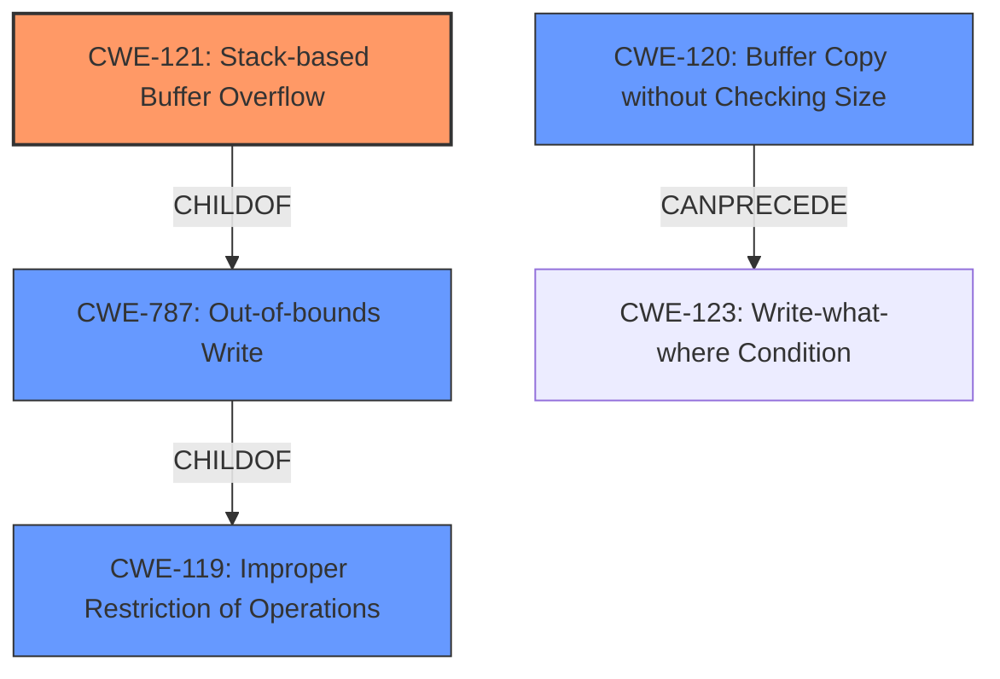

# Analysis Report for CVE-2020-13598

# Vulnerability Analysis Report: CVE-2020-13598

## Description


## Analysis (with Relationship Data)

# Summary
| CWE ID | CWE Name | Confidence | CWE Abstraction Level | CWE Vulnerability Mapping Label | CWE-Vulnerability Mapping Notes |
|---|---|---|---|---|---|
| CWE-121 | Stack-based Buffer Overflow | 1.0 | Variant | Allowed | Primary CWE |
| CWE-119 | Improper Restriction of Operations within the Bounds of a Memory Buffer | 0.7 | Class | Discouraged | Secondary Candidate |
| CWE-120 | Buffer Copy without Checking Size of Input ('Classic Buffer Overflow') | 0.6 | Base | Allowed-with-Review | Secondary Candidate |
| CWE-787 | Out-of-bounds Write | 0.5 | Base | Allowed | Secondary Candidate |

## Evidence and Confidence

*   **Confidence Score:** 0.9
*   **Evidence Strength:** HIGH

## Relationship Analysis
The primary CWE is CWE-121, a variant of CWE-787 (Out-of-bounds Write). CWE-787 is a child of CWE-119 (Improper Restriction of Operations within the Bounds of a Memory Buffer). CWE-120 (Buffer Copy without Checking Size of Input) can precede CWE-123 (Write-what-where Condition).



## Vulnerability Chain
The vulnerability chain starts with **lack of input validation**, leading to a **buffer overflow** when `fs_stat` is called with a filename exceeding `MAX_FILE_NAME` when LFN is enabled. This leads to **memory corruption** and potential **program termination**.

## Summary of Analysis
The initial assessment correctly identifies **CWE-121 Stack-based Buffer Overflow** as a strong candidate. The evidence from the vulnerability description and CVE Reference Links Content Summary strongly supports this. The summary clearly indicates a buffer overflow on the stack when `fs_stat` is called with a long filename.

The analysis is based on the following evidence:
- Vulnerability Description Key Phrases: " **weakness:** **Stack-based Buffer Overflow (CWE-121)**"
- CVE Reference Links Content Summary: "A buffer overflow occurs when the `fs_stat` function is called on a file with a filename longer than 12 characters, when Long File Names (LFN) support is enabled in the FAT file system implementation."
- CVE Reference Links Content Summary: "The `fatfs_stat` function in `subsys/fs/fat_fs.c` uses a fixed-size buffer (`MAX_FILE_NAME`) to store the file name, without checking if the provided name exceeds this limit, leading to a buffer overflow."

The graph relationships influenced the selection by clarifying the hierarchical structure. CWE-121 is a specific type of CWE-787 (Out-of-bounds Write), which in turn is a type of CWE-119 (Improper Restriction of Operations within the Bounds of a Memory Buffer). Since the overflow occurs on the stack, CWE-121 is more specific and appropriate than its parents.

The selected CWE is at the optimal level of specificity because the description explicitly states that it is a stack-based buffer overflow.

Relevant CWE Information:

# Enhanced Context (25 CWEs)
The following CWEs were identified as potentially relevant to this vulnerability:

## CWE-131: Incorrect Calculation of Buffer Size
**Abstraction Level**: Base
**Similarity Score**: 0.77
**Source**: dense

**Description**:
The product does not correctly calculate the size to be used when allocating a buffer, which could lead to a buffer overflow.

**Mapping Guidance**:
- Usage: Allowed
- Rationale: This CWE entry is at the Base level of abstraction, which is a preferred level of abstraction for mapping to the root causes of vulnerabilities.

*Not Selected:* Although incorrect buffer size calculation could lead to a buffer overflow, the primary issue here is the lack of input validation and subsequent overflow, not a calculation error.

## CWE-191: Integer Underflow (Wrap or Wraparound)
**Abstraction Level**: Base
**Similarity Score**: 0.77
**Source**: dense

**Description**:
The product subtracts one value from another, such that the result is less than the minimum allowable integer value, which produces a value that is not equal to the correct result.

**Mapping Guidance**:
- Usage: Allowed
- Rationale: This CWE entry is at the Base level of abstraction, which is a preferred level of abstraction for mapping to the root causes of vulnerabilities.

*Not Selected:* Integer underflow is not indicated in the vulnerability description.

## CWE-805: Buffer Access with Incorrect Length Value
**Abstraction Level**: Base
**Similarity Score**: 0.76
**Source**: dense

**Description**:
The product uses a sequential operation to read or write a buffer, but it uses an incorrect length value that causes it to access memory that is outside of the bounds of the buffer.

**Mapping Guidance**:
- Usage: Allowed
- Rationale: This CWE entry is at the Base level of abstraction, which is a preferred level of abstraction for mapping to the root causes of vulnerabilities.

*Not Selected:* While an incorrect length could be involved, the core issue is the lack of checking the length of the filename before copying it into the fixed-size buffer.

## CWE-130: Improper Handling of Length Parameter Inconsistency
**Abstraction Level**: Base
**Similarity Score**: 0.76
**Source**: dense

**Description**:
The product parses a formatted message or structure, but it does not handle or incorrectly handles a length field that is inconsistent with the actual length of the associated data.

**Mapping Guidance**:
- Usage: Allowed
- Rationale: This CWE entry is at the Base level of abstraction, which is a preferred level of abstraction for mapping to the root causes of vulnerabilities.

*Not Selected:* Not the primary cause; the code does not handle the length at all.

## CWE-226: Sensitive Information in Resource Not Removed Before Reuse
**Abstraction Level**: Base
**Similarity Score**: 0.75
**Source**: dense

**Description**:
The product releases a resource such as memory or a file so that it can be made available for reuse, but it does not clear or "zeroize" the information contained in the resource before the product performs a critical state transition or makes the resource available for reuse by other entities.

**Mapping Guidance**:
- Usage: Allowed
- Rationale: This CWE entry is at the Base level of abstraction, which is a preferred level of abstraction for mapping to the root causes of vulnerabilities.

*Not Selected:* Not relevant to the vulnerability.

## CWE-125: Out-of-bounds Read
**Abstraction Level**: Base
**Similarity Score**: 0.75
**Source**: dense

**Description**:
The product reads data past the end, or before the beginning, of the intended buffer.

**Mapping Guidance**:
- Usage: Allowed
- Rationale: This CWE entry is at the Base level of abstraction, which is a preferred level of abstraction for mapping to the root causes of vulnerabilities.

*Not Selected:* The vulnerability is an out-of-bounds write (overflow), not a read.

## CWE-126: Buffer Over-read
**Abstraction Level**: Variant
**Similarity Score**: 0.75
**Source**: dense

**Description**:
The product reads from a buffer using buffer access mechanisms such as indexes or pointers that reference memory locations after the targeted buffer.

**Mapping Guidance**:
- Usage: Allowed
- Rationale: This CWE entry is at the Variant level of abstraction, which is a preferred level of abstraction for mapping to the root causes of vulnerabilities.

*Not Selected:* The vulnerability is an out-of-bounds write (overflow), not a read.

## CWE-124: Buffer Underwrite ('Buffer Underflow')
**Abstraction Level**: Base
**Similarity Score**: 0.75
**Source**: dense

**Description**:
The product writes to a buffer using an index or pointer that references a memory location prior to the beginning of the buffer.

**Mapping Guidance**:
- Usage: Allowed
- Rationale: This CWE entry is at the Base level of abstraction, which is a preferred level of abstraction for mapping to the root causes of vulnerabilities.

*Not Selected:* The vulnerability is an overflow, not an underflow.

## CWE-19


## CWE Relationship Analysis

Current CWEs represent these abstraction levels: .


### Vulnerability Chain Analysis

**Chain starting from CWE-121:**
- 121 (Stack-based Buffer Overflow) - ROOT


**Chain starting from CWE-787:**
- 787 (Out-of-bounds Write) - ROOT


### CWE Relationship Diagram

```mermaid
graph TD
    classDef primary fill:#f96,stroke:#333,stroke-width:2px
    classDef secondary fill:#69f,stroke:#333
    classDef tertiary fill:#9e9,stroke:#333
```


*Report generated on 2025-04-02 08:29:02*
