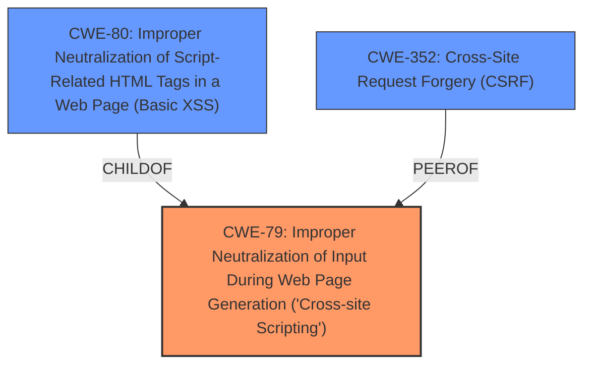

# Analysis for CVE-2020-13673

# Summary
| CWE ID  | CWE Name                                                                   | Confidence | CWE Abstraction Level | CWE Vulnerability Mapping Label | CWE-Vulnerability Mapping Notes |
| :-------- | :------------------------------------------------------------------------- | :--------- | :---------------------- | :------------------------------ | :------------------------------ |
| CWE-79  | Improper Neutralization of Input During Web Page Generation ('Cross-site Scripting') | 1.0        | Base                    | Primary CWE                     | Allowed                       |
| CWE-80  | Improper Neutralization of Script-Related HTML Tags in a Web Page (Basic XSS) | 0.7        | Variant                 | Secondary Candidate            | Allowed                       |
| CWE-352 | Cross-Site Request Forgery (CSRF)                                          | 0.5        | Compound                | Secondary Candidate            | Allowed                       |

## Evidence and Confidence

*   **Confidence Score:** 0.8
*   **Evidence Strength:** HIGH

## Relationship Analysis
The primary CWE is CWE-79, which represents the core vulnerability of improper neutralization leading to XSS. CWE-80 is a variant that focuses on the specific case of script-related HTML tags, providing a more granular view. CWE-352 (CSRF) was considered due to the initial advisory mentioning it, but the description leans more towards stored XSS. The hierarchical relationship shows CWE-80 as a child of CWE-79, indicating a more specific manifestation of the XSS vulnerability. The relationship between XSS and CSRF is also noted, where CSRF can be used to deliver XSS payloads.

## Vulnerability Chain
The vulnerability chain starts with an unprivileged user injecting malicious HTML into content fields due to **insufficient filtering**. This leads to **HTML injection**, which then results in **cross-site scripting** when a trusted user views the page.

Initial Flaw: **Insufficient Filtering** of User Input -> HTML Injection -> Cross-Site Scripting (XSS)

## Summary of Analysis
The initial analysis strongly points towards CWE-79 as the primary weakness, given the explicit mention of **cross-site scripting** in both the vulnerability description and the CVE summary. The ability to **inject HTML** by an **unprivileged user** is also a strong indicator. The retriever results further support this, with CWE-79 having the highest similarity score.

CWE-80 was also considered because it is a variant of CWE-79, specifically focusing on script-related HTML tags, and the description mentions the injection of HTML. However, since the description doesn't explicitly limit the injection to script-related tags, CWE-79 is a more appropriate base-level classification.

CWE-352 was considered, but the vulnerability description details a stored XSS scenario rather than a cross-site request forgery. While the advisory title mentioned CSRF, the root cause lies in the injection of malicious HTML that is then persistently present and executed when a trusted user accesses the page. This aligns more closely with XSS.

The selection of CWE-79 as the primary CWE is based on the direct evidence of cross-site scripting, the ability to inject HTML, and the insufficient filtering of user input. This is at the optimal level of specificity, as it captures the core weakness without being overly specific about the type of HTML being injected (which would be better represented by CWE-80).

Relevant CWE Information:

# Enhanced Context (25 CWEs)
The following CWEs were identified as potentially relevant to this vulnerability:

## CWE-79: Improper Neutralization of Input During Web Page Generation ('Cross-site Scripting')
**Abstraction Level**: Base
**Similarity Score**: 8979.56
**Source**: sparse

**Description**:
The product does not neutralize or incorrectly neutralizes user-controllable input before it is placed in output that is used as a web page that is served to other users.

**Mapping Guidance**:
- Usage: Allowed
- Rationale: This CWE entry is at the Base level of abstraction, which is a preferred level of abstraction for mapping to the root causes of vulnerabilities.

## CWE-80: Improper Neutralization of Script-Related HTML Tags in a Web Page (Basic XSS)
**Abstraction Level**: Variant
**Similarity Score**: 0.80
**Source**: dense

**Description**:
The product receives input from an upstream component, but it does not neutralize or incorrectly neutralizes special characters such as "<", ">", and "&" that could be interpreted as web-scripting elements when they are sent to a downstream component that processes web pages.

**Mapping Guidance**:
- Usage: Allowed
- Rationale: This CWE entry is at the Variant level of abstraction, which is a preferred level of abstraction for mapping to the root causes of vulnerabilities.

## CWE-352: Cross-Site Request Forgery (CSRF)
**Abstraction Level**: Compound
**Similarity Score**: 3.54
**Source**: graph

**Description**:
CWE-352: Cross-Site Request Forgery (CSRF)

**Mapping Guidance**:
- Usage: Allowed
- Rationale: This is a well-known Composite of multiple weaknesses that must all occur simultaneously, although it is attack-oriented in nature.

### CWE Details and Justification:

*   **CWE-79: Improper Neutralization of Input During Web Page Generation ('Cross-site Scripting')**
    *   **Technical Explanation:** The vulnerability allows an unprivileged user to inject HTML into a page, leading to potential cross-site scripting. This aligns directly with the description of CWE-79, where user-controllable input is not properly neutralized before being placed in a web page.
    *   **Security Implications:** An attacker can execute malicious scripts in the context of the victim's browser, potentially stealing cookies, redirecting users, or performing actions on their behalf.
    *   **Relationship Analysis:** CWE-79 is the base weakness, and CWE-80 is a more specific variant.
    *   **Mapping Guidance:** The usage is "Allowed" and the rationale is that it is at the Base level of abstraction, which is preferred.
    *   **Supporting Evidence:** The vulnerability description explicitly mentions "cross-site scripting" and "inject HTML." The CVE summary also highlights the potential for XSS.
    *   **Confidence:** 1.0

*   **CWE-80: Improper Neutralization of Script-Related HTML Tags in a Web Page (Basic XSS)**
    *   **Technical Explanation:** This CWE is a variant of XSS that focuses on the improper handling of script-related HTML tags. Since the vulnerability description mentions the injection of HTML, this could be a relevant, more specific CWE if the injected HTML is primarily script-related.
    *   **Security Implications:** Similar to CWE-79, but specifically focused on the risks associated with script tags.
    *   **Relationship Analysis:** ChildOf CWE-79.
    *   **Mapping Guidance:** The usage is "Allowed" and the rationale is that it is at the Variant level of abstraction, which is preferred.
    *   **Supporting Evidence:** The vulnerability description mentions "inject HTML", which could include script-related tags.
    *   **Confidence:** 0.7

*   **CWE-352: Cross-Site Request Forgery (CSRF)**
    *   **Technical Explanation:** The vulnerability description leans more towards a stored XSS scenario rather than a cross-site request forgery. The root cause lies in the injection of malicious HTML that is then persistently present and executed when a trusted user accesses the page.
    *   **Security Implications:** CSRF allows an attacker to induce a user to perform actions without their knowledge or consent.
    *   **Relationship Analysis:** PeerOf CWE-79
    *   **Mapping Guidance:** The usage is "Allowed".
    *   **Supporting Evidence:** The advisory title mentioned CSRF.
    *   **Confidence:** 0.5

### Considered but Not Used:
*   **CWE-116: Improper Encoding or Escaping of Output:** While encoding/escaping issues can contribute to XSS, the primary weakness here is the lack of neutralization of input.
*   **CWE-89: Improper Neutralization of Special Elements used in an SQL Command ('SQL Injection'):** This is not relevant as the vulnerability involves HTML injection, not SQL injection.
*   **CWE-434: Unrestricted Upload of File with Dangerous Type:** This is not relevant as the vulnerability involves HTML injection, not file uploads.
*   **CWE-