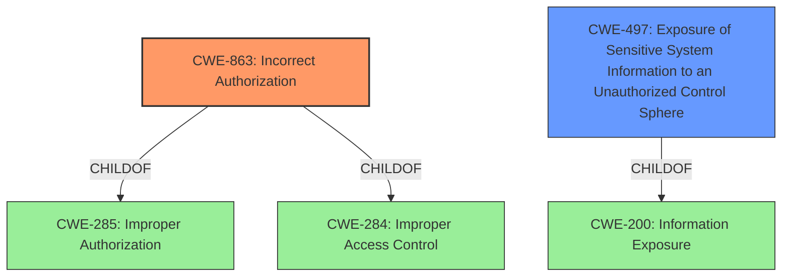

# Raw Analyzer Response for CVE-2020-13676

# Summary
| CWE ID | CWE Name | Confidence | CWE Abstraction Level | CWE Vulnerability Mapping Label | CWE-Vulnerability Mapping Notes |
|---|---|---|---|---|---|
| CWE-863 | Incorrect Authorization | 0.8 | Class | Allowed-with-Review | Primary CWE. The QuickEdit module performs an authorization check, but it does not correctly perform the check. |
| CWE-497 | Exposure of Sensitive System Information to an Unauthorized Control Sphere | 0.6 | Base | Allowed | Secondary candidate. The vulnerability leads to unintended disclosure of field data. |

## Evidence and Confidence

*   **Confidence Score:** 0.7
*   **Evidence Strength:** MEDIUM

## Relationship Analysis
The primary CWE is CWE-863 (Incorrect Authorization), a Class-level CWE. CWE-863 is a child of CWE-285 (Improper Authorization) and CWE-284 (Improper Access Control). CWE-497 (Exposure of Sensitive System Information to an Unauthorized Control Sphere) is a Base-level CWE and a child of CWE-200 (Information Exposure).

## Vulnerability Chain
The vulnerability chain starts with the **improper authorization** check (CWE-863) in the QuickEdit module, which leads to an **access bypass**, resulting in the **unintended disclosure of field data** (CWE-497).

## Summary of Analysis
The vulnerability lies in the QuickEdit module's failure to properly check access to fields, leading to unintended disclosure of field data.

The "Root cause of vulnerability" is that "The QuickEdit module **does not properly check access to fields** in some circumstances." The "Weaknesses/vulnerabilities" is "Access bypass leading to unintended disclosure of field data." The "**impact**" is "unintended disclosure of field data."

CWE-863 (Incorrect Authorization) aligns with the **improper access check**, and CWE-497 (Exposure of Sensitive System Information to an Unauthorized Control Sphere) aligns with the **unintended disclosure of field data**.

The retriever results also suggest CWE-863 as a potential match, with a score of 0.081. CWE-497 has a sparse retriever score of 0.074.

The MITRE mapping guidance for CWE-863 suggests that it is a Class and might have Base-level children that would be more appropriate. However, the description provided aligns well with the general nature of the **incorrect authorization** without specifying the exact mechanism of the error. Therefore, it is appropriate to use the Class-level CWE.

CWE-497 is considered a secondary weakness since the primary issue is the **incorrect authorization** which leads to the **exposure of sensitive information**.

Other CWEs Considered:
- CWE-862 (Missing Authorization): While this could be considered, the description explicitly states that the module *does* perform an access check, but it is done incorrectly. Thus, CWE-863 is more appropriate than CWE-862.
- CWE-639 (Authorization Bypass Through User-Controlled Key): This is a specific case of authorization bypass, but the description doesn't provide enough detail to suggest that the bypass occurs through a user-controlled key.
- CWE-215 (Insertion of Sensitive Information Into Debugging Code) and CWE-489 (Active Debug Code): These CWEs are related to debugging code, which is not mentioned in the vulnerability description.