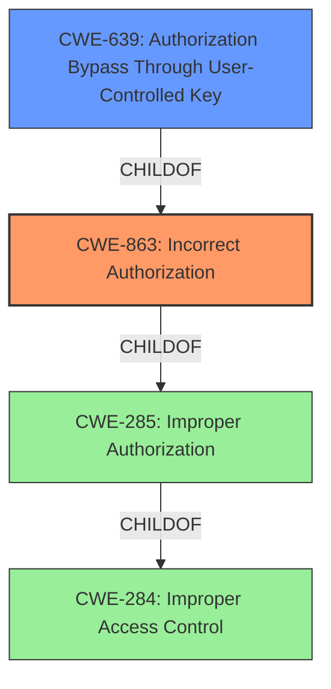

# Analysis for CVE-2020-13677

# Summary
| CWE ID | CWE Name | Confidence | CWE Abstraction Level | CWE Vulnerability Mapping Label | CWE-Vulnerability Mapping Notes |
|---|---|---|---|---|---|
| CWE-863 | Incorrect Authorization | 0.8 | Class | Primary | Allowed-with-Review |
| CWE-639 | Authorization Bypass Through User-Controlled Key | 0.6 | Base | Secondary | Allowed |

## Evidence and Confidence

*   **Confidence Score:** 0.7
*   **Evidence Strength:** MEDIUM

## Relationship Analysis
The primary CWE, CWE-863, is a Class-level weakness indicating a general problem with authorization checks. The secondary CWE, CWE-639, is a Base-level weakness describing a specific type of authorization bypass. CWE-639 is a ChildOf CWE-863, meaning it is a more specific instance of an incorrect authorization. Because the vulnerability involves bypassing authorization through **improper access restriction**, I selected CWE-863. I also considered the more specific CWE-639 because the summary refers to "unintended access bypass", so I selected it as a secondary candidate.

## Vulnerability Chain
The vulnerability chain starts with the **improper access restriction** in the Drupal core JSONAPI module, leading to an unintended access bypass.
  - Root Cause: **improper access restriction**
  - Weakness: Incorrect Authorization
  - Impact: Unintended access bypass

## Summary of Analysis
The vulnerability description clearly indicates an **improper access restriction** within the Drupal core JSONAPI module that leads to an unintended access bypass.

The evidence supporting this assessment comes from the "Vulnerability Description Key Phrases" section, which identifies "**improper access restriction**" as the root cause and "unintended access bypass" as the impact. The "CVE Reference Links Content Summary" section reinforces this by stating that the **root cause** is that the Drupal core JSON:API module "does not properly restrict access to certain content under some circumstances," leading to an access bypass.

The Retriever Results list CWE-863 (Incorrect Authorization) as the top candidate. Given the **root cause** of **improper access restriction**, CWE-863 is the most appropriate primary CWE.

CWE-639 (Authorization Bypass Through User-Controlled Key) was considered as a secondary CWE because the vulnerability results in an access bypass. However, the description doesn't explicitly state that the bypass is achieved through a user-controlled key, so I chose it as a secondary.

The selected CWEs are at the optimal level of specificity. CWE-863 captures the general **incorrect authorization**, while CWE-639 describes a specific type of authorization bypass that could be relevant.

Relevant CWE Information:

# Enhanced Context (25 CWEs)
The following CWEs were identified as potentially relevant to this vulnerability:

## CWE-267: Privilege Defined With Unsafe Actions
**Abstraction Level**: Base
**Similarity Score**: 0.76
**Source**: dense

**Description**:
A particular privilege, role, capability, or right can be used to perform unsafe actions that were not intended, even when it is assigned to the correct entity.

**Mapping Guidance**:
- Usage: Allowed
- Rationale: This CWE entry is at the Base level of abstraction, which is a preferred level of abstraction for mapping to the root causes of vulnerabilities.

## CWE-274: Improper Handling of Insufficient Privileges
**Abstraction Level**: Base
**Similarity Score**: 0.76
**Source**: dense

**Description**:
The product does not handle or incorrectly handles when it has insufficient privileges to perform an operation, leading to resultant weaknesses.

**Mapping Guidance**:
- Usage: Discouraged
- Rationale: This CWE entry could be deprecated in a future version of CWE.

## CWE-639: Authorization Bypass Through User-Controlled Key
**Abstraction Level**: Base
**Similarity Score**: 0.76
**Source**: dense

**Description**:
The system's authorization functionality does not prevent one user from gaining access to another user's data or record by modifying the key value identifying the data.

**Mapping Guidance**:
- Usage: Allowed
- Rationale: This CWE entry is at the Base level of abstraction, which is a preferred level of abstraction for mapping to the root causes of vulnerabilities.

## CWE-668: Exposure of Resource to Wrong Sphere
**Abstraction Level**: Class
**Similarity Score**: 0.76
**Source**: dense

**Description**:
The product exposes a resource to the wrong control sphere, providing unintended actors with inappropriate access to the resource.

**Mapping Guidance**:
- Usage: Discouraged
- Rationale: CWE-668 is high-level and is often misused as a catch-all when lower-level CWE IDs might be applicable. It is sometimes used for low-information vulnerability reports [REF-1287]. It is a level-1 Class (i.e., a child of a Pillar). It is not useful for trend analysis.

## CWE-807: Reliance on Untrusted Inputs in a Security Decision
**Abstraction Level**: Base
**Similarity Score**: 0.75
**Source**: dense

**Description**:
The product uses a protection mechanism that relies on the existence or values of an input, but the input can be modified by an untrusted actor in a way that bypasses the protection mechanism.

**Mapping Guidance**:
- Usage: Allowed
- Rationale: This CWE entry is at the Base level of abstraction, which is a preferred level of abstraction for mapping to the root causes of vulnerabilities.

## CWE-266: Incorrect Privilege Assignment
**Abstraction Level**: Base
**Similarity Score**: 0.75
**Source**: dense

**Description**:
A product incorrectly assigns a privilege to a particular actor, creating an unintended sphere of control for that actor.

**Mapping Guidance**:
- Usage: Allowed
- Rationale: This CWE entry is at the Base level of abstraction, which is a preferred level of abstraction for mapping to the root causes of vulnerabilities.

## CWE-41: Improper Resolution of Path Equivalence
**Abstraction Level**: Base
**Similarity Score**: 0.75
**Source**: dense

**Description**:
The product is vulnerable to file system contents disclosure through path equivalence. Path equivalence involves the use of special characters in file and directory names. The associated manipulations are intended to generate multiple names for the same object.

**Mapping Guidance**:
- Usage: Allowed
- Rationale: This CWE entry is at the Base level of abstraction, which is a preferred level of abstraction for mapping to the root causes of vulnerabilities.

## CWE-280: Improper Handling of Insufficient Permissions or Privileges 
**Abstraction Level**: Base
**Similarity Score**: 0.75
**Source**: dense

**Description**:
The product does not handle or incorrectly handles when it has insufficient privileges to access resources or functionality as specified by their permissions. This may cause it to follow unexpected code paths that may leave the product in an invalid state.

**Mapping Guidance**:
- Usage: Allowed
- Rationale: This CWE entry is at the Base level of abstraction, which is a preferred level of abstraction for mapping to the root causes of vulnerabilities.

## CWE-552: Files or Directories Accessible to External Parties
**Abstraction Level**: Base
**Similarity Score**: 0.75
**Source**: dense

**Description**:
The product makes files or directories accessible to unauthorized actors, even though they should not be.

**Mapping Guidance**:
- Usage: Allowed
- Rationale: This CWE entry is at the Base level of abstraction, which is a preferred level of abstraction for mapping to the root causes of vulnerabilities.

## CWE-653: Improper Isolation or Compartmentalization
**Abstraction Level**: Class
**Similarity Score**: 0.74
**Source**: dense

**Description**:
The product does not properly compartmentalize or isolate functionality, processes, or resources that require different privilege levels, rights, or permissions.

**Mapping Guidance**:
- Usage: Allowed
- Rationale: This CWE entry is at the Base level of abstraction, which is a preferred level of abstraction for mapping to the root causes of vulnerabilities.

## CWE-639: Authorization Bypass Through User-Controlled Key
**Abstraction Level**: Base
**Similarity Score**: 5863.61
**Source**: sparse

**Description**:
The system's authorization functionality does not prevent one user from gaining access