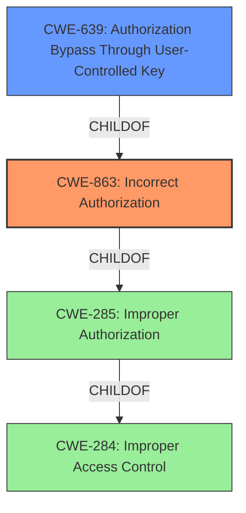

# Analysis for CVE-2020-13677

# Summary
| CWE ID | CWE Name | Confidence | CWE Abstraction Level | CWE Vulnerability Mapping Label | CWE-Vulnerability Mapping Notes |
|---|---|---|---|---|---|
| CWE-863 | Incorrect Authorization | 0.8 | Class | Primary | Allowed-with-Review |
| CWE-639 | Authorization Bypass Through User-Controlled Key | 0.6 | Base | Secondary | Allowed |

## Evidence and Confidence

*   **Confidence Score:** 0.7
*   **Evidence Strength:** MEDIUM

## Relationship Analysis
The primary CWE, CWE-863, is a Class-level weakness indicating a general problem with authorization checks. The secondary CWE, CWE-639, is a Base-level weakness describing a specific type of authorization bypass. CWE-639 is a ChildOf CWE-863, meaning it is a more specific instance of an incorrect authorization. Because the vulnerability involves bypassing authorization through **improper access restriction**, I selected CWE-863. I also considered the more specific CWE-639 because the summary refers to "unintended access bypass", so I selected it as a secondary candidate.



## Vulnerability Chain
The vulnerability chain starts with the **improper access restriction** in the Drupal core JSONAPI module, leading to an unintended access bypass.
  - Root Cause: **improper access restriction**
  - Weakness: Incorrect Authorization
  - Impact: Unintended access bypass

## Summary of Analysis
The vulnerability description clearly indicates an **improper access restriction** within the Drupal core JSONAPI module that leads to an unintended access bypass.

The evidence supporting this assessment comes from the "Vulnerability Description Key Phrases" section, which identifies "**improper access restriction**" as the root cause and "unintended access bypass" as the impact. The "CVE Reference Links Content Summary" section reinforces this by stating that the **root cause** is that the Drupal core JSON:API module "does not properly restrict access to certain content under some circumstances," leading to an access bypass.

The Retriever Results list CWE-863 (Incorrect Authorization) as the top candidate. Given the **root cause** of **improper access restriction**, CWE-863 is the most appropriate primary CWE.

CWE-639 (Authorization Bypass Through User-Controlled Key) was considered as a secondary CWE because the vulnerability results in an access bypass. However, the description doesn't explicitly state that the bypass is achieved through a user-controlled key, so I chose it as a secondary.

The selected CWEs are at the optimal level of specificity. CWE-863 captures the general **incorrect authorization**, while CWE-639 describes a specific type of authorization bypass that could be relevant.

Relevant CWE Information:

# Enhanced Context (25 CWEs)
The following CWEs were identified as potentially relevant to this vulnerability:

## CWE-267: Privilege Defined With Unsafe Actions
**Abstraction Level**: Base
**Similarity Score**: 0.76
**Source**: dense

**Description**:
A particular privilege, role, capability, or right can be used to perform unsafe actions that were not intended, even when it is assigned to the correct entity.

**Mapping Guidance**:
- Usage: Allowed
- Rationale: This CWE entry is at the Base level of abstraction, which is a preferred level of abstraction for mapping to the root causes of vulnerabilities.

## CWE-274: Improper Handling of Insufficient Privileges
**Abstraction Level**: Base
**Similarity Score**: 0.76
**Source**: dense

**Description**:
The product does not handle or incorrectly handles when it has insufficient privileges to perform an operation, leading to resultant weaknesses.

**Mapping Guidance**:
- Usage: Discouraged
- Rationale: This CWE entry could be deprecated in a future version of CWE.

## CWE-639: Authorization Bypass Through User-Controlled Key
**Abstraction Level**: Base
**Similarity Score**: 0.76
**Source**: dense

**Description**:
The system's authorization functionality does not prevent one user from gaining access to another user's data or record by modifying the key value identifying the data.

**Mapping Guidance**:
- Usage: Allowed
- Rationale: This CWE entry is at the Base level of abstraction, which is a preferred level of abstraction for mapping to the root causes of vulnerabilities.

## CWE-668: Exposure of Resource to Wrong Sphere
**Abstraction Level**: Class
**Similarity Score**: 0.76
**Source**: dense

**Description**:
The product exposes a resource to the wrong control sphere, providing unintended actors with inappropriate access to the resource.

**Mapping Guidance**:
- Usage: Discouraged
- Rationale: CWE-668 is high-level and is often misused as a catch-all when lower-level CWE IDs might be applicable. It is sometimes used for low-information vulnerability reports [REF-1287]. It is a level-1 Class (i.e., a child of a Pillar). It is not useful for trend analysis.

## CWE-807: Reliance on Untrusted Inputs in a Security Decision
**Abstraction Level**: Base
**Similarity Score**: 0.75
**Source**: dense

**Description**:
The product uses a protection mechanism that relies on the existence or values of an input, but the input can be modified by an untrusted actor in a way that bypasses the protection mechanism.

**Mapping Guidance**:
- Usage: Allowed
- Rationale: This CWE entry is at the Base level of abstraction, which is a preferred level of abstraction for mapping to the root causes of vulnerabilities.

## CWE-266: Incorrect Privilege Assignment
**Abstraction Level**: Base
**Similarity Score**: 0.75
**Source**: dense

**Description**:
A product incorrectly assigns a privilege to a particular actor, creating an unintended sphere of control for that actor.

**Mapping Guidance**:
- Usage: Allowed
- Rationale: This CWE entry is at the Base level of abstraction, which is a preferred level of abstraction for mapping to the root causes of vulnerabilities.

## CWE-41: Improper Resolution of Path Equivalence
**Abstraction Level**: Base
**Similarity Score**: 0.75
**Source**: dense

**Description**:
The product is vulnerable to file system contents disclosure through path equivalence. Path equivalence involves the use of special characters in file and directory names. The associated manipulations are intended to generate multiple names for the same object.

**Mapping Guidance**:
- Usage: Allowed
- Rationale: This CWE entry is at the Base level of abstraction, which is a preferred level of abstraction for mapping to the root causes of vulnerabilities.

## CWE-280: Improper Handling of Insufficient Permissions or Privileges 
**Abstraction Level**: Base
**Similarity Score**: 0.75
**Source**: dense

**Description**:
The product does not handle or incorrectly handles when it has insufficient privileges to access resources or functionality as specified by their permissions. This may cause it to follow unexpected code paths that may leave the product in an invalid state.

**Mapping Guidance**:
- Usage: Allowed
- Rationale: This CWE entry is at the Base level of abstraction, which is a preferred level of abstraction for mapping to the root causes of vulnerabilities.

## CWE-552: Files or Directories Accessible to External Parties
**Abstraction Level**: Base
**Similarity Score**: 0.75
**Source**: dense

**Description**:
The product makes files or directories accessible to unauthorized actors, even though they should not be.

**Mapping Guidance**:
- Usage: Allowed
- Rationale: This CWE entry is at the Base level of abstraction, which is a preferred level of abstraction for mapping to the root causes of vulnerabilities.

## CWE-653: Improper Isolation or Compartmentalization
**Abstraction Level**: Class
**Similarity Score**: 0.74
**Source**: dense

**Description**:
The product does not properly compartmentalize or isolate functionality, processes, or resources that require different privilege levels, rights, or permissions.

**Mapping Guidance**:
- Usage: Allowed
- Rationale: This CWE entry is at the Base level of abstraction, which is a preferred level of abstraction for mapping to the root causes of vulnerabilities.

## CWE-639: Authorization Bypass Through User-Controlled Key
**Abstraction Level**: Base
**Similarity Score**: 5863.61
**Source**: sparse

**Description**:
The system's authorization functionality does not prevent one user from gaining access

# Enhanced Query for CVE-2020-13677

## Vulnerability Description
Under some circumstances, the Drupal core JSONAPI module does not properly restrict access to certain content, which may result in unintended access bypass. Sites that do not have the JSONAPI module enabled are not affected.

### Vulnerability Description Key Phrases
- **rootcause:** **improper access restriction**
- **impact:** unintended access bypass
- **product:** Drupal core
- **component:** JSONAPI module

## CVE Reference Links Content Summary
Based on the provided content, here's a breakdown of the vulnerability:

*   **Root Cause:** The Drupal core JSON:API module does not properly restrict access to certain content under some circumstances.
*   **Weaknesses/Vulnerabilities:** Access Bypass due to improper access restrictions within the JSON:API module.
*   **Impact of Exploitation:** Unintended access to content that should otherwise be restricted. This may result in the disclosure of non-public data.
*   **Attack Vectors:** The vulnerability is triggered by accessing the Drupal site via the JSON:API module.
*   **Required Attacker Capabilities/Position:** No authentication is required to exploit this vulnerability. An attacker needs to interact with the vulnerable Drupal site by accessing the JSON:API.

Additional details:

*   The vulnerability is rated as "Moderately critical".
*   The vulnerability is present in Drupal core versions >= 8.0.0 <8.9.19, >= 9.1.0 <9.1.13, and >=9.2.0 <9.2.6.
*   Sites that do not have the JSON:API module enabled are not affected.
*   Versions of Drupal 8 prior to 8.9.x and versions of Drupal 9 prior to 9.1.x are end-of-life and do not receive security coverage.
*   Drupal 7 core does not include the JSON:API module and therefore is not affected.
*   The provided advisory is not covered by the Drupal Steward program.

## Retriever Results

### Top Combined Results

| Rank | CWE ID | Name | Abstraction | Usage  | Retrievers | Individual Scores |
|------|--------|------|-------------|-------|------------|-------------------|
| 1 | 863 | Incorrect Authorization | Class | Allowed-with-Review | sparse | 0.216 |
| 2 | 285 | Improper Authorization | Class | Discouraged | sparse | 0.215 |
| 3 | 287 | Improper Authentication | Class | Discouraged | sparse | 0.206 |
| 4 | 284 | Improper Access Control | Pillar | Discouraged | sparse | 0.204 |
| 5 | 1390 | Weak Authentication | Class | Allowed-with-Review | sparse | 0.201 |
| 6 | 639 | Authorization Bypass Through User-Controlled Key | Base | Allowed | dense | 0.470 |
| 7 | 1275 | Sensitive Cookie with Improper SameSite Attribute | Variant | Allowed | graph | 0.003 |
| 8 | 306 | Missing Authentication for Critical Function | Base | Allowed | sparse | 0.197 |
| 9 | 434 | Unrestricted Upload of File with Dangerous Type | Base | Allowed | sparse | 0.195 |
| 10 | 267 | Privilege Defined With Unsafe Actions | Base | Allowed | sparse | 0.194 |


# Complete CWE Specifications


## CWE-863: Incorrect Authorization
**Abstraction:** Class
**Status:** Incomplete

### Description
The product performs an authorization check when an actor attempts to access a resource or perform an action, but it does not correctly perform the check.

### Extended Description
Not provided

### Alternative Terms
AuthZ: "AuthZ" is typically used as an abbreviation of "authorization" within the web application security community. It is distinct from "AuthN" (or, sometimes, "AuthC") which is an abbreviation of "authentication." The use of "Auth" as an abbreviation is discouraged, since it could be used for either authentication or authorization.

### Relationships
ChildOf -> CWE-285
ChildOf -> CWE-284

### Mapping Guidance
**Usage:** Allowed-with-Review
**Rationale:** This CWE entry is a Class and might have Base-level children that would be more appropriate
**Comments:** Examine children of this entry to see if there is a better fit
**Reasons:**
- Abstraction


### Additional Notes
**[Terminology]** 

Assuming a user with a given identity, authorization is the process of determining whether that user can access a given resource, based on the user's privileges and any permissions or other access-control specifications that apply to the resource.


### Observed Examples
- **CVE-2021-39155:** Chain: A microservice integration and management platform compares the hostname in the HTTP Host header in a case-sensitive way (CWE-178, CWE-1289), allowing bypass of the authorization policy (CWE-863) using a hostname with mixed case or other variations.
- **CVE-2019-15900:** Chain: sscanf() call is used to check if a username and group exists, but the return value of sscanf() call is not checked (CWE-252), causing an uninitialized variable to be checked (CWE-457), returning success to allow authorization bypass for executing a privileged (CWE-863).
- **CVE-2009-2213:** Gateway uses default "Allow" configuration for its authorization settings.


## CWE-285: Improper Authorization
**Abstraction:** Class
**Status:** Draft

### Description
The product does not perform or incorrectly performs an authorization check when an actor attempts to access a resource or perform an action.

### Extended Description


Assuming a user with a given identity, authorization is the process of determining whether that user can access a given resource, based on the user's privileges and any permissions or other access-control specifications that apply to the resource.


When access control checks are not applied consistently - or not at all - users are able to access data or perform actions that they should not be allowed to perform. This can lead to a wide range of problems, including information exposures, denial of service, and arbitrary code execution.


### Alternative Terms
AuthZ: "AuthZ" is typically used as an abbreviation of "authorization" within the web application security community. It is distinct from "AuthN" (or, sometimes, "AuthC") which is an abbreviation of "authentication." The use of "Auth" as an abbreviation is discouraged, since it could be used for either authentication or authorization.

### Relationships
ChildOf -> CWE-284
ChildOf -> CWE-284

### Mapping Guidance
**Usage:** Discouraged
**Rationale:** CWE-285 is high-level and lower-level CWEs can frequently be used instead. It is a level-1 Class (i.e., a child of a Pillar).
**Comments:** Look at CWE-285's children and consider mapping to CWEs such as CWE-862: Missing Authorization, CWE-863: Incorrect Authorization, CWE-732: Incorrect Permission Assignment for Critical Resource, or others.
**Reasons:**
- Abstraction
**Suggested Alternatives:**
- CWE-862: Missing Authorization
- CWE-863: Incorrect Authorization
- CWE-732: Incorrect Permission Assignment for Critical Resource


### Observed Examples
- **CVE-2022-24730:** Go-based continuous deployment product does not check that a user has certain privileges to update or create an app, allowing adversaries to read sensitive repository information
- **CVE-2009-3168:** Web application does not restrict access to admin scripts, allowing authenticated users to reset administrative passwords.
- **CVE-2009-2960:** Web application does not restrict access to admin scripts, allowing authenticated users to modify passwords of other users.


## CWE-287: Improper Authentication
**Abstraction:** Class
**Status:** Draft

### Description
When an actor claims to have a given identity, the product does not prove or insufficiently proves that the claim is correct.

### Extended Description
Not provided

### Alternative Terms
authentification: An alternate term is "authentification", which appears to be most commonly used by people from non-English-speaking countries.
AuthN: "AuthN" is typically used as an abbreviation of "authentication" within the web application security community. It is also distinct from "AuthZ," which is an abbreviation of "authorization." The use of "Auth" as an abbreviation is discouraged, since it could be used for either authentication or authorization.
AuthC: "AuthC" is used as an abbreviation of "authentication," but it appears to used less frequently than "AuthN."

### Relationships
ChildOf -> CWE-284
ChildOf -> CWE-284

### Mapping Guidance
**Usage:** Discouraged
**Rationale:** This CWE entry might be misused when lower-level CWE entries are likely to be applicable. It is a level-1 Class (i.e., a child of a Pillar).
**Comments:** Consider children or descendants, beginning with CWE-1390: Weak Authentication or CWE-306: Missing Authentication for Critical Function.
**Reasons:**
- Frequent Misuse
**Suggested Alternatives:**
- CWE-1390: Weak Authentication
- CWE-306: Missing Authentication for Critical Function


### Additional Notes
**[Relationship]** This can be resultant from SQL injection vulnerabilities and other issues.

**[Maintenance]** The Taxonomy_Mappings to ISA/IEC 62443 were added in CWE 4.10, but they are still under review and might change in future CWE versions. These draft mappings were performed by members of the "Mapping CWE to 62443" subgroup of the CWE-CAPEC ICS/OT Special Interest Group (SIG), and their work is incomplete as of CWE 4.10. The mappings are included to facilitate discussion and review by the broader ICS/OT community, and they are likely to change in future CWE versions.


### Observed Examples
- **CVE-2022-35248:** Chat application skips validation when Central Authentication Service (CAS) is enabled, effectively removing the second factor from two-factor authentication
- **CVE-2022-36436:** Python-based authentication proxy does not enforce password authentication during the initial handshake, allowing the client to bypass authentication by specifying a 'None' authentication type.
- **CVE-2022-30034:** Chain: Web UI for a Python RPC framework does not use regex anchors to validate user login emails (CWE-777), potentially allowing bypass of OAuth (CWE-1390).


## CWE-284: Improper Access Control
**Abstraction:** Pillar
**Status:** Incomplete

### Description
The product does not restrict or incorrectly restricts access to a resource from an unauthorized actor.

### Extended Description


Access control involves the use of several protection mechanisms such as:


  - Authentication (proving the identity of an actor)

  - Authorization (ensuring that a given actor can access a resource), and

  - Accountability (tracking of activities that were performed)

When any mechanism is not applied or otherwise fails, attackers can compromise the security of the product by gaining privileges, reading sensitive information, executing commands, evading detection, etc.

There are two distinct behaviors that can introduce access control weaknesses:


  - Specification: incorrect privileges, permissions, ownership, etc. are explicitly specified for either the user or the resource (for example, setting a password file to be world-writable, or giving administrator capabilities to a guest user). This action could be performed by the program or the administrator.

  - Enforcement: the mechanism contains errors that prevent it from properly enforcing the specified access control requirements (e.g., allowing the user to specify their own privileges, or allowing a syntactically-incorrect ACL to produce insecure settings). This problem occurs within the program itself, in that it does not actually enforce the intended security policy that the administrator specifies.


### Alternative Terms
Authorization: The terms "access control" and "authorization" are often used interchangeably, although many people have distinct definitions. The CWE usage of "access control" is intended as a general term for the various mechanisms that restrict which users can access which resources, and "authorization" is more narrowly defined. It is unlikely that there will be community consensus on the use of these terms.

### Relationships
None

### Mapping Guidance
**Usage:** Discouraged
**Rationale:** CWE-284 is extremely high-level, a Pillar. Its name, "Improper Access Control," is often misused in low-information vulnerability reports [REF-1287] or by active use of the OWASP Top Ten, such as "A01:2021-Broken Access Control". It is not useful for trend analysis.
**Comments:** Consider using descendants of CWE-284 that are more specific to the kind of access control involved, such as those involving authorization (Missing Authorization (CWE-862), Incorrect Authorization (CWE-863), Incorrect Permission Assignment for Critical Resource (CWE-732), etc.); authentication (Missing Authentication (CWE-306) or Weak Authentication (CWE-1390)); Incorrect User Management (CWE-286); Improper Restriction of Communication Channel to Intended Endpoints (CWE-923); etc.
**Reasons:**
- Frequent Misuse
- Abstraction
**Suggested Alternatives:**
- CWE-862: Missing Authorization
- CWE-863: Incorrect Authorization
- CWE-732: Incorrect Permission Assignment for Critical Resource
- CWE-306: Missing Authentication
- CWE-1390: Weak Authentication
- CWE-923: Improper Restriction of Communication Channel to Intended Endpoints


### Additional Notes
**[Maintenance]** 

This entry needs more work. Possible sub-categories include:


  - Trusted group includes undesired entities (partially covered by CWE-286)

  - Group can perform undesired actions

  - ACL parse error does not fail closed


### Observed Examples
- **CVE-2022-24985:** A form hosting website only checks the session authentication status for a single form, making it possible to bypass authentication when there are multiple forms
- **CVE-2022-29238:** Access-control setting in web-based document collaboration tool is not properly implemented by the code, which prevents listing hidden directories but does not prevent direct requests to files in those directories.
- **CVE-2022-23607:** Python-based HTTP library did not scope cookies to a particular domain such that "supercookies" could be sent to any domain on redirect


## CWE-1390: Weak Authentication
**Abstraction:** Class
**Status:** Incomplete

### Description
The product uses an authentication mechanism to restrict access to specific users or identities, but the mechanism does not sufficiently prove that the claimed identity is correct.

### Extended Description


Attackers may be able to bypass weak authentication faster and/or with less effort than expected.


### Alternative Terms
None

### Relationships
ChildOf -> CWE-287

### Mapping Guidance
**Usage:** Allowed-with-Review
**Rationale:** This CWE entry is a Class and might have Base-level children that would be more appropriate
**Comments:** Examine children of this entry to see if there is a better fit
**Reasons:**
- Abstraction


### Observed Examples
- **CVE-2022-30034:** Chain: Web UI for a Python RPC framework does not use regex anchors to validate user login emails (CWE-777), potentially allowing bypass of OAuth (CWE-1390).
- **CVE-2022-35248:** Chat application skips validation when Central Authentication Service (CAS) is enabled, effectively removing the second factor from two-factor authentication
- **CVE-2021-3116:** Chain: Python-based HTTP Proxy server uses the wrong boolean operators (CWE-480) causing an incorrect comparison (CWE-697) that identifies an authN failure if all three conditions are met instead of only one, allowing bypass of the proxy authentication (CWE-1390)


## CWE-639: Authorization Bypass Through User-Controlled Key
**Abstraction:** Base
**Status:** Incomplete

### Description
The system's authorization functionality does not prevent one user from gaining access to another user's data or record by modifying the key value identifying the data.

### Extended Description


Retrieval of a user record occurs in the system based on some key value that is under user control. The key would typically identify a user-related record stored in the system and would be used to lookup that record for presentation to the user. It is likely that an attacker would have to be an authenticated user in the system. However, the authorization process would not properly check the data access operation to ensure that the authenticated user performing the operation has sufficient entitlements to perform the requested data access, hence bypassing any other authorization checks present in the system.


For example, attackers can look at places where user specific data is retrieved (e.g. search screens) and determine whether the key for the item being looked up is controllable externally. The key may be a hidden field in the HTML form field, might be passed as a URL parameter or as an unencrypted cookie variable, then in each of these cases it will be possible to tamper with the key value.


One manifestation of this weakness is when a system uses sequential or otherwise easily-guessable session IDs that would allow one user to easily switch to another user's session and read/modify their data.


### Alternative Terms
Insecure Direct Object Reference / IDOR: The "Insecure Direct Object Reference" term, as described in the OWASP Top Ten, is broader than this CWE because it also covers path traversal (CWE-22). Within the context of vulnerability theory, there is a similarity between the OWASP concept and CWE-706: Use of Incorrectly-Resolved Name or Reference.
Broken Object Level Authorization / BOLA: BOLA is used in the 2019 OWASP API Security Top 10 and is said to be the same as IDOR.
Horizontal Authorization: "Horizontal Authorization" is used to describe situations in which two users have the same privilege level, but must be prevented from accessing each other's resources. This is fairly common when using key-based access to resources in a multi-user context.

### Relationships
ChildOf -> CWE-863
ChildOf -> CWE-863
ChildOf -> CWE-284

### Mapping Guidance
**Usage:** Allowed
**Rationale:** This CWE entry is at the Base level of abstraction, which is a preferred level of abstraction for mapping to the root causes of vulnerabilities.
**Comments:** Carefully read both the name and description to ensure that this mapping is an appropriate fit. Do not try to 'force' a mapping to a lower-level Base/Variant simply to comply with this preferred level of abstraction.
**Reasons:**
- Acceptable-Use


### Observed Examples
- **CVE-2021-36539:** An educational application does not appropriately restrict file IDs to a particular user. The attacker can brute-force guess IDs, indicating IDOR.


## CWE-1275: Sensitive Cookie with Improper SameSite Attribute
**Abstraction:** Variant
**Status:** Incomplete

### Description
The SameSite attribute for sensitive cookies is not set, or an insecure value is used.

### Extended Description
The SameSite attribute controls how cookies are sent for cross-domain requests. This attribute may have three values: 'Lax', 'Strict', or 'None'. If the 'None' value is used, a website may create a cross-domain POST HTTP request to another website, and the browser automatically adds cookies to this request. This may lead to Cross-Site-Request-Forgery (CSRF) attacks if there are no additional protections in place (such as Anti-CSRF tokens).

### Alternative Terms
None

### Relationships
ChildOf -> CWE-923
CanPrecede -> CWE-352

### Mapping Guidance
**Usage:** Allowed
**Rationale:** This CWE entry is at the Variant level of abstraction, which is a preferred level of abstraction for mapping to the root causes of vulnerabilities.
**Comments:** Carefully read both the name and description to ensure that this mapping is an appropriate fit. Do not try to 'force' a mapping to a lower-level Base/Variant simply to comply with this preferred level of abstraction.
**Reasons:**
- Acceptable-Use


### Observed Examples
- **CVE-2022-24045:** Web application for a room automation system has client-side JavaScript that sets a sensitive cookie without the SameSite security attribute, allowing the cookie to be sniffed


## CWE-306: Missing Authentication for Critical Function
**Abstraction:** Base
**Status:** Draft

### Description
The product does not perform any authentication for functionality that requires a provable user identity or consumes a significant amount of resources.

### Extended Description
Not provided

### Alternative Terms
None

### Relationships
ChildOf -> CWE-287
ChildOf -> CWE-287

### Mapping Guidance
**Usage:** Allowed
**Rationale:** This CWE entry is at the Base level of abstraction, which is a preferred level of abstraction for mapping to the root causes of vulnerabilities.
**Comments:** Carefully read both the name and description to ensure that this mapping is an appropriate fit. Do not try to 'force' a mapping to a lower-level Base/Variant simply to comply with this preferred level of abstraction.
**Reasons:**
- Acceptable-Use


### Observed Examples
- **CVE-2022-31260:** Chain: a digital asset management program has an undisclosed backdoor in the legacy version of a PHP script (CWE-912) that could allow an unauthenticated user to export metadata (CWE-306)
- **CVE-2022-29951:** TCP-based protocol in Programmable Logic Controller (PLC) has no authentication.
- **CVE-2022-29952:** Condition Monitor firmware uses a protocol that does not require authentication.


## CWE-434: Unrestricted Upload of File with Dangerous Type
**Abstraction:** Base
**Status:** Draft

### Description
The product allows the upload or transfer of dangerous file types that are automatically processed within its environment.

### Extended Description
Not provided

### Alternative Terms
Unrestricted File Upload: Used in vulnerability databases and elsewhere, but it is insufficiently precise. The phrase could be interpreted as the lack of restrictions on the size or number of uploaded files, which is a resource consumption issue.

### Relationships
ChildOf -> CWE-669
ChildOf -> CWE-669
PeerOf -> CWE-351
PeerOf -> CWE-436
PeerOf -> CWE-430

### Mapping Guidance
**Usage:** Allowed
**Rationale:** This CWE entry is at the Base level of abstraction, which is a preferred level of abstraction for mapping to the root causes of vulnerabilities.
**Comments:** Carefully read both the name and description to ensure that this mapping is an appropriate fit. Do not try to 'force' a mapping to a lower-level Base/Variant simply to comply with this preferred level of abstraction.
**Reasons:**
- Acceptable-Use


### Additional Notes
**[Relationship]** 

This can have a chaining relationship with incomplete denylist / permissive allowlist errors when the product tries, but fails, to properly limit which types of files are allowed (CWE-183, CWE-184).


This can also overlap multiple interpretation errors for intermediaries, e.g. anti-virus products that do not remove or quarantine attachments with certain file extensions that can be processed by client systems.


### Observed Examples
- **CVE-2023-5227:** PHP-based FAQ management app does not check the MIME type for uploaded images
- **CVE-2001-0901:** Web-based mail product stores ".shtml" attachments that could contain SSI
- **CVE-2002-1841:** PHP upload does not restrict file types


## CWE-267: Privilege Defined With Unsafe Actions
**Abstraction:** Base
**Status:** Incomplete

### Description
A particular privilege, role, capability, or right can be used to perform unsafe actions that were not intended, even when it is assigned to the correct entity.

### Extended Description
Not provided

### Alternative Terms
None

### Relationships
ChildOf -> CWE-269

### Mapping Guidance
**Usage:** Allowed
**Rationale:** This CWE entry is at the Base level of abstraction, which is a preferred level of abstraction for mapping to the root causes of vulnerabilities.
**Comments:** Carefully read both the name and description to ensure that this mapping is an appropriate fit. Do not try to 'force' a mapping to a lower-level Base/Variant simply to comply with this preferred level of abstraction.
**Reasons:**
- Acceptable-Use


### Additional Notes
**[Maintenance]** 

Note: there are 2 separate sub-categories here:

```
		- privilege incorrectly allows entities to perform certain actions
		- object is incorrectly accessible to entities with a given privilege
```


### Observed Examples
- **CVE-2002-1981:** Roles have access to dangerous procedures (Accessible entities).
- **CVE-2002-1671:** Untrusted object/method gets access to clipboard (Accessible entities).
- **CVE-2004-2204:** Gain privileges using functions/tags that should be restricted (Accessible entities).

