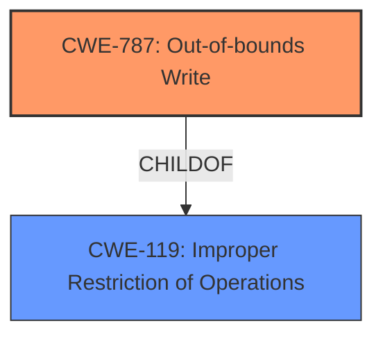

# Analysis for CVE-2020-1380

# Summary
| CWE ID | CWE Name | Confidence | CWE Abstraction Level | CWE Vulnerability Mapping Label | CWE-Vulnerability Mapping Notes |
|---|---|---|---|---|---|
| CWE-787 | Out-of-bounds Write | 1.0 | Base | Allowed | Primary CWE |

## Evidence and Confidence

*   **Confidence Score:** 1.0
*   **Evidence Strength:** HIGH

## Relationship Analysis
The primary CWE selected is CWE-787, which is a Base level CWE. The relationships show that CWE-787 is a child of CWE-119 (Improper Restriction of Operations within the Bounds of a Memory Buffer). This indicates that the out-of-bounds write is a specific type of memory corruption issue. The analysis focuses on the specific **memory corruption** (**improper handling of objects in memory**) root cause rather than higher-level classifications.

## Vulnerability Chain
The vulnerability chain starts with the **improper handling of objects in memory**, leading to **memory corruption**, which results in arbitrary code execution.

## Summary of Analysis
The analysis is based on the provided evidence, particularly the "Vulnerability Description Key Phrases" that highlight the root cause as "**improper handling of objects in memory**" and the resulting weakness as "**memory corruption**". The vulnerability description mentions that the issue lies in the scripting engine's handling of objects in memory, which can lead to **memory corruption** and allow an attacker to execute arbitrary code. The retriever results also strongly suggest CWE-787 (Out-of-bounds Write) as the most relevant CWE.

The selection of CWE-787 is at the optimal level of specificity because it directly addresses the **memory corruption** aspect of the vulnerability. While other CWEs were considered, such as those related to input validation or privilege management, they do not accurately capture the core weakness of **memory corruption** due to **improper handling of objects in memory**. The confidence in this assessment is high (1.0) due to the clear description of the vulnerability and the strong alignment with CWE-787.

Relevant CWE Information:

# Enhanced Context (25 CWEs)

## CWE-1289: Improper Validation of Unsafe Equivalence in Input
**Abstraction Level**: Base
**Similarity Score**: 0.77
**Source**: dense

**Description**:
The product receives an input value that is used as a resource identifier or other type of reference, but it does not validate or incorrectly validates that the input is equivalent to a potentially-unsafe value.

**Mapping Guidance**:
- Usage: Allowed
- Rationale: This CWE entry is at the Base level of abstraction, which is a preferred level of abstraction for mapping to the root causes of vulnerabilities.

**Why it was not selected:** This CWE is not applicable because the vulnerability is not related to the validation of input values.

## CWE-266: Incorrect Privilege Assignment
**Abstraction Level**: Base
**Similarity Score**: 0.76
**Source**: dense

**Description**:
A product incorrectly assigns a privilege to a particular actor, creating an unintended sphere of control for that actor.

**Mapping Guidance**:
- Usage: Allowed
- Rationale: This CWE entry is at the Base level of abstraction, which is a preferred level of abstraction for mapping to the root causes of vulnerabilities.

**Why it was not selected:** The vulnerability is not about incorrect privilege assignment but rather about **memory corruption**.

## CWE-807: Reliance on Untrusted Inputs in a Security Decision
**Abstraction Level**: Base
**Similarity Score**: 0.76
**Source**: dense

**Description**:
The product uses a protection mechanism that relies on the existence or values of an input, but the input can be modified by an untrusted actor in a way that bypasses the protection mechanism.

**Mapping Guidance**:
- Usage: Allowed
- Rationale: This CWE entry is at the Base level of abstraction, which is a preferred level of abstraction for mapping to the root causes of vulnerabilities.

**Why it was not selected:** This CWE does not fit the vulnerability description, which is centered on **memory corruption**, not a reliance on untrusted inputs for security decisions.

## CWE-653: Improper Isolation or Compartmentalization
**Abstraction Level**: Class
**Similarity Score**: 0.76
**Source**: dense

**Description**:
The product does not properly compartmentalize or isolate functionality, processes, or resources that require different privilege levels, rights, or permissions.

**Mapping Guidance**:
- Usage: Allowed
- Rationale: This CWE entry is at the Base level of abstraction, which is a preferred level of abstraction for mapping to the root causes of vulnerabilities.

**Why it was not selected:** The vulnerability is not directly related to improper isolation or compartmentalization, but rather due to **memory corruption**.

## CWE-274: Improper Handling of Insufficient Privileges
**Abstraction Level**: Base
**Similarity Score**: 0.76
**Source**: dense

**Description**:
The product does not handle or incorrectly handles when it has insufficient privileges to perform an operation, leading to resultant weaknesses.

**Mapping Guidance**:
- Usage: Discouraged
- Rationale: This CWE entry could be deprecated in a future version of CWE.

**Why it was not selected:** This CWE does not fit, as the core issue is **memory corruption**, not the handling of insufficient privileges.

## CWE-280: Improper Handling of Insufficient Permissions or Privileges
**Abstraction Level**: Base
**Similarity Score**: 0.76
**Source**: dense

**Description**:
The product does not handle or incorrectly handles when it has insufficient privileges to access resources or functionality as specified by their permissions. This may cause it to follow unexpected code paths that may leave the product in an invalid state.

**Mapping Guidance**:
- Usage: Allowed
- Rationale: This CWE entry is at the Base level of abstraction, which is a preferred level of abstraction for mapping to the root causes of vulnerabilities.

**Why it was not selected:** This CWE does not fit as the issue is related to **memory corruption**.

## CWE-668: Exposure of Resource to Wrong Sphere
**Abstraction Level**: Class
**Similarity Score**: 0.76
**Source**: dense

**Description**:
The product exposes a resource to the wrong control sphere, providing unintended actors with inappropriate access to the resource.

**Mapping Guidance**:
- Usage: Discouraged
- Rationale: CWE-668 is high-level and is often misused as a catch-all when lower-level CWE IDs might be applicable. It is sometimes used for low-information vulnerability reports [REF-1287]. It is a level-1 Class (i.e., a child of a Pillar). It is not useful for trend analysis.

**Why it was not selected:** The vulnerability is caused by **memory corruption**, not the exposure of resources.

## CWE-183: Permissive List of Allowed Inputs
**Abstraction Level**: Base
**Similarity Score**: 0.76
**Source**: dense

**Description**:
The product implements a protection mechanism that relies on a list of inputs (or properties of inputs) that are explicitly allowed by policy because the inputs are assumed to be safe, but the list is too permissive - that is, it allows an input that is unsafe, leading to resultant weaknesses.

**Mapping Guidance**:
- Usage: Allowed
- Rationale: This CWE entry is at the Base level of abstraction, which is a preferred level of abstraction for mapping to the root causes of vulnerabilities.

**Why it was not selected:** This CWE does not accurately describe the vulnerability, which is related to **memory corruption**.

## CWE-267: Privilege Defined With Unsafe Actions
**Abstraction Level**: Base
**Similarity Score**: 0.76
**Source**: dense

**Description**:
A particular privilege, role, capability, or right can be used to perform unsafe actions that were not intended, even when it is assigned to the correct entity.

**Mapping Guidance**:
- Usage: Allowed
- Rationale: This CWE entry is at the Base level of abstraction, which is a preferred level of abstraction for mapping to the root causes of vulnerabilities.

**Why it was not selected:** The vulnerability is not due to a privilege defined with unsafe actions, but due to **memory corruption**.

## CWE-74: Improper Neutralization of Special Elements in Output Used by a Downstream Component ('Injection')
**Abstraction Level**: Class
**Similarity Score**: 0.76
**Source**: dense

**Description**:
The product constructs all or part of a command, data structure, or record using externally-influenced input from an upstream component, but it does not neutralize or incorrectly neutralizes special elements that could modify how it is parsed or interpreted when it is sent to a downstream component.

**Mapping Guidance**:
- Usage: Discouraged
- Rationale: CWE-74 is high-level and often misused when lower-level weaknesses are more appropriate

# Enhanced Query for CVE-2020-1380

## Vulnerability Description
A remote code execution vulnerability exists in the way that the scripting engine handles objects in memory in Internet Explorer. The vulnerability could corrupt memory in such a way that an attacker could execute arbitrary code in the context of the current user. An attacker who successfully exploited the vulnerability could gain the same user rights as the current user. If the current user is logged on with administrative user rights, an attacker who successfully exploited the vulnerability could take control of an affected system. An attacker could then install programs; view, change, or delete data; or create new accounts with full user rights.
In a web-based attack scenario, an attacker could host a specially crafted website that is designed to exploit the vulnerability through Internet Explorer and then convince a user to view the website. An attacker could also embed an ActiveX control marked &quot;safe for initialization&quot; in an application or Microsoft Office document that hosts the IE rendering engine. The attacker could also take advantage of compromised websites and websites that accept or host user-provided content or advertisements. These websites could contain specially crafted content that could exploit the vulnerability.
The security update addresses the vulnerability by modifying how the scripting engine handles objects in memory.

### Vulnerability Description Key Phrases
- **rootcause:** **improper handling of objects in memory**
- **weakness:** **memory corruption**
- **impact:** arbitrary code execution
- **product:** Internet Explorer
- **component:** scripting engine

### CWE for similar CVE Descriptions
### Primary CWE Match
CWE-787

#### Top CWEs
- CWE-787 (Count: 62)
- CWE-NVD-noinfo (Count: 2)

## CVE Reference Links Content Summary
Based on the provided content, there is no information related to CVE-2020-1380. The content includes a message about a 24-hour lockout due to rate limiting or failed login attempts, and also includes some navigational elements.

Response: NOINFO

## Retriever Results

### Top Combined Results

| Rank | CWE ID | Name | Abstraction | Usage  | Retrievers | Individual Scores |
|------|--------|------|-------------|-------|------------|-------------------|
| 1 | 787 | Out-of-bounds Write | Base | Allowed | alternate_terms | 1.000 |
| 2 | 502 | Deserialization of Untrusted Data | Base | Allowed | sparse | 1.118 |
| 3 | 23 | Relative Path Traversal | Base | Allowed | sparse | 1.105 |
| 4 | 74 | Improper Neutralization of Special Elements in Output Used by a Downstream Component ('Injection') | Class | Discouraged | sparse | 1.078 |
| 5 | 20 | Improper Input Validation | Class | Discouraged | sparse | 1.075 |
| 6 | 618 | Exposed Unsafe ActiveX Method | Variant | Allowed | dense | 0.645 |
| 7 | 22 | Improper Limitation of a Pathname to a Restricted Directory ('Path Traversal') | Base | Allowed | graph | 0.003 |
| 8 | 269 | Improper Privilege Management | Class | Discouraged | sparse | 1.074 |
| 9 | 732 | Incorrect Permission Assignment for Critical Resource | Class | Allowed-with-Review | sparse | 1.069 |
| 10 | 863 | Incorrect Authorization | Class | Allowed-with-Review | sparse | 1.069 |

# Complete CWE Specifications

## CWE-787: Out-of-bounds Write
**Abstraction:** Base
**Status:** Draft

### Description
The product writes data past the end, or before the beginning, of the intended buffer.

### Extended Description
Not provided

### Alternative Terms
Memory Corruption: Often used to describe the consequences of writing to memory outside the bounds of a buffer, or to memory that is otherwise invalid.

### Relationships
ChildOf -> CWE-119
ChildOf -> CWE-119
ChildOf -> CWE-119
ChildOf -> CWE-119

### Mapping Guidance
**Usage:** Allowed
**Rationale:** This CWE entry is at the Base level of abstraction, which is a preferred level of abstraction for mapping to the root causes of vulnerabilities.
**Comments:** Carefully read both the name and description to ensure that this mapping is an appropriate fit. Do not try to 'force' a mapping to a lower-level Base/Variant simply to comply with this preferred level of abstraction.
**Reasons:**
- Acceptable-Use

### Observed Examples
- **CVE-2023-1017:** The reference implementation code for a Trusted Platform Module does not implement length checks on data, allowing for an attacker to write 2 bytes past the end of a buffer.
- **CVE-2021-21220:** Chain: insufficient input validation (CWE-20) in browser allows heap corruption (CWE-787), as exploited in the wild per CISA KEV.
- **CVE-2021-28664:** GPU kernel driver allows memory corruption because a user can obtain read/write access to read-only pages, as exploited in the wild per CISA KEV.

## CWE-502: Deserialization of Untrusted Data
**Abstraction:** Base
**Status:** Draft

### Description
The product deserializes untrusted data without sufficiently ensuring that the resulting data will be valid.

### Extended Description
Not provided

### Alternative Terms
Marshaling, Unmarshaling: Marshaling and unmarshaling are effectively synonyms for serialization and deserialization, respectively.
Pickling, Unpickling: In Python, the "pickle" functionality is used to perform serialization and deserialization.
PHP Object Injection: Some PHP application researchers use this term when attacking unsafe use of the unserialize() function; but it is also used for CWE-915.

### Relationships
ChildOf -> CWE-913
ChildOf -> CWE-913
PeerOf -> CWE-915

### Mapping Guidance
**Usage:** Allowed
**Rationale:** This CWE entry is at the Base level of abstraction, which is a preferred level of abstraction for mapping to the root causes of vulnerabilities.
**Comments:** Carefully read both the name and description to ensure that this mapping is an appropriate fit. Do not try to 'force' a mapping to a lower-level Base/Variant simply to comply with this preferred level of abstraction.
**Reasons:**
- Acceptable-Use

### Additional Notes
**[Maintenance]** The relationships between CWE-502 and CWE-915 need further exploration. CWE-915 is more narrowly scoped to object modification, and is not necessarily used for deserialization.

### Observed Examples
- **CVE-2019-12799:** chain: bypass of untrusted deserialization issue (CWE-502) by using an assumed-trusted class (CWE-183)
- **CVE-2015-8103:** Deserialization issue in commonly-used Java library allows remote execution.
- **CVE-2015-4852:** Deserialization issue in commonly-used Java library allows remote execution.

## CWE-23: Relative Path Traversal
**Abstraction:** Base
**Status:** Draft

### Description
The product uses external input to construct a pathname that should be within a restricted directory, but it does not properly neutralize sequences such as ".." that can resolve to a location that is outside of that directory.

### Extended Description
This allows attackers to traverse the file system to access files or directories that are outside of the restricted directory.

### Alternative Terms
Zip Slip: "Zip slip" is an attack that uses file archives (e.g., ZIP, tar, rar, etc.) that contain filenames with path traversal sequences that cause the files to be written outside of the directory under which the archive is expected to be extracted [REF-1282]. It is most commonly used for relative path traversal (CWE-23) and link following (CWE-59).

### Relationships
ChildOf -> CWE-22
ChildOf -> CWE-22
ChildOf -> CWE-22

### Mapping Guidance
**Usage:** Allowed
**Rationale:** This CWE entry is at the Base level of abstraction, which is a preferred level of abstraction for mapping to the root causes of vulnerabilities.
**Comments:** Carefully read both the name and description to ensure that this mapping is an appropriate fit. Do not try to 'force' a mapping to a lower-level Base/Variant simply to comply with this preferred level of abstraction.
**Reasons:**
- Acceptable-Use

### Observed Examples
- **CVE-2024-37032:** Large language model (LLM) management tool does not validate the format of a digest value (CWE-1287) from a private, untrusted model registry, enabling relative path traversal (CWE-23), a.k.a. Probllama
- **CVE-2022-45918:** Chain: a learning management tool debugger uses external input to locate previous session logs (CWE-73) and does not properly validate the given path (CWE-20), allowing for filesystem path traversal using "../" sequences (CWE-24)
- **CVE-2019-20916:** Python package manager does not correctly restrict the filename specified in a Content-Disposition header, allowing arbitrary file read using path traversal sequences such as "../"

## CWE-74: Improper Neutralization of Special Elements in Output Used by a Downstream Component ('Injection')
**Abstraction:** Class
**Status:** Incomplete

### Description
The product constructs all or part of a command, data structure, or record using externally-influenced input from an upstream component, but it does not neutralize or incorrectly neutralizes special elements that could modify how it is parsed or interpreted when it is sent to a downstream component.

### Extended Description
Software or other automated logic has certain assumptions about what constitutes data and control respectively. It is the lack of verification of these assumptions for user-controlled input that leads to injection problems. Injection problems encompass a wide variety of issues -- all mitigated in very different ways and usually attempted in order to alter the control flow of the process. For this reason, the most effective way to discuss these weaknesses is to note the distinct features that classify them as injection weaknesses. The most important issue to note is that all injection problems share one thing in common -- i.e., they allow for the injection of control plane data into the user-controlled data plane. This means that the execution of the process may be altered by sending code in through legitimate data channels, using no other mechanism. While buffer overflows, and many other flaws, involve the use of some further issue to gain execution, injection problems need only for the data to be parsed.

### Alternative Terms
None

### Relationships
ChildOf -> CWE-707

### Mapping Guidance
**Usage:** Discouraged
**Rationale:** CWE-74 is high-level and often misused when lower-level weaknesses are more appropriate.
**Comments:** Examine the children and descendants of this entry to find a more precise mapping.
**Reasons:**
- Frequent Misuse
- Abstraction

### Additional Notes
**[Theoretical]** Many people treat injection only as an input validation problem (CWE-20) because many people do not distinguish between the consequence/attack (injection) and the protection mechanism that prevents the attack from succeeding. However, input validation is only one potential protection mechanism (output encoding is another), and there is a chaining relationship between improper input validation and the improper enforcement of the structure of messages to other components. Other issues not directly related to input validation, such as race conditions, could similarly impact message structure.

### Observed Examples
- **CVE-2024-5184:** API service using a large generative AI model allows direct prompt injection to leak hard-coded system prompts or execute other prompts.
- **CVE-2022-36069:** Python-based dependency management tool avoids OS command injection when generating Git commands but allows injection of optional arguments with input beginning with a dash (CWE-88), potentially allowing for code execution.
- **CVE-1999-0067:** Canonical example of OS command injection. CGI program does not neutralize "|" metacharacter when invoking a phonebook program.

## CWE-20: Improper Input Validation
**Abstraction:** Class
**Status:** Stable

### Description
The product receives input or data, but it does
        not validate or incorrectly validates that the input has the
        properties that are required to process the data safely and
        correctly.

### Extended Description

Input validation is a frequently-used technique for checking potentially dangerous inputs in order to ensure that the inputs are safe for processing within the code, or when communicating with other components. When software does not validate input properly, an attacker is able to craft the input in a form that is not expected by the rest of the application. This will lead to parts of the system receiving unintended input, which may result in altered control flow, arbitrary control of a resource, or arbitrary code execution.

Input validation is not the only technique for processing input, however. Other techniques attempt to transform potentially-dangerous input into something safe, such as filtering (CWE-790) - which attempts to remove dangerous inputs - or encoding/escaping (CWE-116), which attempts to ensure that the input is not misinterpreted when it is included in output to another component. Other techniques exist as well (see CWE-138 for more examples.)

Input validation can be applied to:

  - raw data - strings, numbers, parameters, file contents, etc.

  - metadata - information about the raw data, such as headers or size

Data can be simple or structured. Structured data can be composed of many nested layers, composed of combinations of metadata and raw data, with other simple or structured data.

Many properties of raw data or metadata may need to be validated upon entry into the code, such as:

  - specified quantities such as size, length, frequency, price, rate, number of operations, time, etc.

  - implied or derived quantities, such as the actual size of a file instead of a specified size

  - indexes, offsets, or positions into more complex data structures

  - symbolic keys or other elements into hash tables, associative arrays, etc.

  - well-formedness, i.e. syntactic correctness - compliance with expected syntax 

  - lexical token correctness - compliance with rules for what is treated as a token

  - specified or derived type - the actual type of the input (or what the input appears to be)

  - consistency - between individual data elements, between raw data and metadata, between references, etc.

  - conformance to domain-specific rules, e.g. business logic 

  - equivalence - ensuring that equivalent inputs are treated the same

  - authenticity, ownership, or other attestations about the input, e.g. a cryptographic signature to prove the source of the data

Implied or derived properties of data must often be calculated or inferred by the code itself. Errors in deriving properties may be considered a contributing factor to improper input validation. 

Note that "input validation" has very different meanings to different people, or within different classification schemes. Caution must be used when referencing this CWE entry or mapping to it. For example, some weaknesses might involve inadvertently giving control to an attacker over an input when they should not be able to provide an input at all, but sometimes this is referred to as input validation.

Finally, it is important to emphasize that the distinctions between input validation and output escaping are often blurred, and developers must be careful to understand the difference, including how input validation is not always sufficient to prevent vulnerabilities, especially when less stringent data types must be supported, such as free-form text. Consider a SQL injection scenario in which a person's last name is inserted into a query. The name "O'Reilly" would likely pass the validation step since it is a common last name in the English language. However, this valid name cannot be directly inserted into the database because it contains the "'" apostrophe character, which would need to be escaped or otherwise transformed. In this case, removing the apostrophe might reduce the risk of SQL injection, but it would produce incorrect behavior because the wrong name would be recorded.

### Alternative Terms
None

### Relationships
ChildOf -> CWE-707
PeerOf -> CWE-345
CanPrecede -> CWE-22
CanPrecede -> CWE-41
CanPrecede -> CWE-74
CanPrecede -> CWE-119
CanPrecede -> CWE-770

### Mapping Guidance
**Usage:** Discouraged
**Rationale:** CWE-20 is commonly misused in low-information vulnerability reports when lower-level CWEs could be used instead, or when more details about the vulnerability are available [REF-1287]. It is not useful for trend analysis. It is also a level-1 Class (i.e., a child of a Pillar).
**Comments:** Consider lower-level children such as Improper Use of Validation Framework (CWE-1173) or improper validation involving specific types or properties of input such as Specified Quantity (CWE-1284); Specified Index, Position, or Offset (CWE-1285); Syntactic Correctness (CWE-1286); Specified Type (CWE-1287); Consistency within Input (CWE-1288); or Unsafe Equivalence (CWE-1289).
**Reasons:**
- Frequent Misuse
**Suggested Alternatives:**
- CWE-1284: Specified Quantity
- CWE-1285: Specified Index, Position, or Offset
- CWE-1286: Syntactic Correctness
- CWE-1287: Specified Type
- CWE-1288: Consistency within Input
- CWE-1289: Unsafe Equivalence
- CWE-116: Improper Encoding or Escaping of Output

### Additional Notes
**[Relationship]** 

CWE-116 and CWE-20 have a close association because, depending on the nature of the structured message, proper input validation can indirectly prevent special characters from changing the meaning of a structured message. For example, by validating that a numeric ID field should only contain the 0-9 characters, the programmer effectively prevents injection attacks.

**[Maintenance]** As of 2020, this entry is used more often than preferred, and it is a source of frequent confusion. It is being actively modified for CWE 4.1 and subsequent versions.

**[Maintenance]** Concepts such as validation, data transformation, and neutralization are being refined, so relationships between CWE-20 and other entries such as CWE-707 may change in future versions, along with an update to the Vulnerability Theory document.

**[Maintenance]** Input validation - whether missing or incorrect - is such an essential and widespread part of secure development that it is implicit in many different weaknesses. Traditionally, problems such as buffer overflows and XSS have been classified as input validation problems by many security professionals. However, input validation is not necessarily the only protection mechanism available for avoiding such problems, and in some cases it is not even sufficient. The CWE team has begun capturing these subtleties in chains within the Research Concepts view (CWE-1000), but more work is needed.

**[Terminology]** 

The "input validation" term is extremely common, but it is used in many different ways. In some cases its usage can obscure the real underlying weakness or otherwise hide chaining and composite relationships.

Some people use "input validation" as a general term that covers many different neutralization techniques for ensuring that input is appropriate, such as filtering, canonicalization, and escaping. Others use the term in a more narrow context to simply mean "checking if an input conforms to expectations without changing it." CWE uses this more narrow interpretation.

### Observed Examples
- **CVE-2024-37032:** Large language model (LLM) management tool does not validate the format of a digest value (CWE-1287) from a private, untrusted model registry, enabling relative path traversal (CWE-23), a.k.a. Probllama
- **CVE-2022-45918:** Chain: a learning management tool debugger uses external input to locate previous session logs (CWE-73) and does not properly validate the given path (CWE-20), allowing for filesystem path traversal using "../" sequences (CWE-24)
- **CVE-2021-30860:** Chain: improper input validation (CWE-20) leads to integer overflow (CWE-190) in mobile OS, as exploited in the wild per CISA KEV.

## CWE-618: Exposed Unsafe ActiveX Method
**Abstraction:** Variant
**Status:** Incomplete

### Description
An ActiveX control is intended for use in a web browser, but it exposes dangerous methods that perform actions that are outside of the browser's security model (e.g. the zone or domain).

### Extended Description
ActiveX controls can exercise far greater control over the operating system than typical Java or javascript. Exposed methods can be subject to various vulnerabilities, depending on the implemented behaviors of those methods, and whether input validation is performed on the provided arguments. If there is no integrity checking or origin validation, this method could be invoked by attackers.

### Alternative Terms
None

### Relationships
ChildOf -> CWE-749

### Mapping Guidance
**Usage:** Allowed
**Rationale:** This CWE entry is at the Variant level of abstraction, which is a preferred level of abstraction for mapping to the root causes of vulnerabilities.
**Comments:** Carefully read both the name and description to ensure that this mapping is an appropriate fit. Do not try to 'force' a mapping to a lower-level Base/Variant simply to comply with this preferred level of abstraction.
**Reasons:**
- Acceptable-Use

### Observed Examples
- **CVE-2007-1120:** download a file to arbitrary folders.
- **CVE-2006-6838:** control downloads and executes a url in a parameter
- **CVE-2007-0321:** resultant buffer overflow

## CWE-22: Improper Limitation of a Pathname to a Restricted Directory ('Path Traversal')
**Abstraction:** Base
**Status:** Stable

### Description
The product uses external input to construct a pathname that is intended to identify a file or directory that is located underneath a restricted parent directory, but the product does not properly neutralize special elements within the pathname that can cause the pathname to resolve to a location that is outside of the restricted directory.

### Extended Description

Many file operations are intended to take place within a restricted directory. By using special elements such as ".." and "/" separators, attackers can escape outside of the restricted location to access files or directories that are elsewhere on the system. One of the most common special elements is the "../" sequence, which in most modern operating systems is interpreted as the parent directory of the current location. This is referred to as relative path traversal. Path traversal also covers the use of absolute pathnames such as "/usr/local/bin" to access unexpected files. This is referred to as absolute path traversal.

### Alternative Terms
Directory traversal
Path traversal: "Path traversal" is preferred over "directory traversal," but both terms are attack-focused.

### Relationships
ChildOf -> CWE-706
ChildOf -> CWE-706
ChildOf -> CWE-668

### Mapping Guidance
**Usage:** Allowed
**Rationale:** This CWE entry is at the Base level of abstraction, which is a preferred level of abstraction for mapping to the root causes of vulnerabilities.
**Comments:** Carefully read both the name and description to ensure that this mapping is an appropriate fit. Do not try to 'force' a mapping to a lower-level Base/Variant simply to comply with this preferred level of abstraction.
**Reasons:**
- Acceptable-Use

### Additional Notes
**[Other]** In many programming languages, the injection of a null byte (the 0 or NUL) may allow an attacker to truncate a generated filename to apply to a wider range of files. For example, the product may add ".txt" to any pathname, thus limiting the attacker to text files, but a null injection may effectively remove this restriction.

**[Relationship]** Pathname equivalence can be regarded as a type of canonicalization error.

**[Relationship]** Some pathname equivalence issues are not directly related to directory traversal, rather are used to bypass security-relevant checks for whether a file/directory can be accessed by the attacker (e.g. a trailing "/" on a filename could bypass access rules that don't expect a trailing /, causing a server to provide the file when it normally would not).

**[Terminology]** 

Like other weaknesses, terminology is often based on the types of manipulations used, instead of the underlying weaknesses. Some people use "directory traversal" only to refer to the injection of ".." and equivalent sequences whose specific meaning is to traverse directories.

Other variants like "absolute pathname" and "drive letter" have the *effect* of directory traversal, but some people may not call it such, since it doesn't involve ".." or equivalent.

**[Research Gap]** Many variants of path traversal attacks are probably under-studied with respect to root cause. CWE-790 and CWE-182 begin to cover part of this gap.

**[Research Gap]** 

Incomplete diagnosis or reporting of vulnerabilities can make it difficult to know which variant is affected. For example, a researcher might say that "..\" is vulnerable, but not test "../" which may also be vulnerable.

Any combination of directory separators ("/", "\", etc.) and numbers of "." (e.g. "....") can produce unique variants; for example, the "//../" variant is not listed (CVE-2004-0325). See this entry's children and lower-level descendants.

### Observed Examples
- **CVE-2024-37032:** Large language model (LLM) management tool does not validate the format of a digest value (CWE-1287) from a private, untrusted model registry, enabling relative path traversal (CWE-23), a.k.a. Probllama
- **CVE-2024-4315:** Chain: API for text generation using Large Language Models (LLMs) does not include the "\" Windows folder separator in its denylist (CWE-184) when attempting to prevent Local File Inclusion via path traversal (CWE-22), allowing deletion of arbitrary files on Windows systems.
- **CVE-2022-45918:** Chain: a learning management tool debugger uses external input to locate previous session logs (CWE-73) and does not properly validate the given path (CWE-20), allowing for filesystem path traversal using "../" sequences (CWE-24)

## CWE-269: Improper Privilege Management
**Abstraction:** Class
**Status:** Draft

### Description
The product does not properly assign, modify, track, or check privileges for an actor, creating an unintended sphere of control for that actor.

### Extended Description
Not provided

### Alternative Terms
None

### Relationships
ChildOf -> CWE-284

### Mapping Guidance
**Usage:** Discouraged
**Rationale:** CWE-269 is commonly misused. It can be conflated with "privilege escalation," which is a technical impact that is listed in many low-information vulnerability reports [REF-1287]. It is not useful for trend analysis.
**Comments:** If an error or mistake allows privilege escalation, then use the CWE ID for that mistake. Avoid using CWE-269 when only phrases such as "privilege escalation" or "gain privileges" are available, as these indicate technical impact of the vulnerability - not the root cause weakness. If the root cause seems to be directly related to privileges, then examine the children of CWE-269 for additional hints, such as Execution with Unnecessary Privileges (CWE-250) or Incorrect Privilege Assignment (CWE-266).
**Reasons:**
- Frequent Misuse

### Additional Notes
**[Maintenance]** The relationships between privileges, permissions, and actors (e.g. users and groups) need further refinement within the Research view. One complication is that these concepts apply to two different pillars, related to control of resources (CWE-664) and protection mechanism failures (CWE-693).

### Observed Examples
- **CVE-2001-1555:** Terminal privileges are not reset when a user logs out.
- **CVE-2001-1514:** Does not properly pass security context to child processes in certain cases, allows privilege escalation.
- **CVE-2001-0128:** Does not properly compute roles.

## CWE-732: Incorrect Permission Assignment for Critical Resource
**Abstraction:** Class
**Status:** Draft

### Description
The product specifies permissions for a security-critical resource in a way that allows that resource to be read or modified by unintended actors.

### Extended Description
When a resource is given a permission setting that provides access to a wider range of actors than required, it could lead to the exposure of sensitive information, or the modification of that resource by unintended parties. This is especially dangerous when the resource is related to program configuration, execution, or sensitive user data. For example, consider a misconfigured storage account for the cloud that can be read or written by a public or anonymous user.

### Alternative Terms
None

### Relationships
ChildOf -> CWE-285
ChildOf -> CWE-668

### Mapping Guidance
**Usage:** Allowed-with-Review
**Rationale:** While the name itself indicates an assignment of permissions for resources, this is often misused for vulnerabilities in which "permissions" are not checked, which is an "authorization" weakness (CWE-285 or descendants) within CWE's model [REF-1287].
**Comments:** Closely analyze the specific mistake that is allowing the resource to be exposed, and perform a CWE mapping for that mistake.
**Reasons:**
- Frequent Misuse

### Additional Notes
**[Maintenance]** The relationships between privileges, permissions, and actors (e.g. users and groups) need further refinement within the Research view. One complication is that these concepts apply to two different pillars, related to control of resources (CWE-664) and protection mechanism failures (CWE-693).

### Observed Examples
- **CVE-2022-29527:** Go application for cloud management creates a world-writable sudoers file that allows local attackers to inject sudo rules and escalate privileges to root by winning a race condition.
- **CVE-2009-3482:** Anti-virus product sets insecure "Everyone: Full Control" permissions for files under the "Program Files" folder, allowing attackers to replace executables with Trojan horses.
- **CVE-2009-3897:** Product creates directories with 0777 permissions at installation, allowing users to gain privileges and access a socket used for authentication.

## CWE-863: Incorrect Authorization
**Abstraction:** Class
**Status:** Incomplete

### Description
The product performs an authorization check when an actor attempts to access a resource or perform an action, but it does not correctly perform the check.

### Extended Description
Not provided

### Alternative Terms
AuthZ: "AuthZ" is typically used as an abbreviation of "authorization" within the web application security community. It is distinct from "AuthN" (or, sometimes, "AuthC") which is an abbreviation of "authentication." The use of "Auth" as an abbreviation is discouraged, since it could be used for either authentication or authorization.

### Relationships
ChildOf -> CWE-285
ChildOf -> CWE-284

### Mapping Guidance
**Usage:** Allowed-with-Review
**Rationale:** This CWE entry is a Class and might have Base-level children that would be more appropriate
**Comments:** Examine children of this entry to see if there is a better fit
**Reasons:**
- Abstraction

### Additional Notes
**[Terminology]** 

Assuming a user with a given identity, authorization is the process of determining whether that user can access a given resource, based on the user's privileges and any permissions or other access-control specifications that apply to the resource.

### Observed Examples
- **CVE-2021-39155:** Chain: A microservice integration and management platform compares the hostname in the HTTP Host header in a case-sensitive way (CWE-178, CWE-1289), allowing bypass of the authorization policy (CWE-863) using a hostname with mixed case or other variations.
- **CVE-2019-15900:** Chain: sscanf() call is used to check if a username and group exists, but the return value of sscanf() call is not checked (CWE-252), causing an uninitialized variable to be checked (CWE-457), returning success to allow authorization bypass for executing a privileged (CWE-863).
- **CVE-2009-2213:** Gateway uses default "Allow" configuration for its authorization settings.

