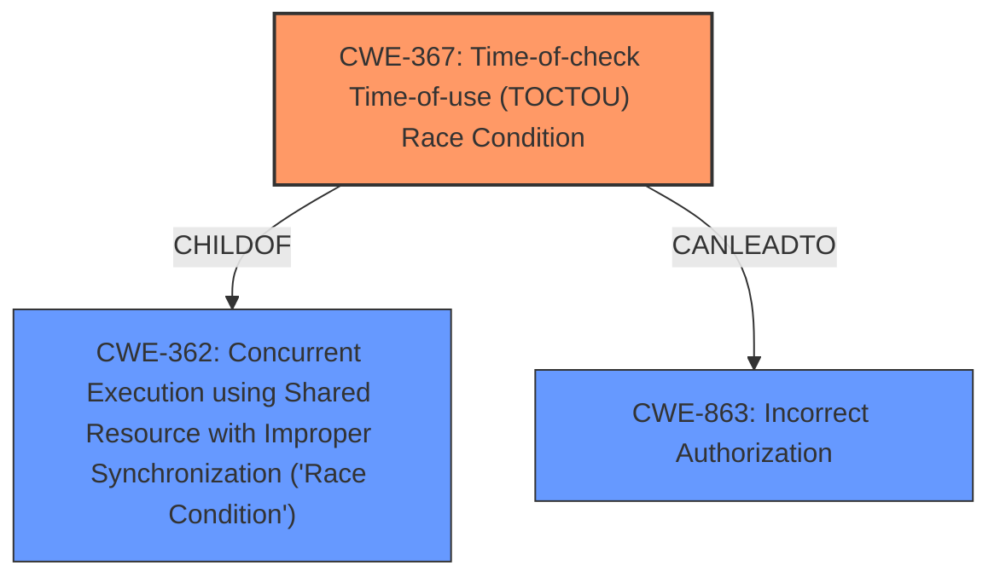

# Raw Analyzer Response for CVE-2020-13882

# Summary
| CWE ID | CWE Name | Confidence | CWE Abstraction Level | CWE Vulnerability Mapping Label | CWE-Vulnerability Mapping Notes |
|---|---|---|---|---|---|
| CWE-367 | Time-of-check Time-of-use (TOCTOU) Race Condition | 1.0 | Base | Primary | Allowed |
| CWE-863 | Incorrect Authorization | 0.75 | Class | Secondary | Allowed-with-Review |

## Evidence and Confidence

*   **Confidence Score:** 0.85
*   **Evidence Strength:** HIGH

## Relationship Analysis
The primary CWE is CWE-367, which is a child of CWE-362 (Concurrent Execution using Shared Resource with Improper Synchronization ('Race Condition')). CWE-367 is a more specific case of CWE-362, focusing on the time-of-check time-of-use scenario. CWE-863 (Incorrect Authorization) is related because the **TOCTOU race condition** allows bypassing intended authorization checks. The relationships guide us to choose the most specific CWE, i.e., CWE-367, and to consider how it leads to a failure in authorization.

## Vulnerability Chain
The vulnerability chain starts with a **TOCTOU race condition** (CWE-367). An unprivileged attacker exploits this condition by manipulating log and report files between the permission check and the actual use of those files. This leads to a bypass of the intended **access control** (weakness) and ultimately leads to **Incorrect Authorization** (CWE-863).

## Summary of Analysis
Initial analysis identified a **TOCTOU race condition** leading to **incorrect access control**. The CVE description highlights an issue where a race condition allows an attacker to manipulate files after a permission check but before their usage. This directly maps to CWE-367 (Time-of-check Time-of-use (TOCTOU) Race Condition). The retriever results also strongly suggest CWE-367.

The evidence for CWE-367 is strong: "The vulnerability stems from a Time-of-Check to Time-of-Use (TOCTTOU) race condition in the symlink detection routine of Lynis."

CWE-863 (Incorrect Authorization) is considered a secondary CWE because the **TOCTOU** allows bypassing the intended authorization mechanism, "After that, the file can be removed, recreated, and used for additional attacks." The primary weakness is the **TOCTOU**, and a consequence of the **TOCTOU** is the incorrect authorization.

The chosen CWEs are at the optimal level of specificity. CWE-367 is a Base level CWE that accurately captures the **TOCTOU** issue. CWE-863 is a Class level CWE.

Relevant CWE Information:

# Enhanced Context (25 CWEs)
The following CWEs were identified as potentially relevant to this vulnerability:

## CWE-667: Improper Locking
**Abstraction Level**: Class
**Similarity Score**: 0.78
**Source**: dense

**Description**:
The product does not properly acquire or release a lock on a resource, leading to unexpected resource state changes and behaviors.

**Mapping Guidance**:
- Usage: Allowed-with-Review
- Rationale: This CWE entry is a Class and might have Base-level children that would be more appropriate

**Why Not Selected:** This CWE relates to issues with locking mechanisms and does not directly apply to the **TOCTOU race condition** described in the vulnerability.

## CWE-59: Improper Link Resolution Before File Access ('Link Following')
**Abstraction Level**: Base
**Similarity Score**: 0.78
**Source**: dense

**Description**:
The product attempts to access a file based on the filename, but it does not properly prevent that filename from identifying a link or shortcut that resolves to an unintended resource.

**Mapping Guidance**:
- Usage: Allowed
- Rationale: This CWE entry is at the Base level of abstraction, which is a preferred level of abstraction for mapping to the root causes of vulnerabilities.

**Why Not Selected:** While the vulnerability description mentions symlink manipulation, the core issue is the **TOCTOU race condition**, not the improper resolution of links. The symlink manipulation is a technique used to exploit the race condition.

## CWE-754: Improper Check for Unusual or Exceptional Conditions
**Abstraction Level**: Class
**Similarity Score**: 0.77
**Source**: dense

**Description**:
The product does not check or incorrectly checks for unusual or exceptional conditions that are not expected to occur frequently during day to day operation of the product.

**Mapping Guidance**:
- Usage: Allowed-with-Review
- Rationale: This CWE entry is a Class and might have Base-level children that would be more appropriate

**Why Not Selected:** This CWE is too general. The vulnerability is specific to a **TOCTOU race condition**, and this CWE doesn't capture that specificity.

## CWE-362: Concurrent Execution using Shared Resource with Improper Synchronization ('Race Condition')
**Abstraction Level**: Class
**Similarity Score**: 0.77
**Source**: dense

**Description**:
The product contains a concurrent code sequence that requires temporary, exclusive access to a shared resource, but a timing window exists in which the shared resource can be modified by another code sequence operating concurrently.

**Mapping Guidance**:
- Usage: Allowed-with-Review
- Rationale: This CWE entry is a Class and might have Base-level children that would be more appropriate

**Why Not Selected:** CWE-367 is a child of CWE-362, and since the vulnerability is specifically a **TOCTOU race condition**, CWE-367 is more appropriate.

## CWE-668: Exposure of Resource to Wrong Sphere
**Abstraction Level**: Class
**Similarity Score**: 0.77
**Source**: dense

**Description**:
The product exposes a resource to the wrong control sphere, providing unintended actors with inappropriate access to the resource.

**Mapping Guidance**:
- Usage: Discouraged
- Rationale: CWE-668 is high-level and is often misused as a catch-all when lower-level CWE IDs might be applicable. It is sometimes used for low-information vulnerability reports [REF-1287]. It is a level-1 Class (i.e., a child of a Pillar). It is not useful for trend analysis.

**Why Not Selected:** This CWE is too high-level and does not capture the specific **TOCTOU race condition**.

## CWE-41: Improper Resolution of Path Equivalence
**Abstraction Level**: Base
**Similarity Score**: 0.77
**Source**: dense

**Description**:
The product is vulnerable to file system contents disclosure through path equivalence. Path equivalence involves the use of special characters in file and directory names. The associated manipulations are intended to generate multiple names for the same object.

**Mapping Guidance**:
- Usage: Allowed
- Rationale: This CWE entry is at the Base level of abstraction, which is a preferred level of abstraction for mapping to the root causes of vulnerabilities.

**Why Not Selected:** The vulnerability involves a **TOCTOU race condition**, not the resolution of path equivalence.

## CWE-755: Improper Handling of Exceptional Conditions
**Abstraction Level**: Class
**Similarity Score**: 0.76
**Source**: dense

**Description**:
The product does not handle or incorrectly handles an exceptional condition.

**Mapping Guidance**:
- Usage: Discouraged
- Rationale: This CWE entry is a level-1 Class (i.e., a child of a Pillar). It might have lower-level children that would be more appropriate

**Why Not Selected:** This CWE is too general.

## CWE-303: Incorrect Implementation of Authentication Algorithm
**Abstraction Level**: Base
**Similarity Score**: 0.76
**Source**: dense

**Description**:
The requirements for the product dictate the use of an established authentication algorithm, but the implementation of the algorithm is incorrect.

**Mapping Guidance**:
- Usage: Allowed
- Rationale: This CWE entry is at the Base level of abstraction, which is a preferred level of abstraction for mapping to the root causes of vulnerabilities.

**Why Not Selected:** The vulnerability does not relate to an incorrect implementation of an authentication algorithm.

## CWE-703: Improper Check or Handling of Exceptional Conditions
**Abstraction Level**: Pillar
**Similarity Score**: 0.76
**Source**: dense

**Description**:
The product does not properly anticipate or handle exceptional conditions that rarely occur during normal operation of the product.

**Mapping Guidance**:
- Usage: Discouraged