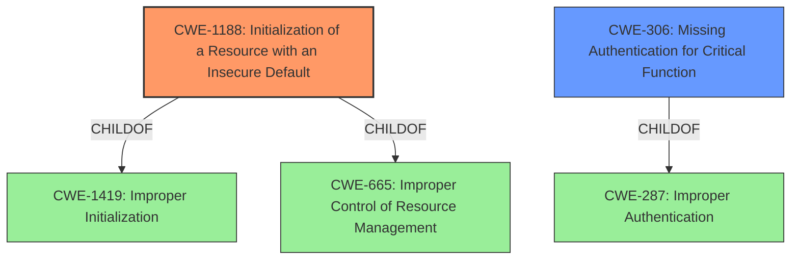

# Analysis for CVE-2020-13927

# Summary
| CWE ID    | CWE Name                                                      | Confidence | CWE Abstraction Level | CWE Vulnerability Mapping Label | CWE-Vulnerability Mapping Notes |
| :-------- | :------------------------------------------------------------ | :--------- | :---------------------- | :------------------------------ | :------------------------------ |
| CWE-1188  | Initialization of a Resource with an Insecure Default       | 0.9        | Base                    | Allowed                         | Primary CWE                     |
| CWE-306   | Missing Authentication for Critical Function                  | 0.7        | Base                    | Allowed                         | Secondary Candidate             |

## Evidence and Confidence

*   **Confidence Score:** 0.8
*   **Evidence Strength:** MEDIUM

## Relationship Analysis

The primary relationship that influenced the CWE selection was the parent-child relationship. CWE-1188 (Initialization of a Resource with an Insecure Default) is a specific type of weakness related to how a resource is initialized, making it a good fit for this vulnerability. CWE-306 (Missing Authentication for Critical Function) was also considered since the insecure default allows API requests without authentication, but it does not capture the initialization aspect of the weakness as clearly as CWE-1188.

## Vulnerability Chain

The chain of events is as follows:

1.  **Root Cause:** The Airflow Experimental API had a **previous default setting** that **allowed all API requests without authentication**. (CWE-1188)
2.  **Weakness:** This **missing authentication** for API requests exposed the system to security risks.
3.  **Impact:** The API could be accessed without proper authorization, potentially leading to unauthorized actions.

## Summary of Analysis

The initial analysis focused on identifying the **root cause** of the vulnerability. The description clearly states that the **previous default setting for Airflows Experimental API was to allow all API requests without authentication**. This directly points to CWE-1188 (Initialization of a Resource with an Insecure Default), where the resource (API) was initialized with an insecure setting (no authentication).

The retriever results also supported this decision, with CWE-1188 having the highest score. The MITRE mapping guidance for CWE-1188 states that it is at the Base level of abstraction, which is preferred, and the description fits the vulnerability well.

CWE-306 (Missing Authentication for Critical Function) was considered, but it only captures the consequence of the insecure default, rather than the **root cause** of initializing the API without authentication. Therefore, CWE-1188 was chosen as the primary CWE, with CWE-306 as a secondary candidate.

The final decision is based on the provided evidence, the retriever results, and the MITRE mapping guidance, ensuring that the selected CWE is at the optimal level of specificity and accurately represents the **root cause** of the vulnerability.

Relevant CWE Information:

# Enhanced Context (25 CWEs)

## CWE-1188: Initialization of a Resource with an Insecure Default

**Explanation:** The vulnerability's details align with CWE-1188 because the Airflow Experimental API was **initialized** with a **default setting** that **allowed all API requests without authentication**. This fits the description of CWE-1188, where a resource is initialized with a default that is not secure.
**Security Implications and Potential Impact:** The **security implication** is that the API could be accessed without proper authorization, potentially leading to unauthorized actions. The **potential impact** includes information exposure, denial of service, and arbitrary code execution.
**Parent-Child Relationships or Chain Patterns:** CWE-1188 is a child of CWE-1419 (Improper Initialization) and CWE-665 (Improper Control of Resource Management), indicating that it is a specific type of initialization weakness.
**Whether the Weakness is Primary or Secondary in the Vulnerability:** This is the primary weakness in the vulnerability because it is the **root cause** of the issue.
**How the Official MITRE Mapping Guidance Influenced Your Decision:** The MITRE mapping guidance for CWE-1188 states that it is at the Base level of abstraction, which is preferred, and the description fits the vulnerability well.

## CWE-306: Missing Authentication for Critical Function

**Explanation:** The vulnerability also aligns with CWE-306 because the Airflow Experimental API was missing authentication for critical functions. The **rootcause** of the API allowing all requests without authentication can be traced to the **missing authentication** for API requests.
**Security Implications and Potential Impact:** The **security implication** is that the API could be accessed without proper authorization, potentially leading to unauthorized actions. The **potential impact** includes information exposure, denial of service, and arbitrary code execution.
**Parent-Child Relationships or Chain Patterns:** CWE-306 is a child of CWE-287 (Improper Authentication), indicating that it is a specific type of authentication weakness.
**Whether the Weakness is Primary or Secondary in the Vulnerability:** This is a secondary weakness because it is a consequence of the insecure default, rather than the **root cause**.
**How the Official MITRE Mapping Guidance Influenced Your Decision:** The MITRE mapping guidance for CWE-306 states that it is at the Base level of abstraction, which is preferred.

**Other CWEs Considered but Not Used:**

*   CWE-285 (Improper Authorization) and CWE-863 (Incorrect Authorization): These were considered but are too high-level. The problem isn't that authorization is done improperly, but that authentication is missing by default.
*   CWE-1393 (Use of Default Password): This CWE is related to default credentials, which is not the case here. The issue is the complete absence of authentication by default.