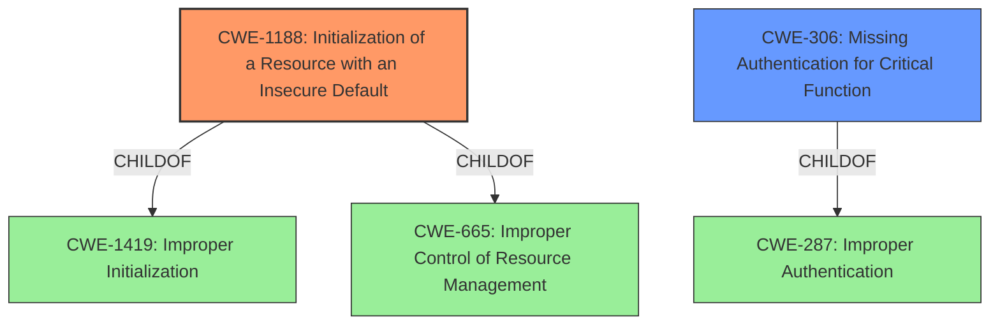

# Analysis for CVE-2020-13927

# Summary
| CWE ID    | CWE Name                                                      | Confidence | CWE Abstraction Level | CWE Vulnerability Mapping Label | CWE-Vulnerability Mapping Notes |
| :-------- | :------------------------------------------------------------ | :--------- | :---------------------- | :------------------------------ | :------------------------------ |
| CWE-1188  | Initialization of a Resource with an Insecure Default       | 0.9        | Base                    | Allowed                         | Primary CWE                     |
| CWE-306   | Missing Authentication for Critical Function                  | 0.7        | Base                    | Allowed                         | Secondary Candidate             |

## Evidence and Confidence

*   **Confidence Score:** 0.8
*   **Evidence Strength:** MEDIUM

## Relationship Analysis

The primary relationship that influenced the CWE selection was the parent-child relationship. CWE-1188 (Initialization of a Resource with an Insecure Default) is a specific type of weakness related to how a resource is initialized, making it a good fit for this vulnerability. CWE-306 (Missing Authentication for Critical Function) was also considered since the insecure default allows API requests without authentication, but it does not capture the initialization aspect of the weakness as clearly as CWE-1188.

## Vulnerability Chain

The chain of events is as follows:

1.  **Root Cause:** The Airflow Experimental API had a **previous default setting** that **allowed all API requests without authentication**. (CWE-1188)
2.  **Weakness:** This **missing authentication** for API requests exposed the system to security risks.
3.  **Impact:** The API could be accessed without proper authorization, potentially leading to unauthorized actions.

## Summary of Analysis

The initial analysis focused on identifying the **root cause** of the vulnerability. The description clearly states that the **previous default setting for Airflows Experimental API was to allow all API requests without authentication**. This directly points to CWE-1188 (Initialization of a Resource with an Insecure Default), where the resource (API) was initialized with an insecure setting (no authentication).

The retriever results also supported this decision, with CWE-1188 having the highest score. The MITRE mapping guidance for CWE-1188 states that it is at the Base level of abstraction, which is preferred, and the description fits the vulnerability well.

CWE-306 (Missing Authentication for Critical Function) was considered, but it only captures the consequence of the insecure default, rather than the **root cause** of initializing the API without authentication. Therefore, CWE-1188 was chosen as the primary CWE, with CWE-306 as a secondary candidate.

The final decision is based on the provided evidence, the retriever results, and the MITRE mapping guidance, ensuring that the selected CWE is at the optimal level of specificity and accurately represents the **root cause** of the vulnerability.

Relevant CWE Information:

# Enhanced Context (25 CWEs)

## CWE-1188: Initialization of a Resource with an Insecure Default

**Explanation:** The vulnerability's details align with CWE-1188 because the Airflow Experimental API was **initialized** with a **default setting** that **allowed all API requests without authentication**. This fits the description of CWE-1188, where a resource is initialized with a default that is not secure.
**Security Implications and Potential Impact:** The **security implication** is that the API could be accessed without proper authorization, potentially leading to unauthorized actions. The **potential impact** includes information exposure, denial of service, and arbitrary code execution.
**Parent-Child Relationships or Chain Patterns:** CWE-1188 is a child of CWE-1419 (Improper Initialization) and CWE-665 (Improper Control of Resource Management), indicating that it is a specific type of initialization weakness.
**Whether the Weakness is Primary or Secondary in the Vulnerability:** This is the primary weakness in the vulnerability because it is the **root cause** of the issue.
**How the Official MITRE Mapping Guidance Influenced Your Decision:** The MITRE mapping guidance for CWE-1188 states that it is at the Base level of abstraction, which is preferred, and the description fits the vulnerability well.

## CWE-306: Missing Authentication for Critical Function

**Explanation:** The vulnerability also aligns with CWE-306 because the Airflow Experimental API was missing authentication for critical functions. The **rootcause** of the API allowing all requests without authentication can be traced to the **missing authentication** for API requests.
**Security Implications and Potential Impact:** The **security implication** is that the API could be accessed without proper authorization, potentially leading to unauthorized actions. The **potential impact** includes information exposure, denial of service, and arbitrary code execution.
**Parent-Child Relationships or Chain Patterns:** CWE-306 is a child of CWE-287 (Improper Authentication), indicating that it is a specific type of authentication weakness.
**Whether the Weakness is Primary or Secondary in the Vulnerability:** This is a secondary weakness because it is a consequence of the insecure default, rather than the **root cause**.
**How the Official MITRE Mapping Guidance Influenced Your Decision:** The MITRE mapping guidance for CWE-306 states that it is at the Base level of abstraction, which is preferred.

**Other CWEs Considered but Not Used:**

*   CWE-285 (Improper Authorization) and CWE-863 (Incorrect Authorization): These were considered but are too high-level. The problem isn't that authorization is done improperly, but that authentication is missing by default.
*   CWE-1393 (Use of Default Password): This CWE is related to default credentials, which is not the case here. The issue is the complete absence of authentication by default.

# Enhanced Query for CVE-2020-13927

## Vulnerability Description
The **previous default setting for Airflows Experimental API was to allow all API requests without authentication**, but this poses security risks to users who miss this fact. From Airflow 1.10.11 the default has been changed to deny all requests by default and is documented at https//airflow.apache.org/docs/1.10.11/security.html#api-authentication. Note this change fixes it for new installs but existing users need to change their config to default `[api]auth_backend = airflow.api.auth.backend.deny_all` as mentioned in the Updating Guide https//github.com/apache/airflow/blob/1.10.11/UPDATING.md#experimental-api-will-deny-all-request-by-default

### Vulnerability Description Key Phrases
- **rootcause:** **previous default setting for Airflows Experimental API was to allow all API requests without authentication**
- **product:** Airflow
- **version:** 1.10.11
- **component:** Experimental API

## CVE Reference Links Content Summary
The provided content does not contain any information related to a vulnerability described by CVE-2020-13927. The content consists of website layouts, logos, navigation menus, and links to social media pages. There is no discussion of software vulnerabilities, exploits, or security flaws.

Response: UNRELATED

## Retriever Results

### Top Combined Results

| Rank | CWE ID | Name | Abstraction | Usage  | Retrievers | Individual Scores |
|------|--------|------|-------------|-------|------------|-------------------|
| 1 | 1188 | Initialization of a Resource with an Insecure Default | Base | Allowed | sparse | 1.155 |
| 2 | 306 | Missing Authentication for Critical Function | Base | Allowed | sparse | 0.658 |
| 3 | 201 | Insertion of Sensitive Information Into Sent Data | Base | Allowed | sparse | 0.578 |
| 4 | 863 | Incorrect Authorization | Class | Allowed-with-Review | sparse | 0.572 |
| 5 | 918 | Server-Side Request Forgery (SSRF) | Base | Allowed | sparse | 0.568 |
| 6 | 1393 | Use of Default Password | Base | Allowed | dense | 0.367 |
| 7 | 226 | Sensitive Information in Resource Not Removed Before Reuse | Base | Allowed | graph | 0.002 |
| 8 | 285 | Improper Authorization | Class | Discouraged | sparse | 0.536 |
| 9 | 287 | Improper Authentication | Class | Discouraged | sparse | 0.536 |
| 10 | 639 | Authorization Bypass Through User-Controlled Key | Base | Allowed | sparse | 0.532 |

# Complete CWE Specifications

## CWE-1188: Initialization of a Resource with an Insecure Default
**Abstraction:** Base
**Status:** Incomplete

### Description
The product initializes or sets a resource with a default that is intended to be changed by the administrator, but the default is not secure.

### Extended Description

Developers often choose default values that leave the product as open and easy to use as possible out-of-the-box, under the assumption that the administrator can (or should) change the default value. However, this ease-of-use comes at a cost when the default is insecure and the administrator does not change it.

### Alternative Terms
None

### Relationships
ChildOf -> CWE-1419
ChildOf -> CWE-665

### Mapping Guidance
**Usage:** Allowed
**Rationale:** This CWE entry is at the Base level of abstraction, which is a preferred level of abstraction for mapping to the root causes of vulnerabilities.
**Comments:** Carefully read both the name and description to ensure that this mapping is an appropriate fit. Do not try to 'force' a mapping to a lower-level Base/Variant simply to comply with this preferred level of abstraction.
**Reasons:**
- Acceptable-Use

### Additional Notes
**[Maintenance]** This entry improves organization of concepts under initialization. The typical CWE model is to cover "Missing" and "Incorrect" behaviors. Arguably, this entry could be named as "Incorrect" instead of "Insecure." This might be changed in the near future.

### Observed Examples
- **CVE-2022-36349:** insecure default variable initialization in BIOS firmware for a hardware board allows DoS
- **CVE-2022-42467:** A generic database browser interface has a default mode that exposes a web server to the network, allowing queries to the database.

## CWE-306: Missing Authentication for Critical Function
**Abstraction:** Base
**Status:** Draft

### Description
The product does not perform any authentication for functionality that requires a provable user identity or consumes a significant amount of resources.

### Extended Description
Not provided

### Alternative Terms
None

### Relationships
ChildOf -> CWE-287
ChildOf -> CWE-287

### Mapping Guidance
**Usage:** Allowed
**Rationale:** This CWE entry is at the Base level of abstraction, which is a preferred level of abstraction for mapping to the root causes of vulnerabilities.
**Comments:** Carefully read both the name and description to ensure that this mapping is an appropriate fit. Do not try to 'force' a mapping to a lower-level Base/Variant simply to comply with this preferred level of abstraction.
**Reasons:**
- Acceptable-Use

### Observed Examples
- **CVE-2022-31260:** Chain: a digital asset management program has an undisclosed backdoor in the legacy version of a PHP script (CWE-912) that could allow an unauthenticated user to export metadata (CWE-306)
- **CVE-2022-29951:** TCP-based protocol in Programmable Logic Controller (PLC) has no authentication.
- **CVE-2022-29952:** Condition Monitor firmware uses a protocol that does not require authentication.

## CWE-201: Insertion of Sensitive Information Into Sent Data
**Abstraction:** Base
**Status:** Draft

### Description
The code transmits data to another actor, but a portion of the data includes sensitive information that should not be accessible to that actor.

### Extended Description
Not provided

### Alternative Terms
None

### Relationships
ChildOf -> CWE-200
CanAlsoBe -> CWE-209
CanAlsoBe -> CWE-202

### Mapping Guidance
**Usage:** Allowed
**Rationale:** This CWE entry is at the Base level of abstraction, which is a preferred level of abstraction for mapping to the root causes of vulnerabilities.
**Comments:** Carefully read both the name and description to ensure that this mapping is an appropriate fit. Do not try to 'force' a mapping to a lower-level Base/Variant simply to comply with this preferred level of abstraction.
**Reasons:**
- Acceptable-Use

### Additional Notes
**[Other]** Sensitive information could include data that is sensitive in and of itself (such as credentials or private messages), or otherwise useful in the further exploitation of the system (such as internal file system structure).

### Observed Examples
- **CVE-2022-0708:** Collaboration platform does not clear team emails in a response, allowing leak of email addresses

## CWE-863: Incorrect Authorization
**Abstraction:** Class
**Status:** Incomplete

### Description
The product performs an authorization check when an actor attempts to access a resource or perform an action, but it does not correctly perform the check.

### Extended Description
Not provided

### Alternative Terms
AuthZ: "AuthZ" is typically used as an abbreviation of "authorization" within the web application security community. It is distinct from "AuthN" (or, sometimes, "AuthC") which is an abbreviation of "authentication." The use of "Auth" as an abbreviation is discouraged, since it could be used for either authentication or authorization.

### Relationships
ChildOf -> CWE-285
ChildOf -> CWE-284

### Mapping Guidance
**Usage:** Allowed-with-Review
**Rationale:** This CWE entry is a Class and might have Base-level children that would be more appropriate
**Comments:** Examine children of this entry to see if there is a better fit
**Reasons:**
- Abstraction

### Additional Notes
**[Terminology]** 

Assuming a user with a given identity, authorization is the process of determining whether that user can access a given resource, based on the user's privileges and any permissions or other access-control specifications that apply to the resource.

### Observed Examples
- **CVE-2021-39155:** Chain: A microservice integration and management platform compares the hostname in the HTTP Host header in a case-sensitive way (CWE-178, CWE-1289), allowing bypass of the authorization policy (CWE-863) using a hostname with mixed case or other variations.
- **CVE-2019-15900:** Chain: sscanf() call is used to check if a username and group exists, but the return value of sscanf() call is not checked (CWE-252), causing an uninitialized variable to be checked (CWE-457), returning success to allow authorization bypass for executing a privileged (CWE-863).
- **CVE-2009-2213:** Gateway uses default "Allow" configuration for its authorization settings.

## CWE-918: Server-Side Request Forgery (SSRF)
**Abstraction:** Base
**Status:** Incomplete

### Description
The web server receives a URL or similar request from an upstream component and retrieves the contents of this URL, but it does not sufficiently ensure that the request is being sent to the expected destination.

### Extended Description
Not provided

### Alternative Terms
XSPA: Cross Site Port Attack
SSRF: Server-Side Request Forgery

### Relationships
ChildOf -> CWE-441
ChildOf -> CWE-610

### Mapping Guidance
**Usage:** Allowed
**Rationale:** This CWE entry is at the Base level of abstraction, which is a preferred level of abstraction for mapping to the root causes of vulnerabilities.
**Comments:** Carefully read both the name and description to ensure that this mapping is an appropriate fit. Do not try to 'force' a mapping to a lower-level Base/Variant simply to comply with this preferred level of abstraction.
**Reasons:**
- Acceptable-Use

### Additional Notes
**[Relationship]** CWE-918 (SSRF) and CWE-611 (XXE) are closely related, because they both involve web-related technologies and can launch outbound requests to unexpected destinations. However, XXE can be performed client-side, or in other contexts in which the software is not acting directly as a server, so the "Server" portion of the SSRF acronym does not necessarily apply.

### Observed Examples
- **CVE-2023-32786:** Chain: LLM integration framework has prompt injection (CWE-1427) that allows an attacker to force the service to retrieve data from an arbitrary URL, essentially providing SSRF (CWE-918) and potentially injecting content into downstream tasks.
- **CVE-2021-26855:** Server Side Request Forgery (SSRF) in mail server, as exploited in the wild per CISA KEV.
- **CVE-2021-21973:** Server Side Request Forgery in cloud platform, as exploited in the wild per CISA KEV.

## CWE-1393: Use of Default Password
**Abstraction:** Base
**Status:** Incomplete

### Description
The product uses default passwords for potentially critical functionality.

### Extended Description
It is common practice for products to be designed to use default passwords for authentication. The rationale is to simplify the manufacturing process or the system administrator's task of installation and deployment into an enterprise. However, if admins do not change the defaults, then it makes it easier for attackers to quickly bypass authentication across multiple organizations. There are many lists of default passwords and default-password scanning tools that are easily available from the World Wide Web.

### Alternative Terms
None

### Relationships
ChildOf -> CWE-1392

### Mapping Guidance
**Usage:** Allowed
**Rationale:** This CWE entry is at the Base level of abstraction, which is a preferred level of abstraction for mapping to the root causes of vulnerabilities.
**Comments:** Carefully read both the name and description to ensure that this mapping is an appropriate fit. Do not try to 'force' a mapping to a lower-level Base/Variant simply to comply with this preferred level of abstraction.
**Reasons:**
- Acceptable-Use

### Observed Examples
- **CVE-2022-30270:** Remote Terminal Unit (RTU) uses default credentials for some SSH accounts
- **CVE-2022-2336:** OPC Unified Architecture (OPC UA) industrial automation product has a default password
- **CVE-2021-38759:** microcontroller board has default password

## CWE-226: Sensitive Information in Resource Not Removed Before Reuse
**Abstraction:** Base
**Status:** Draft

### Description
The product releases a resource such as memory or a file so that it can be made available for reuse, but it does not clear or "zeroize" the information contained in the resource before the product performs a critical state transition or makes the resource available for reuse by other entities.

### Extended Description

When resources are released, they can be made available for reuse. For example, after memory is de-allocated, an operating system may make the memory available to another process, or disk space may be reallocated when a file is deleted. As removing information requires time and additional resources, operating systems do not usually clear the previously written information.

Even when the resource is reused by the same process, this weakness can arise when new data is not as large as the old data, which leaves portions of the old data still available. Equivalent errors can occur in other situations where the length of data is variable but the associated data structure is not. If memory is not cleared after use, the information may be read by less trustworthy parties when the memory is reallocated.

This weakness can apply in hardware, such as when a device or system switches between power, sleep, or debug states during normal operation, or when execution changes to different users or privilege levels.

### Alternative Terms
None

### Relationships
ChildOf -> CWE-459
ChildOf -> CWE-212
CanPrecede -> CWE-201

### Mapping Guidance
**Usage:** Allowed
**Rationale:** This CWE entry is at the Base level of abstraction, which is a preferred level of abstraction for mapping to the root causes of vulnerabilities.
**Comments:** Carefully read both the name and description to ensure that this mapping is an appropriate fit. Do not try to 'force' a mapping to a lower-level Base/Variant simply to comply with this preferred level of abstraction.
**Reasons:**
- Acceptable-Use

### Additional Notes
**[Relationship]** There is a close association between CWE-226 and CWE-212. The difference is partially that of perspective. CWE-226 is geared towards the final stage of the resource lifecycle, in which the resource is deleted, eliminated, expired, or otherwise released for reuse. Technically, this involves a transfer to a different control sphere, in which the original contents of the resource are no longer relevant. CWE-212, however, is intended for sensitive data in resources that are intentionally shared with others, so they are still active. This distinction is useful from the perspective of the CWE research view (CWE-1000).

**[Maintenance]** This entry needs modification to clarify the differences with CWE-212. The description also combines two problems that are distinct from the CWE research perspective: the inadvertent transfer of information to another sphere, and improper initialization/shutdown. Some of the associated taxonomy mappings reflect these different uses.

**[Research Gap]** This is frequently found for network packets, but it can also exist in local memory allocation, files, etc.

### Observed Examples
- **CVE-2019-3733:** Cryptography library does not clear heap memory before release
- **CVE-2003-0001:** Ethernet NIC drivers do not pad frames with null bytes, leading to infoleak from malformed packets.
- **CVE-2003-0291:** router does not clear information from DHCP packets that have been previously used

## CWE-285: Improper Authorization
**Abstraction:** Class
**Status:** Draft

### Description
The product does not perform or incorrectly performs an authorization check when an actor attempts to access a resource or perform an action.

### Extended Description

Assuming a user with a given identity, authorization is the process of determining whether that user can access a given resource, based on the user's privileges and any permissions or other access-control specifications that apply to the resource.

When access control checks are not applied consistently - or not at all - users are able to access data or perform actions that they should not be allowed to perform. This can lead to a wide range of problems, including information exposures, denial of service, and arbitrary code execution.

### Alternative Terms
AuthZ: "AuthZ" is typically used as an abbreviation of "authorization" within the web application security community. It is distinct from "AuthN" (or, sometimes, "AuthC") which is an abbreviation of "authentication." The use of "Auth" as an abbreviation is discouraged, since it could be used for either authentication or authorization.

### Relationships
ChildOf -> CWE-284
ChildOf -> CWE-284

### Mapping Guidance
**Usage:** Discouraged
**Rationale:** CWE-285 is high-level and lower-level CWEs can frequently be used instead. It is a level-1 Class (i.e., a child of a Pillar).
**Comments:** Look at CWE-285's children and consider mapping to CWEs such as CWE-862: Missing Authorization, CWE-863: Incorrect Authorization, CWE-732: Incorrect Permission Assignment for Critical Resource, or others.
**Reasons:**
- Abstraction
**Suggested Alternatives:**
- CWE-862: Missing Authorization
- CWE-863: Incorrect Authorization
- CWE-732: Incorrect Permission Assignment for Critical Resource

### Observed Examples
- **CVE-2022-24730:** Go-based continuous deployment product does not check that a user has certain privileges to update or create an app, allowing adversaries to read sensitive repository information
- **CVE-2009-3168:** Web application does not restrict access to admin scripts, allowing authenticated users to reset administrative passwords.
- **CVE-2009-2960:** Web application does not restrict access to admin scripts, allowing authenticated users to modify passwords of other users.

## CWE-287: Improper Authentication
**Abstraction:** Class
**Status:** Draft

### Description
When an actor claims to have a given identity, the product does not prove or insufficiently proves that the claim is correct.

### Extended Description
Not provided

### Alternative Terms
authentification: An alternate term is "authentification", which appears to be most commonly used by people from non-English-speaking countries.
AuthN: "AuthN" is typically used as an abbreviation of "authentication" within the web application security community. It is also distinct from "AuthZ," which is an abbreviation of "authorization." The use of "Auth" as an abbreviation is discouraged, since it could be used for either authentication or authorization.
AuthC: "AuthC" is used as an abbreviation of "authentication," but it appears to used less frequently than "AuthN."

### Relationships
ChildOf -> CWE-284
ChildOf -> CWE-284

### Mapping Guidance
**Usage:** Discouraged
**Rationale:** This CWE entry might be misused when lower-level CWE entries are likely to be applicable. It is a level-1 Class (i.e., a child of a Pillar).
**Comments:** Consider children or descendants, beginning with CWE-1390: Weak Authentication or CWE-306: Missing Authentication for Critical Function.
**Reasons:**
- Frequent Misuse
**Suggested Alternatives:**
- CWE-1390: Weak Authentication
- CWE-306: Missing Authentication for Critical Function

### Additional Notes
**[Relationship]** This can be resultant from SQL injection vulnerabilities and other issues.

**[Maintenance]** The Taxonomy_Mappings to ISA/IEC 62443 were added in CWE 4.10, but they are still under review and might change in future CWE versions. These draft mappings were performed by members of the "Mapping CWE to 62443" subgroup of the CWE-CAPEC ICS/OT Special Interest Group (SIG), and their work is incomplete as of CWE 4.10. The mappings are included to facilitate discussion and review by the broader ICS/OT community, and they are likely to change in future CWE versions.

### Observed Examples
- **CVE-2022-35248:** Chat application skips validation when Central Authentication Service (CAS) is enabled, effectively removing the second factor from two-factor authentication
- **CVE-2022-36436:** Python-based authentication proxy does not enforce password authentication during the initial handshake, allowing the client to bypass authentication by specifying a 'None' authentication type.
- **CVE-2022-30034:** Chain: Web UI for a Python RPC framework does not use regex anchors to validate user login emails (CWE-777), potentially allowing bypass of OAuth (CWE-1390).

## CWE-639: Authorization Bypass Through User-Controlled Key
**Abstraction:** Base
**Status:** Incomplete

### Description
The system's authorization functionality does not prevent one user from gaining access to another user's data or record by modifying the key value identifying the data.

### Extended Description

Retrieval of a user record occurs in the system based on some key value that is under user control. The key would typically identify a user-related record stored in the system and would be used to lookup that record for presentation to the user. It is likely that an attacker would have to be an authenticated user in the system. However, the authorization process would not properly check the data access operation to ensure that the authenticated user performing the operation has sufficient entitlements to perform the requested data access, hence bypassing any other authorization checks present in the system.

For example, attackers can look at places where user specific data is retrieved (e.g. search screens) and determine whether the key for the item being looked up is controllable externally. The key may be a hidden field in the HTML form field, might be passed as a URL parameter or as an unencrypted cookie variable, then in each of these cases it will be possible to tamper with the key value.

One manifestation of this weakness is when a system uses sequential or otherwise easily-guessable session IDs that would allow one user to easily switch to another user's session and read/modify their data.

### Alternative Terms
Insecure Direct Object Reference / IDOR: The "Insecure Direct Object Reference" term, as described in the OWASP Top Ten, is broader than this CWE because it also covers path traversal (CWE-22). Within the context of vulnerability theory, there is a similarity between the OWASP concept and CWE-706: Use of Incorrectly-Resolved Name or Reference.
Broken Object Level Authorization / BOLA: BOLA is used in the 2019 OWASP API Security Top 10 and is said to be the same as IDOR.
Horizontal Authorization: "Horizontal Authorization" is used to describe situations in which two users have the same privilege level, but must be prevented from accessing each other's resources. This is fairly common when using key-based access to resources in a multi-user context.

### Relationships
ChildOf -> CWE-863
ChildOf -> CWE-863
ChildOf -> CWE-284

### Mapping Guidance
**Usage:** Allowed
**Rationale:** This CWE entry is at the Base level of abstraction, which is a preferred level of abstraction for mapping to the root causes of vulnerabilities.
**Comments:** Carefully read both the name and description to ensure that this mapping is an appropriate fit. Do not try to 'force' a mapping to a lower-level Base/Variant simply to comply with this preferred level of abstraction.
**Reasons:**
- Acceptable-Use

### Observed Examples
- **CVE-2021-36539:** An educational application does not appropriately restrict file IDs to a particular user. The attacker can brute-force guess IDs, indicating IDOR.

