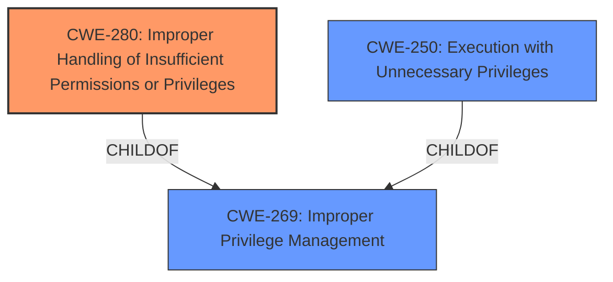

# Raw Analyzer Response for CVE-2020-13938

# Summary
| CWE ID | CWE Name | Confidence | CWE Abstraction Level | CWE Vulnerability Mapping Label | CWE-Vulnerability Mapping Notes |
|---|---|---|---|---|---|
| CWE-280 | Improper Handling of Insufficient Permissions or Privileges | 0.9 | Base | Allowed | Primary CWE |
| CWE-250 | Execution with Unnecessary Privileges | 0.6 | Base | Allowed | Secondary Candidate |

## Evidence and Confidence

*   **Confidence Score:** 0.75
*   **Evidence Strength:** HIGH

## Relationship Analysis
The primary CWE, CWE-280, is directly related to the root cause of the vulnerability, which is the improper handling of insufficient privileges. While CWE-280 is a base level CWE, which is the preferred level, there are no more specific child CWEs that apply.

CWE-250, Execution with Unnecessary Privileges, is related in that the vulnerability could be exacerbated if the Apache HTTP Server was running with higher privileges than necessary.

## Vulnerability Chain
The chain of events is as follows:
1.  **Root Cause:** **Improper Handling of Insufficient Privileges** (CWE-280)
2.  **Impact:** Unprivileged local users can stop the httpd service, leading to a denial of service.

## Summary of Analysis
The initial assessment focused on the **improper handling of insufficient privileges** as the root cause, which directly aligns with CWE-280. The vulnerability allows unprivileged local users to stop the httpd service on Windows, indicating that the server **does not properly handle or incorrectly handles when it has insufficient privileges** to prevent this action. The evidence from the CVE description clearly supports this: "**Improper Handling of Insufficient Privileges**" and "**Unprivileged local users can stop httpd on Windows**".

CWE-250 was considered as a secondary factor because the impact could be more severe if the Apache HTTP Server was running with elevated privileges, although the provided evidence does not explicitly state this.

Both CWE-280 and CWE-250 are at the Base level of abstraction, which is preferred.

Relevant CWE Information:

# Enhanced Context (25 CWEs)

## CWE-274: Improper Handling of Insufficient Privileges
**Abstraction Level**: Base
**Similarity Score**: 0.78
**Source**: dense

**Description**:
The product does not handle or incorrectly handles when it has insufficient privileges to perform an operation, leading to resultant weaknesses.

**Mapping Guidance**:
- Usage: Discouraged
- Rationale: This CWE entry could be deprecated in a future version of CWE.

*This CWE is very similar to CWE-280, but because CWE-274 is discouraged, I will not select it.*

## CWE-266: Incorrect Privilege Assignment
**Abstraction Level**: Base
**Similarity Score**: 0.77
**Source**: dense

**Description**:
A product incorrectly assigns a privilege to a particular actor, creating an unintended sphere of control for that actor.

**Mapping Guidance**:
- Usage: Allowed
- Rationale: This CWE entry is at the Base level of abstraction, which is a preferred level of abstraction for mapping to the root causes of vulnerabilities.

*This CWE is not as applicable as CWE-280 because the issue is not about incorrect assignment, but about the improper handling.*

## CWE-653: Improper Isolation or Compartmentalization
**Abstraction Level**: Class
**Similarity Score**: 0.77
**Source**: dense

**Description**:
The product does not properly compartmentalize or isolate functionality, processes, or resources that require different privilege levels, rights, or permissions.

**Mapping Guidance**:
- Usage: Allowed
- Rationale: This CWE entry is at the Base level of abstraction, which is a preferred level of abstraction for mapping to the root causes of vulnerabilities.

*This CWE is not as applicable because the issue is not about lack of compartmentalization, but rather the improper handling of privileges.*

## CWE-267: Privilege Defined With Unsafe Actions
**Abstraction Level**: Base
**Similarity Score**: 0.77
**Source**: dense

**Description**:
A particular privilege, role, capability, or right can be used to perform unsafe actions that were not intended, even when it is assigned to the correct entity.

**Mapping Guidance**:
- Usage: Allowed
- Rationale: This CWE entry is at the Base level of abstraction, which is a preferred level of abstraction for mapping to the root causes of vulnerabilities.

*This CWE is not as applicable because the issue is not about a privilege enabling unsafe actions, but about handling of privileges.*

## CWE-280: Improper Handling of Insufficient Permissions or Privileges
**Abstraction Level**: Base
**Similarity Score**: 0.76
**Source**: dense

**Description**:
The product does not handle or incorrectly handles when it has insufficient privileges to access resources or functionality as specified by their permissions. This may cause it to follow unexpected code paths that may leave the product in an invalid state.

**Mapping Guidance**:
- Usage: Allowed
- Rationale: This CWE entry is at the Base level of abstraction, which is a preferred level of abstraction for mapping to the root causes of vulnerabilities.

*This is the best match.*

## CWE-668: Exposure of Resource to Wrong Sphere
**Abstraction Level**: Class
**Similarity Score**: 0.75
**Source**: dense

**Description**:
The product exposes a resource to the wrong control sphere, providing unintended actors with inappropriate access to the resource.

**Mapping Guidance**:
- Usage: Discouraged
- Rationale: CWE-668 is high-level and is often misused as a catch-all when lower-level CWE IDs might be applicable. It is sometimes used for low-information vulnerability reports [REF-1287]. It is a level-1 Class (i.e., a child of a Pillar). It is not useful for trend analysis.

*This CWE is not as applicable because the issue is not about exposing the resource, but about the improper handling of privileges.*

## CWE-41: Improper Resolution of Path Equivalence
**Abstraction Level**: Base
**Similarity Score**: 0.75
**Source**: dense

**Description**:
The product is vulnerable to file system contents disclosure through path equivalence. Path equivalence involves the use of special characters in file and directory names. The associated manipulations are intended to generate multiple names for the same object.

**Mapping Guidance**:
- Usage: Allowed
- Rationale: This CWE entry is at the Base level of abstraction, which is a preferred level of abstraction for mapping to the root causes of vulnerabilities.

*This CWE is not applicable because it is focused on file system issues, not privilege handling.*

## CWE-664: Improper Control of a Resource Through its Lifetime
**Abstraction Level**: Pillar
**Similarity Score**: 0.74
**Source**: dense

**Description**:
The product does not maintain or incorrectly maintains control over a resource throughout its lifetime of creation, use, and release.

**Mapping Guidance**:
- Usage: Discouraged
- Rationale: This CWE entry is high-level when lower-level children are available.

*This CWE is not applicable because the description is too broad for the vulnerability.*

## CWE-404: Improper Resource Shutdown or Release
**Abstraction Level**: Class
**Similarity Score**: 0.74
**Source**: dense

**Description**:
The product does not release or incorrectly releases a resource before it is made available for re-use.

**Mapping Guidance**:
- Usage: Allowed-with-Review
- Rationale: This CWE entry is a Class and might have Base-level children that would be more appropriate

*This CWE is not applicable because the vulnerability is not about releasing resources, but about privilege handling.*

## CWE-59: Improper Link Resolution Before File Access ('Link Following')
**Abstraction Level**: Base
**Similarity Score**: 0.74
**Source**: dense

**Description**:
The product attempts to access a file based on the filename, but it does not properly prevent that filename from identifying a link or shortcut that resolves to an unintended resource.

**Mapping Guidance**:
- Usage: Allowed
- Rationale: This CWE entry is at the Base level of abstraction, which is a preferred level of abstraction for mapping to the root causes of vulnerabilities.

*This CWE is not applicable because it is focused on file access, not privilege handling.*

## CWE-22: Improper Limitation of a Pathname to a Restricted Directory ('Path Traversal')
**Abstraction Level**: Base
**Similarity Score**: 6890.47
**Source