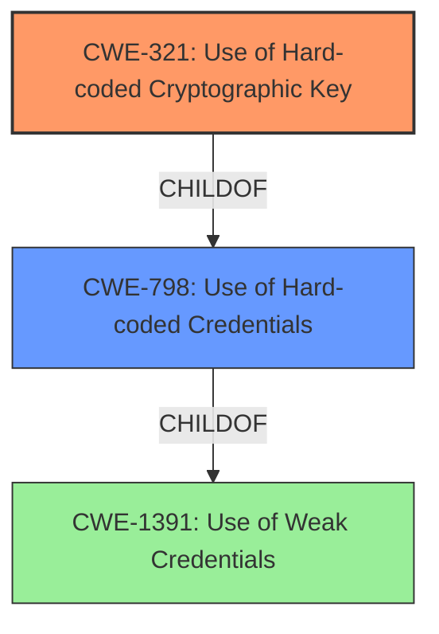

# Analysis for CVE-2020-13963

# Summary
| CWE ID | CWE Name | Confidence | CWE Abstraction Level | CWE Vulnerability Mapping Label | CWE-Vulnerability Mapping Notes |
|---|---|---|---|---|---|
| CWE-321 | Use of Hard-coded Cryptographic Key | 1.0 | Variant | Allowed | Primary CWE |
| CWE-798 | Use of Hard-coded Credentials | 1.0 | Base | Allowed | Secondary Candidate |

## Evidence and Confidence

*   **Confidence Score:** 1.0
*   **Evidence Strength:** HIGH

## Relationship Analysis
The primary CWE identified is CWE-321, a **Variant** of CWE-798. CWE-798 is a **Base** CWE and parent of CWE-321. Since the hardcoded value is specifically a cryptographic key, CWE-321 is a more precise mapping choice.



## Vulnerability Chain
The vulnerability chain starts with the **ROOTCAUSE** of using a **hard-coded cryptographic key** (CWE-321) for the admin user and the **lack of a key** for the guest user, leading to **incorrect access control** and ultimately an **authentication bypass** that allows unauthorized access.

## Summary of Analysis
The initial assessment strongly points towards **CWE-321 (Use of Hard-coded Cryptographic Key)** as the primary weakness. The vulnerability description clearly states that the "key for admin is hardcoded in the installation code". The "CVE Reference Links Content Summary" confirms this, stating: "The secret key for the admin user is hardcoded in the database installation script." This aligns perfectly with the description of CWE-321, which focuses on the risks associated with hard-coded cryptographic keys.

**CWE-798 (Use of Hard-coded Credentials)** was considered as a broader category, but **CWE-321** is a more specific **Variant** that accurately captures the **WEAKNESS**. The "Mapping Guidance" for both CWE-321 and CWE-798 recommends using the most specific level of abstraction.

Other CWEs like CWE-1391 (Use of Weak Credentials) and CWE-259 (Use of Hard-coded Password) were considered but deemed less relevant. While the hard-coded key is technically a weak credential, CWE-321 specifically addresses cryptographic keys. CWE-259 focuses on passwords, making it less suitable.

The final decision to prioritize CWE-321 is based on the direct evidence from the vulnerability description and the guidance to choose the most specific CWE.

Relevant CWE Information:

# Enhanced Context (25 CWEs)
The following CWEs were identified as potentially relevant to this vulnerability:

## CWE-798: Use of Hard-coded Credentials
**Abstraction Level**: Base
**Similarity Score**: 0.77
**Source**: dense

**Description**:
The product contains hard-coded credentials, such as a password or cryptographic key.

**Mapping Guidance**:
- Usage: Allowed
- Rationale: This CWE entry is at the Base level of abstraction, which is a preferred level of abstraction for mapping to the root causes of vulnerabilities.

## CWE-1391: Use of Weak Credentials
**Abstraction Level**: Class
**Similarity Score**: 0.77
**Source**: dense

**Description**:
The product uses weak credentials (such as a default key or hard-coded password) that can be calculated, derived, reused, or guessed by an attacker.

**Mapping Guidance**:
- Usage: Allowed-with-Review
- Rationale: This CWE entry is a Class and might have Base-level children that would be more appropriate

## CWE-668: Exposure of Resource to Wrong Sphere
**Abstraction Level**: Class
**Similarity Score**: 0.77
**Source**: dense

**Description**:
The product exposes a resource to the wrong control sphere, providing unintended actors with inappropriate access to the resource.

**Mapping Guidance**:
- Usage: Discouraged
- Rationale: CWE-668 is high-level and is often misused as a catch-all when lower-level CWE IDs might be applicable. It is sometimes used for low-information vulnerability reports [REF-1287]. It is a level-1 Class (i.e., a child of a Pillar). It is not useful for trend analysis.

## CWE-266: Incorrect Privilege Assignment
**Abstraction Level**: Base
**Similarity Score**: 0.77
**Source**: dense

**Description**:
A product incorrectly assigns a privilege to a particular actor, creating an unintended sphere of control for that actor.

**Mapping Guidance**:
- Usage: Allowed
- Rationale: This CWE entry is at the Base level of abstraction, which is a preferred level of abstraction for mapping to the root causes of vulnerabilities.

## CWE-807: Reliance on Untrusted Inputs in a Security Decision
**Abstraction Level**: Base
**Similarity Score**: 0.77
**Source**: dense

**Description**:
The product uses a protection mechanism that relies on the existence or values of an input, but the input can be modified by an untrusted actor in a way that bypasses the protection mechanism.

**Mapping Guidance**:
- Usage: Allowed
- Rationale: This CWE entry is at the Base level of abstraction, which is a preferred level of abstraction for mapping to the root causes of vulnerabilities.

## CWE-280: Improper Handling of Insufficient Permissions or Privileges
**Abstraction Level**: Base
**Similarity Score**: 0.77
**Source**: dense

**Description**:
The product does not handle or incorrectly handles when it has insufficient privileges to access resources or functionality as specified by their permissions. This may cause it to follow unexpected code paths that may leave the product in an invalid state.

**Mapping Guidance**:
- Usage: Allowed
- Rationale: This CWE entry is at the Base level of abstraction, which is a preferred level of abstraction for mapping to the root causes of vulnerabilities.

## CWE-639: Authorization Bypass Through User-Controlled Key
**Abstraction Level**: Base
**Similarity Score**: 0.76
**Source**: dense

**Description**:
The system's authorization functionality does not prevent one user from gaining access to another user's data or record by modifying the key value identifying the data.

**Mapping Guidance**:
- Usage: Allowed
- Rationale: This CWE entry is at the Base level of abstraction, which is a preferred level of abstraction for mapping to the root causes of vulnerabilities.

## CWE-1390: Weak Authentication
**Abstraction Level**: Class
**Similarity Score**: 0.76
**Source**: dense

**Description**:
The product uses an authentication mechanism to restrict access to specific users or identities, but the mechanism does not sufficiently prove that the claimed identity is correct.

**Mapping Guidance**:
- Usage: Allowed-with-Review
- Rationale: This CWE entry is a Class and might have Base-level children that would be more appropriate

## CWE-274: Improper Handling of Insufficient Privileges
**Abstraction Level**: Base
**Similarity Score**: 0.76
**Source**: dense

**Description**:
The product does not handle or incorrectly handles when it has insufficient privileges to perform an operation, leading to resultant weaknesses.

**Mapping Guidance**:
- Usage: Discouraged
- Rationale: This CWE entry could be deprecated in a future version of CWE.

## CWE-303: Incorrect Implementation of Authentication Algorithm
**Abstraction Level**: Base
**Similarity Score**: 0.76
**Source**: dense

**Description**:
The requirements for the product dictate the use of an established authentication algorithm, but the implementation of the algorithm is incorrect.

**Mapping Guidance**:
- Usage: Allowed
- Rationale: This CWE entry is at the Base level of abstraction, which is a preferred level of abstraction for mapping to the root causes of vulnerabilities.

## CWE-798: Use of Hard-coded Credentials
**Abstraction Level**: Base
**Similarity Score**: 7338.01
**Source**: sparse

**Description**:
The product contains hard-coded credentials, such as a password or cryptographic key.

**Mapping Guidance**:
- Usage: Allowed
- Rationale: This CWE entry is at the Base level of abstraction, which is a preferred level of abstraction for mapping to the root causes of vulnerabilities.

## CWE-1391: Use of Weak Credentials
**Abstraction Level**: Class
**Similarity Score**: 7248.13
**Source**: sparse

**Description**:
The product uses weak credentials (such as a default key

# Enhanced Query for CVE-2020-13963

## Vulnerability Description
SOPlanning before 1.47 has Incorrect Access Control because certain secret key information, and the related authentication algorithm, is public. The key for admin is hardcoded in the installation code, and there is no key for publicsp (which is a guest account).

### Vulnerability Description Key Phrases
- **rootcause:** **incorrect access control**
- **impact:** view secret key information
- **product:** SOPlanning
- **version:** before 1.47

## CVE Reference Links Content Summary
Based on the provided content, here's the breakdown of the vulnerability:

**Root Cause:**

- The "remember me" feature in SOPlanning uses a cookie to maintain user sessions. The cookie is generated by hashing the user ID and date with a secret key.
- The secret key for the admin user is hardcoded in the database installation script.
- The guest user has no key set.

**Weaknesses/Vulnerabilities Present:**

- **Hardcoded Secret Key:** The use of a hardcoded secret key for the admin user makes it easily predictable.
- **Missing Secret Key:** The lack of a secret key for the guest user makes it possible to forge a valid cookie without any secret.
- **Authentication Bypass:** These flaws allow an attacker to forge a valid cookie for both the admin and guest users, bypassing the normal authentication process.

**Impact of Exploitation:**

- **Complete Authentication Bypass:** Attackers can gain access to SOPlanning as either the admin or guest user without requiring valid credentials.
- **Unauthorized Access:** This bypass can lead to unauthorized access to sensitive data and administrative functions, depending on which account is compromised.

**Attack Vectors:**

- The attack vector is the ability to forge a cookie with a predictable secret key or no key for the guest account. This allows an attacker to directly log in to the application.

**Required Attacker Capabilities/Position:**

- The attacker needs to know the hardcoded key, or simply understand that no key is used for the guest account.
- The attacker needs the ability to craft an HTTP request that contains a crafted cookie.
- No prior access to the application is needed and the vulnerability can be exploited remotely.

**Additional Details**

- The vulnerability affects SOPlanning versions 1.45 to 1.46.
- The issue was reported to the vendor on 7/Jun/2020 and fixed on 21/Jul/2020 in version 1.47

## Retriever Results

### Top Combined Results

| Rank | CWE ID | Name | Abstraction | Usage  | Retrievers | Individual Scores |
|------|--------|------|-------------|-------|------------|-------------------|
| 1 | 321 | Use of Hard-coded Cryptographic Key | Variant | Allowed | sparse | 0.337 |
| 2 | 798 | Use of Hard-coded Credentials | Base | Allowed | sparse | 0.297 |
| 3 | 1391 | Use of Weak Credentials | Class | Allowed-with-Review | sparse | 0.271 |
| 4 | 425 | Direct Request ('Forced Browsing') | Base | Allowed | sparse | 0.266 |
| 5 | 327 | Use of a Broken or Risky Cryptographic Algorithm | Class | Allowed-with-Review | sparse | 0.261 |
| 6 | 842 | Placement of User into Incorrect Group | Base | Allowed | dense | 0.485 |
| 7 | 259 | Use of Hard-coded Password | Variant | Allowed | graph | 0.003 |
| 8 | 328 | Use of Weak Hash | Base | Allowed | sparse | 0.260 |
| 9 | 290 | Authentication Bypass by Spoofing | Base | Allowed | sparse | 0.259 |
| 10 | 732 | Incorrect Permission Assignment for Critical Resource | Class | Allowed-with-Review | sparse | 0.258 |


# Complete CWE Specifications


## CWE-321: Use of Hard-coded Cryptographic Key
**Abstraction:** Variant
**Status:** Draft

### Description
The use of a hard-coded cryptographic key significantly increases the possibility that encrypted data may be recovered.

### Extended Description
Not provided

### Alternative Terms
None

### Relationships
ChildOf -> CWE-798
ChildOf -> CWE-798
ChildOf -> CWE-798

### Mapping Guidance
**Usage:** Allowed
**Rationale:** This CWE entry is at the Variant level of abstraction, which is a preferred level of abstraction for mapping to the root causes of vulnerabilities.
**Comments:** Carefully read both the name and description to ensure that this mapping is an appropriate fit. Do not try to 'force' a mapping to a lower-level Base/Variant simply to comply with this preferred level of abstraction.
**Reasons:**
- Acceptable-Use


### Additional Notes
**[Other]** The main difference between the use of hard-coded passwords and the use of hard-coded cryptographic keys is the false sense of security that the former conveys. Many people believe that simply hashing a hard-coded password before storage will protect the information from malicious users. However, many hashes are reversible (or at least vulnerable to brute force attacks) -- and further, many authentication protocols simply request the hash itself, making it no better than a password.

**[Maintenance]** The Taxonomy_Mappings to ISA/IEC 62443 were added in CWE 4.10, but they are still under review and might change in future CWE versions. These draft mappings were performed by members of the "Mapping CWE to 62443" subgroup of the CWE-CAPEC ICS/OT Special Interest Group (SIG), and their work is incomplete as of CWE 4.10. The mappings are included to facilitate discussion and review by the broader ICS/OT community, and they are likely to change in future CWE versions.


### Observed Examples
- **CVE-2022-29960:** Engineering Workstation uses hard-coded cryptographic keys that could allow for unathorized filesystem access and privilege escalation
- **CVE-2022-30271:** Remote Terminal Unit (RTU) uses a hard-coded SSH private key that is likely to be used by default.
- **CVE-2020-10884:** WiFi router service has a hard-coded encryption key, allowing root access


## CWE-798: Use of Hard-coded Credentials
**Abstraction:** Base
**Status:** Draft

### Description
The product contains hard-coded credentials, such as a password or cryptographic key.

### Extended Description


There are two main variations:


  - Inbound: the product contains an authentication mechanism that checks the input credentials against a hard-coded set of credentials. In this variant, a default administration account is created, and a simple password is hard-coded into the product and associated with that account. This hard-coded password is the same for each installation of the product, and it usually cannot be changed or disabled by system administrators without manually modifying the program, or otherwise patching the product. It can also be difficult for the administrator to detect.

  - Outbound: the product connects to another system or component, and it contains hard-coded credentials for connecting to that component. This variant applies to front-end systems that authenticate with a back-end service. The back-end service may require a fixed password that can be easily discovered. The programmer may simply hard-code those back-end credentials into the front-end product.


### Alternative Terms
None

### Relationships
ChildOf -> CWE-1391
ChildOf -> CWE-287
ChildOf -> CWE-344
ChildOf -> CWE-671
PeerOf -> CWE-257

### Mapping Guidance
**Usage:** Allowed
**Rationale:** This CWE entry is at the Base level of abstraction, which is a preferred level of abstraction for mapping to the root causes of vulnerabilities.
**Comments:** Carefully read both the name and description to ensure that this mapping is an appropriate fit. Do not try to 'force' a mapping to a lower-level Base/Variant simply to comply with this preferred level of abstraction.
**Reasons:**
- Acceptable-Use


### Additional Notes
**[Maintenance]** The Taxonomy_Mappings to ISA/IEC 62443 were added in CWE 4.10, but they are still under review and might change in future CWE versions. These draft mappings were performed by members of the "Mapping CWE to 62443" subgroup of the CWE-CAPEC ICS/OT Special Interest Group (SIG), and their work is incomplete as of CWE 4.10. The mappings are included to facilitate discussion and review by the broader ICS/OT community, and they are likely to change in future CWE versions.


### Observed Examples
- **CVE-2022-29953:** Condition Monitor firmware has a maintenance interface with hard-coded credentials
- **CVE-2022-29960:** Engineering Workstation uses hard-coded cryptographic keys that could allow for unathorized filesystem access and privilege escalation
- **CVE-2022-29964:** Distributed Control System (DCS) has hard-coded passwords for local shell access


## CWE-1391: Use of Weak Credentials
**Abstraction:** Class
**Status:** Incomplete

### Description
The product uses weak credentials (such as a default key or hard-coded password) that can be calculated, derived, reused, or guessed by an attacker.

### Extended Description


By design, authentication protocols try to ensure that attackers must perform brute force attacks if they do not know the credentials such as a key or password. However, when these credentials are easily predictable or even fixed (as with default or hard-coded passwords and keys), then the attacker can defeat the mechanism without relying on brute force.


Credentials may be weak for different reasons, such as:


  - Hard-coded (i.e., static and unchangeable by the administrator)

  - Default (i.e., the same static value across different deployments/installations, but able to be changed by the administrator)

  - Predictable (i.e., generated in a way that produces unique credentials across deployments/installations, but can still be guessed with reasonable efficiency)

Even if a new, unique credential is intended to be generated for each product installation, if the generation is predictable, then that may also simplify guessing attacks.

### Alternative Terms
None

### Relationships
ChildOf -> CWE-1390

### Mapping Guidance
**Usage:** Allowed-with-Review
**Rationale:** This CWE entry is a Class and might have Base-level children that would be more appropriate
**Comments:** Examine children of this entry to see if there is a better fit
**Reasons:**
- Abstraction


### Observed Examples
- **[REF-1374]:** Chain: JavaScript-based cryptocurrency library can fall back to the insecure Math.random() function instead of reporting a failure (CWE-392), thus reducing the entropy (CWE-332) and leading to generation of non-unique cryptographic keys for Bitcoin wallets (CWE-1391)
- **CVE-2022-30270:** Remote Terminal Unit (RTU) uses default credentials for some SSH accounts
- **CVE-2022-29965:** Distributed Control System (DCS) uses a deterministic algorithm to generate utility passwords


## CWE-425: Direct Request ('Forced Browsing')
**Abstraction:** Base
**Status:** Incomplete

### Description
The web application does not adequately enforce appropriate authorization on all restricted URLs, scripts, or files.

### Extended Description
Web applications susceptible to direct request attacks often make the false assumption that such resources can only be reached through a given navigation path and so only apply authorization at certain points in the path.

### Alternative Terms
forced browsing: The "forced browsing" term could be misinterpreted to include weaknesses such as CSRF or XSS, so its use is discouraged.

### Relationships
ChildOf -> CWE-862
ChildOf -> CWE-862
ChildOf -> CWE-288
ChildOf -> CWE-424
CanPrecede -> CWE-471
CanPrecede -> CWE-98

### Mapping Guidance
**Usage:** Allowed
**Rationale:** This CWE entry is at the Base level of abstraction, which is a preferred level of abstraction for mapping to the root causes of vulnerabilities.
**Comments:** Carefully read both the name and description to ensure that this mapping is an appropriate fit. Do not try to 'force' a mapping to a lower-level Base/Variant simply to comply with this preferred level of abstraction.
**Reasons:**
- Acceptable-Use


### Additional Notes
**[Relationship]** Overlaps Modification of Assumed-Immutable Data (MAID), authorization errors, container errors; often primary to other weaknesses such as XSS and SQL injection.

**[Theoretical]** "Forced browsing" is a step-based manipulation involving the omission of one or more steps, whose order is assumed to be immutable. The application does not verify that the first step was performed successfully before the second step. The consequence is typically "authentication bypass" or "path disclosure," although it can be primary to all kinds of weaknesses, especially in languages such as PHP, which allow external modification of assumed-immutable variables.


### Observed Examples
- **CVE-2022-29238:** Access-control setting in web-based document collaboration tool is not properly implemented by the code, which prevents listing hidden directories but does not prevent direct requests to files in those directories.
- **CVE-2022-23607:** Python-based HTTP library did not scope cookies to a particular domain such that "supercookies" could be sent to any domain on redirect.
- **CVE-2004-2144:** Bypass authentication via direct request.


## CWE-327: Use of a Broken or Risky Cryptographic Algorithm
**Abstraction:** Class
**Status:** Draft

### Description
The product uses a broken or risky cryptographic algorithm or protocol.

### Extended Description


Cryptographic algorithms are the methods by which data is scrambled to prevent observation or influence by unauthorized actors. Insecure cryptography can be exploited to expose sensitive information, modify data in unexpected ways, spoof identities of other users or devices, or other impacts.


It is very difficult to produce a secure algorithm, and even high-profile algorithms by accomplished cryptographic experts have been broken. Well-known techniques exist to break or weaken various kinds of cryptography. Accordingly, there are a small number of well-understood and heavily studied algorithms that should be used by most products. Using a non-standard or known-insecure algorithm is dangerous because a determined adversary may be able to break the algorithm and compromise whatever data has been protected.


Since the state of cryptography advances so rapidly, it is common for an algorithm to be considered "unsafe" even if it was once thought to be strong. This can happen when new attacks are discovered, or if computing power increases so much that the cryptographic algorithm no longer provides the amount of protection that was originally thought.


For a number of reasons, this weakness is even more challenging to manage with hardware deployment of cryptographic algorithms as opposed to software implementation. First, if a flaw is discovered with hardware-implemented cryptography, the flaw cannot be fixed in most cases without a recall of the product, because hardware is not easily replaceable like software. Second, because the hardware product is expected to work for years, the adversary's computing power will only increase over time.


### Alternative Terms
None

### Relationships
ChildOf -> CWE-693
PeerOf -> CWE-311

### Mapping Guidance
**Usage:** Allowed-with-Review
**Rationale:** This CWE entry is a Class and might have Base-level children that would be more appropriate
**Comments:** Examine children of this entry to see if there is a better fit
**Reasons:**
- Abstraction


### Additional Notes
**[Maintenance]** Since CWE 4.4, various cryptography-related entries, including CWE-327 and CWE-1240, have been slated for extensive research, analysis, and community consultation to define consistent terminology, improve relationships, and reduce overlap or duplication. As of CWE 4.6, this work is still ongoing.

**[Maintenance]** The Taxonomy_Mappings to ISA/IEC 62443 were added in CWE 4.10, but they are still under review and might change in future CWE versions. These draft mappings were performed by members of the "Mapping CWE to 62443" subgroup of the CWE-CAPEC ICS/OT Special Interest Group (SIG), and their work is incomplete as of CWE 4.10. The mappings are included to facilitate discussion and review by the broader ICS/OT community, and they are likely to change in future CWE versions.


### Observed Examples
- **CVE-2022-30273:** SCADA-based protocol supports a legacy encryption mode that uses Tiny Encryption Algorithm (TEA) in ECB mode, which leaks patterns in messages and cannot protect integrity
- **CVE-2022-30320:** Programmable Logic Controller (PLC) uses a protocol with a cryptographically insecure hashing algorithm for passwords.
- **CVE-2008-3775:** Product uses "ROT-25" to obfuscate the password in the registry.


## CWE-842: Placement of User into Incorrect Group
**Abstraction:** Base
**Status:** Incomplete

### Description
The product or the administrator places a user into an incorrect group.

### Extended Description
If the incorrect group has more access or privileges than the intended group, the user might be able to bypass intended security policy to access unexpected resources or perform unexpected actions. The access-control system might not be able to detect malicious usage of this group membership.

### Alternative Terms
None

### Relationships
ChildOf -> CWE-286

### Mapping Guidance
**Usage:** Allowed
**Rationale:** This CWE entry is at the Base level of abstraction, which is a preferred level of abstraction for mapping to the root causes of vulnerabilities.
**Comments:** Carefully read both the name and description to ensure that this mapping is an appropriate fit. Do not try to 'force' a mapping to a lower-level Base/Variant simply to comply with this preferred level of abstraction.
**Reasons:**
- Acceptable-Use


### Observed Examples
- **CVE-1999-1193:** Operating system assigns user to privileged wheel group, allowing the user to gain root privileges.
- **CVE-2010-3716:** Chain: drafted web request allows the creation of users with arbitrary group membership.
- **CVE-2008-5397:** Chain: improper processing of configuration options causes users to contain unintended group memberships.


## CWE-259: Use of Hard-coded Password
**Abstraction:** Variant
**Status:** Draft

### Description
The product contains a hard-coded password, which it uses for its own inbound authentication or for outbound communication to external components.

### Extended Description


A hard-coded password typically leads to a significant authentication failure that can be difficult for the system administrator to detect. Once detected, it can be difficult to fix, so the administrator may be forced into disabling the product entirely. There are two main variations:

```
		Inbound: the product contains an authentication mechanism that checks for a hard-coded password.
		Outbound: the product connects to another system or component, and it contains hard-coded password for connecting to that component.
```
In the Inbound variant, a default administration account is created, and a simple password is hard-coded into the product and associated with that account. This hard-coded password is the same for each installation of the product, and it usually cannot be changed or disabled by system administrators without manually modifying the program, or otherwise patching the product. If the password is ever discovered or published (a common occurrence on the Internet), then anybody with knowledge of this password can access the product. Finally, since all installations of the product will have the same password, even across different organizations, this enables massive attacks such as worms to take place.

The Outbound variant applies to front-end systems that authenticate with a back-end service. The back-end service may require a fixed password which can be easily discovered. The programmer may simply hard-code those back-end credentials into the front-end product. Any user of that program may be able to extract the password. Client-side systems with hard-coded passwords pose even more of a threat, since the extraction of a password from a binary is usually very simple.


### Alternative Terms
None

### Relationships
ChildOf -> CWE-798
ChildOf -> CWE-798
ChildOf -> CWE-798
PeerOf -> CWE-321
PeerOf -> CWE-257

### Mapping Guidance
**Usage:** Allowed
**Rationale:** This CWE entry is at the Variant level of abstraction, which is a preferred level of abstraction for mapping to the root causes of vulnerabilities.
**Comments:** Carefully read both the name and description to ensure that this mapping is an appropriate fit. Do not try to 'force' a mapping to a lower-level Base/Variant simply to comply with this preferred level of abstraction.
**Reasons:**
- Acceptable-Use


### Additional Notes
**[Maintenance]** This entry could be split into multiple variants: an inbound variant (as seen in the second demonstrative example) and an outbound variant (as seen in the first demonstrative example). These variants are likely to have different consequences, detectability, etc. More importantly, from a vulnerability theory perspective, they could be characterized as different behaviors.


### Observed Examples
- **CVE-2022-29964:** Distributed Control System (DCS) has hard-coded passwords for local shell access
- **CVE-2021-37555:** Telnet service for IoT feeder for dogs and cats has hard-coded password [REF-1288]
- **CVE-2021-35033:** Firmware for a WiFi router uses a hard-coded password for a BusyBox shell, allowing bypass of authentication through the UART port


## CWE-328: Use of Weak Hash
**Abstraction:** Base
**Status:** Draft

### Description
The product uses an algorithm that produces a digest (output value) that does not meet security expectations for a hash function that allows an adversary to reasonably determine the original input (preimage attack), find another input that can produce the same hash (2nd preimage attack), or find multiple inputs that evaluate to the same hash (birthday attack).

### Extended Description


A hash function is defined as an algorithm that maps arbitrarily sized data into a fixed-sized digest (output) such that the following properties hold:


  1. The algorithm is not invertible (also called "one-way" or "not reversible")

  1. The algorithm is deterministic; the same input produces the same digest every time

 Building on this definition, a cryptographic hash function must also ensure that a malicious actor cannot leverage the hash function to have a reasonable chance of success at determining any of the following:

  1. the original input (preimage attack), given only the digest

  1. another input that can produce the same digest (2nd preimage attack), given the original input

  1. a set of two or more inputs that evaluate to the same digest (birthday attack), given the actor can arbitrarily choose the inputs to be hashed and can do so a reasonable amount of times

What is regarded as "reasonable" varies by context and threat model, but in general, "reasonable" could cover any attack that is more efficient than brute force (i.e., on average, attempting half of all possible combinations). Note that some attacks might be more efficient than brute force but are still not regarded as achievable in the real world.

Any algorithm that does not meet the above conditions will generally be considered weak for general use in hashing.


In addition to algorithmic weaknesses, a hash function can be made weak by using the hash in a security context that breaks its security guarantees. For example, using a hash function without a salt for storing passwords (that are sufficiently short) could enable an adversary to create a "rainbow table" [REF-637] to recover the password under certain conditions; this attack works against such hash functions as MD5, SHA-1, and SHA-2.


### Alternative Terms
None

### Relationships
ChildOf -> CWE-326
ChildOf -> CWE-327

### Mapping Guidance
**Usage:** Allowed
**Rationale:** This CWE entry is at the Base level of abstraction, which is a preferred level of abstraction for mapping to the root causes of vulnerabilities.
**Comments:** Carefully read both the name and description to ensure that this mapping is an appropriate fit. Do not try to 'force' a mapping to a lower-level Base/Variant simply to comply with this preferred level of abstraction.
**Reasons:**
- Acceptable-Use


### Additional Notes
**[Maintenance]** Since CWE 4.4, various cryptography-related entries including CWE-328 have been slated for extensive research, analysis, and community consultation to define consistent terminology, improve relationships, and reduce overlap or duplication. As of CWE 4.6, this work is still ongoing.


### Observed Examples
- **CVE-2022-30320:** Programmable Logic Controller (PLC) uses a protocol with a cryptographically insecure hashing algorithm for passwords.
- **CVE-2005-4900:** SHA-1 algorithm is not collision-resistant.
- **CVE-2020-25685:** DNS product uses a weak hash (CRC32 or SHA-1) of the query name, allowing attacker to forge responses by computing domain names with the same hash.


## CWE-290: Authentication Bypass by Spoofing
**Abstraction:** Base
**Status:** Incomplete

### Description
This attack-focused weakness is caused by incorrectly implemented authentication schemes that are subject to spoofing attacks.

### Extended Description
Not provided

### Alternative Terms
None

### Relationships
ChildOf -> CWE-1390
ChildOf -> CWE-287

### Mapping Guidance
**Usage:** Allowed
**Rationale:** This CWE entry is at the Base level of abstraction, which is a preferred level of abstraction for mapping to the root causes of vulnerabilities.
**Comments:** Carefully read both the name and description to ensure that this mapping is an appropriate fit. Do not try to 'force' a mapping to a lower-level Base/Variant simply to comply with this preferred level of abstraction.
**Reasons:**
- Acceptable-Use


### Additional Notes
**[Relationship]** This can be resultant from insufficient verification.


### Observed Examples
- **CVE-2022-30319:** S-bus functionality in a home automation product performs access control using an IP allowlist, which can be bypassed by a forged IP address.
- **CVE-2009-1048:** VOIP product allows authentication bypass using 127.0.0.1 in the Host header.


## CWE-732: Incorrect Permission Assignment for Critical Resource
**Abstraction:** Class
**Status:** Draft

### Description
The product specifies permissions for a security-critical resource in a way that allows that resource to be read or modified by unintended actors.

### Extended Description
When a resource is given a permission setting that provides access to a wider range of actors than required, it could lead to the exposure of sensitive information, or the modification of that resource by unintended parties. This is especially dangerous when the resource is related to program configuration, execution, or sensitive user data. For example, consider a misconfigured storage account for the cloud that can be read or written by a public or anonymous user.

### Alternative Terms
None

### Relationships
ChildOf -> CWE-285
ChildOf -> CWE-668

### Mapping Guidance
**Usage:** Allowed-with-Review
**Rationale:** While the name itself indicates an assignment of permissions for resources, this is often misused for vulnerabilities in which "permissions" are not checked, which is an "authorization" weakness (CWE-285 or descendants) within CWE's model [REF-1287].
**Comments:** Closely analyze the specific mistake that is allowing the resource to be exposed, and perform a CWE mapping for that mistake.
**Reasons:**
- Frequent Misuse


### Additional Notes
**[Maintenance]** The relationships between privileges, permissions, and actors (e.g. users and groups) need further refinement within the Research view. One complication is that these concepts apply to two different pillars, related to control of resources (CWE-664) and protection mechanism failures (CWE-693).


### Observed Examples
- **CVE-2022-29527:** Go application for cloud management creates a world-writable sudoers file that allows local attackers to inject sudo rules and escalate privileges to root by winning a race condition.
- **CVE-2009-3482:** Anti-virus product sets insecure "Everyone: Full Control" permissions for files under the "Program Files" folder, allowing attackers to replace executables with Trojan horses.
- **CVE-2009-3897:** Product creates directories with 0777 permissions at installation, allowing users to gain privileges and access a socket used for authentication.

