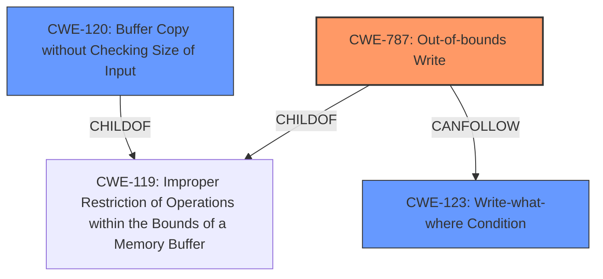

# Analysis for CVE-2020-13995

# Summary
| CWE ID  | CWE Name | Confidence | CWE Abstraction Level | CWE Vulnerability Mapping Label | CWE-Vulnerability Mapping Notes |
|-----------------|------------------------------------------------------------------------------------|------------|-----------------------|------------------------------------|-----------------------------------|
| CWE-787 | Out-of-bounds Write | 0.95 | Base | Allowed | Primary CWE |
| CWE-123 | Write-what-where Condition | 0.85 | Base | Allowed | Secondary CWE |
| CWE-120 | Buffer Copy without Checking Size of Input ('Classic Buffer Overflow') | 0.75 | Base | Allowed-with-Review | Secondary CWE |

## Evidence and Confidence

*   **Confidence Score:** 0.9
*   **Evidence Strength:** HIGH

## Relationship Analysis
The primary weakness is an **out-of-bounds write (CWE-787)**, which is a child of **improper restriction of operations within the bounds of a memory buffer (CWE-119)**. The **out-of-bounds write** leads to a **write-what-where condition (CWE-123)**, where the attacker can write arbitrary data to arbitrary locations. **CWE-120 (Buffer Copy without Checking Size of Input)** is also related because the **buffer overflow** occurs due to **improper input validation** and **lack of size checking**.

## Vulnerability Chain
The vulnerability chain starts with a **buffer overflow** due to the **lack of input validation**. This leads to an **out-of-bounds write** to the `sBuffer` variable. Overwriting `sBuffer` corrupts other global variables, including the `DES_info` pointer, eventually achieving a **write-what-where condition**. The final impact is arbitrary code execution.

## Summary of Analysis
Based on the evidence provided, the primary CWE is **CWE-787 (Out-of-bounds Write)** because the vulnerability involves writing data past the end of the intended buffer (`sBuffer`). The vulnerability description mentions "**buffer overflow** that leads to code execution. An overflow in a global variable (sBuffer) leads to a Write-What-Where outcome." The CVE Reference Links Content Summary states: "When `NUMDES` is greater than 76, the amount of data read exceeds the size of `sBuffer`, causing a **buffer overflow**."

Additionally, the **out-of-bounds write** leads to a **write-what-where condition (CWE-123)**, which is a secondary weakness. The attacker can overwrite arbitrary memory locations by controlling the `DES_info` pointer.

**CWE-120 (Buffer Copy without Checking Size of Input)** is also relevant since the root cause is the **lack of size checking** before copying data into the `sBuffer`.

I considered **CWE-119 (Improper Restriction of Operations within the Bounds of a Memory Buffer)**, but it is a Class-level CWE and is discouraged when more specific CWEs are available. Since we have evidence of **out-of-bounds write**, **write-what-where**, and **lack of input validation**, it is more appropriate to use the more specific CWEs.

I also considered **CWE-190 (Integer Overflow or Wraparound)**, but there is no direct evidence of an integer overflow in the provided description. While it's possible an integer overflow could contribute to calculating the size, the explicit mention of **buffer overflow** and **out-of-bounds write** takes precedence.

**CWE-125 (Out-of-bounds Read)** and **CWE-416 (Use After Free)** were also considered but do not fit the vulnerability description as the primary issue is writing out of bounds, not reading or using freed memory.

The selected CWEs are at the optimal level of specificity because they directly address the root cause (**out-of-bounds write**) and the resulting impact (**write-what-where condition**). They provide a more precise classification than the more general **CWE-119**.

# Enhanced Query for CVE-2020-13995

## Vulnerability Description
U.S. Air Force Sensor Data Management System extract75 has a **buffer overflow** that leads to code execution. An overflow in a global variable (sBuffer) leads to a Write-What-Where outcome. Writing beyond sBuffer will clobber most global variables until reaching a pointer such as DES_info or image_info. By controlling that pointer, one achieves an arbitrary write when its fields are assigned. The data written is from a potentially untrusted NITF file in the form of an integer. The attacker can gain control of the instruction pointer.

### Vulnerability Description Key Phrases
- **weakness:** **buffer overflow**
- **impact:** code execution
- **product:** U.S. Air Force Sensor Data Management System extract75

## CVE Reference Links Content Summary
Based on the provided content, here's a breakdown of the vulnerability described:

**Root Cause of Vulnerability:**

*   A global buffer overflow exists in the `sBuffer` variable within the `extract75` utility when parsing NITF files. This buffer has a fixed size of 1000 bytes.

**Weaknesses/Vulnerabilities Present:**

*   **Global Buffer Overflow:** The `read_verify` function reads data from the NITF file based on the `NUMDES` field (number of data extension segments). When `NUMDES` is greater than 76, the amount of data read exceeds the size of `sBuffer`, causing a buffer overflow.
*   **Write-What-Where Condition:** Overwriting `sBuffer` clobbers other global variables, including a pointer named `DES_info`. By controlling the value of `DES_info`, an attacker can write arbitrary data to arbitrary memory locations when the fields of the `DES_info` structure are assigned.
*   **Multiple Similar Bugs:** There are multiple similar buffer overflow vulnerabilities within the code, affecting other sections of the NITF file format (image, symbol, graphic, label, text, DES, RES).

**Impact of Exploitation:**

*   **Memory Corruption:** By overflowing `sBuffer`, an attacker can corrupt program memory, including global variables, and function pointers.
*   **Arbitrary Code Execution:** By controlling the `DES_info` pointer and overwriting function pointers (e.g. `strncpy` in the provided example), an attacker can gain control of the instruction pointer and achieve arbitrary code execution.
*   **Software compromise**: Since the software is used for parsing NITF files, using it on untrusted files can lead to system compromise.

**Attack Vectors:**

*   **Malicious NITF File:** An attacker can create a specially crafted NITF file with a large value for `NUMDES` (or other similar parameters) to trigger the buffer overflow.

**Required Attacker Capabilities/Position:**

*   **Ability to supply a crafted NITF file**: The attacker needs to supply a malicious NITF file to be processed by the vulnerable `extract75` utility.

**Additional Details:**

*   The `extract75` utility is a C program developed in the 1990s, lacking modern security considerations.
*   The vulnerability was discovered using fuzzing with AFLPlusPlus.
*   The vendor (US Air Force Sensor Data Management System) was contacted and removed the tool from its website initially, but later it was found on a "hidden" URL.
*   The report provides a detailed technical walkthrough of discovering and exploiting the vulnerability.
*   The vulnerability can be exploited to overwrite the `.got.plt` section to redirect code execution using `strncpy` function.
*   The researchers were able to get arbitrary code execution by writing a specific value to the `.got.plt` address for `strncpy`, which is used in the parsing loop after the overflow.

The provided content gives more detail than the official CVE description which is a placeholder.

## Retriever Results

### Top Combined Results

| Rank | CWE ID | Name | Abstraction | Usage  | Retrievers | Individual Scores |
|------|--------|------|-------------|-------|------------|-------------------|
| 1 | 119 | Improper Restriction of Operations within the Bounds of a Memory Buffer | Class | Discouraged | alternate_terms | 1.000 |
| 2 | 190 | Integer Overflow or Wraparound | Base | Allowed | alternate_terms | 0.800 |
| 3 | 120 | Buffer Copy without Checking Size of Input ('Classic Buffer Overflow') | Base | Allowed-with-Review | alternate_terms | 0.700 |
| 4 | 123 | Write-what-where Condition | Base | Allowed | sparse | 0.978 |
| 5 | 121 | Stack-based Buffer Overflow | Variant | Allowed | sparse | 0.448 |
| 6 | 805 | Buffer Access with Incorrect Length Value | Base | Allowed | dense | 0.560 |
| 7 | 416 | Use After Free | Variant | Allowed | graph | 0.003 |
| 8 | 193 | Off-by-one Error | Base | Allowed | sparse | 0.441 |
| 9 | 787 | Out-of-bounds Write | Base | Allowed | sparse | 0.433 |
| 10 | 125 | Out-of-bounds Read | Base | Allowed | sparse | 0.422 |

# Complete CWE Specifications

## CWE-119: Improper Restriction of Operations within the Bounds of a Memory Buffer
**Abstraction:** Class
**Status:** Stable

### Description
The product performs operations on a memory buffer, but it reads from or writes to a memory location outside the buffer's intended boundary. This may result in read or write operations on unexpected memory locations that could be linked to other variables, data structures, or internal program data.

### Extended Description
Not provided

### Alternative Terms
Buffer Overflow: This term has many different meanings to different audiences. From a CWE mapping perspective, this term should be avoided where possible. Some researchers, developers, and tools intend for it to mean "write past the end of a buffer," whereas others use the same term to mean "any read or write outside the boundaries of a buffer, whether before the beginning of the buffer or after the end of the buffer." Others could mean "any action after the end of a buffer, whether it is a read or write." Since the term is commonly used for exploitation and for vulnerabilities, it further confuses things.
buffer overrun: Some prominent vendors and researchers use the term "buffer overrun," but most people use "buffer overflow." See the alternate term for "buffer overflow" for context.
memory safety: Generally used for techniques that avoid weaknesses related to memory access, such as those identified by CWE-119 and its descendants. However, the term is not formal, and there is likely disagreement between practitioners as to which weaknesses are implicitly covered by the "memory safety" term.

### Relationships
ChildOf -> CWE-118
ChildOf -> CWE-20

### Mapping Guidance
**Usage:** Discouraged
**Rationale:** CWE-119 is commonly misused in low-information vulnerability reports when lower-level CWEs could be used instead, or when more details about the vulnerability are available.
**Comments:** Look at CWE-119's children and consider mapping to CWEs such as CWE-787: Out-of-bounds Write, CWE-125: Out-of-bounds Read, or others.
**Reasons:**
- Frequent Misuse

### Additional Notes
**[Applicable Platform]** 

It is possible in any programming languages without memory management support to attempt an operation outside of the bounds of a memory buffer, but the consequences will vary widely depending on the language, platform, and chip architecture.

### Observed Examples
- **CVE-2021-22991:** Incorrect URI normalization in application traffic product leads to buffer overflow, as exploited in the wild per CISA KEV.
- **CVE-2020-29557:** Buffer overflow in Wi-Fi router web interface, as exploited in the wild per CISA KEV.
- **CVE-2009-2550:** Classic stack-based buffer overflow in media player using a long entry in a playlist

## CWE-190: Integer Overflow or Wraparound
**Abstraction:** Base
**Status:** Stable

### Description
The product performs a calculation that can
         produce an integer overflow or wraparound when the logic
         assumes that the resulting value will always be larger than
         the original value. This occurs when an integer value is
         incremented to a value that is too large to store in the
         associated representation. When this occurs, the value may
         become a very small or negative number.

### Extended Description
Not provided

### Alternative Terms
Overflow: The terms "overflow" and "wraparound" are used interchangeably by some people, but they can have more precise distinctions by others. See Terminology Notes.
Wraparound: The terms "overflow" and "wraparound" are used interchangeably by some people, but they can have more precise distinctions by others. See Terminology Notes.
wrap, wrap-around, wrap around: Alternate spellings of "wraparound"

### Relationships
ChildOf -> CWE-682
ChildOf -> CWE-682
ChildOf -> CWE-20
CanPrecede -> CWE-119

### Mapping Guidance
**Usage:** Allowed
**Rationale:** This CWE entry is at the Base level of abstraction, which is a preferred level of abstraction for mapping to the root causes of vulnerabilities.
**Comments:** Be careful of terminology problems with "overflow," "underflow," and "wraparound" - see Terminology Notes. Carefully read both the name and description to ensure that this mapping is an appropriate fit. Do not try to 'force' a mapping to a lower-level Base/Variant simply to comply with this preferred level of abstraction.
**Reasons:**
- Acceptable-Use
**Suggested Alternatives:**
- CWE-191: Integer Underflow (Wrap or Wraparound). Consider CWE-191 when the result is less than the minimum value that can be represented (sometimes called "underflows").

### Additional Notes
**[Relationship]** Integer overflows can be primary to buffer overflows when they cause less memory to be allocated than expected.

**[Terminology]** 

"Integer overflow" is sometimes used to cover several types of errors, including signedness errors, or buffer overflows that involve manipulation of integer data types instead of characters. Part of the confusion results from the fact that 0xffffffff is -1 in a signed context. Other confusion also arises because of the role that integer overflows have in chains.

A "wraparound" is a well-defined, standard behavior that follows specific rules for how to handle situations when the intended numeric value is too large or too small to be represented, as specified in standards such as C11.

"Overflow" is sometimes conflated with "wraparound" but typically indicates a non-standard or undefined behavior.

The "overflow" term is sometimes used to indicate cases where either the maximum or the minimum is exceeded, but others might only use "overflow" to indicate exceeding the maximum while using "underflow" for exceeding the minimum.

Some people use "overflow" to mean any value outside the representable range - whether greater than the maximum, or less than the minimum - but CWE uses "underflow" for cases in which the intended result is less than the minimum.

See [REF-1440] for additional explanation of the ambiguity of terminology.

**[Other]** While there may be circumstances in which the logic intentionally relies on wrapping - such as with modular arithmetic in timers or counters - it can have security consequences if the wrap is unexpected. This is especially the case if the integer overflow can be triggered using user-supplied inputs.

### Observed Examples
- **CVE-2021-43537:** Chain: in a web browser, an unsigned 64-bit integer is forcibly cast to a 32-bit integer (CWE-681) and potentially leading to an integer overflow (CWE-190). If an integer overflow occurs, this can cause heap memory corruption (CWE-122)
- **CVE-2022-21668:** Chain: Python library does not limit the resources used to process images that specify a very large number of bands (CWE-1284), leading to excessive memory consumption (CWE-789) or an integer overflow (CWE-190).
- **CVE-2022-0545:** Chain: 3D renderer has an integer overflow (CWE-190) leading to write-what-where condition (CWE-123) using a crafted image.

## CWE-120: Buffer Copy without Checking Size of Input ('Classic Buffer Overflow')
**Abstraction:** Base
**Status:** Incomplete

### Description
The product copies an input buffer to an output buffer without verifying that the size of the input buffer is less than the size of the output buffer, leading to a buffer overflow.

### Extended Description
A buffer overflow condition exists when a product attempts to put more data in a buffer than it can hold, or when it attempts to put data in a memory area outside of the boundaries of a buffer. The simplest type of error, and the most common cause of buffer overflows, is the "classic" case in which the product copies the buffer without restricting how much is copied. Other variants exist, but the existence of a classic overflow strongly suggests that the programmer is not considering even the most basic of security protections.

### Alternative Terms
Classic Buffer Overflow: This term was frequently used by vulnerability researchers during approximately 1995 to 2005 to differentiate buffer copies without length checks (which had been known about for decades) from other emerging weaknesses that still involved invalid accesses of buffers, as vulnerability researchers began to develop advanced exploitation techniques.
Unbounded Transfer

### Relationships
ChildOf -> CWE-119
ChildOf -> CWE-119
ChildOf -> CWE-119
ChildOf -> CWE-119
CanPrecede -> CWE-123
ChildOf -> CWE-20

### Mapping Guidance
**Usage:** Allowed-with-Review
**Rationale:** There are some indications that this CWE ID might be misused and selected simply because it mentions "buffer overflow" - an increasingly vague term. This CWE entry is only appropriate for "Buffer Copy" operations (not buffer reads), in which where there is no "Checking [the] Size of Input", and (by implication of the copy) writing past the end of the buffer.
**Comments:** If the vulnerability being analyzed involves out-of-bounds reads, then consider CWE-125 or descendants. For root cause analysis: if there is any input validation, consider children of CWE-20 such as CWE-1284. If there is a calculation error for buffer sizes, consider CWE-131 or similar.
**Reasons:**
- Frequent Misuse

### Additional Notes
**[Relationship]** At the code level, stack-based and heap-based overflows do not differ significantly, so there usually is not a need to distinguish them. From the attacker perspective, they can be quite different, since different techniques are required to exploit them.

**[Terminology]** Many issues that are now called "buffer overflows" are substantively different than the "classic" overflow, including entirely different bug types that rely on overflow exploit techniques, such as integer signedness errors, integer overflows, and format string bugs. This imprecise terminology can make it difficult to determine which variant is being reported.

### Observed Examples
- **CVE-2000-1094:** buffer overflow using command with long argument
- **CVE-1999-0046:** buffer overflow in local program using long environment variable
- **CVE-2002-1337:** buffer overflow in comment characters, when product increments a counter for a ">" but does not decrement for "<"

## CWE-123: Write-what-where Condition
**Abstraction:** Base
**Status:** Draft

### Description
Any condition where the attacker has the ability to write an arbitrary value to an arbitrary location, often as the result of a buffer overflow.

### Extended Description
Not provided

### Alternative Terms
None

### Relationships
ChildOf -> CWE-787
ChildOf -> CWE-119
ChildOf -> CWE-119

### Mapping Guidance
**Usage:** Allowed
**Rationale:** This CWE entry is at the Base level of abstraction, which is a preferred level of abstraction for mapping to the root causes of vulnerabilities.
**Comments:** Carefully read both the name and description to ensure that this mapping is an appropriate fit. Do not try to 'force' a mapping to a lower-level Base/Variant simply to comply with this preferred level of abstraction.
**Reasons:**
- Acceptable-Use

### Observed Examples
- **CVE-2022-21668:** Chain: Python library does not limit the resources used to process images that specify a very large number of bands (CWE-1284), leading to excessive memory consumption (CWE-789) or an integer overflow (CWE-190).
- **CVE-2022-0545:** Chain: 3D renderer has an integer overflow (CWE-190) leading to write-what-where condition (CWE-123) using a crafted image.

## CWE-121: Stack-based Buffer Overflow
**Abstraction:** Variant
**Status:** Draft

### Description
A stack-based buffer overflow condition is a condition where the buffer being overwritten is allocated on the stack (i.e., is a local variable or, rarely, a parameter to a function).

### Extended Description
Not provided

### Alternative Terms
Stack Overflow: "Stack Overflow" is often used to mean the same thing as stack-based buffer overflow, however it is also used on occasion to mean stack exhaustion, usually a result from an excessively recursive function call. Due to the ambiguity of the term, use of stack overflow to describe either circumstance is discouraged.

### Relationships
ChildOf -> CWE-788
ChildOf -> CWE-787

### Mapping Guidance
**Usage:** Allowed
**Rationale:** This CWE entry is at the Variant level of abstraction, which is a preferred level of abstraction for mapping to the root causes of vulnerabilities.
**Comments:** Carefully read both the name and description to ensure that this mapping is an appropriate fit. Do not try to 'force' a mapping to a lower-level Base/Variant simply to comply with this preferred level of abstraction.
**Reasons:**
- Acceptable-Use

### Additional Notes
**[Other]** Stack-based buffer overflows can instantiate in return address overwrites, stack pointer overwrites or frame pointer overwrites. They can also be considered function pointer overwrites, array indexer overwrites or write-what-where condition, etc.

### Observed Examples
- **CVE-2021-35395:** Stack-based buffer overflows in SFK for wifi chipset used for IoT/embedded devices, as exploited in the wild per CISA KEV.

## CWE-805: Buffer Access with Incorrect Length Value
**Abstraction:** Base
**Status:** Incomplete

### Description
The product uses a sequential operation to read or write a buffer, but it uses an incorrect length value that causes it to access memory that is outside of the bounds of the buffer.

### Extended Description
When the length value exceeds the size of the destination, a buffer overflow could occur.

### Alternative Terms
None

### Relationships
ChildOf -> CWE-119
ChildOf -> CWE-119
ChildOf -> CWE-119

### Mapping Guidance
**Usage:** Allowed
**Rationale:** This CWE entry is at the Base level of abstraction, which is a preferred level of abstraction for mapping to the root causes of vulnerabilities.
**Comments:** Carefully read both the name and description to ensure that this mapping is an appropriate fit. Do not try to 'force' a mapping to a lower-level Base/Variant simply to comply with this preferred level of abstraction.
**Reasons:**
- Acceptable-Use

### Observed Examples
- **CVE-2011-1959:** Chain: large length value causes buffer over-read (CWE-126)
- **CVE-2011-1848:** Use of packet length field to make a calculation, then copy into a fixed-size buffer
- **CVE-2011-0105:** Chain: retrieval of length value from an uninitialized memory location

## CWE-416: Use After Free
**Abstraction:** Variant
**Status:** Stable

### Description
The product reuses or references memory after it has been freed. At some point afterward, the memory may be allocated again and saved in another pointer, while the original pointer references a location somewhere within the new allocation. Any operations using the original pointer are no longer valid because the memory "belongs" to the code that operates on the new pointer.

### Extended Description
Not provided

### Alternative Terms
Dangling pointer: a pointer that no longer points to valid memory, often after it has been freed
UAF: commonly used acronym for Use After Free
Use-After-Free

### Relationships
ChildOf -> CWE-825
ChildOf -> CWE-672
ChildOf -> CWE-672
ChildOf -> CWE-672
CanPrecede -> CWE-120
CanPrecede -> CWE-123

### Mapping Guidance
**Usage:** Allowed
**Rationale:** This CWE entry is at the Variant level of abstraction, which is a preferred level of abstraction for mapping to the root causes of vulnerabilities.
**Comments:** Carefully read both the name and description to ensure that this mapping is an appropriate fit. Do not try to 'force' a mapping to a lower-level Base/Variant simply to comply with this preferred level of abstraction.
**Reasons:**
- Acceptable-Use

### Observed Examples
- **CVE-2022-20141:** Chain: an operating system kernel has insufficent resource locking (CWE-413) leading to a use after free (CWE-416).
- **CVE-2022-2621:** Chain: two threads in a web browser use the same resource (CWE-366), but one of those threads can destroy the resource before the other has completed (CWE-416).
- **CVE-2021-0920:** Chain: mobile platform race condition (CWE-362) leading to use-after-free (CWE-416), as exploited in the wild per CISA KEV.

## CWE-193: Off-by-one Error
**Abstraction:** Base
**Status:** Draft

### Description
A product calculates or uses an incorrect maximum or minimum value that is 1 more, or 1 less, than the correct value.

### Extended Description
Not provided

### Alternative Terms
off-by-five: An "off-by-five" error was reported for sudo in 2002 (CVE-2002-0184), but that is more like a "length calculation" error.

### Relationships
ChildOf -> CWE-682
ChildOf -> CWE-682
CanPrecede -> CWE-617
CanPrecede -> CWE-170
CanPrecede -> CWE-119

### Mapping Guidance
**Usage:** Allowed
**Rationale:** This CWE entry is at the Base level of abstraction, which is a preferred level of abstraction for mapping to the root causes of vulnerabilities.
**Comments:** Carefully read both the name and description to ensure that this mapping is an appropriate fit. Do not try to 'force' a mapping to a lower-level Base/Variant simply to comply with this preferred level of abstraction.
**Reasons:**
- Acceptable-Use

### Additional Notes
**[Relationship]** This is not always a buffer overflow. For example, an off-by-one error could be a factor in a partial comparison, a read from the wrong memory location, an incorrect conditional, etc.

### Observed Examples
- **CVE-2003-0252:** Off-by-one error allows remote attackers to cause a denial of service and possibly execute arbitrary code via requests that do not contain newlines.
- **CVE-2001-1391:** Off-by-one vulnerability in driver allows users to modify kernel memory.
- **CVE-2002-0083:** Off-by-one error allows local users or remote malicious servers to gain privileges.

## CWE-787: Out-of-bounds Write
**Abstraction:** Base
**Status:** Draft

### Description
The product writes data past the end, or before the beginning, of the intended buffer.

### Extended Description
Not provided

### Alternative Terms
Memory Corruption: Often used to describe the consequences of writing to memory outside the bounds of a buffer, or to memory that is otherwise invalid.

### Relationships
ChildOf -> CWE-119
ChildOf -> CWE-119
ChildOf -> CWE-119
ChildOf -> CWE-119

### Mapping Guidance
**Usage:** Allowed
**Rationale:** This CWE entry is at the Base level of abstraction, which is a preferred level of abstraction for mapping to the root causes of vulnerabilities.
**Comments:** Carefully read both the name and description to ensure that this mapping is an appropriate fit. Do not try to 'force' a mapping to a lower-level Base/Variant simply to comply with this preferred level of abstraction.
**Reasons:**
- Acceptable-Use

### Observed Examples
- **CVE-2023-1017:** The reference implementation code for a Trusted Platform Module does not implement length checks on data, allowing for an attacker to write 2 bytes past the end of a buffer.
- **CVE-2021-21220:** Chain: insufficient input validation (CWE-20) in browser allows heap corruption (CWE-787), as exploited in the wild per CISA KEV.
- **CVE-2021-28664:** GPU kernel driver allows memory corruption because a user can obtain read/write access to read-only pages, as exploited in the wild per CISA KEV.

## CWE-125: Out-of-bounds Read
**Abstraction:** Base
**Status:** Draft

### Description
The product reads data past the end, or before the beginning, of the intended buffer.

### Extended Description
Not provided

### Alternative Terms
OOB read: Shorthand for "Out of bounds" read

### Relationships
ChildOf -> CWE-119
ChildOf -> CWE-119
ChildOf -> CWE-119
ChildOf -> CWE-119

### Mapping Guidance
**Usage:** Allowed
**Rationale:** This CWE entry is at the Base level of abstraction, which is a preferred level of abstraction for mapping to the root causes of vulnerabilities.
**Comments:** Carefully read both the name and description to ensure that this mapping is an appropriate fit. Do not try to 'force' a mapping to a lower-level Base/Variant simply to comply with this preferred level of abstraction.
**Reasons:**
- Acceptable-Use

### Observed Examples
- **CVE-2023-1018:** The reference implementation code for a Trusted Platform Module does not implement length checks on data, allowing for an attacker to read 2 bytes past the end of a buffer.
- **CVE-2020-11899:** Out-of-bounds read in IP stack used in embedded systems, as exploited in the wild per CISA KEV.
- **CVE-2014-0160:** Chain: "Heartbleed" bug receives an inconsistent length parameter (CWE-130) enabling an out-of-bounds read (CWE-126), returning memory that could include private cryptographic keys and other sensitive data.

