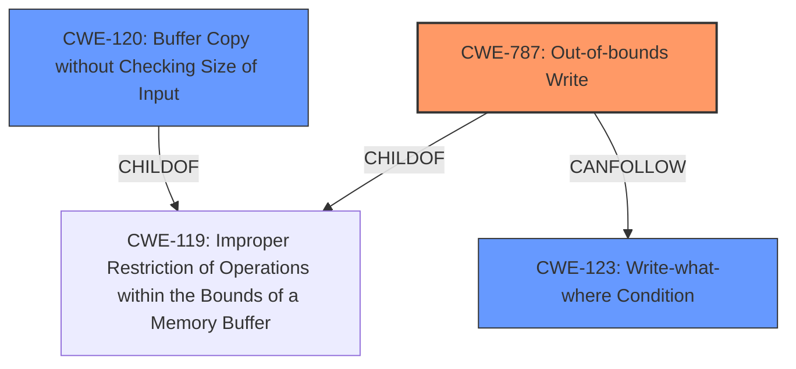

# Analysis Report for CVE-2020-13995

# Vulnerability Analysis Report: CVE-2020-13995

## Description


## Analysis (with Relationship Data)

# Summary
| CWE ID  | CWE Name | Confidence | CWE Abstraction Level | CWE Vulnerability Mapping Label | CWE-Vulnerability Mapping Notes |
|-----------------|------------------------------------------------------------------------------------|------------|-----------------------|------------------------------------|-----------------------------------|
| CWE-787 | Out-of-bounds Write | 0.95 | Base | Allowed | Primary CWE |
| CWE-123 | Write-what-where Condition | 0.85 | Base | Allowed | Secondary CWE |
| CWE-120 | Buffer Copy without Checking Size of Input ('Classic Buffer Overflow') | 0.75 | Base | Allowed-with-Review | Secondary CWE |

## Evidence and Confidence

*   **Confidence Score:** 0.9
*   **Evidence Strength:** HIGH

## Relationship Analysis
The primary weakness is an **out-of-bounds write (CWE-787)**, which is a child of **improper restriction of operations within the bounds of a memory buffer (CWE-119)**. The **out-of-bounds write** leads to a **write-what-where condition (CWE-123)**, where the attacker can write arbitrary data to arbitrary locations. **CWE-120 (Buffer Copy without Checking Size of Input)** is also related because the **buffer overflow** occurs due to **improper input validation** and **lack of size checking**.



## Vulnerability Chain
The vulnerability chain starts with a **buffer overflow** due to the **lack of input validation**. This leads to an **out-of-bounds write** to the `sBuffer` variable. Overwriting `sBuffer` corrupts other global variables, including the `DES_info` pointer, eventually achieving a **write-what-where condition**. The final impact is arbitrary code execution.

## Summary of Analysis
Based on the evidence provided, the primary CWE is **CWE-787 (Out-of-bounds Write)** because the vulnerability involves writing data past the end of the intended buffer (`sBuffer`). The vulnerability description mentions "**buffer overflow** that leads to code execution. An overflow in a global variable (sBuffer) leads to a Write-What-Where outcome." The CVE Reference Links Content Summary states: "When `NUMDES` is greater than 76, the amount of data read exceeds the size of `sBuffer`, causing a **buffer overflow**."

Additionally, the **out-of-bounds write** leads to a **write-what-where condition (CWE-123)**, which is a secondary weakness. The attacker can overwrite arbitrary memory locations by controlling the `DES_info` pointer.

**CWE-120 (Buffer Copy without Checking Size of Input)** is also relevant since the root cause is the **lack of size checking** before copying data into the `sBuffer`.

I considered **CWE-119 (Improper Restriction of Operations within the Bounds of a Memory Buffer)**, but it is a Class-level CWE and is discouraged when more specific CWEs are available. Since we have evidence of **out-of-bounds write**, **write-what-where**, and **lack of input validation**, it is more appropriate to use the more specific CWEs.

I also considered **CWE-190 (Integer Overflow or Wraparound)**, but there is no direct evidence of an integer overflow in the provided description. While it's possible an integer overflow could contribute to calculating the size, the explicit mention of **buffer overflow** and **out-of-bounds write** takes precedence.

**CWE-125 (Out-of-bounds Read)** and **CWE-416 (Use After Free)** were also considered but do not fit the vulnerability description as the primary issue is writing out of bounds, not reading or using freed memory.

The selected CWEs are at the optimal level of specificity because they directly address the root cause (**out-of-bounds write**) and the resulting impact (**write-what-where condition**). They provide a more precise classification than the more general **CWE-119**.


## CWE Relationship Analysis

Current CWEs represent these abstraction levels: .


### Vulnerability Chain Analysis

**Chain starting from CWE-787:**
- 787 (Out-of-bounds Write) - ROOT


**Chain starting from CWE-123:**
- 123 (Write-what-where Condition) - ROOT


### CWE Relationship Diagram

```mermaid
graph TD
    classDef primary fill:#f96,stroke:#333,stroke-width:2px
    classDef secondary fill:#69f,stroke:#333
    classDef tertiary fill:#9e9,stroke:#333
```


*Report generated on 2025-04-02 09:26:21*
