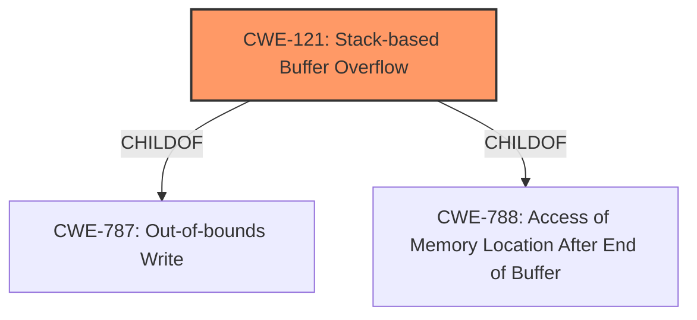

# Analysis for CVE-2020-14107

# Summary
| CWE ID | CWE Name | Confidence | CWE Abstraction Level | CWE Vulnerability Mapping Label | CWE-Vulnerability Mapping Notes |
|---|---|---|---|---|---|
| CWE-121 | Stack-based Buffer Overflow | 1.0 | Variant | Allowed | Primary CWE |

## Evidence and Confidence

*   **Confidence Score:** 1.0
*   **Evidence Strength:** HIGH

## Relationship Analysis
The primary relationship that influenced the decision was the ChildOf relationship, linking CWE-121 to its parent CWE-787 (Out-of-bounds Write) and CWE-788 (Access of Memory Location After End of Buffer). This hierarchy confirms the classification of a stack-based buffer overflow as a specific instance of a more general out-of-bounds write condition.

## Vulnerability Chain
The vulnerability chain consists of the **stack overflow** condition, leading to a crash. There isn't enough information to determine the root cause of the stack overflow, so the chain is not fully complete.

## Summary of Analysis
The vulnerability description explicitly states a **"stack overflow"** in the HTTP server, making CWE-121 (Stack-based Buffer Overflow) the most appropriate choice. The key phrase "stack overflow" directly aligns with the CWE name and description.
The retriever results also lists CWE-121 as the top result with a score of 1.0. The CWE-121 is a Variant, which is a preferred level of abstraction.

Relevant CWE Information:

# Enhanced Context (25 CWEs)

## CWE-121: Stack-based Buffer Overflow
**Abstraction:** Variant
**Status:** Draft

### Description
A stack-based buffer overflow condition is a condition where the buffer being overwritten is allocated on the stack (i.e., is a local variable or, rarely, a parameter to a function).

### Extended Description
Not provided

### Alternative Terms
Stack Overflow: "Stack Overflow" is often used to mean the same thing as stack-based buffer overflow, however it is also used on occasion to mean stack exhaustion, usually a result from an excessively recursive function call. Due to the ambiguity of the term, use of stack overflow to describe either circumstance is discouraged.

### Relationships
ChildOf -> CWE-788
ChildOf -> CWE-787

### Mapping Guidance
**Usage:** Allowed
**Rationale:** This CWE entry is at the Variant level of abstraction, which is a preferred level of abstraction for mapping to the root causes of vulnerabilities.
**Comments:** Carefully read both the name and description to ensure that this mapping is an appropriate fit. Do not try to 'force' a mapping to a lower-level Base/Variant simply to comply with this preferred level of abstraction.
**Reasons:**
- Acceptable-Use

### Additional Notes
**[Other]** Stack-based buffer overflows can instantiate in return address overwrites, stack pointer overwrites or frame pointer overwrites. They can also be considered function pointer overwrites, array indexer overwrites or write-what-where condition, etc.

### Observed Examples
- **CVE-2021-35395:** Stack-based buffer overflows in SFK for wifi chipset used for IoT/embedded devices, as exploited in the wild per CISA KEV.

Other CWEs considered:

*   **CWE-190 (Integer Overflow or Wraparound):** While integer overflows can sometimes lead to buffer overflows, there is no indication of integer manipulation in the description.
*   **CWE-674 (Uncontrolled Recursion):** Although stack exhaustion due to uncontrolled recursion can resemble a stack overflow, the description specifically mentions a buffer overflow, not excessive recursion.
*   **CWE-120 (Buffer Copy without Checking Size of Input):** This is a base class of buffer overflow, but the stack allocation isn't specified.
*   **CWE-1284 (Improper Validation of Specified Quantity in Input):** This could be a root cause, but not enough information to say that the quantity in the input was not validated.