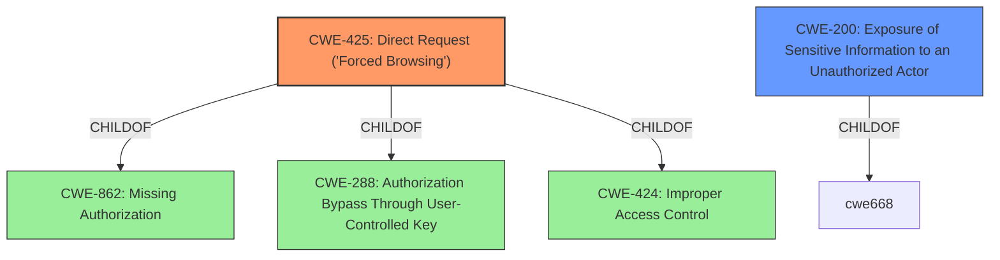

# Raw Analyzer Response for CVE-2020-14110

# Summary
| CWE ID | CWE Name | Confidence | CWE Abstraction Level | CWE Vulnerability Mapping Label | CWE-Vulnerability Mapping Notes |
|---|---|---|---|---|---|
| CWE-425 | Direct Request ('Forced Browsing') | 0.8 | Base | Allowed | Primary CWE. The application does not adequately enforce appropriate authorization on all restricted URLs, scripts, or files. |
| CWE-200 | Exposure of Sensitive Information to an Unauthorized Actor | 0.6 | Class | Discouraged | Secondary Candidate. The product exposes sensitive information to an actor that is not explicitly authorized to have access to that information. |

## Evidence and Confidence

*   **Confidence Score:** 0.7
*   **Evidence Strength:** MEDIUM

## Relationship Analysis
The primary relationship that influenced the decision was the ChildOf relationship between CWE-425 and CWE-862 (Missing Authorization). While CWE-862 could have been considered, the description of CWE-425 more closely aligns with the vulnerability description, especially the part about "unauthorized interface through luci". CWE-425 is also related to CWE-288, which describes authorization bypass, and CWE-424, which deals with improper access control.

## Vulnerability Chain
The vulnerability chain starts with the **unauthorized interface** (**ROOT CAUSE**). Because there is **missing authorization**, an attacker can then **obtain sensitive information** (**IMPACT**) and then **log in to the web background** (**IMPACT**).

## Summary of Analysis
The initial analysis focused on the "unauthorized interface" aspect of the vulnerability description, aligning with authorization-related CWEs. The description, "There is an **unauthorized interface through luci** to obtain sensitive information and log in to the web background," strongly suggests that the application is failing to properly enforce authorization checks, allowing direct requests to sensitive resources.

The selection of CWE-425 is primarily based on the root cause identified in the "Vulnerability Description Key Phrases": "**unauthorized interface through luci**". This indicates a failure in authorization checks, making CWE-425 a more precise fit compared to the higher-level CWE-200.

CWE-200 was considered as a secondary candidate because the vulnerability ultimately leads to the exposure of sensitive information. However, CWE-200 is a class-level CWE and its mapping is discouraged when more specific CWEs are available. The retriever listed CWE-425 with a similarity score of 0.160 and CWE-200 with a similarity score of 0.159, so CWE-425 is a marginally better fit.

The selected CWEs are at the optimal level of specificity because CWE-425 is a Base-level CWE.

Relevant CWE Information:

# Enhanced Context (25 CWEs)
The following CWEs were identified as potentially relevant to this vulnerability:

## CWE-538: Insertion of Sensitive Information into Externally-Accessible File or Directory
**Abstraction Level**: Base
**Similarity Score**: 0.79
**Source**: dense

**Description**:
The product places sensitive information into files or directories that are accessible to actors who are allowed to have access to the files, but not to the sensitive information.

**Mapping Guidance**:
- Usage: Allowed
- Rationale: This CWE entry is at the Base level of abstraction, which is a preferred level of abstraction for mapping to the root causes of vulnerabilities.

## CWE-497: Exposure of Sensitive System Information to an Unauthorized Control Sphere
**Abstraction Level**: Base
**Similarity Score**: 0.76
**Source**: dense

**Description**:
The product does not properly prevent sensitive system-level information from being accessed by unauthorized actors who do not have the same level of access to the underlying system as the product does.

**Mapping Guidance**:
- Usage: Allowed
- Rationale: This CWE entry is at the Base level of abstraction, which is a preferred level of abstraction for mapping to the root causes of vulnerabilities.

## CWE-807: Reliance on Untrusted Inputs in a Security Decision
**Abstraction Level**: Base
**Similarity Score**: 0.76
**Source**: dense

**Description**:
The product uses a protection mechanism that relies on the existence or values of an input, but the input can be modified by an untrusted actor in a way that bypasses the protection mechanism.

**Mapping Guidance**:
- Usage: Allowed
- Rationale: This CWE entry is at the Base level of abstraction, which is a preferred level of abstraction for mapping to the root causes of vulnerabilities.

## CWE-213: Exposure of Sensitive Information Due to Incompatible Policies
**Abstraction Level**: Base
**Similarity Score**: 0.76
**Source**: dense

**Description**:
The product's intended functionality exposes information to certain actors in accordance with the developer's security policy, but this information is regarded as sensitive according to the intended security policies of other stakeholders such as the product's administrator, users, or others whose information is being processed.

**Mapping Guidance**:
- Usage: Allowed
- Rationale: This CWE entry is at the Base level of abstraction, which is a preferred level of abstraction for mapping to the root causes of vulnerabilities.

## CWE-212: Improper Removal of Sensitive Information Before Storage or Transfer
**Abstraction Level**: Base
**Similarity Score**: 0.76
**Source**: dense

**Description**:
The product stores, transfers, or shares a resource that contains sensitive information, but it does not properly remove that information before the product makes the resource available to unauthorized actors.

**Mapping Guidance**:
- Usage: Allowed
- Rationale: This CWE entry is at the Base level of abstraction, which is a preferred level of abstraction for mapping to the root causes of vulnerabilities.

## CWE-552: Files or Directories Accessible to External Parties
**Abstraction Level**: Base
**Similarity Score**: 0.76
**Source**: dense

**Description**:
The product makes files or directories accessible to unauthorized actors, even though they should not be.

**Mapping Guidance**:
- Usage: Allowed
- Rationale: This CWE entry is at the Base level of abstraction, which is a preferred level of abstraction for mapping to the root causes of vulnerabilities.

## CWE-319: Cleartext Transmission of Sensitive Information
**Abstraction Level**: Base
**Similarity Score**: 0.75
**Source**: dense

**Description**:
The product transmits sensitive or security-critical data in cleartext in a communication channel that can be sniffed by unauthorized actors.

**Mapping Guidance**:
- Usage: Allowed
- Rationale: This CWE entry is at the Base level of abstraction, which is a preferred level of abstraction for mapping to the root causes of vulnerabilities.

## CWE-668: Exposure of Resource to Wrong Sphere
**Abstraction Level**: Class
**Similarity Score**: 0.75
**Source**: dense

**Description**:
The product exposes a resource to the wrong control sphere, providing unintended actors with inappropriate access to the resource.

**Mapping Guidance**:
- Usage: Discouraged
- Rationale: CWE-668 is high-level and is often misused as a catch-all when lower-level CWE IDs might be applicable. It is sometimes used for low-information vulnerability reports [REF-1287]. It is a level-1 Class (i.e., a child of a Pillar). It is not useful for trend analysis.

## CWE-280: Improper Handling of Insufficient Permissions or Privileges 
**Abstraction Level**: Base
**Similarity Score**: 0.75
**Source**: dense

**Description**:
The product does not handle or incorrectly handles when it has insufficient privileges to access resources or functionality as specified by their permissions. This may cause it to follow unexpected code paths that may leave the product in an invalid state.

**Mapping Guidance**:
- Usage: Allowed
- Rationale: This CWE entry is at the Base level of abstraction, which is a preferred level of abstraction for mapping to the root causes of vulnerabilities.

## CWE-226: Sensitive Information in Resource Not Removed Before Reuse
**Abstraction Level**: Base
**Similarity Score**: 0.75
**Source