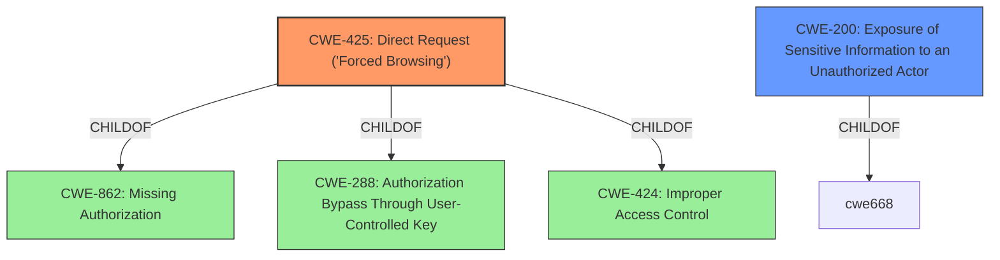

# Analysis for CVE-2020-14110

# Summary
| CWE ID | CWE Name | Confidence | CWE Abstraction Level | CWE Vulnerability Mapping Label | CWE-Vulnerability Mapping Notes |
|---|---|---|---|---|---|
| CWE-425 | Direct Request ('Forced Browsing') | 0.8 | Base | Allowed | Primary CWE. The application does not adequately enforce appropriate authorization on all restricted URLs, scripts, or files. |
| CWE-200 | Exposure of Sensitive Information to an Unauthorized Actor | 0.6 | Class | Discouraged | Secondary Candidate. The product exposes sensitive information to an actor that is not explicitly authorized to have access to that information. |

## Evidence and Confidence

*   **Confidence Score:** 0.7
*   **Evidence Strength:** MEDIUM

## Relationship Analysis
The primary relationship that influenced the decision was the ChildOf relationship between CWE-425 and CWE-862 (Missing Authorization). While CWE-862 could have been considered, the description of CWE-425 more closely aligns with the vulnerability description, especially the part about "unauthorized interface through luci". CWE-425 is also related to CWE-288, which describes authorization bypass, and CWE-424, which deals with improper access control.



## Vulnerability Chain
The vulnerability chain starts with the **unauthorized interface** (**ROOT CAUSE**). Because there is **missing authorization**, an attacker can then **obtain sensitive information** (**IMPACT**) and then **log in to the web background** (**IMPACT**).

## Summary of Analysis
The initial analysis focused on the "unauthorized interface" aspect of the vulnerability description, aligning with authorization-related CWEs. The description, "There is an **unauthorized interface through luci** to obtain sensitive information and log in to the web background," strongly suggests that the application is failing to properly enforce authorization checks, allowing direct requests to sensitive resources.

The selection of CWE-425 is primarily based on the root cause identified in the "Vulnerability Description Key Phrases": "**unauthorized interface through luci**". This indicates a failure in authorization checks, making CWE-425 a more precise fit compared to the higher-level CWE-200.

CWE-200 was considered as a secondary candidate because the vulnerability ultimately leads to the exposure of sensitive information. However, CWE-200 is a class-level CWE and its mapping is discouraged when more specific CWEs are available. The retriever listed CWE-425 with a similarity score of 0.160 and CWE-200 with a similarity score of 0.159, so CWE-425 is a marginally better fit.

The selected CWEs are at the optimal level of specificity because CWE-425 is a Base-level CWE.

Relevant CWE Information:

# Enhanced Context (25 CWEs)
The following CWEs were identified as potentially relevant to this vulnerability:

## CWE-538: Insertion of Sensitive Information into Externally-Accessible File or Directory
**Abstraction Level**: Base
**Similarity Score**: 0.79
**Source**: dense

**Description**:
The product places sensitive information into files or directories that are accessible to actors who are allowed to have access to the files, but not to the sensitive information.

**Mapping Guidance**:
- Usage: Allowed
- Rationale: This CWE entry is at the Base level of abstraction, which is a preferred level of abstraction for mapping to the root causes of vulnerabilities.


## CWE-497: Exposure of Sensitive System Information to an Unauthorized Control Sphere
**Abstraction Level**: Base
**Similarity Score**: 0.76
**Source**: dense

**Description**:
The product does not properly prevent sensitive system-level information from being accessed by unauthorized actors who do not have the same level of access to the underlying system as the product does.

**Mapping Guidance**:
- Usage: Allowed
- Rationale: This CWE entry is at the Base level of abstraction, which is a preferred level of abstraction for mapping to the root causes of vulnerabilities.


## CWE-807: Reliance on Untrusted Inputs in a Security Decision
**Abstraction Level**: Base
**Similarity Score**: 0.76
**Source**: dense

**Description**:
The product uses a protection mechanism that relies on the existence or values of an input, but the input can be modified by an untrusted actor in a way that bypasses the protection mechanism.

**Mapping Guidance**:
- Usage: Allowed
- Rationale: This CWE entry is at the Base level of abstraction, which is a preferred level of abstraction for mapping to the root causes of vulnerabilities.


## CWE-213: Exposure of Sensitive Information Due to Incompatible Policies
**Abstraction Level**: Base
**Similarity Score**: 0.76
**Source**: dense

**Description**:
The product's intended functionality exposes information to certain actors in accordance with the developer's security policy, but this information is regarded as sensitive according to the intended security policies of other stakeholders such as the product's administrator, users, or others whose information is being processed.

**Mapping Guidance**:
- Usage: Allowed
- Rationale: This CWE entry is at the Base level of abstraction, which is a preferred level of abstraction for mapping to the root causes of vulnerabilities.


## CWE-212: Improper Removal of Sensitive Information Before Storage or Transfer
**Abstraction Level**: Base
**Similarity Score**: 0.76
**Source**: dense

**Description**:
The product stores, transfers, or shares a resource that contains sensitive information, but it does not properly remove that information before the product makes the resource available to unauthorized actors.

**Mapping Guidance**:
- Usage: Allowed
- Rationale: This CWE entry is at the Base level of abstraction, which is a preferred level of abstraction for mapping to the root causes of vulnerabilities.


## CWE-552: Files or Directories Accessible to External Parties
**Abstraction Level**: Base
**Similarity Score**: 0.76
**Source**: dense

**Description**:
The product makes files or directories accessible to unauthorized actors, even though they should not be.

**Mapping Guidance**:
- Usage: Allowed
- Rationale: This CWE entry is at the Base level of abstraction, which is a preferred level of abstraction for mapping to the root causes of vulnerabilities.


## CWE-319: Cleartext Transmission of Sensitive Information
**Abstraction Level**: Base
**Similarity Score**: 0.75
**Source**: dense

**Description**:
The product transmits sensitive or security-critical data in cleartext in a communication channel that can be sniffed by unauthorized actors.

**Mapping Guidance**:
- Usage: Allowed
- Rationale: This CWE entry is at the Base level of abstraction, which is a preferred level of abstraction for mapping to the root causes of vulnerabilities.


## CWE-668: Exposure of Resource to Wrong Sphere
**Abstraction Level**: Class
**Similarity Score**: 0.75
**Source**: dense

**Description**:
The product exposes a resource to the wrong control sphere, providing unintended actors with inappropriate access to the resource.

**Mapping Guidance**:
- Usage: Discouraged
- Rationale: CWE-668 is high-level and is often misused as a catch-all when lower-level CWE IDs might be applicable. It is sometimes used for low-information vulnerability reports [REF-1287]. It is a level-1 Class (i.e., a child of a Pillar). It is not useful for trend analysis.


## CWE-280: Improper Handling of Insufficient Permissions or Privileges 
**Abstraction Level**: Base
**Similarity Score**: 0.75
**Source**: dense

**Description**:
The product does not handle or incorrectly handles when it has insufficient privileges to access resources or functionality as specified by their permissions. This may cause it to follow unexpected code paths that may leave the product in an invalid state.

**Mapping Guidance**:
- Usage: Allowed
- Rationale: This CWE entry is at the Base level of abstraction, which is a preferred level of abstraction for mapping to the root causes of vulnerabilities.


## CWE-226: Sensitive Information in Resource Not Removed Before Reuse
**Abstraction Level**: Base
**Similarity Score**: 0.75
**Source

# Enhanced Query for CVE-2020-14110

## Vulnerability Description
AX3600 router sensitive information leaked.There is an **unauthorized interface through luci** to obtain sensitive information and log in to the web background.

### Vulnerability Description Key Phrases
- **rootcause:** **unauthorized interface through luci**
- **impact:** obtain sensitive information and log in to web background
- **product:** AX3600 router

## Retriever Results

### Top Combined Results

| Rank | CWE ID | Name | Abstraction | Usage  | Retrievers | Individual Scores |
|------|--------|------|-------------|-------|------------|-------------------|
| 1 | 425 | Direct Request ('Forced Browsing') | Base | Allowed | sparse | 0.160 |
| 2 | 200 | Exposure of Sensitive Information to an Unauthorized Actor | Class | Discouraged | sparse | 0.159 |
| 3 | 359 | Exposure of Private Personal Information to an Unauthorized Actor | Base | Allowed | sparse | 0.156 |
| 4 | 306 | Missing Authentication for Critical Function | Base | Allowed | sparse | 0.154 |
| 5 | 201 | Insertion of Sensitive Information Into Sent Data | Base | Allowed | sparse | 0.153 |
| 6 | 78 | Improper Neutralization of Special Elements used in an OS Command ('OS Command Injection') | Base | Allowed | dense | 0.550 |
| 7 | 259 | Use of Hard-coded Password | Variant | Allowed | graph | 0.002 |
| 8 | 319 | Cleartext Transmission of Sensitive Information | Base | Allowed | sparse | 0.152 |
| 9 | 532 | Insertion of Sensitive Information into Log File | Base | Allowed | sparse | 0.150 |
| 10 | 285 | Improper Authorization | Class | Discouraged | sparse | 0.149 |


# Complete CWE Specifications


## CWE-425: Direct Request ('Forced Browsing')
**Abstraction:** Base
**Status:** Incomplete

### Description
The web application does not adequately enforce appropriate authorization on all restricted URLs, scripts, or files.

### Extended Description
Web applications susceptible to direct request attacks often make the false assumption that such resources can only be reached through a given navigation path and so only apply authorization at certain points in the path.

### Alternative Terms
forced browsing: The "forced browsing" term could be misinterpreted to include weaknesses such as CSRF or XSS, so its use is discouraged.

### Relationships
ChildOf -> CWE-862
ChildOf -> CWE-862
ChildOf -> CWE-288
ChildOf -> CWE-424
CanPrecede -> CWE-471
CanPrecede -> CWE-98

### Mapping Guidance
**Usage:** Allowed
**Rationale:** This CWE entry is at the Base level of abstraction, which is a preferred level of abstraction for mapping to the root causes of vulnerabilities.
**Comments:** Carefully read both the name and description to ensure that this mapping is an appropriate fit. Do not try to 'force' a mapping to a lower-level Base/Variant simply to comply with this preferred level of abstraction.
**Reasons:**
- Acceptable-Use


### Additional Notes
**[Relationship]** Overlaps Modification of Assumed-Immutable Data (MAID), authorization errors, container errors; often primary to other weaknesses such as XSS and SQL injection.

**[Theoretical]** "Forced browsing" is a step-based manipulation involving the omission of one or more steps, whose order is assumed to be immutable. The application does not verify that the first step was performed successfully before the second step. The consequence is typically "authentication bypass" or "path disclosure," although it can be primary to all kinds of weaknesses, especially in languages such as PHP, which allow external modification of assumed-immutable variables.


### Observed Examples
- **CVE-2022-29238:** Access-control setting in web-based document collaboration tool is not properly implemented by the code, which prevents listing hidden directories but does not prevent direct requests to files in those directories.
- **CVE-2022-23607:** Python-based HTTP library did not scope cookies to a particular domain such that "supercookies" could be sent to any domain on redirect.
- **CVE-2004-2144:** Bypass authentication via direct request.


## CWE-200: Exposure of Sensitive Information to an Unauthorized Actor
**Abstraction:** Class
**Status:** Draft

### Description
The product exposes sensitive information to an actor that is not explicitly authorized to have access to that information.

### Extended Description


There are many different kinds of mistakes that introduce information exposures. The severity of the error can range widely, depending on the context in which the product operates, the type of sensitive information that is revealed, and the benefits it may provide to an attacker. Some kinds of sensitive information include:


  - private, personal information, such as personal messages, financial data, health records, geographic location, or contact details

  - system status and environment, such as the operating system and installed packages

  - business secrets and intellectual property

  - network status and configuration

  - the product's own code or internal state

  - metadata, e.g. logging of connections or message headers

  - indirect information, such as a discrepancy between two internal operations that can be observed by an outsider

Information might be sensitive to different parties, each of which may have their own expectations for whether the information should be protected. These parties include:

  - the product's own users

  - people or organizations whose information is created or used by the product, even if they are not direct product users

  - the product's administrators, including the admins of the system(s) and/or networks on which the product operates

  - the developer

Information exposures can occur in different ways:

  - the code  **explicitly inserts**  sensitive information into resources or messages that are intentionally made accessible to unauthorized actors, but should not contain the information - i.e., the information should have been "scrubbed" or "sanitized"

  - a different weakness or mistake  **indirectly inserts**  the sensitive information into resources, such as a web script error revealing the full system path of the program.

  - the code manages resources that intentionally contain sensitive information, but the resources are  **unintentionally made accessible**  to unauthorized actors. In this case, the information exposure is resultant - i.e., a different weakness enabled the access to the information in the first place.

It is common practice to describe any loss of confidentiality as an "information exposure," but this can lead to overuse of CWE-200 in CWE mapping. From the CWE perspective, loss of confidentiality is a technical impact that can arise from dozens of different weaknesses, such as insecure file permissions or out-of-bounds read. CWE-200 and its lower-level descendants are intended to cover the mistakes that occur in behaviors that explicitly manage, store, transfer, or cleanse sensitive information.

### Alternative Terms
Information Disclosure: This term is frequently used in vulnerability advisories to describe a consequence or technical impact, for any vulnerability that has a loss of confidentiality. Often, CWE-200 can be misused to represent the loss of confidentiality, even when the mistake - i.e., the weakness - is not directly related to the mishandling of the information itself, such as an out-of-bounds read that accesses sensitive memory contents; here, the out-of-bounds read is the primary weakness, not the disclosure of the memory. In addition, this phrase is also used frequently in policies and legal documents, but it does not refer to any disclosure of security-relevant information.
Information Leak: This is a frequently used term, however the "leak" term has multiple uses within security. In some cases it deals with the accidental exposure of information from a different weakness, but in other cases (such as "memory leak"), this deals with improper tracking of resources, which can lead to exhaustion. As a result, CWE is actively avoiding usage of the "leak" term.

### Relationships
ChildOf -> CWE-668

### Mapping Guidance
**Usage:** Discouraged
**Rationale:** CWE-200 is commonly misused to represent the loss of confidentiality in a vulnerability, but confidentiality loss is a technical impact - not a root cause error. As of CWE 4.9, over 400 CWE entries can lead to a loss of confidentiality. Other options are often available. [REF-1287].
**Comments:** If an error or mistake causes information to be disclosed, then use the CWE ID for that error. Consider starting with improper authorization (CWE-285), insecure permissions (CWE-732), improper authentication (CWE-287), etc. Also consider children such as Insertion of Sensitive Information Into Sent Data (CWE-201), Observable Discrepancy (CWE-203), Insertion of Sensitive Information into Externally-Accessible File or Directory (CWE-538), or others.
**Reasons:**
- Frequent Misuse


### Additional Notes
**[Maintenance]** As a result of mapping analysis in the 2020 Top 25 and more recent versions, this weakness is under review, since it is frequently misused in mapping to cover many problems that lead to loss of confidentiality. See Mapping Notes, Extended Description, and Alternate Terms.


### Observed Examples
- **CVE-2022-31162:** Rust library leaks Oauth client details in application debug logs
- **CVE-2021-25476:** Digital Rights Management (DRM) capability for mobile platform leaks pointer information, simplifying ASLR bypass
- **CVE-2001-1483:** Enumeration of valid usernames based on inconsistent responses


## CWE-359: Exposure of Private Personal Information to an Unauthorized Actor
**Abstraction:** Base
**Status:** Incomplete

### Description
The product does not properly prevent a person's private, personal information from being accessed by actors who either (1) are not explicitly authorized to access the information or (2) do not have the implicit consent of the person about whom the information is collected.

### Extended Description
Not provided

### Alternative Terms
Privacy violation
Privacy leak
Privacy leakage

### Relationships
ChildOf -> CWE-200

### Mapping Guidance
**Usage:** Allowed
**Rationale:** This CWE entry is at the Base level of abstraction, which is a preferred level of abstraction for mapping to the root causes of vulnerabilities.
**Comments:** Carefully read both the name and description to ensure that this mapping is an appropriate fit. Do not try to 'force' a mapping to a lower-level Base/Variant simply to comply with this preferred level of abstraction.
**Reasons:**
- Acceptable-Use


### Additional Notes
**[Maintenance]** This entry overlaps many other entries that are not organized around the kind of sensitive information that is exposed. However, because privacy is treated with such importance due to regulations and other factors, and it may be useful for weakness-finding tools to highlight capabilities that detect personal private information instead of system information, it is not clear whether - and how - this entry should be deprecated.

**[Other]** 

There are many types of sensitive information that products must protect from attackers, including system data, communications, configuration, business secrets, intellectual property, and an individual's personal (private) information. Private personal information may include a password, phone number, geographic location, personal messages, credit card number, etc. Private information is important to consider whether the person is a user of the product, or part of a data set that is processed by the product. An exposure of private information does not necessarily prevent the product from working properly, and in fact the exposure might be intended by the developer, e.g. as part of data sharing with other organizations. However, the exposure of personal private information can still be undesirable or explicitly prohibited by law or regulation.


Some types of private information include:


  - Government identifiers, such as Social Security Numbers

  - Contact information, such as home addresses and telephone numbers

  - Geographic location - where the user is (or was)

  - Employment history

  - Financial data - such as credit card numbers, salary, bank accounts, and debts

  - Pictures, video, or audio

  - Behavioral patterns - such as web surfing history, when certain activities are performed, etc.

  - Relationships (and types of relationships) with others - family, friends, contacts, etc.

  - Communications - e-mail addresses, private messages, text messages, chat logs, etc.

  - Health - medical conditions, insurance status, prescription records

  - Account passwords and other credentials

Some of this information may be characterized as PII (Personally Identifiable Information), Protected Health Information (PHI), etc. Categories of private information may overlap or vary based on the intended usage or the policies and practices of a particular industry.

Sometimes data that is not labeled as private can have a privacy implication in a different context. For example, student identification numbers are usually not considered private because there is no explicit and publicly-available mapping to an individual student's personal information. However, if a school generates identification numbers based on student social security numbers, then the identification numbers should be considered private.


## CWE-306: Missing Authentication for Critical Function
**Abstraction:** Base
**Status:** Draft

### Description
The product does not perform any authentication for functionality that requires a provable user identity or consumes a significant amount of resources.

### Extended Description
Not provided

### Alternative Terms
None

### Relationships
ChildOf -> CWE-287
ChildOf -> CWE-287

### Mapping Guidance
**Usage:** Allowed
**Rationale:** This CWE entry is at the Base level of abstraction, which is a preferred level of abstraction for mapping to the root causes of vulnerabilities.
**Comments:** Carefully read both the name and description to ensure that this mapping is an appropriate fit. Do not try to 'force' a mapping to a lower-level Base/Variant simply to comply with this preferred level of abstraction.
**Reasons:**
- Acceptable-Use


### Observed Examples
- **CVE-2022-31260:** Chain: a digital asset management program has an undisclosed backdoor in the legacy version of a PHP script (CWE-912) that could allow an unauthenticated user to export metadata (CWE-306)
- **CVE-2022-29951:** TCP-based protocol in Programmable Logic Controller (PLC) has no authentication.
- **CVE-2022-29952:** Condition Monitor firmware uses a protocol that does not require authentication.


## CWE-201: Insertion of Sensitive Information Into Sent Data
**Abstraction:** Base
**Status:** Draft

### Description
The code transmits data to another actor, but a portion of the data includes sensitive information that should not be accessible to that actor.

### Extended Description
Not provided

### Alternative Terms
None

### Relationships
ChildOf -> CWE-200
CanAlsoBe -> CWE-209
CanAlsoBe -> CWE-202

### Mapping Guidance
**Usage:** Allowed
**Rationale:** This CWE entry is at the Base level of abstraction, which is a preferred level of abstraction for mapping to the root causes of vulnerabilities.
**Comments:** Carefully read both the name and description to ensure that this mapping is an appropriate fit. Do not try to 'force' a mapping to a lower-level Base/Variant simply to comply with this preferred level of abstraction.
**Reasons:**
- Acceptable-Use


### Additional Notes
**[Other]** Sensitive information could include data that is sensitive in and of itself (such as credentials or private messages), or otherwise useful in the further exploitation of the system (such as internal file system structure).


### Observed Examples
- **CVE-2022-0708:** Collaboration platform does not clear team emails in a response, allowing leak of email addresses


## CWE-78: Improper Neutralization of Special Elements used in an OS Command ('OS Command Injection')
**Abstraction:** Base
**Status:** Stable

### Description
The product constructs all or part of an OS command using externally-influenced input from an upstream component, but it does not neutralize or incorrectly neutralizes special elements that could modify the intended OS command when it is sent to a downstream component.

### Extended Description


This weakness can lead to a vulnerability in environments in which the attacker does not have direct access to the operating system, such as in web applications. Alternately, if the weakness occurs in a privileged program, it could allow the attacker to specify commands that normally would not be accessible, or to call alternate commands with privileges that the attacker does not have. The problem is exacerbated if the compromised process does not follow the principle of least privilege, because the attacker-controlled commands may run with special system privileges that increases the amount of damage.


There are at least two subtypes of OS command injection:


  - The application intends to execute a single, fixed program that is under its own control. It intends to use externally-supplied inputs as arguments to that program. For example, the program might use system("nslookup [HOSTNAME]") to run nslookup and allow the user to supply a HOSTNAME, which is used as an argument. Attackers cannot prevent nslookup from executing. However, if the program does not remove command separators from the HOSTNAME argument, attackers could place the separators into the arguments, which allows them to execute their own program after nslookup has finished executing.

  - The application accepts an input that it uses to fully select which program to run, as well as which commands to use. The application simply redirects this entire command to the operating system. For example, the program might use "exec([COMMAND])" to execute the [COMMAND] that was supplied by the user. If the COMMAND is under attacker control, then the attacker can execute arbitrary commands or programs. If the command is being executed using functions like exec() and CreateProcess(), the attacker might not be able to combine multiple commands together in the same line.

From a weakness standpoint, these variants represent distinct programmer errors. In the first variant, the programmer clearly intends that input from untrusted parties will be part of the arguments in the command to be executed. In the second variant, the programmer does not intend for the command to be accessible to any untrusted party, but the programmer probably has not accounted for alternate ways in which malicious attackers can provide input.

### Alternative Terms
Shell injection
Shell metacharacters
OS Command Injection

### Relationships
ChildOf -> CWE-77
ChildOf -> CWE-74
ChildOf -> CWE-77
ChildOf -> CWE-77
CanAlsoBe -> CWE-88

### Mapping Guidance
**Usage:** Allowed
**Rationale:** This CWE entry is at the Base level of abstraction, which is a preferred level of abstraction for mapping to the root causes of vulnerabilities.
**Comments:** Carefully read both the name and description to ensure that this mapping is an appropriate fit. Do not try to 'force' a mapping to a lower-level Base/Variant simply to comply with this preferred level of abstraction.
**Reasons:**
- Acceptable-Use


### Additional Notes
**[Terminology]** The "OS command injection" phrase carries different meanings to different people. For some people, it only refers to cases in which the attacker injects command separators into arguments for an application-controlled program that is being invoked. For some people, it refers to any type of attack that can allow the attacker to execute OS commands of their own choosing. This usage could include untrusted search path weaknesses (CWE-426) that cause the application to find and execute an attacker-controlled program. Further complicating the issue is the case when argument injection (CWE-88) allows alternate command-line switches or options to be inserted into the command line, such as an "-exec" switch whose purpose may be to execute the subsequent argument as a command (this -exec switch exists in the UNIX "find" command, for example). In this latter case, however, CWE-88 could be regarded as the primary weakness in a chain with CWE-78.

**[Research Gap]** More investigation is needed into the distinction between the OS command injection variants, including the role with argument injection (CWE-88). Equivalent distinctions may exist in other injection-related problems such as SQL injection.


### Observed Examples
- **CVE-2020-10987:** OS command injection in Wi-Fi router, as exploited in the wild per CISA KEV.
- **CVE-2020-10221:** Template functionality in network configuration management tool allows OS command injection, as exploited in the wild per CISA KEV.
- **CVE-2020-9054:** Chain: improper input validation (CWE-20) in username parameter, leading to OS command injection (CWE-78), as exploited in the wild per CISA KEV.


## CWE-259: Use of Hard-coded Password
**Abstraction:** Variant
**Status:** Draft

### Description
The product contains a hard-coded password, which it uses for its own inbound authentication or for outbound communication to external components.

### Extended Description


A hard-coded password typically leads to a significant authentication failure that can be difficult for the system administrator to detect. Once detected, it can be difficult to fix, so the administrator may be forced into disabling the product entirely. There are two main variations:

```
		Inbound: the product contains an authentication mechanism that checks for a hard-coded password.
		Outbound: the product connects to another system or component, and it contains hard-coded password for connecting to that component.
```
In the Inbound variant, a default administration account is created, and a simple password is hard-coded into the product and associated with that account. This hard-coded password is the same for each installation of the product, and it usually cannot be changed or disabled by system administrators without manually modifying the program, or otherwise patching the product. If the password is ever discovered or published (a common occurrence on the Internet), then anybody with knowledge of this password can access the product. Finally, since all installations of the product will have the same password, even across different organizations, this enables massive attacks such as worms to take place.

The Outbound variant applies to front-end systems that authenticate with a back-end service. The back-end service may require a fixed password which can be easily discovered. The programmer may simply hard-code those back-end credentials into the front-end product. Any user of that program may be able to extract the password. Client-side systems with hard-coded passwords pose even more of a threat, since the extraction of a password from a binary is usually very simple.


### Alternative Terms
None

### Relationships
ChildOf -> CWE-798
ChildOf -> CWE-798
ChildOf -> CWE-798
PeerOf -> CWE-321
PeerOf -> CWE-257

### Mapping Guidance
**Usage:** Allowed
**Rationale:** This CWE entry is at the Variant level of abstraction, which is a preferred level of abstraction for mapping to the root causes of vulnerabilities.
**Comments:** Carefully read both the name and description to ensure that this mapping is an appropriate fit. Do not try to 'force' a mapping to a lower-level Base/Variant simply to comply with this preferred level of abstraction.
**Reasons:**
- Acceptable-Use


### Additional Notes
**[Maintenance]** This entry could be split into multiple variants: an inbound variant (as seen in the second demonstrative example) and an outbound variant (as seen in the first demonstrative example). These variants are likely to have different consequences, detectability, etc. More importantly, from a vulnerability theory perspective, they could be characterized as different behaviors.


### Observed Examples
- **CVE-2022-29964:** Distributed Control System (DCS) has hard-coded passwords for local shell access
- **CVE-2021-37555:** Telnet service for IoT feeder for dogs and cats has hard-coded password [REF-1288]
- **CVE-2021-35033:** Firmware for a WiFi router uses a hard-coded password for a BusyBox shell, allowing bypass of authentication through the UART port


## CWE-319: Cleartext Transmission of Sensitive Information
**Abstraction:** Base
**Status:** Draft

### Description
The product transmits sensitive or security-critical data in cleartext in a communication channel that can be sniffed by unauthorized actors.

### Extended Description


Many communication channels can be "sniffed" (monitored) by adversaries during data transmission. For example, in networking, packets can traverse many intermediary nodes from the source to the destination, whether across the internet, an internal network, the cloud, etc. Some actors might have privileged access to a network interface or any link along the channel, such as a router, but they might not be authorized to collect the underlying data. As a result, network traffic could be sniffed by adversaries, spilling security-critical data.


Applicable communication channels are not limited to software products. Applicable channels include hardware-specific technologies such as internal hardware networks and external debug channels, supporting remote JTAG debugging. When mitigations are not applied to combat adversaries within the product's threat model, this weakness significantly lowers the difficulty of exploitation by such adversaries.


When full communications are recorded or logged, such as with a packet dump, an adversary could attempt to obtain the dump long after the transmission has occurred and try to "sniff" the cleartext from the recorded communications in the dump itself. Even if the information is encoded in a way that is not human-readable, certain techniques could determine which encoding is being used, then decode the information. 


### Alternative Terms
None

### Relationships
ChildOf -> CWE-311
ChildOf -> CWE-311

### Mapping Guidance
**Usage:** Allowed
**Rationale:** This CWE entry is at the Base level of abstraction, which is a preferred level of abstraction for mapping to the root causes of vulnerabilities.
**Comments:** Carefully read both the name and description to ensure that this mapping is an appropriate fit. Do not try to 'force' a mapping to a lower-level Base/Variant simply to comply with this preferred level of abstraction.
**Reasons:**
- Acceptable-Use


### Additional Notes
**[Maintenance]** The Taxonomy_Mappings to ISA/IEC 62443 were added in CWE 4.10, but they are still under review and might change in future CWE versions. These draft mappings were performed by members of the "Mapping CWE to 62443" subgroup of the CWE-CAPEC ICS/OT Special Interest Group (SIG), and their work is incomplete as of CWE 4.10. The mappings are included to facilitate discussion and review by the broader ICS/OT community, and they are likely to change in future CWE versions.


### Observed Examples
- **CVE-2022-29519:** Programmable Logic Controller (PLC) sends sensitive information in plaintext, including passwords and session tokens.
- **CVE-2022-30312:** Building Controller uses a protocol that transmits authentication credentials in plaintext.
- **CVE-2022-31204:** Programmable Logic Controller (PLC) sends password in plaintext.


## CWE-532: Insertion of Sensitive Information into Log File
**Abstraction:** Base
**Status:** Incomplete

### Description
The product writes sensitive information to a log file.

### Extended Description
Not provided

### Alternative Terms
None

### Relationships
ChildOf -> CWE-538
ChildOf -> CWE-200

### Mapping Guidance
**Usage:** Allowed
**Rationale:** This CWE entry is at the Base level of abstraction, which is a preferred level of abstraction for mapping to the root causes of vulnerabilities.
**Comments:** Carefully read both the name and description to ensure that this mapping is an appropriate fit. Do not try to 'force' a mapping to a lower-level Base/Variant simply to comply with this preferred level of abstraction.
**Reasons:**
- Acceptable-Use


### Observed Examples
- **CVE-2017-9615:** verbose logging stores admin credentials in a world-readable log file
- **CVE-2018-1999036:** SSH password for private key stored in build log


## CWE-285: Improper Authorization
**Abstraction:** Class
**Status:** Draft

### Description
The product does not perform or incorrectly performs an authorization check when an actor attempts to access a resource or perform an action.

### Extended Description


Assuming a user with a given identity, authorization is the process of determining whether that user can access a given resource, based on the user's privileges and any permissions or other access-control specifications that apply to the resource.


When access control checks are not applied consistently - or not at all - users are able to access data or perform actions that they should not be allowed to perform. This can lead to a wide range of problems, including information exposures, denial of service, and arbitrary code execution.


### Alternative Terms
AuthZ: "AuthZ" is typically used as an abbreviation of "authorization" within the web application security community. It is distinct from "AuthN" (or, sometimes, "AuthC") which is an abbreviation of "authentication." The use of "Auth" as an abbreviation is discouraged, since it could be used for either authentication or authorization.

### Relationships
ChildOf -> CWE-284
ChildOf -> CWE-284

### Mapping Guidance
**Usage:** Discouraged
**Rationale:** CWE-285 is high-level and lower-level CWEs can frequently be used instead. It is a level-1 Class (i.e., a child of a Pillar).
**Comments:** Look at CWE-285's children and consider mapping to CWEs such as CWE-862: Missing Authorization, CWE-863: Incorrect Authorization, CWE-732: Incorrect Permission Assignment for Critical Resource, or others.
**Reasons:**
- Abstraction
**Suggested Alternatives:**
- CWE-862: Missing Authorization
- CWE-863: Incorrect Authorization
- CWE-732: Incorrect Permission Assignment for Critical Resource


### Observed Examples
- **CVE-2022-24730:** Go-based continuous deployment product does not check that a user has certain privileges to update or create an app, allowing adversaries to read sensitive repository information
- **CVE-2009-3168:** Web application does not restrict access to admin scripts, allowing authenticated users to reset administrative passwords.
- **CVE-2009-2960:** Web application does not restrict access to admin scripts, allowing authenticated users to modify passwords of other users.

