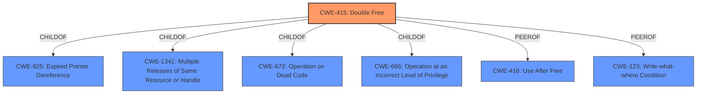

# Enhanced Analysis for CVE-2020-14123

# Summary
| CWE ID | CWE Name | Confidence | CWE Abstraction Level | CWE Vulnerability Mapping Label | CWE-Vulnerability Mapping Notes |
|---|---|---|---|---|---|
| CWE-415 | Double Free | 1.0 | Variant | Allowed | Primary CWE |

## Evidence and Confidence

*   **Confidence Score:** 1.0
*   **Evidence Strength:** HIGH

## Relationship Analysis
The primary relationship influencing the choice of CWE-415 is its presence as a **weakness** in the vulnerability description. CWE-415 is a variant of several other CWEs including CWE-825 (Expired Pointer Dereference), CWE-1341 (Multiple Releases of Same Resource or Handle), CWE-672 (Operation on Dead Code), and CWE-666 (Operation at an Incorrect Level of Privilege). It also has a peer relationship to CWE-416 (Use After Free) and CWE-123 (Write-what-where Condition). Since the vulnerability description directly states a **double free** condition, CWE-415 is the most specific and appropriate choice.



## Vulnerability Chain
The vulnerability chain starts with a memory pointer being copied to two function modules. A malicious operation causes the pointer to be released repeatedly, leading to a **double free** condition and subsequent crash. This can potentially lead to privilege escalation.

Root Cause: Memory pointer copied to multiple modules.
Weakness: **Double Free** (CWE-415)
Impact: Crash, Potential Elevation of Privileges

## Summary of Analysis
The primary assessment is based on the clear statement of a **double free** vulnerability. The vulnerability description explicitly states that an attacker can cause a pointer to be repeatedly released, resulting in a crash. This aligns directly with the definition of CWE-415.

"There is a pointer **double free** vulnerability in Some MIUI Services. When a function is called, the memory pointer is copied to two function modules, and an attacker can cause the pointer to be repeatedly released through malicious operations, resulting in the affected module crashing and affecting normal functionality, and if successfully exploited the vulnerability can cause elevation of privileges."

The graph relationships show that CWE-415 is a variant with specific characteristics, making it more appropriate than its parent classes. The other CWEs considered from the retriever results such as CWE-364, CWE-252, CWE-362, CWE-824, CWE-822, CWE-123, CWE-476, CWE-908, and CWE-787 do not directly describe the **double free** condition, even though some of them could be related to the root cause or impact of the vulnerability.

CWE-415 is at the optimal level of specificity because it directly addresses the **double free** condition described in the vulnerability.


## CWE Relationship Analysis

Current CWEs represent these abstraction levels: .


### Vulnerability Chain Analysis

**Chain starting from CWE-822:**
- 822 (Untrusted Pointer Dereference) - ROOT


**Chain starting from CWE-415:**
- 415 (Double Free) - ROOT


### CWE Relationship Diagram

```mermaid
graph TD
    classDef primary fill:#f96,stroke:#333,stroke-width:2px
    classDef secondary fill:#69f,stroke:#333
    classDef tertiary fill:#9e9,stroke:#333
```