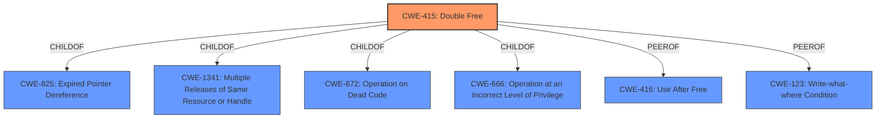

# Analysis for CVE-2020-14123

# Summary
| CWE ID | CWE Name | Confidence | CWE Abstraction Level | CWE Vulnerability Mapping Label | CWE-Vulnerability Mapping Notes |
|---|---|---|---|---|---|
| CWE-415 | Double Free | 1.0 | Variant | Allowed | Primary CWE |

## Evidence and Confidence

*   **Confidence Score:** 1.0
*   **Evidence Strength:** HIGH

## Relationship Analysis
The primary relationship influencing the choice of CWE-415 is its presence as a **weakness** in the vulnerability description. CWE-415 is a variant of several other CWEs including CWE-825 (Expired Pointer Dereference), CWE-1341 (Multiple Releases of Same Resource or Handle), CWE-672 (Operation on Dead Code), and CWE-666 (Operation at an Incorrect Level of Privilege). It also has a peer relationship to CWE-416 (Use After Free) and CWE-123 (Write-what-where Condition). Since the vulnerability description directly states a **double free** condition, CWE-415 is the most specific and appropriate choice.

## Vulnerability Chain
The vulnerability chain starts with a memory pointer being copied to two function modules. A malicious operation causes the pointer to be released repeatedly, leading to a **double free** condition and subsequent crash. This can potentially lead to privilege escalation.

Root Cause: Memory pointer copied to multiple modules.
Weakness: **Double Free** (CWE-415)
Impact: Crash, Potential Elevation of Privileges

## Summary of Analysis
The primary assessment is based on the clear statement of a **double free** vulnerability. The vulnerability description explicitly states that an attacker can cause a pointer to be repeatedly released, resulting in a crash. This aligns directly with the definition of CWE-415.

"There is a pointer **double free** vulnerability in Some MIUI Services. When a function is called, the memory pointer is copied to two function modules, and an attacker can cause the pointer to be repeatedly released through malicious operations, resulting in the affected module crashing and affecting normal functionality, and if successfully exploited the vulnerability can cause elevation of privileges."

The graph relationships show that CWE-415 is a variant with specific characteristics, making it more appropriate than its parent classes. The other CWEs considered from the retriever results such as CWE-364, CWE-252, CWE-362, CWE-824, CWE-822, CWE-123, CWE-476, CWE-908, and CWE-787 do not directly describe the **double free** condition, even though some of them could be related to the root cause or impact of the vulnerability.

CWE-415 is at the optimal level of specificity because it directly addresses the **double free** condition described in the vulnerability.

# Enhanced Query for CVE-2020-14123

## Vulnerability Description
There is a pointer **double free** vulnerability in Some MIUI Services. When a function is called, the memory pointer is copied to two function modules, and an attacker can cause the pointer to be repeatedly released through malicious operations, resulting in the affected module crashing and affecting normal functionality, and if successfully exploited the vulnerability can cause elevation of privileges.

### Vulnerability Description Key Phrases
- **weakness:** **double free**
- **impact:** crash
- **vector:** malicious operations
- **product:** MIUI
- **component:** Some MIUI Services

## Retriever Results

### Top Combined Results

| Rank | CWE ID | Name | Abstraction | Usage  | Retrievers | Individual Scores |
|------|--------|------|-------------|-------|------------|-------------------|
| 1 | 415 | Double Free | Variant | Allowed | sparse | 0.529 |
| 2 | 364 | Signal Handler Race Condition | Base | Allowed | sparse | 0.368 |
| 3 | 252 | Unchecked Return Value | Base | Allowed | sparse | 0.362 |
| 4 | 362 | Concurrent Execution using Shared Resource with Improper Synchronization ('Race Condition') | Class | Allowed-with-Review | sparse | 0.356 |
| 5 | 824 | Access of Uninitialized Pointer | Base | Allowed | sparse | 0.351 |
| 6 | 822 | Untrusted Pointer Dereference | Base | Allowed | dense | 0.569 |
| 7 | 123 | Write-what-where Condition | Base | Allowed | graph | 0.003 |
| 8 | 476 | NULL Pointer Dereference | Base | Allowed | sparse | 0.349 |
| 9 | 908 | Use of Uninitialized Resource | Base | Allowed | sparse | 0.349 |
| 10 | 787 | Out-of-bounds Write | Base | Allowed | sparse | 0.343 |

# Complete CWE Specifications

## CWE-415: Double Free
**Abstraction:** Variant
**Status:** Draft

### Description
The product calls free() twice on the same memory address, potentially leading to modification of unexpected memory locations.

### Extended Description
When a program calls free() twice with the same argument, the program's memory management data structures become corrupted. This corruption can cause the program to crash or, in some circumstances, cause two later calls to malloc() to return the same pointer. If malloc() returns the same value twice and the program later gives the attacker control over the data that is written into this doubly-allocated memory, the program becomes vulnerable to a buffer overflow attack.

### Alternative Terms
Double-free

### Relationships
ChildOf -> CWE-825
ChildOf -> CWE-1341
ChildOf -> CWE-672
ChildOf -> CWE-672
ChildOf -> CWE-672
ChildOf -> CWE-666
PeerOf -> CWE-416
PeerOf -> CWE-123

### Mapping Guidance
**Usage:** Allowed
**Rationale:** This CWE entry is at the Variant level of abstraction, which is a preferred level of abstraction for mapping to the root causes of vulnerabilities.
**Comments:** Carefully read both the name and description to ensure that this mapping is an appropriate fit. Do not try to 'force' a mapping to a lower-level Base/Variant simply to comply with this preferred level of abstraction.
**Reasons:**
- Acceptable-Use

### Additional Notes
**[Relationship]** This is usually resultant from another weakness, such as an unhandled error or race condition between threads. It could also be primary to weaknesses such as buffer overflows.

**[Theoretical]** It could be argued that Double Free would be most appropriately located as a child of "Use after Free", but "Use" and "Release" are considered to be distinct operations within vulnerability theory, therefore this is more accurately "Release of a Resource after Expiration or Release", which doesn't exist yet.

### Observed Examples
- **CVE-2006-5051:** Chain: Signal handler contains too much functionality (CWE-828), introducing a race condition (CWE-362) that leads to a double free (CWE-415).
- **CVE-2004-0642:** Double free resultant from certain error conditions.
- **CVE-2004-0772:** Double free resultant from certain error conditions.

## CWE-364: Signal Handler Race Condition
**Abstraction:** Base
**Status:** Incomplete

### Description
The product uses a signal handler that introduces a race condition.

### Extended Description

Race conditions frequently occur in signal handlers, since signal handlers support asynchronous actions. These race conditions have a variety of root causes and symptoms. Attackers may be able to exploit a signal handler race condition to cause the product state to be corrupted, possibly leading to a denial of service or even code execution.

These issues occur when non-reentrant functions, or state-sensitive actions occur in the signal handler, where they may be called at any time. These behaviors can violate assumptions being made by the "regular" code that is interrupted, or by other signal handlers that may also be invoked. If these functions are called at an inopportune moment - such as while a non-reentrant function is already running - memory corruption could occur that may be exploitable for code execution. Another signal race condition commonly found occurs when free is called within a signal handler, resulting in a double free and therefore a write-what-where condition. Even if a given pointer is set to NULL after it has been freed, a race condition still exists between the time the memory was freed and the pointer was set to NULL. This is especially problematic if the same signal handler has been set for more than one signal -- since it means that the signal handler itself may be reentered.

There are several known behaviors related to signal handlers that have received the label of "signal handler race condition":

  - Shared state (e.g. global data or static variables) that are accessible to both a signal handler and "regular" code

  - Shared state between a signal handler and other signal handlers

  - Use of non-reentrant functionality within a signal handler - which generally implies that shared state is being used. For example, malloc() and free() are non-reentrant because they may use global or static data structures for managing memory, and they are indirectly used by innocent-seeming functions such as syslog(); these functions could be exploited for memory corruption and, possibly, code execution.

  - Association of the same signal handler function with multiple signals - which might imply shared state, since the same code and resources are accessed. For example, this can be a source of double-free and use-after-free weaknesses.

  - Use of setjmp and longjmp, or other mechanisms that prevent a signal handler from returning control back to the original functionality

  - While not technically a race condition, some signal handlers are designed to be called at most once, and being called more than once can introduce security problems, even when there are not any concurrent calls to the signal handler. This can be a source of double-free and use-after-free weaknesses.

Signal handler vulnerabilities are often classified based on the absence of a specific protection mechanism, although this style of classification is discouraged in CWE because programmers often have a choice of several different mechanisms for addressing the weakness. Such protection mechanisms may preserve exclusivity of access to the shared resource, and behavioral atomicity for the relevant code:

  - Avoiding shared state

  - Using synchronization in the signal handler

  - Using synchronization in the regular code

  - Disabling or masking other signals, which provides atomicity (which effectively ensures exclusivity)

### Alternative Terms
None

### Relationships
ChildOf -> CWE-362
CanPrecede -> CWE-415
CanPrecede -> CWE-416
CanPrecede -> CWE-123

### Mapping Guidance
**Usage:** Allowed
**Rationale:** This CWE entry is at the Base level of abstraction, which is a preferred level of abstraction for mapping to the root causes of vulnerabilities.
**Comments:** Carefully read both the name and description to ensure that this mapping is an appropriate fit. Do not try to 'force' a mapping to a lower-level Base/Variant simply to comply with this preferred level of abstraction.
**Reasons:**
- Acceptable-Use

### Observed Examples
- **CVE-1999-0035:** Signal handler does not disable other signal handlers, allowing it to be interrupted, causing other functionality to access files/etc. with raised privileges
- **CVE-2001-0905:** Attacker can send a signal while another signal handler is already running, leading to crash or execution with root privileges
- **CVE-2001-1349:** unsafe calls to library functions from signal handler

## CWE-252: Unchecked Return Value
**Abstraction:** Base
**Status:** Draft

### Description
The product does not check the return value from a method or function, which can prevent it from detecting unexpected states and conditions.

### Extended Description
Two common programmer assumptions are "this function call can never fail" and "it doesn't matter if this function call fails". If an attacker can force the function to fail or otherwise return a value that is not expected, then the subsequent program logic could lead to a vulnerability, because the product is not in a state that the programmer assumes. For example, if the program calls a function to drop privileges but does not check the return code to ensure that privileges were successfully dropped, then the program will continue to operate with the higher privileges.

### Alternative Terms
None

### Relationships
ChildOf -> CWE-754
ChildOf -> CWE-754
CanPrecede -> CWE-476

### Mapping Guidance
**Usage:** Allowed
**Rationale:** This CWE entry is at the Base level of abstraction, which is a preferred level of abstraction for mapping to the root causes of vulnerabilities.
**Comments:** Carefully read both the name and description to ensure that this mapping is an appropriate fit. Do not try to 'force' a mapping to a lower-level Base/Variant simply to comply with this preferred level of abstraction.
**Reasons:**
- Acceptable-Use

### Observed Examples
- **CVE-2020-17533:** Chain: unchecked return value (CWE-252) of some functions for policy enforcement leads to authorization bypass (CWE-862)
- **CVE-2020-6078:** Chain: The return value of a function returning a pointer is not checked for success (CWE-252) resulting in the later use of an uninitialized variable (CWE-456) and a null pointer dereference (CWE-476)
- **CVE-2019-15900:** Chain: sscanf() call is used to check if a username and group exists, but the return value of sscanf() call is not checked (CWE-252), causing an uninitialized variable to be checked (CWE-457), returning success to allow authorization bypass for executing a privileged (CWE-863).

## CWE-362: Concurrent Execution using Shared Resource with Improper Synchronization ('Race Condition')
**Abstraction:** Class
**Status:** Draft

### Description
The product contains a concurrent code sequence that requires temporary, exclusive access to a shared resource, but a timing window exists in which the shared resource can be modified by another code sequence operating concurrently.

### Extended Description

A race condition occurs within concurrent environments, and it is effectively a property of a code sequence. Depending on the context, a code sequence may be in the form of a function call, a small number of instructions, a series of program invocations, etc.

A race condition violates these properties, which are closely related:

  - Exclusivity - the code sequence is given exclusive access to the shared resource, i.e., no other code sequence can modify properties of the shared resource before the original sequence has completed execution.

  - Atomicity - the code sequence is behaviorally atomic, i.e., no other thread or process can concurrently execute the same sequence of instructions (or a subset) against the same resource.

A race condition exists when an "interfering code sequence" can still access the shared resource, violating exclusivity.

The interfering code sequence could be "trusted" or "untrusted." A trusted interfering code sequence occurs within the product; it cannot be modified by the attacker, and it can only be invoked indirectly. An untrusted interfering code sequence can be authored directly by the attacker, and typically it is external to the vulnerable product.

### Alternative Terms
Race Condition

### Relationships
ChildOf -> CWE-691
CanPrecede -> CWE-416
CanPrecede -> CWE-476

### Mapping Guidance
**Usage:** Allowed-with-Review
**Rationale:** This CWE entry is a Class and might have Base-level children that would be more appropriate
**Comments:** Examine children of this entry to see if there is a better fit
**Reasons:**
- Abstraction

### Additional Notes
**[Maintenance]** The relationship between race conditions and synchronization problems (CWE-662) needs to be further developed. They are not necessarily two perspectives of the same core concept, since synchronization is only one technique for avoiding race conditions, and synchronization can be used for other purposes besides race condition prevention.

**[Research Gap]** Race conditions in web applications are under-studied and probably under-reported. However, in 2008 there has been growing interest in this area.

**[Research Gap]** Much of the focus of race condition research has been in Time-of-check Time-of-use (TOCTOU) variants (CWE-367), but many race conditions are related to synchronization problems that do not necessarily require a time-of-check.

**[Research Gap]** From a classification/taxonomy perspective, the relationships between concurrency and program state need closer investigation and may be useful in organizing related issues.

### Observed Examples
- **CVE-2022-29527:** Go application for cloud management creates a world-writable sudoers file that allows local attackers to inject sudo rules and escalate privileges to root by winning a race condition.
- **CVE-2021-1782:** Chain: improper locking (CWE-667) leads to race condition (CWE-362), as exploited in the wild per CISA KEV.
- **CVE-2021-0920:** Chain: mobile platform race condition (CWE-362) leading to use-after-free (CWE-416), as exploited in the wild per CISA KEV.

## CWE-824: Access of Uninitialized Pointer
**Abstraction:** Base
**Status:** Incomplete

### Description
The product accesses or uses a pointer that has not been initialized.

### Extended Description

If the pointer contains an uninitialized value, then the value might not point to a valid memory location. This could cause the product to read from or write to unexpected memory locations, leading to a denial of service. If the uninitialized pointer is used as a function call, then arbitrary functions could be invoked. If an attacker can influence the portion of uninitialized memory that is contained in the pointer, this weakness could be leveraged to execute code or perform other attacks.

Depending on memory layout, associated memory management behaviors, and product operation, the attacker might be able to influence the contents of the uninitialized pointer, thus gaining more fine-grained control of the memory location to be accessed.

### Alternative Terms
None

### Relationships
ChildOf -> CWE-119
ChildOf -> CWE-119
ChildOf -> CWE-119
ChildOf -> CWE-119
CanPrecede -> CWE-125
CanPrecede -> CWE-787

### Mapping Guidance
**Usage:** Allowed
**Rationale:** This CWE entry is at the Base level of abstraction, which is a preferred level of abstraction for mapping to the root causes of vulnerabilities.
**Comments:** Carefully read both the name and description to ensure that this mapping is an appropriate fit. Do not try to 'force' a mapping to a lower-level Base/Variant simply to comply with this preferred level of abstraction.
**Reasons:**
- Acceptable-Use

### Additional Notes
**[Maintenance]** There are close relationships between incorrect pointer dereferences and other weaknesses related to buffer operations. There may not be sufficient community agreement regarding these relationships. Further study is needed to determine when these relationships are chains, composites, perspective/layering, or other types of relationships. As of September 2010, most of the relationships are being captured as chains.

**[Terminology]** Many weaknesses related to pointer dereferences fall under the general term of "memory corruption" or "memory safety." As of September 2010, there is no commonly-used terminology that covers the lower-level variants.

### Observed Examples
- **CVE-2024-32878:** LLM product has a free of an uninitialized pointer
- **CVE-2010-0211:** chain: unchecked return value (CWE-252) leads to free of invalid, uninitialized pointer (CWE-824).
- **CVE-2009-2768:** Pointer in structure is not initialized, leading to NULL pointer dereference (CWE-476) and system crash.

## CWE-822: Untrusted Pointer Dereference
**Abstraction:** Base
**Status:** Incomplete

### Description
The product obtains a value from an untrusted source, converts this value to a pointer, and dereferences the resulting pointer.

### Extended Description

An attacker can supply a pointer for memory locations that the product is not expecting. If the pointer is dereferenced for a write operation, the attack might allow modification of critical state variables, cause a crash, or execute code. If the dereferencing operation is for a read, then the attack might allow reading of sensitive data, cause a crash, or set a variable to an unexpected value (since the value will be read from an unexpected memory location).

There are several variants of this weakness, including but not necessarily limited to:

  - The untrusted value is directly invoked as a function call.

  - In OS kernels or drivers where there is a boundary between "userland" and privileged memory spaces, an untrusted pointer might enter through an API or system call (see CWE-781 for one such example).

  - Inadvertently accepting the value from an untrusted control sphere when it did not have to be accepted as input at all. This might occur when the code was originally developed to be run by a single user in a non-networked environment, and the code is then ported to or otherwise exposed to a networked environment.

### Alternative Terms
None

### Relationships
ChildOf -> CWE-119
ChildOf -> CWE-119
ChildOf -> CWE-119
CanPrecede -> CWE-125
CanPrecede -> CWE-787

### Mapping Guidance
**Usage:** Allowed
**Rationale:** This CWE entry is at the Base level of abstraction, which is a preferred level of abstraction for mapping to the root causes of vulnerabilities.
**Comments:** Carefully read both the name and description to ensure that this mapping is an appropriate fit. Do not try to 'force' a mapping to a lower-level Base/Variant simply to comply with this preferred level of abstraction.
**Reasons:**
- Acceptable-Use

### Additional Notes
**[Maintenance]** There are close relationships between incorrect pointer dereferences and other weaknesses related to buffer operations. There may not be sufficient community agreement regarding these relationships. Further study is needed to determine when these relationships are chains, composites, perspective/layering, or other types of relationships. As of September 2010, most of the relationships are being captured as chains.

**[Terminology]** Many weaknesses related to pointer dereferences fall under the general term of "memory corruption" or "memory safety." As of September 2010, there is no commonly-used terminology that covers the lower-level variants.

### Observed Examples
- **CVE-2007-5655:** message-passing framework interprets values in packets as pointers, causing a crash.
- **CVE-2010-2299:** labeled as a "type confusion" issue, also referred to as a "stale pointer." However, the bug ID says "contents are simply interpreted as a pointer... renderer ordinarily doesn't supply this pointer directly". The "handle" in the untrusted area is replaced in one function, but not another - thus also, effectively, exposure to wrong sphere (CWE-668).
- **CVE-2009-1719:** Untrusted dereference using undocumented constructor.

## CWE-123: Write-what-where Condition
**Abstraction:** Base
**Status:** Draft

### Description
Any condition where the attacker has the ability to write an arbitrary value to an arbitrary location, often as the result of a buffer overflow.

### Extended Description
Not provided

### Alternative Terms
None

### Relationships
ChildOf -> CWE-787
ChildOf -> CWE-119
ChildOf -> CWE-119

### Mapping Guidance
**Usage:** Allowed
**Rationale:** This CWE entry is at the Base level of abstraction, which is a preferred level of abstraction for mapping to the root causes of vulnerabilities.
**Comments:** Carefully read both the name and description to ensure that this mapping is an appropriate fit. Do not try to 'force' a mapping to a lower-level Base/Variant simply to comply with this preferred level of abstraction.
**Reasons:**
- Acceptable-Use

### Observed Examples
- **CVE-2022-21668:** Chain: Python library does not limit the resources used to process images that specify a very large number of bands (CWE-1284), leading to excessive memory consumption (CWE-789) or an integer overflow (CWE-190).
- **CVE-2022-0545:** Chain: 3D renderer has an integer overflow (CWE-190) leading to write-what-where condition (CWE-123) using a crafted image.

## CWE-476: NULL Pointer Dereference
**Abstraction:** Base
**Status:** Stable

### Description
The product dereferences a pointer that it expects to be valid but is NULL.

### Extended Description
Not provided

### Alternative Terms
NPD: Common abbreviation for Null Pointer Dereference
null deref: Common abbreviation for Null Pointer Dereference
NPE: Common abbreviation for Null Pointer Exception
nil pointer dereference: used for access of nil in Go programs

### Relationships
ChildOf -> CWE-710
ChildOf -> CWE-754
ChildOf -> CWE-754

### Mapping Guidance
**Usage:** Allowed
**Rationale:** This CWE entry is at the Base level of abstraction, which is a preferred level of abstraction for mapping to the root causes of vulnerabilities.
**Comments:** Carefully read both the name and description to ensure that this mapping is an appropriate fit. Do not try to 'force' a mapping to a lower-level Base/Variant simply to comply with this preferred level of abstraction.
**Reasons:**
- Acceptable-Use

### Observed Examples
- **CVE-2005-3274:** race condition causes a table to be corrupted if a timer activates while it is being modified, leading to resultant NULL dereference; also involves locking.
- **CVE-2002-1912:** large number of packets leads to NULL dereference
- **CVE-2005-0772:** packet with invalid error status value triggers NULL dereference

## CWE-908: Use of Uninitialized Resource
**Abstraction:** Base
**Status:** Incomplete

### Description
The product uses or accesses a resource that has not been initialized.

### Extended Description
When a resource has not been properly initialized, the product may behave unexpectedly. This may lead to a crash or invalid memory access, but the consequences vary depending on the type of resource and how it is used within the product.

### Alternative Terms
None

### Relationships
ChildOf -> CWE-665
ChildOf -> CWE-665

### Mapping Guidance
**Usage:** Allowed
**Rationale:** This CWE entry is at the Base level of abstraction, which is a preferred level of abstraction for mapping to the root causes of vulnerabilities.
**Comments:** Carefully read both the name and description to ensure that this mapping is an appropriate fit. Do not try to 'force' a mapping to a lower-level Base/Variant simply to comply with this preferred level of abstraction.
**Reasons:**
- Acceptable-Use

### Observed Examples
- **CVE-2019-9805:** Chain: Creation of the packet client occurs before initialization is complete (CWE-696) resulting in a read from uninitialized memory (CWE-908), causing memory corruption.
- **CVE-2008-4197:** Use of uninitialized memory may allow code execution.
- **CVE-2008-2934:** Free of an uninitialized pointer leads to crash and possible code execution.

## CWE-787: Out-of-bounds Write
**Abstraction:** Base
**Status:** Draft

### Description
The product writes data past the end, or before the beginning, of the intended buffer.

### Extended Description
Not provided

### Alternative Terms
Memory Corruption: Often used to describe the consequences of writing to memory outside the bounds of a buffer, or to memory that is otherwise invalid.

### Relationships
ChildOf -> CWE-119
ChildOf -> CWE-119
ChildOf -> CWE-119
ChildOf -> CWE-119

### Mapping Guidance
**Usage:** Allowed
**Rationale:** This CWE entry is at the Base level of abstraction, which is a preferred level of abstraction for mapping to the root causes of vulnerabilities.
**Comments:** Carefully read both the name and description to ensure that this mapping is an appropriate fit. Do not try to 'force' a mapping to a lower-level Base/Variant simply to comply with this preferred level of abstraction.
**Reasons:**
- Acceptable-Use

### Observed Examples
- **CVE-2023-1017:** The reference implementation code for a Trusted Platform Module does not implement length checks on data, allowing for an attacker to write 2 bytes past the end of a buffer.
- **CVE-2021-21220:** Chain: insufficient input validation (CWE-20) in browser allows heap corruption (CWE-787), as exploited in the wild per CISA KEV.
- **CVE-2021-28664:** GPU kernel driver allows memory corruption because a user can obtain read/write access to read-only pages, as exploited in the wild per CISA KEV.

