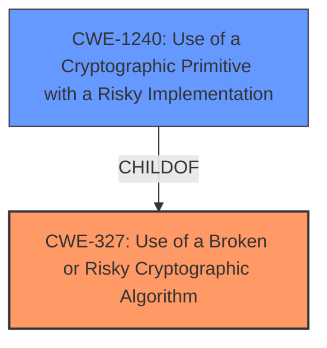

# Analysis Report for CVE-2020-14263

# Vulnerability Analysis Report: CVE-2020-14263

## Description


## Analysis (with Relationship Data)

# Summary
| CWE ID | CWE Name | Confidence | CWE Abstraction Level | CWE Vulnerability Mapping Label | CWE-Vulnerability Mapping Notes |
|---|---|---|---|---|---|
| CWE-327 | Use of a Broken or Risky Cryptographic Algorithm | 0.9 | Class | Primary | Allowed-with-Review |
| CWE-1240 | Use of a Cryptographic Primitive with a Risky Implementation | 0.7 | Base | Secondary | Allowed |

## Evidence and Confidence

*   **Confidence Score:** 0.8
*   **Evidence Strength:** MEDIUM

## Relationship Analysis
The primary CWE is CWE-327, which is a Class-level CWE. CWE-1240 is a ChildOf CWE-327 and represents a more specific case of using a risky cryptographic algorithm. While a more specific CWE is preferred, the description provided does not give sufficient details to ensure CWE-1240 is a good fit.



## Vulnerability Chain
The chain of root cause and weaknesses that followed for the Vulnerability Description:
  - **Root Cause:** **Weak cryptographic process**
  - **Weakness:** Use of a Broken or Risky Cryptographic Algorithm (CWE-327)
  - **Impact:** Vulnerability in HCL Traveler Companion due to the MobileIron AppConnect SDK

## Summary of Analysis
The initial analysis identified CWE-327 as the primary CWE based on the vulnerability description, which mentions a **weak cryptographic process**. The retriever results also list CWE-327 as the top candidate. The relationship analysis shows that CWE-1240 is a child of CWE-327, representing a more specific case. However, without more details, mapping to CWE-1240 is less certain.

The final decision is to map the vulnerability to CWE-327 as the primary CWE due to its direct relevance to the **weak cryptographic process**. I have added CWE-1240 as a secondary candidate.

Relevant CWE Information:

# Enhanced Context (25 CWEs)
The following CWEs were identified as potentially relevant to this vulnerability:

## CWE-1240: Use of a Cryptographic Primitive with a Risky Implementation
**Abstraction Level**: Base
**Similarity Score**: 0.79
**Source**: dense

**Description**:
To fulfill the need for a cryptographic primitive, the product implements a cryptographic algorithm using a non-standard, unproven, or disallowed/non-compliant cryptographic implementation.

**Mapping Guidance**:
- Usage: Allowed
- Rationale: This CWE entry is at the Base level of abstraction, which is a preferred level of abstraction for mapping to the root causes of vulnerabilities.


## CWE-916: Use of Password Hash With Insufficient Computational Effort
**Abstraction Level**: Base
**Similarity Score**: 0.78
**Source**: dense

**Description**:
The product generates a hash for a password, but it uses a scheme that does not provide a sufficient level of computational effort that would make password cracking attacks infeasible or expensive.

**Mapping Guidance**:
- Usage: Allowed
- Rationale: This CWE entry is at the Base level of abstraction, which is a preferred level of abstraction for mapping to the root causes of vulnerabilities.


## CWE-328: Use of Weak Hash
**Abstraction Level**: Base
**Similarity Score**: 0.78
**Source**: dense

**Description**:
The product uses an algorithm that produces a digest (output value) that does not meet security expectations for a hash function that allows an adversary to reasonably determine the original input (preimage attack), find another input that can produce the same hash (2nd preimage attack), or find multiple inputs that evaluate to the same hash (birthday attack).

**Mapping Guidance**:
- Usage: Allowed
- Rationale: This CWE entry is at the Base level of abstraction, which is a preferred level of abstraction for mapping to the root causes of vulnerabilities.


## CWE-1391: Use of Weak Credentials
**Abstraction Level**: Class
**Similarity Score**: 0.76
**Source**: dense

**Description**:
The product uses weak credentials (such as a default key or hard-coded password) that can be calculated, derived, reused, or guessed by an attacker.

**Mapping Guidance**:
- Usage: Allowed-with-Review
- Rationale: This CWE entry is a Class and might have Base-level children that would be more appropriate


## CWE-345: Insufficient Verification of Data Authenticity
**Abstraction Level**: Class
**Similarity Score**: 0.76
**Source**: dense

**Description**:
The product does not sufficiently verify the origin or authenticity of data, in a way that causes it to accept invalid data.

**Mapping Guidance**:
- Usage: Discouraged
- Rationale: This CWE entry is a level-1 Class (i.e., a child of a Pillar). It might have lower-level children that would be more appropriate


## CWE-330: Use of Insufficiently Random Values
**Abstraction Level**: Class
**Similarity Score**: 0.76
**Source**: dense

**Description**:
The product uses insufficiently random numbers or values in a security context that depends on unpredictable numbers.

**Mapping Guidance**:
- Usage: Discouraged
- Rationale: This CWE entry is a level-1 Class (i.e., a child of a Pillar). It might have lower-level children that would be more appropriate


## CWE-331: Insufficient Entropy
**Abstraction Level**: Base
**Similarity Score**: 0.75
**Source**: dense

**Description**:
The product uses an algorithm or scheme that produces insufficient entropy, leaving patterns or clusters of values that are more likely to occur than others.

**Mapping Guidance**:
- Usage: Allowed
- Rationale: This CWE entry is at the Base level of abstraction, which is a preferred level of abstraction for mapping to the root causes of vulnerabilities.


## CWE-312: Cleartext Storage of Sensitive Information
**Abstraction Level**: Base
**Similarity Score**: 0.75
**Source**: dense

**Description**:
The product stores sensitive information in cleartext within a resource that might be accessible to another control sphere.

**Mapping Guidance**:
- Usage: Allowed
- Rationale: This CWE entry is at the Base level of abstraction, which is a preferred level of abstraction for mapping to the root causes of vulnerabilities.


## CWE-208: Observable Timing Discrepancy
**Abstraction Level**: Base
**Similarity Score**: 0.74
**Source**: dense

**Description**:
Two separate operations in a product require different amounts of time to complete, in a way that is observable to an actor and reveals security-relevant information about the state of the product, such as whether a particular operation was successful or not.

**Mapping Guidance**:
- Usage: Allowed
- Rationale: This CWE entry is at the Base level of abstraction, which is a preferred level of abstraction for mapping to the root causes of vulnerabilities.


## CWE-319: Cleartext Transmission of Sensitive Information
**Abstraction Level**: Base
**Similarity Score**: 0.74
**Source**: dense

**Description**:
The product transmits sensitive or security-critical data in cleartext in a communication channel that can be sniffed by unauthorized actors.

**Mapping Guidance**:
- Usage: Allowed
- Rationale: This CWE entry is at the Base level of abstraction, which is a preferred level of abstraction for mapping to the root causes of vulnerabilities.


## CWE-1240: Use of a Cryptographic Primitive with a Risky Implementation
**Abstraction Level**: Base
**Similarity Score**: 8653.72
**Source**: sparse

**Description**:
To fulfill the need for a cryptographic primitive, the product implements a cryptographic algorithm using a non-standard, unproven, or disallowed/non-compliant cryptographic implementation.

**Mapping Guidance**:
- Usage: Allowed
- Rationale: This CWE entry is at the Base level of abstraction, which is a preferred level of abstraction for mapping to the root causes of vulnerabilities.


## CWE-916: Use of Password Hash With Insufficient Computational Effort
**Abstraction Level**: Base
**Similarity Score**: 7680.34
**Source**: sparse

**Description**:
The product generates a hash for a password, but it uses a scheme that does not provide a sufficient level of computational effort that would make password cracking attacks infeasible or expensive.

**Mapping Guidance**:
- Usage: Allowed
- Rationale: This CWE entry is at the Base level of abstraction, which is a preferred level of abstraction for mapping to the root causes of vulnerabilities.


## CWE-327: Use of a Broken or Risky Cryptographic Algorithm
**Abstraction Level**: Class
**Similarity Score**: 7379.57
**Source**:


## CWE Relationship Analysis

Current CWEs represent these abstraction levels: .


### Vulnerability Chain Analysis

**Chain starting from CWE-916:**
- 916 (Use of Password Hash With Insufficient Computational Effort) - ROOT


**Chain starting from CWE-208:**
- 208 (Observable Timing Discrepancy) - ROOT


### CWE Relationship Diagram

```mermaid
graph TD
    classDef primary fill:#f96,stroke:#333,stroke-width:2px
    classDef secondary fill:#69f,stroke:#333
    classDef tertiary fill:#9e9,stroke:#333
```


*Report generated on 2025-04-02 06:36:35*
