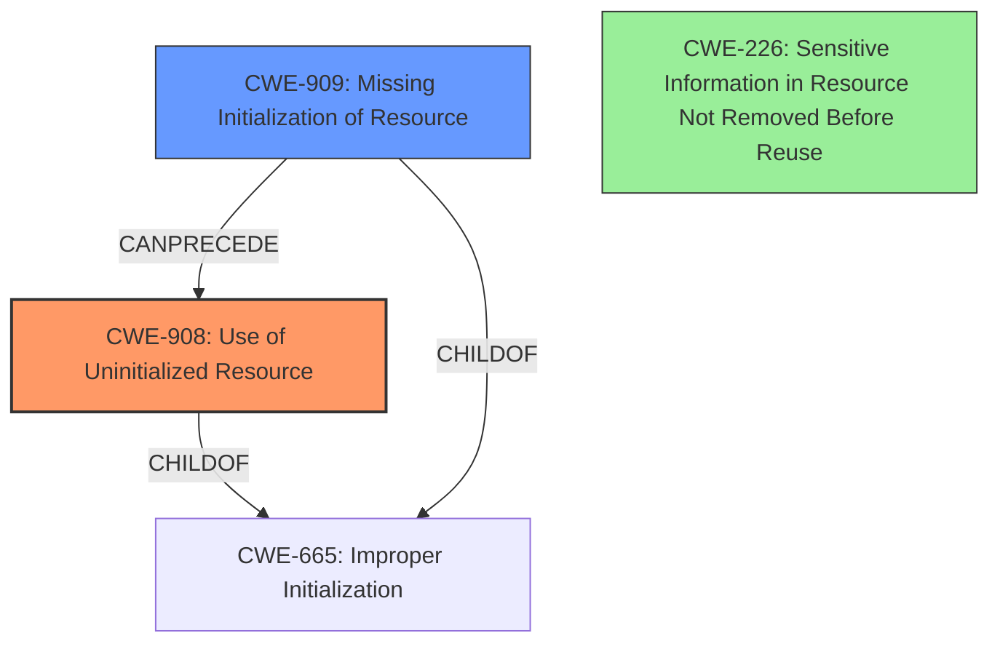

# Analysis for CVE-2020-14304

# Summary
| CWE ID  | CWE Name                                 | Confidence | CWE Abstraction Level | CWE Vulnerability Mapping Label | CWE-Vulnerability Mapping Notes |
| :-------- | :--------------------------------------- | :--------- | :-------------------- | :------------------------------ | :------------------------------ |
| CWE-908 | Use of Uninitialized Resource          | 0.9        | Base                  | Primary                         | Allowed                       |
| CWE-226 | Sensitive Information in Resource Not Removed Before Reuse | 0.7        | Base                  | Secondary                       | Allowed                       |

## Evidence and Confidence

*   **Confidence Score:** 0.9
*   **Evidence Strength:** HIGH

## Relationship Analysis
The primary CWE is CWE-908 (Use of Uninitialized Resource), which is a Base-level CWE. The analysis also considered CWE-909 (Missing Initialization of Resource) which is a Class-level CWE and a parent of CWE-908. Since the description explicitly mentions reading **uninitialized values**, using an uninitialized resource is more precise than simply stating that the resource wasn't initialized. Also, CWE-226 (Sensitive Information in Resource Not Removed Before Reuse) was considered as a secondary CWE because reading uninitialized memory could disclose sensitive information left over from previous operations.

## Vulnerability Chain
The vulnerability chain begins with the kernel's ethernet driver failing to properly handle errors when reading from the EEPROM, leading to the exposure of **uninitialized values** in kernel memory.
  - **Root Cause:** **Improper error handling** within the `mlx4_en_get_module_eeprom` function in the Linux kernel's Mellanox mlx4_en driver.
  - **Weakness:** Use of Uninitialized Resource (CWE-908) - The function returns an uninitialized or partially initialized buffer.
  - **Impact:** Information Disclosure (Memory Leak) - A local user can read uninitialized kernel memory, potentially exposing sensitive data.

## Summary of Analysis
The analysis is primarily based on the provided vulnerability description, specifically the phrase "**read uninitialized values**" and the CVE Reference Links Content Summary mentioning that the function returns an uninitialized or partially initialized buffer. This directly aligns with CWE-908 (Use of Uninitialized Resource). The retriever results also listed CWE-908 as a highly relevant CWE. While other CWEs like CWE-909 (Missing Initialization of Resource) were considered, CWE-908 is a more precise description of the **weakness**, as it focuses on the *use* of an uninitialized resource, rather than just the absence of initialization.

CWE-226 was considered as a secondary weakness since reading uninitialized memory can result in the disclosure of sensitive information.

The selection of CWE-908 is at the optimal level of specificity because it's a Base-level CWE that accurately captures the vulnerability's root cause.

Relevant CWE Information:

# Enhanced Context (25 CWEs)

## CWE-824: Access of Uninitialized Pointer
**Abstraction Level**: Base
**Similarity Score**: 0.79
**Source**: dense

**Description**:
The product accesses or uses a pointer that has not been initialized.

**Mapping Guidance**:
- Usage: Allowed
- Rationale: This CWE entry is at the Base level of abstraction, which is a preferred level of abstraction for mapping to the root causes of vulnerabilities.

## CWE-822: Untrusted Pointer Dereference
**Abstraction Level**: Base
**Similarity Score**: 0.79
**Source**: dense

**Description**:
The product obtains a value from an untrusted source, converts this value to a pointer, and dereferences the resulting pointer.

**Mapping Guidance**:
- Usage: Allowed
- Rationale: This CWE entry is at the Base level of abstraction, which is a preferred level of abstraction for mapping to the root causes of vulnerabilities.

## CWE-823: Use of Out-of-range Pointer Offset
**Abstraction Level**: Base
**Similarity Score**: 0.79
**Source**: dense

**Description**:
The product performs pointer arithmetic on a valid pointer, but it uses an offset that can point outside of the intended range of valid memory locations for the resulting pointer.

**Mapping Guidance**:
- Usage: Allowed
- Rationale: This CWE entry is at the Base level of abstraction, which is a preferred level of abstraction for mapping to the root causes of vulnerabilities.

## CWE-476: NULL Pointer Dereference
**Abstraction Level**: Base
**Similarity Score**: 0.78
**Source**: dense

**Description**:
The product dereferences a pointer that it expects to be valid but is NULL.

**Mapping Guidance**:
- Usage: Allowed
- Rationale: This CWE entry is at the Base level of abstraction, which is a preferred level of abstraction for mapping to the root causes of vulnerabilities.

## CWE-191: Integer Underflow (Wrap or Wraparound)
**Abstraction Level**: Base
**Similarity Score**: 0.78
**Source**: dense

**Description**:
The product subtracts one value from another, such that the result is less than the minimum allowable integer value, which produces a value that is not equal to the correct result.

**Mapping Guidance**:
- Usage: Allowed
- Rationale: This CWE entry is at the Base level of abstraction, which is a preferred level of abstraction for mapping to the root causes of vulnerabilities.

## CWE-226: Sensitive Information in Resource Not Removed Before Reuse
**Abstraction Level**: Base
**Similarity Score**: 0.78
**Source**: dense

**Description**:
The product releases a resource such as memory or a file so that it can be made available for reuse, but it does not clear or "zeroize" the information contained in the resource before the product performs a critical state transition or makes the resource available for reuse by other entities.

**Mapping Guidance**:
- Usage: Allowed
- Rationale: This CWE entry is at the Base level of abstraction, which is a preferred level of abstraction for mapping to the root causes of vulnerabilities.

## CWE-909: Missing Initialization of Resource
**Abstraction Level**: Class
**Similarity Score**: 0.78
**Source**: dense

**Description**:
The product does not initialize a critical resource.

**Mapping Guidance**:
- Usage: Allowed-with-Review
- Rationale: This CWE entry is a Class and might have Base-level children that would be more appropriate

## CWE-805: Buffer Access with Incorrect Length Value
**Abstraction Level**: Base
**Similarity Score**: 0.78
**Source**: dense

**Description**:
The product uses a sequential operation to read or write a buffer, but it uses an incorrect length value that causes it to access memory that is outside of the bounds of the buffer.

**Mapping Guidance**:
- Usage: Allowed
- Rationale: This CWE entry is at the Base level of abstraction, which is a preferred level of abstraction for mapping to the root causes of vulnerabilities.

## CWE-908: Use of Uninitialized Resource
**Abstraction Level**: Base
**Similarity Score**: 0.77
**Source**: dense

**Description**:
The product uses or accesses a resource that has not been initialized.

**Mapping Guidance**:
- Usage: Allowed
- Rationale: This CWE entry is at the Base level of abstraction, which is a preferred level of abstraction for mapping to the root causes of vulnerabilities.

## CWE-667: Improper Locking
**Abstraction Level**: Class
**Similarity Score**: 0.77
**Source**: dense

**Description**:
The product does not properly acquire or release a lock on a resource, leading to unexpected resource state changes and behaviors.

**Mapping Guidance**:
- Usage: Allowed-with-Review
- Rationale: This CWE entry is a Class and might have Base-level children that would be more appropriate

## CWE-822: Untrusted Pointer Dereference
**Abstraction Level**: Base
**Similarity Score**: 5713.36
**Source**: sparse

**Description**:
The product obtains a value from an untrusted source, converts this value to a pointer, and dereferences the resulting pointer.

**Mapping Guidance**:
- Usage: Allowed
- Rationale: This CWE entry is at the Base level of abstraction, which is a preferred level of abstraction for mapping to the root causes of vulnerabilities.

## CWE-252: Un

# Enhanced Query for CVE-2020-14304

## Vulnerability Description
A memory disclosure flaw was found in the Linux kernels ethernet drivers, in the way it read data from the EEPROM of the device. This flaw allows a local user to **read uninitialized values** from the kernel memory. The highest threat from this vulnerability is to confidentiality.

### Vulnerability Description Key Phrases
- **weakness:** **read uninitialized values**
- **impact:** memory disclosure
- **attacker:** local user
- **product:** Linux kernels
- **component:** ethernet drivers

## CVE Reference Links Content Summary
Based on the provided information, here's a breakdown of the vulnerability:

**Root cause of vulnerability:**
- The `mlx4_en_get_module_eeprom` function in the Linux kernel's Mellanox mlx4_en driver does not properly handle errors when reading the EEPROM of a network module. Specifically, it was returning 0 (success) even when `mlx4_get_module_info` failed.
- When the function failed to read the EEPROM, it would return an uninitialized or partially initialized buffer to the user.

**Weaknesses/vulnerabilities present:**
- **Memory Leak (Information Disclosure):** A local user could potentially read uninitialized kernel memory by using `ethtool` to access the EEPROM of a device via the `mlx4_en` driver.
- The issue is that the function is returning success even if `mlx4_get_module_info` fails, and does not return an error code to the user.

**Impact of exploitation:**
- **Confidentiality:** A local attacker could potentially read sensitive data from kernel memory. The data that can be read is limited to the memory area used by the driver, and the attacker has no control over the location or content that is read.
- The vulnerability does **not** affect availability or allow other higher-impact attacks.

**Attack vectors:**
- A local user needs to run the `ethtool` command with the `-m` or `-e` options to read EEPROM data for a Mellanox network device.

**Required attacker capabilities/position:**
- The attacker needs to have root access on the system to use `ethtool` with the necessary parameters.
- The vulnerability exists in the Linux kernel and specific network drivers so the attack has to be carried out on a system with a vulnerable driver.

**Additional notes:**
- The original Debian bug report indicates that the issue is that `ethtool` reports different values depending on if its output is redirected, and it was suspected that this was due to the mlx4 driver returning garbage data.
- A patch was proposed which would return an error if the reading of the EEPROM failed. However, it was determined that the function was already clearing the buffer before attempting to read the EEPROM, making the patch unnecessary.
- The issue was rated as having low impact, because it is limited to reading some of the values from the memory of some particular drivers with limited kernel stack exposure.
- This bug is marked as `WONTFIX` in the Red Hat Bugzilla.

## Retriever Results

### Top Combined Results

| Rank | CWE ID | Name | Abstraction | Usage  | Retrievers | Individual Scores |
|------|--------|------|-------------|-------|------------|-------------------|
| 1 | 392 | Missing Report of Error Condition | Base | Allowed | sparse | 0.408 |
| 2 | 824 | Access of Uninitialized Pointer | Base | Allowed | sparse | 0.360 |
| 3 | 909 | Missing Initialization of Resource | Class | Allowed-with-Review | sparse | 0.347 |
| 4 | 908 | Use of Uninitialized Resource | Base | Allowed | sparse | 0.332 |
| 5 | 401 | Missing Release of Memory after Effective Lifetime | Variant | Allowed | sparse | 0.316 |
| 6 | 1256 | Improper Restriction of Software Interfaces to Hardware Features | Base | Allowed | dense | 0.603 |
| 7 | 787 | Out-of-bounds Write | Base | Allowed | graph | 0.002 |
| 8 | 822 | Untrusted Pointer Dereference | Base | Allowed | sparse | 0.313 |
| 9 | 476 | NULL Pointer Dereference | Base | Allowed | sparse | 0.312 |
| 10 | 125 | Out-of-bounds Read | Base | Allowed | sparse | 0.312 |

# Complete CWE Specifications

## CWE-392: Missing Report of Error Condition
**Abstraction:** Base
**Status:** Draft

### Description
The product encounters an error but does not provide a status code or return value to indicate that an error has occurred.

### Extended Description
Not provided

### Alternative Terms
None

### Relationships
ChildOf -> CWE-755
ChildOf -> CWE-684
ChildOf -> CWE-703
ChildOf -> CWE-703

### Mapping Guidance
**Usage:** Allowed
**Rationale:** This CWE entry is at the Base level of abstraction, which is a preferred level of abstraction for mapping to the root causes of vulnerabilities.
**Comments:** Carefully read both the name and description to ensure that this mapping is an appropriate fit. Do not try to 'force' a mapping to a lower-level Base/Variant simply to comply with this preferred level of abstraction.
**Reasons:**
- Acceptable-Use

### Observed Examples
- **[REF-1374]:** Chain: JavaScript-based cryptocurrency library can fall back to the insecure Math.random() function instead of reporting a failure (CWE-392), thus reducing the entropy (CWE-332) and leading to generation of non-unique cryptographic keys for Bitcoin wallets (CWE-1391)
- **CVE-2004-0063:** Function returns "OK" even if another function returns a different status code than expected, leading to accepting an invalid PIN number.
- **CVE-2002-1446:** Error checking routine in PKCS#11 library returns "OK" status even when invalid signature is detected, allowing spoofed messages.

## CWE-824: Access of Uninitialized Pointer
**Abstraction:** Base
**Status:** Incomplete

### Description
The product accesses or uses a pointer that has not been initialized.

### Extended Description

If the pointer contains an uninitialized value, then the value might not point to a valid memory location. This could cause the product to read from or write to unexpected memory locations, leading to a denial of service. If the uninitialized pointer is used as a function call, then arbitrary functions could be invoked. If an attacker can influence the portion of uninitialized memory that is contained in the pointer, this weakness could be leveraged to execute code or perform other attacks.

Depending on memory layout, associated memory management behaviors, and product operation, the attacker might be able to influence the contents of the uninitialized pointer, thus gaining more fine-grained control of the memory location to be accessed.

### Alternative Terms
None

### Relationships
ChildOf -> CWE-119
ChildOf -> CWE-119
ChildOf -> CWE-119
ChildOf -> CWE-119
CanPrecede -> CWE-125
CanPrecede -> CWE-787

### Mapping Guidance
**Usage:** Allowed
**Rationale:** This CWE entry is at the Base level of abstraction, which is a preferred level of abstraction for mapping to the root causes of vulnerabilities.
**Comments:** Carefully read both the name and description to ensure that this mapping is an appropriate fit. Do not try to 'force' a mapping to a lower-level Base/Variant simply to comply with this preferred level of abstraction.
**Reasons:**
- Acceptable-Use

### Additional Notes
**[Maintenance]** There are close relationships between incorrect pointer dereferences and other weaknesses related to buffer operations. There may not be sufficient community agreement regarding these relationships. Further study is needed to determine when these relationships are chains, composites, perspective/layering, or other types of relationships. As of September 2010, most of the relationships are being captured as chains.

**[Terminology]** Many weaknesses related to pointer dereferences fall under the general term of "memory corruption" or "memory safety." As of September 2010, there is no commonly-used terminology that covers the lower-level variants.

### Observed Examples
- **CVE-2024-32878:** LLM product has a free of an uninitialized pointer
- **CVE-2010-0211:** chain: unchecked return value (CWE-252) leads to free of invalid, uninitialized pointer (CWE-824).
- **CVE-2009-2768:** Pointer in structure is not initialized, leading to NULL pointer dereference (CWE-476) and system crash.

## CWE-909: Missing Initialization of Resource
**Abstraction:** Class
**Status:** Incomplete

### Description
The product does not initialize a critical resource.

### Extended Description
Many resources require initialization before they can be properly used. If a resource is not initialized, it could contain unpredictable or expired data, or it could be initialized to defaults that are invalid. This can have security implications when the resource is expected to have certain properties or values.

### Alternative Terms
None

### Relationships
ChildOf -> CWE-665
ChildOf -> CWE-665
CanPrecede -> CWE-908

### Mapping Guidance
**Usage:** Allowed-with-Review
**Rationale:** This CWE entry is a Class and might have Base-level children that would be more appropriate
**Comments:** Examine children of this entry to see if there is a better fit
**Reasons:**
- Abstraction

### Observed Examples
- **CVE-2020-20739:** A variable that has its value set in a conditional statement is sometimes used when the conditional fails, sometimes causing data leakage
- **CVE-2005-1036:** Chain: Bypass of access restrictions due to improper authorization (CWE-862) of a user results from an improperly initialized (CWE-909) I/O permission bitmap

## CWE-908: Use of Uninitialized Resource
**Abstraction:** Base
**Status:** Incomplete

### Description
The product uses or accesses a resource that has not been initialized.

### Extended Description
When a resource has not been properly initialized, the product may behave unexpectedly. This may lead to a crash or invalid memory access, but the consequences vary depending on the type of resource and how it is used within the product.

### Alternative Terms
None

### Relationships
ChildOf -> CWE-665
ChildOf -> CWE-665

### Mapping Guidance
**Usage:** Allowed
**Rationale:** This CWE entry is at the Base level of abstraction, which is a preferred level of abstraction for mapping to the root causes of vulnerabilities.
**Comments:** Carefully read both the name and description to ensure that this mapping is an appropriate fit. Do not try to 'force' a mapping to a lower-level Base/Variant simply to comply with this preferred level of abstraction.
**Reasons:**
- Acceptable-Use

### Observed Examples
- **CVE-2019-9805:** Chain: Creation of the packet client occurs before initialization is complete (CWE-696) resulting in a read from uninitialized memory (CWE-908), causing memory corruption.
- **CVE-2008-4197:** Use of uninitialized memory may allow code execution.
- **CVE-2008-2934:** Free of an uninitialized pointer leads to crash and possible code execution.

## CWE-401: Missing Release of Memory after Effective Lifetime
**Abstraction:** Variant
**Status:** Draft

### Description
The product does not sufficiently track and release allocated memory after it has been used, which slowly consumes remaining memory.

### Extended Description
This is often triggered by improper handling of malformed data or unexpectedly interrupted sessions. In some languages, developers are responsible for tracking memory allocation and releasing the memory. If there are no more pointers or references to the memory, then it can no longer be tracked and identified for release.

### Alternative Terms
Memory Leak

### Relationships
ChildOf -> CWE-772
ChildOf -> CWE-404
ChildOf -> CWE-404

### Mapping Guidance
**Usage:** Allowed
**Rationale:** This CWE entry is at the Variant level of abstraction, which is a preferred level of abstraction for mapping to the root causes of vulnerabilities.
**Comments:** Carefully read both the name and description to ensure that this mapping is an appropriate fit. Do not try to 'force' a mapping to a lower-level Base/Variant simply to comply with this preferred level of abstraction.
**Reasons:**
- Acceptable-Use

### Additional Notes
**[Relationship]** This is often a resultant weakness due to improper handling of malformed data or early termination of sessions.

**[Terminology]** "memory leak" has sometimes been used to describe other kinds of issues, e.g. for information leaks in which the contents of memory are inadvertently leaked (CVE-2003-0400 is one such example of this terminology conflict).

### Observed Examples
- **CVE-2005-3119:** Memory leak because function does not free() an element of a data structure.
- **CVE-2004-0427:** Memory leak when counter variable is not decremented.
- **CVE-2002-0574:** chain: reference count is not decremented, leading to memory leak in OS by sending ICMP packets.

## CWE-1256: Improper Restriction of Software Interfaces to Hardware Features
**Abstraction:** Base
**Status:** Stable

### Description
The product provides software-controllable
			device functionality for capabilities such as power and
			clock management, but it does not properly limit
			functionality that can lead to modification of
			hardware memory or register bits, or the ability to
			observe physical side channels.

### Extended Description

It is frequently assumed that physical attacks such as fault injection and side-channel analysis require an attacker to have physical access to the target device. This assumption may be false if the device has improperly secured power management features, or similar features. For mobile devices, minimizing power consumption is critical, but these devices run a wide variety of applications with different performance requirements. Software-controllable mechanisms to dynamically scale device voltage and frequency and monitor power consumption are common features in today's chipsets, but they also enable attackers to mount fault injection and side-channel attacks without having physical access to the device.

Fault injection attacks involve strategic manipulation of bits in a device to achieve a desired effect such as skipping an authentication step, elevating privileges, or altering the output of a cryptographic operation. Manipulation of the device clock and voltage supply is a well-known technique to inject faults and is cheap to implement with physical device access. Poorly protected power management features allow these attacks to be performed from software. Other features, such as the ability to write repeatedly to DRAM at a rapid rate from unprivileged software, can result in bit flips in other memory locations (Rowhammer, [REF-1083]).

Side channel analysis requires gathering measurement traces of physical quantities such as power consumption. Modern processors often include power metering capabilities in the hardware itself (e.g., Intel RAPL) which if not adequately protected enable attackers to gather measurements necessary for performing side-channel attacks from software.

### Alternative Terms
None

### Relationships
ChildOf -> CWE-285

### Mapping Guidance
**Usage:** Allowed
**Rationale:** This CWE entry is at the Base level of abstraction, which is a preferred level of abstraction for mapping to the root causes of vulnerabilities.
**Comments:** Carefully read both the name and description to ensure that this mapping is an appropriate fit. Do not try to 'force' a mapping to a lower-level Base/Variant simply to comply with this preferred level of abstraction.
**Reasons:**
- Acceptable-Use

### Observed Examples
- **CVE-2019-11157:** Plundervolt: Improper conditions check in voltage settings for some Intel(R) Processors may allow a privileged user to potentially enable escalation of privilege and/or information disclosure via local access [REF-1081].
- **CVE-2020-8694:** PLATYPUS Attack: Insufficient access control in the Linux kernel driver for some Intel processors allows information disclosure.
- **CVE-2020-8695:** Observable discrepancy in the RAPL interface for some Intel processors allows information disclosure.

## CWE-787: Out-of-bounds Write
**Abstraction:** Base
**Status:** Draft

### Description
The product writes data past the end, or before the beginning, of the intended buffer.

### Extended Description
Not provided

### Alternative Terms
Memory Corruption: Often used to describe the consequences of writing to memory outside the bounds of a buffer, or to memory that is otherwise invalid.

### Relationships
ChildOf -> CWE-119
ChildOf -> CWE-119
ChildOf -> CWE-119
ChildOf -> CWE-119

### Mapping Guidance
**Usage:** Allowed
**Rationale:** This CWE entry is at the Base level of abstraction, which is a preferred level of abstraction for mapping to the root causes of vulnerabilities.
**Comments:** Carefully read both the name and description to ensure that this mapping is an appropriate fit. Do not try to 'force' a mapping to a lower-level Base/Variant simply to comply with this preferred level of abstraction.
**Reasons:**
- Acceptable-Use

### Observed Examples
- **CVE-2023-1017:** The reference implementation code for a Trusted Platform Module does not implement length checks on data, allowing for an attacker to write 2 bytes past the end of a buffer.
- **CVE-2021-21220:** Chain: insufficient input validation (CWE-20) in browser allows heap corruption (CWE-787), as exploited in the wild per CISA KEV.
- **CVE-2021-28664:** GPU kernel driver allows memory corruption because a user can obtain read/write access to read-only pages, as exploited in the wild per CISA KEV.

## CWE-822: Untrusted Pointer Dereference
**Abstraction:** Base
**Status:** Incomplete

### Description
The product obtains a value from an untrusted source, converts this value to a pointer, and dereferences the resulting pointer.

### Extended Description

An attacker can supply a pointer for memory locations that the product is not expecting. If the pointer is dereferenced for a write operation, the attack might allow modification of critical state variables, cause a crash, or execute code. If the dereferencing operation is for a read, then the attack might allow reading of sensitive data, cause a crash, or set a variable to an unexpected value (since the value will be read from an unexpected memory location).

There are several variants of this weakness, including but not necessarily limited to:

  - The untrusted value is directly invoked as a function call.

  - In OS kernels or drivers where there is a boundary between "userland" and privileged memory spaces, an untrusted pointer might enter through an API or system call (see CWE-781 for one such example).

  - Inadvertently accepting the value from an untrusted control sphere when it did not have to be accepted as input at all. This might occur when the code was originally developed to be run by a single user in a non-networked environment, and the code is then ported to or otherwise exposed to a networked environment.

### Alternative Terms
None

### Relationships
ChildOf -> CWE-119
ChildOf -> CWE-119
ChildOf -> CWE-119
CanPrecede -> CWE-125
CanPrecede -> CWE-787

### Mapping Guidance
**Usage:** Allowed
**Rationale:** This CWE entry is at the Base level of abstraction, which is a preferred level of abstraction for mapping to the root causes of vulnerabilities.
**Comments:** Carefully read both the name and description to ensure that this mapping is an appropriate fit. Do not try to 'force' a mapping to a lower-level Base/Variant simply to comply with this preferred level of abstraction.
**Reasons:**
- Acceptable-Use

### Additional Notes
**[Maintenance]** There are close relationships between incorrect pointer dereferences and other weaknesses related to buffer operations. There may not be sufficient community agreement regarding these relationships. Further study is needed to determine when these relationships are chains, composites, perspective/layering, or other types of relationships. As of September 2010, most of the relationships are being captured as chains.

**[Terminology]** Many weaknesses related to pointer dereferences fall under the general term of "memory corruption" or "memory safety." As of September 2010, there is no commonly-used terminology that covers the lower-level variants.

### Observed Examples
- **CVE-2007-5655:** message-passing framework interprets values in packets as pointers, causing a crash.
- **CVE-2010-2299:** labeled as a "type confusion" issue, also referred to as a "stale pointer." However, the bug ID says "contents are simply interpreted as a pointer... renderer ordinarily doesn't supply this pointer directly". The "handle" in the untrusted area is replaced in one function, but not another - thus also, effectively, exposure to wrong sphere (CWE-668).
- **CVE-2009-1719:** Untrusted dereference using undocumented constructor.

## CWE-476: NULL Pointer Dereference
**Abstraction:** Base
**Status:** Stable

### Description
The product dereferences a pointer that it expects to be valid but is NULL.

### Extended Description
Not provided

### Alternative Terms
NPD: Common abbreviation for Null Pointer Dereference
null deref: Common abbreviation for Null Pointer Dereference
NPE: Common abbreviation for Null Pointer Exception
nil pointer dereference: used for access of nil in Go programs

### Relationships
ChildOf -> CWE-710
ChildOf -> CWE-754
ChildOf -> CWE-754

### Mapping Guidance
**Usage:** Allowed
**Rationale:** This CWE entry is at the Base level of abstraction, which is a preferred level of abstraction for mapping to the root causes of vulnerabilities.
**Comments:** Carefully read both the name and description to ensure that this mapping is an appropriate fit. Do not try to 'force' a mapping to a lower-level Base/Variant simply to comply with this preferred level of abstraction.
**Reasons:**
- Acceptable-Use

### Observed Examples
- **CVE-2005-3274:** race condition causes a table to be corrupted if a timer activates while it is being modified, leading to resultant NULL dereference; also involves locking.
- **CVE-2002-1912:** large number of packets leads to NULL dereference
- **CVE-2005-0772:** packet with invalid error status value triggers NULL dereference

## CWE-125: Out-of-bounds Read
**Abstraction:** Base
**Status:** Draft

### Description
The product reads data past the end, or before the beginning, of the intended buffer.

### Extended Description
Not provided

### Alternative Terms
OOB read: Shorthand for "Out of bounds" read

### Relationships
ChildOf -> CWE-119
ChildOf -> CWE-119
ChildOf -> CWE-119
ChildOf -> CWE-119

### Mapping Guidance
**Usage:** Allowed
**Rationale:** This CWE entry is at the Base level of abstraction, which is a preferred level of abstraction for mapping to the root causes of vulnerabilities.
**Comments:** Carefully read both the name and description to ensure that this mapping is an appropriate fit. Do not try to 'force' a mapping to a lower-level Base/Variant simply to comply with this preferred level of abstraction.
**Reasons:**
- Acceptable-Use

### Observed Examples
- **CVE-2023-1018:** The reference implementation code for a Trusted Platform Module does not implement length checks on data, allowing for an attacker to read 2 bytes past the end of a buffer.
- **CVE-2020-11899:** Out-of-bounds read in IP stack used in embedded systems, as exploited in the wild per CISA KEV.
- **CVE-2014-0160:** Chain: "Heartbleed" bug receives an inconsistent length parameter (CWE-130) enabling an out-of-bounds read (CWE-126), returning memory that could include private cryptographic keys and other sensitive data.

