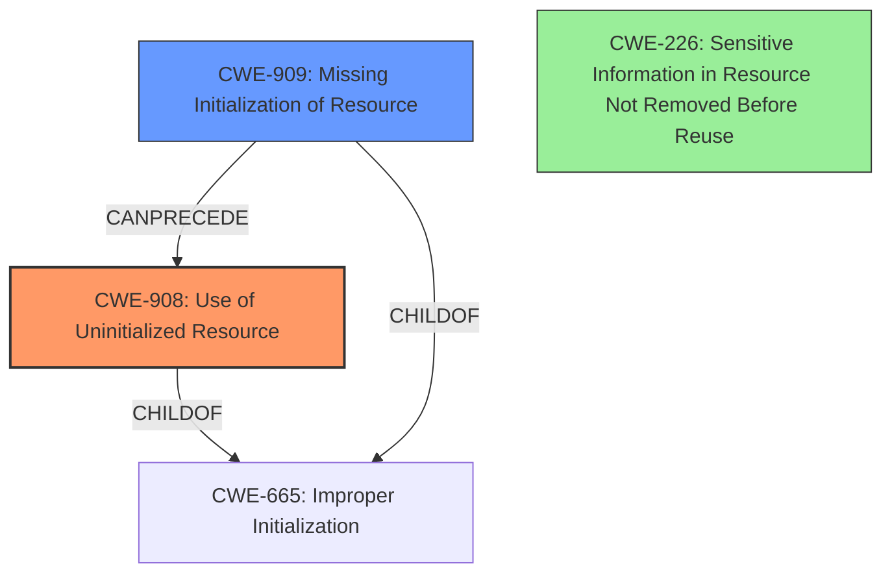

# Analysis Report for CVE-2020-14304

# Vulnerability Analysis Report: CVE-2020-14304

## Description


## Analysis (with Relationship Data)

# Summary
| CWE ID  | CWE Name                                 | Confidence | CWE Abstraction Level | CWE Vulnerability Mapping Label | CWE-Vulnerability Mapping Notes |
| :-------- | :--------------------------------------- | :--------- | :-------------------- | :------------------------------ | :------------------------------ |
| CWE-908 | Use of Uninitialized Resource          | 0.9        | Base                  | Primary                         | Allowed                       |
| CWE-226 | Sensitive Information in Resource Not Removed Before Reuse | 0.7        | Base                  | Secondary                       | Allowed                       |

## Evidence and Confidence

*   **Confidence Score:** 0.9
*   **Evidence Strength:** HIGH

## Relationship Analysis
The primary CWE is CWE-908 (Use of Uninitialized Resource), which is a Base-level CWE. The analysis also considered CWE-909 (Missing Initialization of Resource) which is a Class-level CWE and a parent of CWE-908. Since the description explicitly mentions reading **uninitialized values**, using an uninitialized resource is more precise than simply stating that the resource wasn't initialized. Also, CWE-226 (Sensitive Information in Resource Not Removed Before Reuse) was considered as a secondary CWE because reading uninitialized memory could disclose sensitive information left over from previous operations.



## Vulnerability Chain
The vulnerability chain begins with the kernel's ethernet driver failing to properly handle errors when reading from the EEPROM, leading to the exposure of **uninitialized values** in kernel memory.
  - **Root Cause:** **Improper error handling** within the `mlx4_en_get_module_eeprom` function in the Linux kernel's Mellanox mlx4_en driver.
  - **Weakness:** Use of Uninitialized Resource (CWE-908) - The function returns an uninitialized or partially initialized buffer.
  - **Impact:** Information Disclosure (Memory Leak) - A local user can read uninitialized kernel memory, potentially exposing sensitive data.

## Summary of Analysis
The analysis is primarily based on the provided vulnerability description, specifically the phrase "**read uninitialized values**" and the CVE Reference Links Content Summary mentioning that the function returns an uninitialized or partially initialized buffer. This directly aligns with CWE-908 (Use of Uninitialized Resource). The retriever results also listed CWE-908 as a highly relevant CWE. While other CWEs like CWE-909 (Missing Initialization of Resource) were considered, CWE-908 is a more precise description of the **weakness**, as it focuses on the *use* of an uninitialized resource, rather than just the absence of initialization.

CWE-226 was considered as a secondary weakness since reading uninitialized memory can result in the disclosure of sensitive information.

The selection of CWE-908 is at the optimal level of specificity because it's a Base-level CWE that accurately captures the vulnerability's root cause.

Relevant CWE Information:

# Enhanced Context (25 CWEs)

## CWE-824: Access of Uninitialized Pointer
**Abstraction Level**: Base
**Similarity Score**: 0.79
**Source**: dense

**Description**:
The product accesses or uses a pointer that has not been initialized.

**Mapping Guidance**:
- Usage: Allowed
- Rationale: This CWE entry is at the Base level of abstraction, which is a preferred level of abstraction for mapping to the root causes of vulnerabilities.

## CWE-822: Untrusted Pointer Dereference
**Abstraction Level**: Base
**Similarity Score**: 0.79
**Source**: dense

**Description**:
The product obtains a value from an untrusted source, converts this value to a pointer, and dereferences the resulting pointer.

**Mapping Guidance**:
- Usage: Allowed
- Rationale: This CWE entry is at the Base level of abstraction, which is a preferred level of abstraction for mapping to the root causes of vulnerabilities.

## CWE-823: Use of Out-of-range Pointer Offset
**Abstraction Level**: Base
**Similarity Score**: 0.79
**Source**: dense

**Description**:
The product performs pointer arithmetic on a valid pointer, but it uses an offset that can point outside of the intended range of valid memory locations for the resulting pointer.

**Mapping Guidance**:
- Usage: Allowed
- Rationale: This CWE entry is at the Base level of abstraction, which is a preferred level of abstraction for mapping to the root causes of vulnerabilities.

## CWE-476: NULL Pointer Dereference
**Abstraction Level**: Base
**Similarity Score**: 0.78
**Source**: dense

**Description**:
The product dereferences a pointer that it expects to be valid but is NULL.

**Mapping Guidance**:
- Usage: Allowed
- Rationale: This CWE entry is at the Base level of abstraction, which is a preferred level of abstraction for mapping to the root causes of vulnerabilities.

## CWE-191: Integer Underflow (Wrap or Wraparound)
**Abstraction Level**: Base
**Similarity Score**: 0.78
**Source**: dense

**Description**:
The product subtracts one value from another, such that the result is less than the minimum allowable integer value, which produces a value that is not equal to the correct result.

**Mapping Guidance**:
- Usage: Allowed
- Rationale: This CWE entry is at the Base level of abstraction, which is a preferred level of abstraction for mapping to the root causes of vulnerabilities.

## CWE-226: Sensitive Information in Resource Not Removed Before Reuse
**Abstraction Level**: Base
**Similarity Score**: 0.78
**Source**: dense

**Description**:
The product releases a resource such as memory or a file so that it can be made available for reuse, but it does not clear or "zeroize" the information contained in the resource before the product performs a critical state transition or makes the resource available for reuse by other entities.

**Mapping Guidance**:
- Usage: Allowed
- Rationale: This CWE entry is at the Base level of abstraction, which is a preferred level of abstraction for mapping to the root causes of vulnerabilities.

## CWE-909: Missing Initialization of Resource
**Abstraction Level**: Class
**Similarity Score**: 0.78
**Source**: dense

**Description**:
The product does not initialize a critical resource.

**Mapping Guidance**:
- Usage: Allowed-with-Review
- Rationale: This CWE entry is a Class and might have Base-level children that would be more appropriate

## CWE-805: Buffer Access with Incorrect Length Value
**Abstraction Level**: Base
**Similarity Score**: 0.78
**Source**: dense

**Description**:
The product uses a sequential operation to read or write a buffer, but it uses an incorrect length value that causes it to access memory that is outside of the bounds of the buffer.

**Mapping Guidance**:
- Usage: Allowed
- Rationale: This CWE entry is at the Base level of abstraction, which is a preferred level of abstraction for mapping to the root causes of vulnerabilities.

## CWE-908: Use of Uninitialized Resource
**Abstraction Level**: Base
**Similarity Score**: 0.77
**Source**: dense

**Description**:
The product uses or accesses a resource that has not been initialized.

**Mapping Guidance**:
- Usage: Allowed
- Rationale: This CWE entry is at the Base level of abstraction, which is a preferred level of abstraction for mapping to the root causes of vulnerabilities.

## CWE-667: Improper Locking
**Abstraction Level**: Class
**Similarity Score**: 0.77
**Source**: dense

**Description**:
The product does not properly acquire or release a lock on a resource, leading to unexpected resource state changes and behaviors.

**Mapping Guidance**:
- Usage: Allowed-with-Review
- Rationale: This CWE entry is a Class and might have Base-level children that would be more appropriate

## CWE-822: Untrusted Pointer Dereference
**Abstraction Level**: Base
**Similarity Score**: 5713.36
**Source**: sparse

**Description**:
The product obtains a value from an untrusted source, converts this value to a pointer, and dereferences the resulting pointer.

**Mapping Guidance**:
- Usage: Allowed
- Rationale: This CWE entry is at the Base level of abstraction, which is a preferred level of abstraction for mapping to the root causes of vulnerabilities.

## CWE-252: Un


## CWE Relationship Analysis

Current CWEs represent these abstraction levels: .


### Vulnerability Chain Analysis

**Chain starting from CWE-823:**
- 823 (Use of Out-of-range Pointer Offset) - ROOT


**Chain starting from CWE-476:**
- 476 (NULL Pointer Dereference) - ROOT


### CWE Relationship Diagram

```mermaid
graph TD
    classDef primary fill:#f96,stroke:#333,stroke-width:2px
    classDef secondary fill:#69f,stroke:#333
    classDef tertiary fill:#9e9,stroke:#333
```


*Report generated on 2025-04-02 01:18:27*
