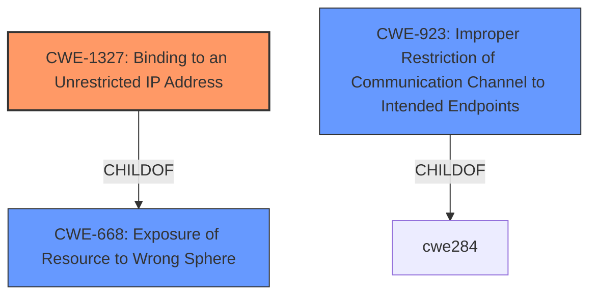

# Analysis for CVE-2020-14312

# Summary
| CWE ID | CWE Name | Confidence | CWE Abstraction Level | CWE Vulnerability Mapping Label | CWE-Vulnerability Mapping Notes |
|---|---|---|---|---|---|
| CWE-1327 | Binding to an Unrestricted IP Address | 0.9 | Base | Allowed | Primary CWE |
| CWE-923 | Improper Restriction of Communication Channel to Intended Endpoints | 0.7 | Class | Allowed-with-Review | Secondary Candidate |
| CWE-668 | Exposure of Resource to Wrong Sphere | 0.5 | Class | Discouraged | Secondary Candidate |

## Evidence and Confidence

*   **Confidence Score:** 0.8
*   **Evidence Strength:** HIGH

## Relationship Analysis
The primary relationship influencing the CWE selection is the ChildOf relationship where CWE-1327 is a child of CWE-668. This indicates a hierarchical relationship where CWE-1327 provides a more specific classification for the vulnerability. The nature of the vulnerability allows it to be classified as binding to an unrestricted IP address, which in turn exposes the resource to the wrong sphere. CWE-923 is a peer of other authorization-related CWEs, but less descriptive of the root cause.

## Vulnerability Chain
The vulnerability chain starts with the **misconfiguration** of `dnsmasq` to listen on all interfaces (0.0.0.0), leading to its exposure as an open resolver, which then allows attackers to conduct DDoS attacks.
  - **Root Cause:** **Default configuration listens on any interface** leading to CWE-1327
  - **Weakness:** The system acts as an open resolver because the **default configuration listens on any interface**.
  - **Impact:** Distributed Denial of Service (DDoS) attacks against other systems.

## Summary of Analysis
The initial assessment identified that `dnsmasq` **default configuration listens on any interface**, which is the root cause. This led to the selection of CWE-1327, Binding to an Unrestricted IP Address, as the primary CWE. The evidence directly supports this selection: "A flaw was found in the default configuration of dnsmasq...where it listens on any interface and accepts queries from addresses outside of its local subnet." The retriever results also listed CWE-1327 and this was also mentioned as the rootcause based on the CVE Reference links section.

CWE-923, Improper Restriction of Communication Channel to Intended Endpoints, was also considered because the open resolver allows unrestricted access, effectively communicating with unintended endpoints. However, CWE-1327 more precisely captures the root cause. CWE-668, Exposure of Resource to Wrong Sphere, is a high-level classification that could apply, but it lacks the specificity of CWE-1327.

The hierarchical relationship between CWE-1327 and CWE-668 reinforces the selection of CWE-1327 as the most appropriate and specific classification. The decision is based on the provided evidence and the hierarchical relationships.

The selected CWEs are at the optimal level of specificity because CWE-1327 directly describes the configuration issue, while CWE-668 is a broader categorization.
Relevant CWE Information:

# Enhanced Context (25 CWEs)
The following CWEs were identified as potentially relevant to this vulnerability:

## CWE-1327: Binding to an Unrestricted IP Address
**CWE-1327 (Binding to an Unrestricted IP Address)**: This CWE accurately describes the **root cause** of the vulnerability, where `dnsmasq` is configured by default to listen on all interfaces (0.0.0.0). This configuration makes it accessible from any address on the internet. The security implication is that the system becomes an open resolver, which can be exploited for DDoS attacks. The MITRE mapping guidance allows its usage, and it's a Base level of abstraction, which is preferred.
## CWE-923: Improper Restriction of Communication Channel to Intended Endpoints
**CWE-923 (Improper Restriction of Communication Channel to Intended Endpoints)**: While relevant, this CWE is a Class and less specific than CWE-1327. The vulnerability involves `dnsmasq` communicating with unintended endpoints (any address on the internet). However, the root cause is specifically the unrestricted IP address binding, making CWE-1327 a better fit. The MITRE mapping guidance suggests reviewing its children for a more appropriate fit, further supporting the choice of CWE-1327.
## CWE-668: Exposure of Resource to Wrong Sphere
**CWE-668 (Exposure of Resource to Wrong Sphere)**: This CWE is a high-level classification, indicating that `dnsmasq` is exposed to the wrong control sphere by listening on all interfaces. While true, it doesn't provide the specificity of CWE-1327, which directly addresses the **root cause**. The MITRE mapping guidance discourages its use when lower-level CWEs are applicable, reinforcing the selection of CWE-1327.

# Enhanced Query for CVE-2020-14312

## Vulnerability Description
A flaw was found in the default configuration of dnsmasq, as shipped with Fedora versions prior to 31 and in all versions Red Hat Enterprise Linux, where it listens on any interface and accepts queries from addresses outside of its local subnet. In particular, the option `local-service` is not enabled. Running dnsmasq in this manner may inadvertently make it an open resolver accessible from any address on the internet. This flaw allows an attacker to conduct a Distributed Denial of Service (DDoS) against other systems.

### Vulnerability Description Key Phrases
- **rootcause:** **default configuration listens on any interface**
- **impact:** open resolver accessible from any address on the internet
- **vector:** Distributed Denial of Service (DDoS)
- **attacker:** attacker
- **product:** dnsmasq
- **version:** Fedora prior to 31, Red Hat Enterprise Linux all versions

## CVE Reference Links Content Summary
Based on the provided content, here's the breakdown of the vulnerability described in CVE-2020-14312:

**Root Cause of Vulnerability:**

*   The root cause is an insecure default configuration in `dnsmasq` as shipped with Fedora and Red Hat Enterprise Linux. Specifically, `dnsmasq` is configured to listen on all interfaces and accept queries from any address, including those outside the local subnet. The `local-service` option, which restricts queries to the local subnet, is not enabled by default.

**Weaknesses/Vulnerabilities Present:**

*   **Open Resolver:** The primary vulnerability is that `dnsmasq`, in its default state, acts as an open resolver. An open resolver is a DNS server that accepts queries from any source, rather than just from a specific or trusted network.
*   **Lack of Access Control:** The missing `local-service` option allows unrestricted access to the DNS resolver, making it accessible from the internet.

**Impact of Exploitation:**

*   **Distributed Denial of Service (DDoS) Attacks:** The primary impact is that an attacker can leverage the open resolver to conduct DDoS attacks against other systems. By sending DNS queries to the vulnerable `dnsmasq` server with a spoofed source IP address of the target, the DNS server will then send a large volume of replies to the spoofed address, overwhelming the target with traffic.
*   **Involvement in Malicious Activity:** Systems running `dnsmasq` with the default configuration may be inadvertently used in DDoS attacks without the owner's knowledge.

**Attack Vectors:**

*   **Remote Queries:** Attackers can send DNS queries from anywhere on the internet to the vulnerable `dnsmasq` server.
*   **Spoofed Source IP:** Attackers can spoof the source IP address in their DNS queries, causing `dnsmasq` to send its responses to a different target address.

**Required Attacker Capabilities/Position:**

*   **Internet Access:** The attacker needs to have access to the internet to send queries to the exposed `dnsmasq` server.
*   **Knowledge of Vulnerable Instance:** The attacker needs to know the IP address of a system running `dnsmasq` with the insecure default configuration.
*   **No Special Privileges:** The attacker does not need any special privileges on the target system to exploit this vulnerability.

**Mitigation:**
The vulnerability can be mitigated by adding the `local-service` option to the `/etc/dnsmasq.conf` file, or a file in `/etc/dnsmasq.d`. Additionally, a firewall can provide another layer of protection.

**Additional details:**
- Red Hat Enterprise Linux 8 and Fedora have firewalld service enabled by default, which blocks incoming DNS queries, which mitigates this issue by default.
- The vulnerability has been fixed in `dnsmasq-2.81-4.fc32` and `dnsmasq-2.80-16.fc31`.

## Retriever Results

### Top Combined Results

| Rank | CWE ID | Name | Abstraction | Usage  | Retrievers | Individual Scores |
|------|--------|------|-------------|-------|------------|-------------------|
| 1 | 923 | Improper Restriction of Communication Channel to Intended Endpoints | Class | Allowed-with-Review | sparse | 0.753 |
| 2 | 201 | Insertion of Sensitive Information Into Sent Data | Base | Allowed | sparse | 0.517 |
| 3 | 306 | Missing Authentication for Critical Function | Base | Allowed | sparse | 0.509 |
| 4 | 918 | Server-Side Request Forgery (SSRF) | Base | Allowed | sparse | 0.506 |
| 5 | 285 | Improper Authorization | Class | Discouraged | sparse | 0.494 |
| 6 | 1327 | Binding to an Unrestricted IP Address | Base | Allowed | dense | 0.467 |
| 7 | 322 | Key Exchange without Entity Authentication | Base | Allowed | graph | 0.003 |
| 8 | 863 | Incorrect Authorization | Class | Allowed-with-Review | sparse | 0.492 |
| 9 | 22 | Improper Limitation of a Pathname to a Restricted Directory ('Path Traversal') | Base | Allowed | sparse | 0.486 |
| 10 | 732 | Incorrect Permission Assignment for Critical Resource | Class | Allowed-with-Review | sparse | 0.482 |

# Complete CWE Specifications

## CWE-923: Improper Restriction of Communication Channel to Intended Endpoints
**Abstraction:** Class
**Status:** Incomplete

### Description
The product establishes a communication channel to (or from) an endpoint for privileged or protected operations, but it does not properly ensure that it is communicating with the correct endpoint.

### Extended Description

Attackers might be able to spoof the intended endpoint from a different system or process, thus gaining the same level of access as the intended endpoint.

While this issue frequently involves authentication between network-based clients and servers, other types of communication channels and endpoints can have this weakness.

### Alternative Terms
None

### Relationships
ChildOf -> CWE-284

### Mapping Guidance
**Usage:** Allowed-with-Review
**Rationale:** This CWE entry is a Class and might have Base-level children that would be more appropriate
**Comments:** Examine children of this entry to see if there is a better fit
**Reasons:**
- Abstraction

### Observed Examples
- **CVE-2022-30319:** S-bus functionality in a home automation product performs access control using an IP allowlist, which can be bypassed by a forged IP address.
- **CVE-2022-22547:** A troubleshooting tool exposes a web server on a random port between 9000-65535 that could be used for information gathering
- **CVE-2022-4390:** A WAN interface on a router has firewall restrictions enabled for IPv4, but it does not for IPv6, which is enabled by default

## CWE-201: Insertion of Sensitive Information Into Sent Data
**Abstraction:** Base
**Status:** Draft

### Description
The code transmits data to another actor, but a portion of the data includes sensitive information that should not be accessible to that actor.

### Extended Description
Not provided

### Alternative Terms
None

### Relationships
ChildOf -> CWE-200
CanAlsoBe -> CWE-209
CanAlsoBe -> CWE-202

### Mapping Guidance
**Usage:** Allowed
**Rationale:** This CWE entry is at the Base level of abstraction, which is a preferred level of abstraction for mapping to the root causes of vulnerabilities.
**Comments:** Carefully read both the name and description to ensure that this mapping is an appropriate fit. Do not try to 'force' a mapping to a lower-level Base/Variant simply to comply with this preferred level of abstraction.
**Reasons:**
- Acceptable-Use

### Additional Notes
**[Other]** Sensitive information could include data that is sensitive in and of itself (such as credentials or private messages), or otherwise useful in the further exploitation of the system (such as internal file system structure).

### Observed Examples
- **CVE-2022-0708:** Collaboration platform does not clear team emails in a response, allowing leak of email addresses

## CWE-306: Missing Authentication for Critical Function
**Abstraction:** Base
**Status:** Draft

### Description
The product does not perform any authentication for functionality that requires a provable user identity or consumes a significant amount of resources.

### Extended Description
Not provided

### Alternative Terms
None

### Relationships
ChildOf -> CWE-287
ChildOf -> CWE-287

### Mapping Guidance
**Usage:** Allowed
**Rationale:** This CWE entry is at the Base level of abstraction, which is a preferred level of abstraction for mapping to the root causes of vulnerabilities.
**Comments:** Carefully read both the name and description to ensure that this mapping is an appropriate fit. Do not try to 'force' a mapping to a lower-level Base/Variant simply to comply with this preferred level of abstraction.
**Reasons:**
- Acceptable-Use

### Observed Examples
- **CVE-2022-31260:** Chain: a digital asset management program has an undisclosed backdoor in the legacy version of a PHP script (CWE-912) that could allow an unauthenticated user to export metadata (CWE-306)
- **CVE-2022-29951:** TCP-based protocol in Programmable Logic Controller (PLC) has no authentication.
- **CVE-2022-29952:** Condition Monitor firmware uses a protocol that does not require authentication.

## CWE-918: Server-Side Request Forgery (SSRF)
**Abstraction:** Base
**Status:** Incomplete

### Description
The web server receives a URL or similar request from an upstream component and retrieves the contents of this URL, but it does not sufficiently ensure that the request is being sent to the expected destination.

### Extended Description
Not provided

### Alternative Terms
XSPA: Cross Site Port Attack
SSRF: Server-Side Request Forgery

### Relationships
ChildOf -> CWE-441
ChildOf -> CWE-610

### Mapping Guidance
**Usage:** Allowed
**Rationale:** This CWE entry is at the Base level of abstraction, which is a preferred level of abstraction for mapping to the root causes of vulnerabilities.
**Comments:** Carefully read both the name and description to ensure that this mapping is an appropriate fit. Do not try to 'force' a mapping to a lower-level Base/Variant simply to comply with this preferred level of abstraction.
**Reasons:**
- Acceptable-Use

### Additional Notes
**[Relationship]** CWE-918 (SSRF) and CWE-611 (XXE) are closely related, because they both involve web-related technologies and can launch outbound requests to unexpected destinations. However, XXE can be performed client-side, or in other contexts in which the software is not acting directly as a server, so the "Server" portion of the SSRF acronym does not necessarily apply.

### Observed Examples
- **CVE-2023-32786:** Chain: LLM integration framework has prompt injection (CWE-1427) that allows an attacker to force the service to retrieve data from an arbitrary URL, essentially providing SSRF (CWE-918) and potentially injecting content into downstream tasks.
- **CVE-2021-26855:** Server Side Request Forgery (SSRF) in mail server, as exploited in the wild per CISA KEV.
- **CVE-2021-21973:** Server Side Request Forgery in cloud platform, as exploited in the wild per CISA KEV.

## CWE-285: Improper Authorization
**Abstraction:** Class
**Status:** Draft

### Description
The product does not perform or incorrectly performs an authorization check when an actor attempts to access a resource or perform an action.

### Extended Description

Assuming a user with a given identity, authorization is the process of determining whether that user can access a given resource, based on the user's privileges and any permissions or other access-control specifications that apply to the resource.

When access control checks are not applied consistently - or not at all - users are able to access data or perform actions that they should not be allowed to perform. This can lead to a wide range of problems, including information exposures, denial of service, and arbitrary code execution.

### Alternative Terms
AuthZ: "AuthZ" is typically used as an abbreviation of "authorization" within the web application security community. It is distinct from "AuthN" (or, sometimes, "AuthC") which is an abbreviation of "authentication." The use of "Auth" as an abbreviation is discouraged, since it could be used for either authentication or authorization.

### Relationships
ChildOf -> CWE-284
ChildOf -> CWE-284

### Mapping Guidance
**Usage:** Discouraged
**Rationale:** CWE-285 is high-level and lower-level CWEs can frequently be used instead. It is a level-1 Class (i.e., a child of a Pillar).
**Comments:** Look at CWE-285's children and consider mapping to CWEs such as CWE-862: Missing Authorization, CWE-863: Incorrect Authorization, CWE-732: Incorrect Permission Assignment for Critical Resource, or others.
**Reasons:**
- Abstraction
**Suggested Alternatives:**
- CWE-862: Missing Authorization
- CWE-863: Incorrect Authorization
- CWE-732: Incorrect Permission Assignment for Critical Resource

### Observed Examples
- **CVE-2022-24730:** Go-based continuous deployment product does not check that a user has certain privileges to update or create an app, allowing adversaries to read sensitive repository information
- **CVE-2009-3168:** Web application does not restrict access to admin scripts, allowing authenticated users to reset administrative passwords.
- **CVE-2009-2960:** Web application does not restrict access to admin scripts, allowing authenticated users to modify passwords of other users.

## CWE-1327: Binding to an Unrestricted IP Address
**Abstraction:** Base
**Status:** Incomplete

### Description
The product assigns the address 0.0.0.0 for a database server, a cloud service/instance, or any computing resource that communicates remotely.

### Extended Description

When a server binds to the address 0.0.0.0, it allows connections from every IP address on the local machine, effectively exposing the server to every possible network. This might be much broader access than intended by the developer or administrator, who might only be expecting the server to be reachable from a single interface/network.

### Alternative Terms
None

### Relationships
ChildOf -> CWE-668

### Mapping Guidance
**Usage:** Allowed
**Rationale:** This CWE entry is at the Base level of abstraction, which is a preferred level of abstraction for mapping to the root causes of vulnerabilities.
**Comments:** Carefully read both the name and description to ensure that this mapping is an appropriate fit. Do not try to 'force' a mapping to a lower-level Base/Variant simply to comply with this preferred level of abstraction.
**Reasons:**
- Acceptable-Use

### Observed Examples
- **CVE-2022-21947:** Desktop manager for Kubernetes and container management binds a service to 0.0.0.0, allowing users on the network to make requests to a dashboard API.

## CWE-322: Key Exchange without Entity Authentication
**Abstraction:** Base
**Status:** Draft

### Description
The product performs a key exchange with an actor without verifying the identity of that actor.

### Extended Description
Performing a key exchange will preserve the integrity of the information sent between two entities, but this will not guarantee that the entities are who they claim they are. This may enable an attacker to impersonate an actor by modifying traffic between the two entities. Typically, this involves a victim client that contacts a malicious server that is impersonating a trusted server. If the client skips authentication or ignores an authentication failure, the malicious server may request authentication information from the user. The malicious server can then use this authentication information to log in to the trusted server using the victim's credentials, sniff traffic between the victim and trusted server, etc.

### Alternative Terms
None

### Relationships
ChildOf -> CWE-306
CanPrecede -> CWE-923
PeerOf -> CWE-295

### Mapping Guidance
**Usage:** Allowed
**Rationale:** This CWE entry is at the Base level of abstraction, which is a preferred level of abstraction for mapping to the root causes of vulnerabilities.
**Comments:** Carefully read both the name and description to ensure that this mapping is an appropriate fit. Do not try to 'force' a mapping to a lower-level Base/Variant simply to comply with this preferred level of abstraction.
**Reasons:**
- Acceptable-Use

## CWE-863: Incorrect Authorization
**Abstraction:** Class
**Status:** Incomplete

### Description
The product performs an authorization check when an actor attempts to access a resource or perform an action, but it does not correctly perform the check.

### Extended Description
Not provided

### Alternative Terms
AuthZ: "AuthZ" is typically used as an abbreviation of "authorization" within the web application security community. It is distinct from "AuthN" (or, sometimes, "AuthC") which is an abbreviation of "authentication." The use of "Auth" as an abbreviation is discouraged, since it could be used for either authentication or authorization.

### Relationships
ChildOf -> CWE-285
ChildOf -> CWE-284

### Mapping Guidance
**Usage:** Allowed-with-Review
**Rationale:** This CWE entry is a Class and might have Base-level children that would be more appropriate
**Comments:** Examine children of this entry to see if there is a better fit
**Reasons:**
- Abstraction

### Additional Notes
**[Terminology]** 

Assuming a user with a given identity, authorization is the process of determining whether that user can access a given resource, based on the user's privileges and any permissions or other access-control specifications that apply to the resource.

### Observed Examples
- **CVE-2021-39155:** Chain: A microservice integration and management platform compares the hostname in the HTTP Host header in a case-sensitive way (CWE-178, CWE-1289), allowing bypass of the authorization policy (CWE-863) using a hostname with mixed case or other variations.
- **CVE-2019-15900:** Chain: sscanf() call is used to check if a username and group exists, but the return value of sscanf() call is not checked (CWE-252), causing an uninitialized variable to be checked (CWE-457), returning success to allow authorization bypass for executing a privileged (CWE-863).
- **CVE-2009-2213:** Gateway uses default "Allow" configuration for its authorization settings.

## CWE-22: Improper Limitation of a Pathname to a Restricted Directory ('Path Traversal')
**Abstraction:** Base
**Status:** Stable

### Description
The product uses external input to construct a pathname that is intended to identify a file or directory that is located underneath a restricted parent directory, but the product does not properly neutralize special elements within the pathname that can cause the pathname to resolve to a location that is outside of the restricted directory.

### Extended Description

Many file operations are intended to take place within a restricted directory. By using special elements such as ".." and "/" separators, attackers can escape outside of the restricted location to access files or directories that are elsewhere on the system. One of the most common special elements is the "../" sequence, which in most modern operating systems is interpreted as the parent directory of the current location. This is referred to as relative path traversal. Path traversal also covers the use of absolute pathnames such as "/usr/local/bin" to access unexpected files. This is referred to as absolute path traversal.

### Alternative Terms
Directory traversal
Path traversal: "Path traversal" is preferred over "directory traversal," but both terms are attack-focused.

### Relationships
ChildOf -> CWE-706
ChildOf -> CWE-706
ChildOf -> CWE-668

### Mapping Guidance
**Usage:** Allowed
**Rationale:** This CWE entry is at the Base level of abstraction, which is a preferred level of abstraction for mapping to the root causes of vulnerabilities.
**Comments:** Carefully read both the name and description to ensure that this mapping is an appropriate fit. Do not try to 'force' a mapping to a lower-level Base/Variant simply to comply with this preferred level of abstraction.
**Reasons:**
- Acceptable-Use

### Additional Notes
**[Other]** In many programming languages, the injection of a null byte (the 0 or NUL) may allow an attacker to truncate a generated filename to apply to a wider range of files. For example, the product may add ".txt" to any pathname, thus limiting the attacker to text files, but a null injection may effectively remove this restriction.

**[Relationship]** Pathname equivalence can be regarded as a type of canonicalization error.

**[Relationship]** Some pathname equivalence issues are not directly related to directory traversal, rather are used to bypass security-relevant checks for whether a file/directory can be accessed by the attacker (e.g. a trailing "/" on a filename could bypass access rules that don't expect a trailing /, causing a server to provide the file when it normally would not).

**[Terminology]** 

Like other weaknesses, terminology is often based on the types of manipulations used, instead of the underlying weaknesses. Some people use "directory traversal" only to refer to the injection of ".." and equivalent sequences whose specific meaning is to traverse directories.

Other variants like "absolute pathname" and "drive letter" have the *effect* of directory traversal, but some people may not call it such, since it doesn't involve ".." or equivalent.

**[Research Gap]** Many variants of path traversal attacks are probably under-studied with respect to root cause. CWE-790 and CWE-182 begin to cover part of this gap.

**[Research Gap]** 

Incomplete diagnosis or reporting of vulnerabilities can make it difficult to know which variant is affected. For example, a researcher might say that "..\" is vulnerable, but not test "../" which may also be vulnerable.

Any combination of directory separators ("/", "\", etc.) and numbers of "." (e.g. "....") can produce unique variants; for example, the "//../" variant is not listed (CVE-2004-0325). See this entry's children and lower-level descendants.

### Observed Examples
- **CVE-2024-37032:** Large language model (LLM) management tool does not validate the format of a digest value (CWE-1287) from a private, untrusted model registry, enabling relative path traversal (CWE-23), a.k.a. Probllama
- **CVE-2024-4315:** Chain: API for text generation using Large Language Models (LLMs) does not include the "\" Windows folder separator in its denylist (CWE-184) when attempting to prevent Local File Inclusion via path traversal (CWE-22), allowing deletion of arbitrary files on Windows systems.
- **CVE-2022-45918:** Chain: a learning management tool debugger uses external input to locate previous session logs (CWE-73) and does not properly validate the given path (CWE-20), allowing for filesystem path traversal using "../" sequences (CWE-24)

## CWE-732: Incorrect Permission Assignment for Critical Resource
**Abstraction:** Class
**Status:** Draft

### Description
The product specifies permissions for a security-critical resource in a way that allows that resource to be read or modified by unintended actors.

### Extended Description
When a resource is given a permission setting that provides access to a wider range of actors than required, it could lead to the exposure of sensitive information, or the modification of that resource by unintended parties. This is especially dangerous when the resource is related to program configuration, execution, or sensitive user data. For example, consider a misconfigured storage account for the cloud that can be read or written by a public or anonymous user.

### Alternative Terms
None

### Relationships
ChildOf -> CWE-285
ChildOf -> CWE-668

### Mapping Guidance
**Usage:** Allowed-with-Review
**Rationale:** While the name itself indicates an assignment of permissions for resources, this is often misused for vulnerabilities in which "permissions" are not checked, which is an "authorization" weakness (CWE-285 or descendants) within CWE's model [REF-1287].
**Comments:** Closely analyze the specific mistake that is allowing the resource to be exposed, and perform a CWE mapping for that mistake.
**Reasons:**
- Frequent Misuse

### Additional Notes
**[Maintenance]** The relationships between privileges, permissions, and actors (e.g. users and groups) need further refinement within the Research view. One complication is that these concepts apply to two different pillars, related to control of resources (CWE-664) and protection mechanism failures (CWE-693).

### Observed Examples
- **CVE-2022-29527:** Go application for cloud management creates a world-writable sudoers file that allows local attackers to inject sudo rules and escalate privileges to root by winning a race condition.
- **CVE-2009-3482:** Anti-virus product sets insecure "Everyone: Full Control" permissions for files under the "Program Files" folder, allowing attackers to replace executables with Trojan horses.
- **CVE-2009-3897:** Product creates directories with 0777 permissions at installation, allowing users to gain privileges and access a socket used for authentication.

