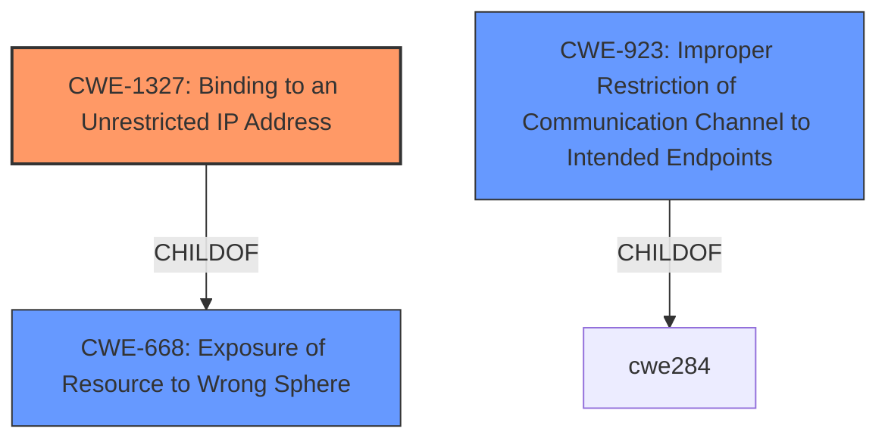

# Analysis Report for CVE-2020-14312

# Vulnerability Analysis Report: CVE-2020-14312

## Description


## Analysis (with Relationship Data)

# Summary
| CWE ID | CWE Name | Confidence | CWE Abstraction Level | CWE Vulnerability Mapping Label | CWE-Vulnerability Mapping Notes |
|---|---|---|---|---|---|
| CWE-1327 | Binding to an Unrestricted IP Address | 0.9 | Base | Allowed | Primary CWE |
| CWE-923 | Improper Restriction of Communication Channel to Intended Endpoints | 0.7 | Class | Allowed-with-Review | Secondary Candidate |
| CWE-668 | Exposure of Resource to Wrong Sphere | 0.5 | Class | Discouraged | Secondary Candidate |

## Evidence and Confidence

*   **Confidence Score:** 0.8
*   **Evidence Strength:** HIGH

## Relationship Analysis
The primary relationship influencing the CWE selection is the ChildOf relationship where CWE-1327 is a child of CWE-668. This indicates a hierarchical relationship where CWE-1327 provides a more specific classification for the vulnerability. The nature of the vulnerability allows it to be classified as binding to an unrestricted IP address, which in turn exposes the resource to the wrong sphere. CWE-923 is a peer of other authorization-related CWEs, but less descriptive of the root cause.



## Vulnerability Chain
The vulnerability chain starts with the **misconfiguration** of `dnsmasq` to listen on all interfaces (0.0.0.0), leading to its exposure as an open resolver, which then allows attackers to conduct DDoS attacks.
  - **Root Cause:** **Default configuration listens on any interface** leading to CWE-1327
  - **Weakness:** The system acts as an open resolver because the **default configuration listens on any interface**.
  - **Impact:** Distributed Denial of Service (DDoS) attacks against other systems.

## Summary of Analysis
The initial assessment identified that `dnsmasq` **default configuration listens on any interface**, which is the root cause. This led to the selection of CWE-1327, Binding to an Unrestricted IP Address, as the primary CWE. The evidence directly supports this selection: "A flaw was found in the default configuration of dnsmasq...where it listens on any interface and accepts queries from addresses outside of its local subnet." The retriever results also listed CWE-1327 and this was also mentioned as the rootcause based on the CVE Reference links section.

CWE-923, Improper Restriction of Communication Channel to Intended Endpoints, was also considered because the open resolver allows unrestricted access, effectively communicating with unintended endpoints. However, CWE-1327 more precisely captures the root cause. CWE-668, Exposure of Resource to Wrong Sphere, is a high-level classification that could apply, but it lacks the specificity of CWE-1327.

The hierarchical relationship between CWE-1327 and CWE-668 reinforces the selection of CWE-1327 as the most appropriate and specific classification. The decision is based on the provided evidence and the hierarchical relationships.

The selected CWEs are at the optimal level of specificity because CWE-1327 directly describes the configuration issue, while CWE-668 is a broader categorization.
Relevant CWE Information:

# Enhanced Context (25 CWEs)
The following CWEs were identified as potentially relevant to this vulnerability:

## CWE-1327: Binding to an Unrestricted IP Address
**CWE-1327 (Binding to an Unrestricted IP Address)**: This CWE accurately describes the **root cause** of the vulnerability, where `dnsmasq` is configured by default to listen on all interfaces (0.0.0.0). This configuration makes it accessible from any address on the internet. The security implication is that the system becomes an open resolver, which can be exploited for DDoS attacks. The MITRE mapping guidance allows its usage, and it's a Base level of abstraction, which is preferred.
## CWE-923: Improper Restriction of Communication Channel to Intended Endpoints
**CWE-923 (Improper Restriction of Communication Channel to Intended Endpoints)**: While relevant, this CWE is a Class and less specific than CWE-1327. The vulnerability involves `dnsmasq` communicating with unintended endpoints (any address on the internet). However, the root cause is specifically the unrestricted IP address binding, making CWE-1327 a better fit. The MITRE mapping guidance suggests reviewing its children for a more appropriate fit, further supporting the choice of CWE-1327.
## CWE-668: Exposure of Resource to Wrong Sphere
**CWE-668 (Exposure of Resource to Wrong Sphere)**: This CWE is a high-level classification, indicating that `dnsmasq` is exposed to the wrong control sphere by listening on all interfaces. While true, it doesn't provide the specificity of CWE-1327, which directly addresses the **root cause**. The MITRE mapping guidance discourages its use when lower-level CWEs are applicable, reinforcing the selection of CWE-1327.


## CWE Relationship Analysis

Current CWEs represent these abstraction levels: .


### Vulnerability Chain Analysis

**Chain starting from CWE-1327:**
- 1327 (Binding to an Unrestricted IP Address) - ROOT


**Chain starting from CWE-923:**
- 923 (Improper Restriction of Communication Channel to Intended Endpoints) - ROOT


### CWE Relationship Diagram

```mermaid
graph TD
    classDef primary fill:#f96,stroke:#333,stroke-width:2px
    classDef secondary fill:#69f,stroke:#333
    classDef tertiary fill:#9e9,stroke:#333
```


*Report generated on 2025-04-01 22:25:28*
