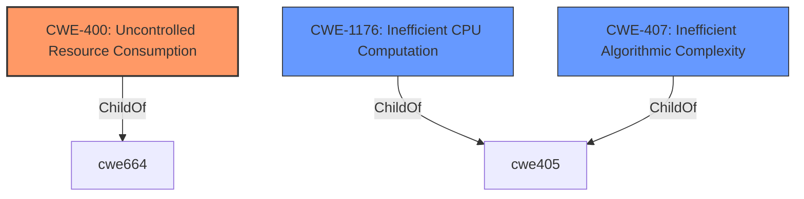

# Analysis for CVE-2020-14326

# Summary
| CWE ID | CWE Name | Confidence | CWE Abstraction Level | CWE Vulnerability Mapping Label | CWE-Vulnerability Mapping Notes |
|---|---|---|---|---|---|
| CWE-400 | Uncontrolled Resource Consumption | 0.8 | Class | Primary | Allowed-with-Review |
| CWE-1176 | Inefficient CPU Computation | 0.7 | Class | Secondary | Allowed-with-Review |
| CWE-407 | Inefficient Algorithmic Complexity | 0.6 | Class | Secondary | Allowed-with-Review |

## Evidence and Confidence

*   **Confidence Score:** 0.8
*   **Evidence Strength:** HIGH

## Relationship Analysis
The primary CWE is CWE-400, which is a class-level CWE. CWE-1176 (Inefficient CPU Computation) and CWE-407 (Inefficient Algorithmic Complexity) are related as potential causes or contributing factors to uncontrolled resource consumption. All three are class level CWEs, indicating there are possibly more specific CWEs.

## Vulnerability Chain
The vulnerability chain starts with the **improper caching of routes** in RESTEasy's RootNode, leading to **hash flooding**. This **hash flooding** results in **inefficient CPU computation** due to increased time spent searching and adding entries, which ultimately causes **uncontrolled resource consumption** and a denial of service.
- **Root Cause:** Improper caching of routes (Implicit, not a CWE)
- **Weakness 1:** Hash flooding (Implicit, not a CWE)
- **Weakness 2:** CWE-1176: Inefficient CPU Computation
- **Weakness 3:** CWE-400: Uncontrolled Resource Consumption
- **Impact:** Denial of Service

## Summary of Analysis
The initial analysis identified CWE-400 as the primary weakness due to the resulting denial of service from resource exhaustion. The vulnerability description clearly states that the **improper caching** leads to **hash flooding**, resulting in slower requests and higher CPU usage, eventually leading to a denial of service. This aligns with the description of CWE-400: "The product does not properly control the allocation and maintenance of a limited resource, thereby enabling an actor to influence the amount of resources consumed, eventually leading to the exhaustion of available resources."

CWE-1176 and CWE-407 are included as secondary CWEs to represent the inefficient CPU usage and algorithmic complexity, respectively, that contribute to the resource exhaustion. The "CVE Reference Links Content Summary" section supports this analysis, stating, "The vulnerability is due to **improper caching** of routes in RootNode within RESTEasy, which leads to **hash flooding** and increased CPU usage when searching for and adding new entries."

The decision to use CWE-400 as the primary CWE is further supported by the impact described in the vulnerability description and CVE summary, both stating that successful exploitation leads to Denial of Service (DoS). While CWE-400 is a Class-level CWE, it accurately represents the overall vulnerability. The other suggested CWEs are also class level and are not more specific to this vulnerability.

Relevant CWE Information:

# Enhanced Context (25 CWEs)
The following CWEs were identified as potentially relevant to this vulnerability:

## CWE-405: Asymmetric Resource Consumption (Amplification)
**Abstraction Level**: Class
**Similarity Score**: 0.76
**Source**: dense

**Description**:
The product does not properly control situations in which an adversary can cause the product to consume or produce excessive resources without requiring the adversary to invest equivalent work or otherwise prove authorization, i.e., the adversary's influence is "asymmetric."

**Mapping Guidance**:
- Usage: Allowed-with-Review
- Rationale: This CWE entry is a Class and might have Base-level children that would be more appropriate

## CWE-799: Improper Control of Interaction Frequency
**Abstraction Level**: Class
**Similarity Score**: 0.76
**Source**: dense

**Description**:
The product does not properly limit the number or frequency of interactions that it has with an actor, such as the number of incoming requests.

**Mapping Guidance**:
- Usage: Allowed-with-Review
- Rationale: This CWE entry is a Class and might have Base-level children that would be more appropriate

## CWE-407: Inefficient Algorithmic Complexity
**Abstraction Level**: Class
**Similarity Score**: 0.76
**Source**: dense

**Description**:
An algorithm in a product has an inefficient worst-case computational complexity that may be detrimental to system performance and can be triggered by an attacker, typically using crafted manipulations that ensure that the worst case is being reached.

**Mapping Guidance**:
- Usage: Allowed-with-Review
- Rationale: This CWE entry is a Class and might have Base-level children that would be more appropriate

## CWE-404: Improper Resource Shutdown or Release
**Abstraction Level**: Class
**Similarity Score**: 0.75
**Source**: dense

**Description**:
The product does not release or incorrectly releases a resource before it is made available for re-use.

**Mapping Guidance**:
- Usage: Allowed-with-Review
- Rationale: This CWE entry is a Class and might have Base-level children that would be more appropriate

## CWE-1176: Inefficient CPU Computation
**Abstraction Level**: Class
**Similarity Score**: 0.74
**Source**: dense

**Description**:
The product performs CPU computations using
         algorithms that are not as efficient as they could be for the
         needs of the developer, i.e., the computations can be
         optimized further.

**Mapping Guidance**:
- Usage: Allowed-with-Review
- Rationale: This CWE entry is a Class and might have Base-level children that would be more appropriate

## CWE-664: Improper Control of a Resource Through its Lifetime
**Abstraction Level**: Pillar
**Similarity Score**: 0.74
**Source**: dense

**Description**:
The product does not maintain or incorrectly maintains control over a resource throughout its lifetime of creation, use, and release.

**Mapping Guidance**:
- Usage: Discouraged
- Rationale: This CWE entry is high-level when lower-level children are available.

## CWE-226: Sensitive Information in Resource Not Removed Before Reuse
**Abstraction Level**: Base
**Similarity Score**: 0.74
**Source**: dense

**Description**:
The product releases a resource such as memory or a file so that it can be made available for reuse, but it does not clear or "zeroize" the information contained in the resource before the product performs a critical state transition or makes the resource available for reuse by other entities.

**Mapping Guidance**:
- Usage: Allowed
- Rationale: This CWE entry is at the Base level of abstraction, which is a preferred level of abstraction for mapping to the root causes of vulnerabilities.

## CWE-668: Exposure of Resource to Wrong Sphere
**Abstraction Level**: Class
**Similarity Score**: 0.73
**Source**: dense

**Description**:
The product exposes a resource to the wrong control sphere, providing unintended actors with inappropriate access to the resource.

**Mapping Guidance**:
- Usage: Discouraged
- Rationale: CWE-668 is high-level and is often misused as a catch-all when lower-level CWE IDs might be applicable. It is sometimes used for low-information vulnerability reports [REF-1287]. It is a level-1 Class (i.e., a child of a Pillar). It is not useful for trend analysis.

## CWE-41: Improper Resolution of Path Equivalence
**Abstraction Level**: Base
**Similarity Score**: 0.73
**Source**: dense

**Description**:
The product is vulnerable to file system contents disclosure through path equivalence. Path equivalence involves the use of special characters in file and directory names. The associated manipulations are intended to generate multiple names for the same object.

**Mapping Guidance**:
- Usage: Allowed
- Rationale: This CWE entry is at the Base level of abstraction, which is a preferred level of abstraction for mapping to the root causes of vulnerabilities.

## CWE-834: Excessive Iteration
**Abstraction Level**: Class
**Similarity Score**: 0.73
**Source**: dense

**Description**:
The product performs an iteration or loop without sufficiently limiting the number of times that the loop is executed.

**Mapping Guidance**:
- Usage: Discouraged
- Rationale: This CWE