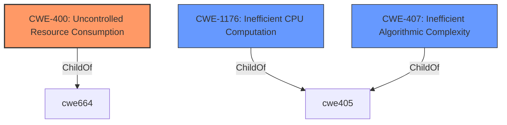

# Analysis for CVE-2020-14326

# Summary
| CWE ID | CWE Name | Confidence | CWE Abstraction Level | CWE Vulnerability Mapping Label | CWE-Vulnerability Mapping Notes |
|---|---|---|---|---|---|
| CWE-400 | Uncontrolled Resource Consumption | 0.8 | Class | Primary | Allowed-with-Review |
| CWE-1176 | Inefficient CPU Computation | 0.7 | Class | Secondary | Allowed-with-Review |
| CWE-407 | Inefficient Algorithmic Complexity | 0.6 | Class | Secondary | Allowed-with-Review |

## Evidence and Confidence

*   **Confidence Score:** 0.8
*   **Evidence Strength:** HIGH

## Relationship Analysis
The primary CWE is CWE-400, which is a class-level CWE. CWE-1176 (Inefficient CPU Computation) and CWE-407 (Inefficient Algorithmic Complexity) are related as potential causes or contributing factors to uncontrolled resource consumption. All three are class level CWEs, indicating there are possibly more specific CWEs.



## Vulnerability Chain
The vulnerability chain starts with the **improper caching of routes** in RESTEasy's RootNode, leading to **hash flooding**. This **hash flooding** results in **inefficient CPU computation** due to increased time spent searching and adding entries, which ultimately causes **uncontrolled resource consumption** and a denial of service.
- **Root Cause:** Improper caching of routes (Implicit, not a CWE)
- **Weakness 1:** Hash flooding (Implicit, not a CWE)
- **Weakness 2:** CWE-1176: Inefficient CPU Computation
- **Weakness 3:** CWE-400: Uncontrolled Resource Consumption
- **Impact:** Denial of Service

## Summary of Analysis
The initial analysis identified CWE-400 as the primary weakness due to the resulting denial of service from resource exhaustion. The vulnerability description clearly states that the **improper caching** leads to **hash flooding**, resulting in slower requests and higher CPU usage, eventually leading to a denial of service. This aligns with the description of CWE-400: "The product does not properly control the allocation and maintenance of a limited resource, thereby enabling an actor to influence the amount of resources consumed, eventually leading to the exhaustion of available resources."

CWE-1176 and CWE-407 are included as secondary CWEs to represent the inefficient CPU usage and algorithmic complexity, respectively, that contribute to the resource exhaustion. The "CVE Reference Links Content Summary" section supports this analysis, stating, "The vulnerability is due to **improper caching** of routes in RootNode within RESTEasy, which leads to **hash flooding** and increased CPU usage when searching for and adding new entries."

The decision to use CWE-400 as the primary CWE is further supported by the impact described in the vulnerability description and CVE summary, both stating that successful exploitation leads to Denial of Service (DoS). While CWE-400 is a Class-level CWE, it accurately represents the overall vulnerability. The other suggested CWEs are also class level and are not more specific to this vulnerability.

Relevant CWE Information:

# Enhanced Context (25 CWEs)
The following CWEs were identified as potentially relevant to this vulnerability:

## CWE-405: Asymmetric Resource Consumption (Amplification)
**Abstraction Level**: Class
**Similarity Score**: 0.76
**Source**: dense

**Description**:
The product does not properly control situations in which an adversary can cause the product to consume or produce excessive resources without requiring the adversary to invest equivalent work or otherwise prove authorization, i.e., the adversary's influence is "asymmetric."

**Mapping Guidance**:
- Usage: Allowed-with-Review
- Rationale: This CWE entry is a Class and might have Base-level children that would be more appropriate


## CWE-799: Improper Control of Interaction Frequency
**Abstraction Level**: Class
**Similarity Score**: 0.76
**Source**: dense

**Description**:
The product does not properly limit the number or frequency of interactions that it has with an actor, such as the number of incoming requests.

**Mapping Guidance**:
- Usage: Allowed-with-Review
- Rationale: This CWE entry is a Class and might have Base-level children that would be more appropriate


## CWE-407: Inefficient Algorithmic Complexity
**Abstraction Level**: Class
**Similarity Score**: 0.76
**Source**: dense

**Description**:
An algorithm in a product has an inefficient worst-case computational complexity that may be detrimental to system performance and can be triggered by an attacker, typically using crafted manipulations that ensure that the worst case is being reached.

**Mapping Guidance**:
- Usage: Allowed-with-Review
- Rationale: This CWE entry is a Class and might have Base-level children that would be more appropriate


## CWE-404: Improper Resource Shutdown or Release
**Abstraction Level**: Class
**Similarity Score**: 0.75
**Source**: dense

**Description**:
The product does not release or incorrectly releases a resource before it is made available for re-use.

**Mapping Guidance**:
- Usage: Allowed-with-Review
- Rationale: This CWE entry is a Class and might have Base-level children that would be more appropriate


## CWE-1176: Inefficient CPU Computation
**Abstraction Level**: Class
**Similarity Score**: 0.74
**Source**: dense

**Description**:
The product performs CPU computations using
         algorithms that are not as efficient as they could be for the
         needs of the developer, i.e., the computations can be
         optimized further.

**Mapping Guidance**:
- Usage: Allowed-with-Review
- Rationale: This CWE entry is a Class and might have Base-level children that would be more appropriate


## CWE-664: Improper Control of a Resource Through its Lifetime
**Abstraction Level**: Pillar
**Similarity Score**: 0.74
**Source**: dense

**Description**:
The product does not maintain or incorrectly maintains control over a resource throughout its lifetime of creation, use, and release.

**Mapping Guidance**:
- Usage: Discouraged
- Rationale: This CWE entry is high-level when lower-level children are available.


## CWE-226: Sensitive Information in Resource Not Removed Before Reuse
**Abstraction Level**: Base
**Similarity Score**: 0.74
**Source**: dense

**Description**:
The product releases a resource such as memory or a file so that it can be made available for reuse, but it does not clear or "zeroize" the information contained in the resource before the product performs a critical state transition or makes the resource available for reuse by other entities.

**Mapping Guidance**:
- Usage: Allowed
- Rationale: This CWE entry is at the Base level of abstraction, which is a preferred level of abstraction for mapping to the root causes of vulnerabilities.


## CWE-668: Exposure of Resource to Wrong Sphere
**Abstraction Level**: Class
**Similarity Score**: 0.73
**Source**: dense

**Description**:
The product exposes a resource to the wrong control sphere, providing unintended actors with inappropriate access to the resource.

**Mapping Guidance**:
- Usage: Discouraged
- Rationale: CWE-668 is high-level and is often misused as a catch-all when lower-level CWE IDs might be applicable. It is sometimes used for low-information vulnerability reports [REF-1287]. It is a level-1 Class (i.e., a child of a Pillar). It is not useful for trend analysis.


## CWE-41: Improper Resolution of Path Equivalence
**Abstraction Level**: Base
**Similarity Score**: 0.73
**Source**: dense

**Description**:
The product is vulnerable to file system contents disclosure through path equivalence. Path equivalence involves the use of special characters in file and directory names. The associated manipulations are intended to generate multiple names for the same object.

**Mapping Guidance**:
- Usage: Allowed
- Rationale: This CWE entry is at the Base level of abstraction, which is a preferred level of abstraction for mapping to the root causes of vulnerabilities.


## CWE-834: Excessive Iteration
**Abstraction Level**: Class
**Similarity Score**: 0.73
**Source**: dense

**Description**:
The product performs an iteration or loop without sufficiently limiting the number of times that the loop is executed.

**Mapping Guidance**:
- Usage: Discouraged
- Rationale: This CWE

# Enhanced Query for CVE-2020-14326

## Vulnerability Description
A vulnerability was found in RESTEasy, where RootNode incorrectly caches routes. This issue results in hash flooding, leading to slower requests with higher CPU time spent searching and adding the entry. This flaw allows an attacker to cause a denial of service.

### Vulnerability Description Key Phrases
- **impact:** denial of service
- **vector:** hash flooding
- **attacker:** attacker
- **product:** RESTEasy
- **component:** RootNode

## CVE Reference Links Content Summary
```json
{
  "data": [
    {
      "id": "CVE-2020-14326",
      "description": "Multiple NetApp products incorporate RESTEasy. RESTEasy versions 4.2.0 prior to 4.5.6 are susceptible to a vulnerability which when successfully exploited could lead to Denial of Service (DoS).",
      "root_cause": "The vulnerability is due to improper caching of routes in RootNode within RESTEasy, which leads to hash flooding and increased CPU usage when searching for and adding new entries.",
      "vulnerabilities": [
        "Improper caching of routes",
        "Hash flooding"
      ],
      "impact": "Successful exploitation of this vulnerability could lead to Denial of Service (DoS).",
       "attack_vectors": [
        "Network-based attacks"
      ],
      "required_capabilities": "No specific attacker capabilities or positions are mentioned beyond being able to send requests to the vulnerable service."
    }
  ]
}
```

## Retriever Results

### Top Combined Results

| Rank | CWE ID | Name | Abstraction | Usage  | Retrievers | Individual Scores |
|------|--------|------|-------------|-------|------------|-------------------|
| 1 | 1176 | Inefficient CPU Computation | Class | Allowed-with-Review | sparse | 0.146 |
| 2 | 400 | Uncontrolled Resource Consumption | Class | Discouraged | sparse | 0.075 |
| 3 | 754 | Improper Check for Unusual or Exceptional Conditions | Class | Allowed-with-Review | sparse | 0.074 |
| 4 | 401 | Missing Release of Memory after Effective Lifetime | Variant | Allowed | sparse | 0.074 |
| 5 | 407 | Inefficient Algorithmic Complexity | Class | Allowed-with-Review | sparse | 0.073 |
| 6 | 410 | Insufficient Resource Pool | Base | Allowed | dense | 0.539 |
| 7 | 390 | Detection of Error Condition Without Action | Base | Allowed | graph | 0.002 |
| 8 | 799 | Improper Control of Interaction Frequency | Class | Allowed-with-Review | sparse | 0.072 |
| 9 | 835 | Loop with Unreachable Exit Condition ('Infinite Loop') | Base | Allowed | sparse | 0.072 |
| 10 | 1333 | Inefficient Regular Expression Complexity | Base | Allowed | sparse | 0.072 |


# Complete CWE Specifications


## CWE-1176: Inefficient CPU Computation
**Abstraction:** Class
**Status:** Incomplete

### Description
The product performs CPU computations using
         algorithms that are not as efficient as they could be for the
         needs of the developer, i.e., the computations can be
         optimized further.

### Extended Description


This issue can make the product perform more slowly, possibly in ways that are noticeable to the users. If an attacker can influence the amount of computation that must be performed, e.g. by triggering worst-case complexity, then this performance problem might introduce a vulnerability.


### Alternative Terms
None

### Relationships
ChildOf -> CWE-405

### Mapping Guidance
**Usage:** Allowed-with-Review
**Rationale:** This CWE entry is a Class and might have Base-level children that would be more appropriate
**Comments:** Examine children of this entry to see if there is a better fit
**Reasons:**
- Abstraction


### Observed Examples
- **CVE-2022-37734:** Chain: lexer in Java-based GraphQL server does not enforce maximum of tokens early enough (CWE-696), allowing excessive CPU consumption (CWE-1176)


## CWE-400: Uncontrolled Resource Consumption
**Abstraction:** Class
**Status:** Draft

### Description
The product does not properly control the allocation and maintenance of a limited resource, thereby enabling an actor to influence the amount of resources consumed, eventually leading to the exhaustion of available resources.

### Extended Description


Limited resources include memory, file system storage, database connection pool entries, and CPU. If an attacker can trigger the allocation of these limited resources, but the number or size of the resources is not controlled, then the attacker could cause a denial of service that consumes all available resources. This would prevent valid users from accessing the product, and it could potentially have an impact on the surrounding environment. For example, a memory exhaustion attack against an application could slow down the application as well as its host operating system.


There are at least three distinct scenarios which can commonly lead to resource exhaustion:


  - Lack of throttling for the number of allocated resources

  - Losing all references to a resource before reaching the shutdown stage

  - Not closing/returning a resource after processing

Resource exhaustion problems are often result due to an incorrect implementation of the following situations:

  - Error conditions and other exceptional circumstances.

  - Confusion over which part of the program is responsible for releasing the resource.


### Alternative Terms
Resource Exhaustion

### Relationships
ChildOf -> CWE-664

### Mapping Guidance
**Usage:** Discouraged
**Rationale:** CWE-400 is intended for incorrect behaviors in which the product is expected to track and restrict how many resources it consumes, but CWE-400 is often misused because it is conflated with the "technical impact" of vulnerabilities in which resource consumption occurs. It is sometimes used for low-information vulnerability reports. It is a level-1 Class (i.e., a child of a Pillar).
**Comments:** Closely analyze the specific mistake that is causing resource consumption, and perform a CWE mapping for that mistake. Consider children/descendants such as CWE-770: Allocation of Resources Without Limits or Throttling, CWE-771: Missing Reference to Active Allocated Resource, CWE-410: Insufficient Resource Pool, CWE-772: Missing Release of Resource after Effective Lifetime, CWE-834: Excessive Iteration, CWE-405: Asymmetric Resource Consumption (Amplification), and others.
**Reasons:**
- Frequent Misuse


### Additional Notes
**[Maintenance]** "Resource consumption" could be interpreted as a consequence instead of an insecure behavior, so this entry is being considered for modification. It appears to be referenced too frequently when more precise mappings are available. Some of its children, such as CWE-771, might be better considered as a chain.

**[Theoretical]** Vulnerability theory is largely about how behaviors and resources interact. "Resource exhaustion" can be regarded as either a consequence or an attack, depending on the perspective. This entry is an attempt to reflect the underlying weaknesses that enable these attacks (or consequences) to take place.

**[Other]** 

Database queries that take a long time to process are good DoS targets. An attacker would have to write a few lines of Perl code to generate enough traffic to exceed the site's ability to keep up. This would effectively prevent authorized users from using the site at all. Resources can be exploited simply by ensuring that the target machine must do much more work and consume more resources in order to service a request than the attacker must do to initiate a request.


A prime example of this can be found in old switches that were vulnerable to "macof" attacks (so named for a tool developed by Dugsong). These attacks flooded a switch with random IP and MAC address combinations, therefore exhausting the switch's cache, which held the information of which port corresponded to which MAC addresses. Once this cache was exhausted, the switch would fail in an insecure way and would begin to act simply as a hub, broadcasting all traffic on all ports and allowing for basic sniffing attacks.


**[Maintenance]** The Taxonomy_Mappings to ISA/IEC 62443 were added in CWE 4.10, but they are still under review and might change in future CWE versions. These draft mappings were performed by members of the "Mapping CWE to 62443" subgroup of the CWE-CAPEC ICS/OT Special Interest Group (SIG), and their work is incomplete as of CWE 4.10. The mappings are included to facilitate discussion and review by the broader ICS/OT community, and they are likely to change in future CWE versions.


### Observed Examples
- **CVE-2022-21668:** Chain: Python library does not limit the resources used to process images that specify a very large number of bands (CWE-1284), leading to excessive memory consumption (CWE-789) or an integer overflow (CWE-190).
- **CVE-2020-7218:** Go-based workload orchestrator does not limit resource usage with unauthenticated connections, allowing a DoS by flooding the service
- **CVE-2020-3566:** Resource exhaustion in distributed OS because of "insufficient" IGMP queue management, as exploited in the wild per CISA KEV.


## CWE-754: Improper Check for Unusual or Exceptional Conditions
**Abstraction:** Class
**Status:** Incomplete

### Description
The product does not check or incorrectly checks for unusual or exceptional conditions that are not expected to occur frequently during day to day operation of the product.

### Extended Description


The programmer may assume that certain events or conditions will never occur or do not need to be worried about, such as low memory conditions, lack of access to resources due to restrictive permissions, or misbehaving clients or components. However, attackers may intentionally trigger these unusual conditions, thus violating the programmer's assumptions, possibly introducing instability, incorrect behavior, or a vulnerability.


Note that this entry is not exclusively about the use of exceptions and exception handling, which are mechanisms for both checking and handling unusual or unexpected conditions.


### Alternative Terms
None

### Relationships
ChildOf -> CWE-703
CanPrecede -> CWE-416

### Mapping Guidance
**Usage:** Allowed-with-Review
**Rationale:** This CWE entry is a Class and might have Base-level children that would be more appropriate
**Comments:** Examine children of this entry to see if there is a better fit
**Reasons:**
- Abstraction


### Additional Notes
**[Relationship]** Sometimes, when a return value can be used to indicate an error, an unchecked return value is a code-layer instance of a missing application-layer check for exceptional conditions. However, return values are not always needed to communicate exceptional conditions. For example, expiration of resources, values passed by reference, asynchronously modified data, sockets, etc. may indicate exceptional conditions without the use of a return value.


### Observed Examples
- **CVE-2023-49286:** Chain: function in web caching proxy does not correctly check a return value (CWE-253) leading to a reachable assertion (CWE-617)
- **CVE-2007-3798:** Unchecked return value leads to resultant integer overflow and code execution.
- **CVE-2006-4447:** Program does not check return value when invoking functions to drop privileges, which could leave users with higher privileges than expected by forcing those functions to fail.


## CWE-401: Missing Release of Memory after Effective Lifetime
**Abstraction:** Variant
**Status:** Draft

### Description
The product does not sufficiently track and release allocated memory after it has been used, which slowly consumes remaining memory.

### Extended Description
This is often triggered by improper handling of malformed data or unexpectedly interrupted sessions. In some languages, developers are responsible for tracking memory allocation and releasing the memory. If there are no more pointers or references to the memory, then it can no longer be tracked and identified for release.

### Alternative Terms
Memory Leak

### Relationships
ChildOf -> CWE-772
ChildOf -> CWE-404
ChildOf -> CWE-404

### Mapping Guidance
**Usage:** Allowed
**Rationale:** This CWE entry is at the Variant level of abstraction, which is a preferred level of abstraction for mapping to the root causes of vulnerabilities.
**Comments:** Carefully read both the name and description to ensure that this mapping is an appropriate fit. Do not try to 'force' a mapping to a lower-level Base/Variant simply to comply with this preferred level of abstraction.
**Reasons:**
- Acceptable-Use


### Additional Notes
**[Relationship]** This is often a resultant weakness due to improper handling of malformed data or early termination of sessions.

**[Terminology]** "memory leak" has sometimes been used to describe other kinds of issues, e.g. for information leaks in which the contents of memory are inadvertently leaked (CVE-2003-0400 is one such example of this terminology conflict).


### Observed Examples
- **CVE-2005-3119:** Memory leak because function does not free() an element of a data structure.
- **CVE-2004-0427:** Memory leak when counter variable is not decremented.
- **CVE-2002-0574:** chain: reference count is not decremented, leading to memory leak in OS by sending ICMP packets.


## CWE-407: Inefficient Algorithmic Complexity
**Abstraction:** Class
**Status:** Incomplete

### Description
An algorithm in a product has an inefficient worst-case computational complexity that may be detrimental to system performance and can be triggered by an attacker, typically using crafted manipulations that ensure that the worst case is being reached.

### Extended Description
Not provided

### Alternative Terms
Quadratic Complexity: Used when the algorithmic complexity is related to the square of the number of inputs (N^2)

### Relationships
ChildOf -> CWE-405

### Mapping Guidance
**Usage:** Allowed-with-Review
**Rationale:** This CWE entry is a Class and might have Base-level children that would be more appropriate
**Comments:** Examine children of this entry to see if there is a better fit
**Reasons:**
- Abstraction


### Observed Examples
- **CVE-2021-32617:** C++ library for image metadata has "quadratic complexity" issue with unnecessarily repetitive parsing each time an invalid character is encountered
- **CVE-2020-10735:** Python has "quadratic complexity" issue when converting string to int with many digits in unexpected bases
- **CVE-2020-5243:** server allows ReDOS with crafted User-Agent strings, due to overlapping capture groups that cause excessive backtracking.


## CWE-410: Insufficient Resource Pool
**Abstraction:** Base
**Status:** Incomplete

### Description
The product's resource pool is not large enough to handle peak demand, which allows an attacker to prevent others from accessing the resource by using a (relatively) large number of requests for resources.

### Extended Description
Frequently the consequence is a "flood" of connection or sessions.

### Alternative Terms
None

### Relationships
ChildOf -> CWE-664
CanPrecede -> CWE-400

### Mapping Guidance
**Usage:** Allowed
**Rationale:** This CWE entry is at the Base level of abstraction, which is a preferred level of abstraction for mapping to the root causes of vulnerabilities.
**Comments:** Carefully read both the name and description to ensure that this mapping is an appropriate fit. Do not try to 'force' a mapping to a lower-level Base/Variant simply to comply with this preferred level of abstraction.
**Reasons:**
- Acceptable-Use


### Observed Examples
- **CVE-1999-1363:** Large number of locks on file exhausts the pool and causes crash.
- **CVE-2001-1340:** Product supports only one connection and does not disconnect a user who does not provide credentials.
- **CVE-2002-0406:** Large number of connections without providing credentials allows connection exhaustion.


## CWE-390: Detection of Error Condition Without Action
**Abstraction:** Base
**Status:** Draft

### Description
The product detects a specific error, but takes no actions to handle the error.

### Extended Description
Not provided

### Alternative Terms
None

### Relationships
ChildOf -> CWE-755
CanPrecede -> CWE-401

### Mapping Guidance
**Usage:** Allowed
**Rationale:** This CWE entry is at the Base level of abstraction, which is a preferred level of abstraction for mapping to the root causes of vulnerabilities.
**Comments:** Carefully read both the name and description to ensure that this mapping is an appropriate fit. Do not try to 'force' a mapping to a lower-level Base/Variant simply to comply with this preferred level of abstraction.
**Reasons:**
- Acceptable-Use


### Observed Examples
- **CVE-2022-21820:** A GPU data center manager detects an error due to a malformed request but does not act on it, leading to memory corruption.


## CWE-799: Improper Control of Interaction Frequency
**Abstraction:** Class
**Status:** Incomplete

### Description
The product does not properly limit the number or frequency of interactions that it has with an actor, such as the number of incoming requests.

### Extended Description
This can allow the actor to perform actions more frequently than expected. The actor could be a human or an automated process such as a virus or bot. This could be used to cause a denial of service, compromise program logic (such as limiting humans to a single vote), or other consequences. For example, an authentication routine might not limit the number of times an attacker can guess a password. Or, a web site might conduct a poll but only expect humans to vote a maximum of once a day.

### Alternative Terms
Insufficient anti-automation: The term "insufficient anti-automation" focuses primarly on non-human actors such as viruses or bots, but the scope of this CWE entry is broader.
Brute force: Vulnerabilities that can be targeted using brute force attacks are often symptomatic of this weakness.

### Relationships
ChildOf -> CWE-691

### Mapping Guidance
**Usage:** Allowed-with-Review
**Rationale:** This CWE entry is a Class and might have Base-level children that would be more appropriate
**Comments:** Examine children of this entry to see if there is a better fit
**Reasons:**
- Abstraction


### Observed Examples
- **CVE-2002-1876:** Mail server allows attackers to prevent other users from accessing mail by sending large number of rapid requests.


## CWE-835: Loop with Unreachable Exit Condition ('Infinite Loop')
**Abstraction:** Base
**Status:** Incomplete

### Description
The product contains an iteration or loop with an exit condition that cannot be reached, i.e., an infinite loop.

### Extended Description
Not provided

### Alternative Terms
None

### Relationships
ChildOf -> CWE-834
ChildOf -> CWE-834

### Mapping Guidance
**Usage:** Allowed
**Rationale:** This CWE entry is at the Base level of abstraction, which is a preferred level of abstraction for mapping to the root causes of vulnerabilities.
**Comments:** Carefully read both the name and description to ensure that this mapping is an appropriate fit. Do not try to 'force' a mapping to a lower-level Base/Variant simply to comply with this preferred level of abstraction.
**Reasons:**
- Acceptable-Use


### Observed Examples
- **CVE-2022-22224:** Chain: an operating system does not properly process malformed Open Shortest Path First (OSPF) Type/Length/Value Identifiers (TLV) (CWE-703), which can cause the process to enter an infinite loop (CWE-835)
- **CVE-2022-25304:** A Python machine communication platform did not account for receiving a malformed packet with a null size, causing the receiving function to never update the message buffer and be caught in an infinite loop.
- **CVE-2011-1027:** Chain: off-by-one error (CWE-193) leads to infinite loop (CWE-835) using invalid hex-encoded characters.


## CWE-1333: Inefficient Regular Expression Complexity
**Abstraction:** Base
**Status:** Draft

### Description
The product uses a regular expression with an inefficient, possibly exponential worst-case computational complexity that consumes excessive CPU cycles.

### Extended Description
Some regular expression engines have a feature called "backtracking". If the token cannot match, the engine "backtracks" to a position that may result in a different token that can match.
 Backtracking becomes a weakness if all of these conditions are met:


  - The number of possible backtracking attempts are exponential relative to the length of the input.

  - The input can fail to match the regular expression.

  - The input can be long enough.

 Attackers can create crafted inputs that intentionally cause the regular expression to use excessive backtracking in a way that causes the CPU consumption to spike. 

### Alternative Terms
ReDoS: ReDoS is an abbreviation of "Regular expression Denial of Service".
Regular Expression Denial of Service: While this term is attack-focused, this is commonly used to describe the weakness.
Catastrophic backtracking: This term is used to describe the behavior of the regular expression as a negative technical impact.

### Relationships
ChildOf -> CWE-407
ChildOf -> CWE-407

### Mapping Guidance
**Usage:** Allowed
**Rationale:** This CWE entry is at the Base level of abstraction, which is a preferred level of abstraction for mapping to the root causes of vulnerabilities.
**Comments:** Carefully read both the name and description to ensure that this mapping is an appropriate fit. Do not try to 'force' a mapping to a lower-level Base/Variant simply to comply with this preferred level of abstraction.
**Reasons:**
- Acceptable-Use


### Observed Examples
- **CVE-2020-5243:** server allows ReDOS with crafted User-Agent strings, due to overlapping capture groups that cause excessive backtracking.
- **CVE-2021-21317:** npm package for user-agent parser prone to ReDoS due to overlapping capture groups
- **CVE-2019-16215:** Markdown parser uses inefficient regex when processing a message, allowing users to cause CPU consumption and delay preventing processing of other messages.

