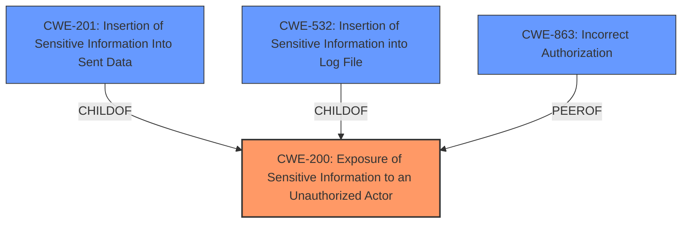

# Analysis for CVE-2020-14329

# Summary
| CWE ID | CWE Name | Confidence | CWE Abstraction Level | CWE Vulnerability Mapping Label | CWE-Vulnerability Mapping Notes |
|---|---|---|---|---|---|
| CWE-200 | Exposure of Sensitive Information to an Unauthorized Actor | 0.9 | Class | Primary | Discouraged: However, most appropriate given the available evidence. |
| CWE-863 | Incorrect Authorization | 0.7 | Class | Secondary | Allowed-with-Review:  Could be a contributing factor, but evidence is limited. |

## Evidence and Confidence

*   **Confidence Score:** 0.8
*   **Evidence Strength:** MEDIUM

## Relationship Analysis
The primary relationship influencing the decision is the ChildOf relationship of CWE-201 and CWE-532 to CWE-200.
CWE-863 has a ChildOf relationship to CWE-285 (Improper Authorization), but there is no evidence of missing authorization checks, only that the authorization was incorrect.

## Vulnerability Chain
The vulnerability chain starts with **inadequate access control** in the `/api/v2/labels/` endpoint, which leads to **sensitive data exposure**, ultimately resulting in a **confidentiality breach**.

## Summary of Analysis
The initial analysis identified the **data exposure flaw** as the primary weakness. The evidence provided points towards the `/api/v2/labels/` endpoint exposing labels associated with different organizations, including their names, due to **inadequate access control**. This allows users from one organization to retrieve data from other organizations, leading to a **confidentiality breach**.

CWE-200 (Exposure of Sensitive Information to an Unauthorized Actor) is chosen as the primary CWE because the vulnerability description explicitly mentions **data exposure** and a **confidentiality breach**. The CVE Reference Links Content Summary supports this, stating "The primary weakness is that the `/api/v2/labels/` endpoint exposes labels associated with different organizations, including their names."

Although CWE-200 is discouraged, the alternatives are not a better fit.  CWE-201 requires explicit insertion of sensitive information. CWE-532 is about logging.

CWE-863 (Incorrect Authorization) is considered as a secondary CWE because the vulnerability involves users from other organizations being able to access labels. The summary states that "The endpoint lacks proper access controls, allowing users from one organization to retrieve data from other organizations within the system." However, the evidence does not explicitly state that an authorization check occurred incorrectly, only that access was granted inappropriately.

The selected CWEs are at the appropriate level of specificity. CWE-200 is a Class, which is higher-level, but the evidence isn't strong enough to go to a Base.

Relevant CWE Information:

# Enhanced Context (25 CWEs)
The following CWEs were identified as potentially relevant to this vulnerability:

## CWE-668: Exposure of Resource to Wrong Sphere
**Abstraction Level**: Class
**Similarity Score**: 0.76
**Source**: dense

**Description**:
The product exposes a resource to the wrong control sphere, providing unintended actors with inappropriate access to the resource.

**Mapping Guidance**:
- Usage: Discouraged
- Rationale: CWE-668 is high-level and is often misused as a catch-all when lower-level CWE IDs might be applicable. It is sometimes used for low-information vulnerability reports [REF-1287]. It is a level-1 Class (i.e., a child of a Pillar). It is not useful for trend analysis.

## CWE-538: Insertion of Sensitive Information into Externally-Accessible File or Directory
**Abstraction Level**: Base
**Similarity Score**: 0.76
**Source**: dense

**Description**:
The product places sensitive information into files or directories that are accessible to actors who are allowed to have access to the files, but not to the sensitive information.

**Mapping Guidance**:
- Usage: Allowed
- Rationale: This CWE entry is at the Base level of abstraction, which is a preferred level of abstraction for mapping to the root causes of vulnerabilities.

## CWE-226: Sensitive Information in Resource Not Removed Before Reuse
**Abstraction Level**: Base
**Similarity Score**: 0.76
**Source**: dense

**Description**:
The product releases a resource such as memory or a file so that it can be made available for reuse, but it does not clear or "zeroize" the information contained in the resource before the product performs a critical state transition or makes the resource available for reuse by other entities.

**Mapping Guidance**:
- Usage: Allowed
- Rationale: This CWE entry is at the Base level of abstraction, which is a preferred level of abstraction for mapping to the root causes of vulnerabilities.

## CWE-639: Authorization Bypass Through User-Controlled Key
**Abstraction Level**: Base
**Similarity Score**: 0.76
**Source**: dense

**Description**:
The system's authorization functionality does not prevent one user from gaining access to another user's data or record by modifying the key value identifying the data.

**Mapping Guidance**:
- Usage: Allowed
- Rationale: This CWE entry is at the Base level of abstraction, which is a preferred level of abstraction for mapping to the root causes of vulnerabilities.

## CWE-497: Exposure of Sensitive System Information to an Unauthorized Control Sphere
**Abstraction Level**: Base
**Similarity Score**: 0.75
**Source**: dense

**Description**:
The product does not properly prevent sensitive system-level information from being accessed by unauthorized actors who do not have the same level of access to the underlying system as the product does.

**Mapping Guidance**:
- Usage: Allowed
- Rationale: This CWE entry is at the Base level of abstraction, which is a preferred level of abstraction for mapping to the root causes of vulnerabilities.

## CWE-807: Reliance on Untrusted Inputs in a Security Decision
**Abstraction Level**: Base
**Similarity Score**: 0.75
**Source**: dense

**Description**:
The product uses a protection mechanism that relies on the existence or values of an input, but the input can be modified by an untrusted actor in a way that bypasses the protection mechanism.

**Mapping Guidance**:
- Usage: Allowed
- Rationale: This CWE entry is at the Base level of abstraction, which is a preferred level of abstraction for mapping to the root causes of vulnerabilities.

## CWE-212: Improper Removal of Sensitive Information Before Storage or Transfer
**Abstraction Level**: Base
**Similarity Score**: 0.75
**Source**: dense

**Description**:
The product stores, transfers, or shares a resource that contains sensitive information, but it does not properly remove that information before the product makes the resource available to unauthorized actors.

**Mapping Guidance**:
- Usage: Allowed
- Rationale: This CWE entry is at the Base level of abstraction, which is a preferred level of abstraction for mapping to the root causes of vulnerabilities.

## CWE-404: Improper Resource Shutdown or Release
**Abstraction Level**: Class
**Similarity Score**: 0.75
**Source**: dense

**Description**:
The product does not release or incorrectly releases a resource before it is made available for re-use.

**Mapping Guidance**:
- Usage: Allowed-with-Review
- Rationale: This CWE entry is a Class and might have Base-level children that would be more appropriate

## CWE-303: Incorrect Implementation of Authentication Algorithm
**Abstraction Level**: Base
**Similarity Score**: 0.75
**Source**: dense

**Description**:
The requirements for the product dictate the use of an established authentication algorithm, but the implementation of the algorithm is incorrect.

**Mapping Guidance**:
- Usage: Allowed
- Rationale: This CWE entry is at the Base level of abstraction, which is a preferred level of abstraction for mapping to the root causes of vulnerabilities.

## CWE-274: Improper Handling of Insufficient Privileges
**Abstraction Level**: Base
**Similarity Score**: 0.75
**Source**: dense

**Description**:
The product does not handle or incorrectly handles when it has insufficient privileges to perform an operation, leading to resultant weaknesses.

**Mapping Guidance**:
- Usage: Discouraged
- Rationale: This CWE entry could be deprecated in a future version of CWE.

## CWE-639: Authorization Bypass Through User-Controlled Key
**Abstraction Level**: Base
**Similarity Score**: 7052.18
**

# Enhanced Query for CVE-2020-14329

## Vulnerability Description
A **data exposure flaw** was found in Ansible Tower in versions before 3.7.2, where sensitive data can be exposed from the /api/v2/labels/ endpoint. This flaw allows users from other organizations in the system to retrieve any label from the organization and also disclose organization names. The highest threat from this vulnerability is to confidentiality.

### Vulnerability Description Key Phrases
- **weakness:** **data exposure flaw**
- **impact:** retrieve any label from the organization and disclose organization names
- **attacker:** users from other organizations
- **product:** Ansible Tower
- **version:** before 3.7.2
- **component:** /api/v2/labels/ endpoint

## CVE Reference Links Content Summary
Based on the provided content, here's a breakdown of the vulnerability described in CVE-2020-14329:

**Root Cause:**
- The vulnerability stems from an issue in the `/api/v2/labels/` endpoint of Ansible Tower. This endpoint was accessible to all logged-in users, regardless of their organization affiliation.

**Weaknesses/Vulnerabilities:**
- **Sensitive Data Exposure:** The primary weakness is that the `/api/v2/labels/` endpoint exposes labels associated with different organizations, including their names.
- **Inadequate Access Control:** The endpoint lacks proper access controls, allowing users from one organization to retrieve data from other organizations within the system.

**Impact of Exploitation:**
- **Confidentiality Breach:** The primary impact is a breach of confidentiality, as users can access sensitive information about other organizations' labels and organization names, which they normally would not have access to.

**Attack Vectors:**
- **Network Access:** The vulnerability is exploited via the network by sending a request to the vulnerable endpoint.

**Required Attacker Capabilities/Position:**
- **Authenticated User:** The attacker must be a logged-in user of the Ansible Tower system. No special privileges are needed other than basic authentication.

**Additional Notes:**
- The vulnerability affects Ansible Tower 3.7.1 and previous versions.
- The vulnerability was fixed in Ansible Tower 3.7.2.
- The vulnerability was addressed in Red Hat Ansible Tower 3.7 for RHEL 7 via RHSA-2020:3328.

## Retriever Results

### Top Combined Results

| Rank | CWE ID | Name | Abstraction | Usage  | Retrievers | Individual Scores |
|------|--------|------|-------------|-------|------------|-------------------|
| 1 | 200 | Exposure of Sensitive Information to an Unauthorized Actor | Class | Discouraged | sparse | 0.357 |
| 2 | 201 | Insertion of Sensitive Information Into Sent Data | Base | Allowed | sparse | 0.337 |
| 3 | 863 | Incorrect Authorization | Class | Allowed-with-Review | sparse | 0.333 |
| 4 | 285 | Improper Authorization | Class | Discouraged | sparse | 0.329 |
| 5 | 639 | Authorization Bypass Through User-Controlled Key | Base | Allowed | sparse | 0.321 |
| 6 | 532 | Insertion of Sensitive Information into Log File | Base | Allowed | dense | 0.548 |
| 7 | 226 | Sensitive Information in Resource Not Removed Before Reuse | Base | Allowed | graph | 0.002 |
| 8 | 668 | Exposure of Resource to Wrong Sphere | Class | Discouraged | sparse | 0.309 |
| 9 | 842 | Placement of User into Incorrect Group | Base | Allowed | sparse | 0.299 |
| 10 | 287 | Improper Authentication | Class | Discouraged | sparse | 0.298 |

# Complete CWE Specifications

## CWE-200: Exposure of Sensitive Information to an Unauthorized Actor
**Abstraction:** Class
**Status:** Draft

### Description
The product exposes sensitive information to an actor that is not explicitly authorized to have access to that information.

### Extended Description

There are many different kinds of mistakes that introduce information exposures. The severity of the error can range widely, depending on the context in which the product operates, the type of sensitive information that is revealed, and the benefits it may provide to an attacker. Some kinds of sensitive information include:

  - private, personal information, such as personal messages, financial data, health records, geographic location, or contact details

  - system status and environment, such as the operating system and installed packages

  - business secrets and intellectual property

  - network status and configuration

  - the product's own code or internal state

  - metadata, e.g. logging of connections or message headers

  - indirect information, such as a discrepancy between two internal operations that can be observed by an outsider

Information might be sensitive to different parties, each of which may have their own expectations for whether the information should be protected. These parties include:

  - the product's own users

  - people or organizations whose information is created or used by the product, even if they are not direct product users

  - the product's administrators, including the admins of the system(s) and/or networks on which the product operates

  - the developer

Information exposures can occur in different ways:

  - the code  **explicitly inserts**  sensitive information into resources or messages that are intentionally made accessible to unauthorized actors, but should not contain the information - i.e., the information should have been "scrubbed" or "sanitized"

  - a different weakness or mistake  **indirectly inserts**  the sensitive information into resources, such as a web script error revealing the full system path of the program.

  - the code manages resources that intentionally contain sensitive information, but the resources are  **unintentionally made accessible**  to unauthorized actors. In this case, the information exposure is resultant - i.e., a different weakness enabled the access to the information in the first place.

It is common practice to describe any loss of confidentiality as an "information exposure," but this can lead to overuse of CWE-200 in CWE mapping. From the CWE perspective, loss of confidentiality is a technical impact that can arise from dozens of different weaknesses, such as insecure file permissions or out-of-bounds read. CWE-200 and its lower-level descendants are intended to cover the mistakes that occur in behaviors that explicitly manage, store, transfer, or cleanse sensitive information.

### Alternative Terms
Information Disclosure: This term is frequently used in vulnerability advisories to describe a consequence or technical impact, for any vulnerability that has a loss of confidentiality. Often, CWE-200 can be misused to represent the loss of confidentiality, even when the mistake - i.e., the weakness - is not directly related to the mishandling of the information itself, such as an out-of-bounds read that accesses sensitive memory contents; here, the out-of-bounds read is the primary weakness, not the disclosure of the memory. In addition, this phrase is also used frequently in policies and legal documents, but it does not refer to any disclosure of security-relevant information.
Information Leak: This is a frequently used term, however the "leak" term has multiple uses within security. In some cases it deals with the accidental exposure of information from a different weakness, but in other cases (such as "memory leak"), this deals with improper tracking of resources, which can lead to exhaustion. As a result, CWE is actively avoiding usage of the "leak" term.

### Relationships
ChildOf -> CWE-668

### Mapping Guidance
**Usage:** Discouraged
**Rationale:** CWE-200 is commonly misused to represent the loss of confidentiality in a vulnerability, but confidentiality loss is a technical impact - not a root cause error. As of CWE 4.9, over 400 CWE entries can lead to a loss of confidentiality. Other options are often available. [REF-1287].
**Comments:** If an error or mistake causes information to be disclosed, then use the CWE ID for that error. Consider starting with improper authorization (CWE-285), insecure permissions (CWE-732), improper authentication (CWE-287), etc. Also consider children such as Insertion of Sensitive Information Into Sent Data (CWE-201), Observable Discrepancy (CWE-203), Insertion of Sensitive Information into Externally-Accessible File or Directory (CWE-538), or others.
**Reasons:**
- Frequent Misuse

### Additional Notes
**[Maintenance]** As a result of mapping analysis in the 2020 Top 25 and more recent versions, this weakness is under review, since it is frequently misused in mapping to cover many problems that lead to loss of confidentiality. See Mapping Notes, Extended Description, and Alternate Terms.

### Observed Examples
- **CVE-2022-31162:** Rust library leaks Oauth client details in application debug logs
- **CVE-2021-25476:** Digital Rights Management (DRM) capability for mobile platform leaks pointer information, simplifying ASLR bypass
- **CVE-2001-1483:** Enumeration of valid usernames based on inconsistent responses

## CWE-201: Insertion of Sensitive Information Into Sent Data
**Abstraction:** Base
**Status:** Draft

### Description
The code transmits data to another actor, but a portion of the data includes sensitive information that should not be accessible to that actor.

### Extended Description
Not provided

### Alternative Terms
None

### Relationships
ChildOf -> CWE-200
CanAlsoBe -> CWE-209
CanAlsoBe -> CWE-202

### Mapping Guidance
**Usage:** Allowed
**Rationale:** This CWE entry is at the Base level of abstraction, which is a preferred level of abstraction for mapping to the root causes of vulnerabilities.
**Comments:** Carefully read both the name and description to ensure that this mapping is an appropriate fit. Do not try to 'force' a mapping to a lower-level Base/Variant simply to comply with this preferred level of abstraction.
**Reasons:**
- Acceptable-Use

### Additional Notes
**[Other]** Sensitive information could include data that is sensitive in and of itself (such as credentials or private messages), or otherwise useful in the further exploitation of the system (such as internal file system structure).

### Observed Examples
- **CVE-2022-0708:** Collaboration platform does not clear team emails in a response, allowing leak of email addresses

## CWE-863: Incorrect Authorization
**Abstraction:** Class
**Status:** Incomplete

### Description
The product performs an authorization check when an actor attempts to access a resource or perform an action, but it does not correctly perform the check.

### Extended Description
Not provided

### Alternative Terms
AuthZ: "AuthZ" is typically used as an abbreviation of "authorization" within the web application security community. It is distinct from "AuthN" (or, sometimes, "AuthC") which is an abbreviation of "authentication." The use of "Auth" as an abbreviation is discouraged, since it could be used for either authentication or authorization.

### Relationships
ChildOf -> CWE-285
ChildOf -> CWE-284

### Mapping Guidance
**Usage:** Allowed-with-Review
**Rationale:** This CWE entry is a Class and might have Base-level children that would be more appropriate
**Comments:** Examine children of this entry to see if there is a better fit
**Reasons:**
- Abstraction

### Additional Notes
**[Terminology]** 

Assuming a user with a given identity, authorization is the process of determining whether that user can access a given resource, based on the user's privileges and any permissions or other access-control specifications that apply to the resource.

### Observed Examples
- **CVE-2021-39155:** Chain: A microservice integration and management platform compares the hostname in the HTTP Host header in a case-sensitive way (CWE-178, CWE-1289), allowing bypass of the authorization policy (CWE-863) using a hostname with mixed case or other variations.
- **CVE-2019-15900:** Chain: sscanf() call is used to check if a username and group exists, but the return value of sscanf() call is not checked (CWE-252), causing an uninitialized variable to be checked (CWE-457), returning success to allow authorization bypass for executing a privileged (CWE-863).
- **CVE-2009-2213:** Gateway uses default "Allow" configuration for its authorization settings.

## CWE-285: Improper Authorization
**Abstraction:** Class
**Status:** Draft

### Description
The product does not perform or incorrectly performs an authorization check when an actor attempts to access a resource or perform an action.

### Extended Description

Assuming a user with a given identity, authorization is the process of determining whether that user can access a given resource, based on the user's privileges and any permissions or other access-control specifications that apply to the resource.

When access control checks are not applied consistently - or not at all - users are able to access data or perform actions that they should not be allowed to perform. This can lead to a wide range of problems, including information exposures, denial of service, and arbitrary code execution.

### Alternative Terms
AuthZ: "AuthZ" is typically used as an abbreviation of "authorization" within the web application security community. It is distinct from "AuthN" (or, sometimes, "AuthC") which is an abbreviation of "authentication." The use of "Auth" as an abbreviation is discouraged, since it could be used for either authentication or authorization.

### Relationships
ChildOf -> CWE-284
ChildOf -> CWE-284

### Mapping Guidance
**Usage:** Discouraged
**Rationale:** CWE-285 is high-level and lower-level CWEs can frequently be used instead. It is a level-1 Class (i.e., a child of a Pillar).
**Comments:** Look at CWE-285's children and consider mapping to CWEs such as CWE-862: Missing Authorization, CWE-863: Incorrect Authorization, CWE-732: Incorrect Permission Assignment for Critical Resource, or others.
**Reasons:**
- Abstraction
**Suggested Alternatives:**
- CWE-862: Missing Authorization
- CWE-863: Incorrect Authorization
- CWE-732: Incorrect Permission Assignment for Critical Resource

### Observed Examples
- **CVE-2022-24730:** Go-based continuous deployment product does not check that a user has certain privileges to update or create an app, allowing adversaries to read sensitive repository information
- **CVE-2009-3168:** Web application does not restrict access to admin scripts, allowing authenticated users to reset administrative passwords.
- **CVE-2009-2960:** Web application does not restrict access to admin scripts, allowing authenticated users to modify passwords of other users.

## CWE-639: Authorization Bypass Through User-Controlled Key
**Abstraction:** Base
**Status:** Incomplete

### Description
The system's authorization functionality does not prevent one user from gaining access to another user's data or record by modifying the key value identifying the data.

### Extended Description

Retrieval of a user record occurs in the system based on some key value that is under user control. The key would typically identify a user-related record stored in the system and would be used to lookup that record for presentation to the user. It is likely that an attacker would have to be an authenticated user in the system. However, the authorization process would not properly check the data access operation to ensure that the authenticated user performing the operation has sufficient entitlements to perform the requested data access, hence bypassing any other authorization checks present in the system.

For example, attackers can look at places where user specific data is retrieved (e.g. search screens) and determine whether the key for the item being looked up is controllable externally. The key may be a hidden field in the HTML form field, might be passed as a URL parameter or as an unencrypted cookie variable, then in each of these cases it will be possible to tamper with the key value.

One manifestation of this weakness is when a system uses sequential or otherwise easily-guessable session IDs that would allow one user to easily switch to another user's session and read/modify their data.

### Alternative Terms
Insecure Direct Object Reference / IDOR: The "Insecure Direct Object Reference" term, as described in the OWASP Top Ten, is broader than this CWE because it also covers path traversal (CWE-22). Within the context of vulnerability theory, there is a similarity between the OWASP concept and CWE-706: Use of Incorrectly-Resolved Name or Reference.
Broken Object Level Authorization / BOLA: BOLA is used in the 2019 OWASP API Security Top 10 and is said to be the same as IDOR.
Horizontal Authorization: "Horizontal Authorization" is used to describe situations in which two users have the same privilege level, but must be prevented from accessing each other's resources. This is fairly common when using key-based access to resources in a multi-user context.

### Relationships
ChildOf -> CWE-863
ChildOf -> CWE-863
ChildOf -> CWE-284

### Mapping Guidance
**Usage:** Allowed
**Rationale:** This CWE entry is at the Base level of abstraction, which is a preferred level of abstraction for mapping to the root causes of vulnerabilities.
**Comments:** Carefully read both the name and description to ensure that this mapping is an appropriate fit. Do not try to 'force' a mapping to a lower-level Base/Variant simply to comply with this preferred level of abstraction.
**Reasons:**
- Acceptable-Use

### Observed Examples
- **CVE-2021-36539:** An educational application does not appropriately restrict file IDs to a particular user. The attacker can brute-force guess IDs, indicating IDOR.

## CWE-532: Insertion of Sensitive Information into Log File
**Abstraction:** Base
**Status:** Incomplete

### Description
The product writes sensitive information to a log file.

### Extended Description
Not provided

### Alternative Terms
None

### Relationships
ChildOf -> CWE-538
ChildOf -> CWE-200

### Mapping Guidance
**Usage:** Allowed
**Rationale:** This CWE entry is at the Base level of abstraction, which is a preferred level of abstraction for mapping to the root causes of vulnerabilities.
**Comments:** Carefully read both the name and description to ensure that this mapping is an appropriate fit. Do not try to 'force' a mapping to a lower-level Base/Variant simply to comply with this preferred level of abstraction.
**Reasons:**
- Acceptable-Use

### Observed Examples
- **CVE-2017-9615:** verbose logging stores admin credentials in a world-readable log file
- **CVE-2018-1999036:** SSH password for private key stored in build log

## CWE-226: Sensitive Information in Resource Not Removed Before Reuse
**Abstraction:** Base
**Status:** Draft

### Description
The product releases a resource such as memory or a file so that it can be made available for reuse, but it does not clear or "zeroize" the information contained in the resource before the product performs a critical state transition or makes the resource available for reuse by other entities.

### Extended Description

When resources are released, they can be made available for reuse. For example, after memory is de-allocated, an operating system may make the memory available to another process, or disk space may be reallocated when a file is deleted. As removing information requires time and additional resources, operating systems do not usually clear the previously written information.

Even when the resource is reused by the same process, this weakness can arise when new data is not as large as the old data, which leaves portions of the old data still available. Equivalent errors can occur in other situations where the length of data is variable but the associated data structure is not. If memory is not cleared after use, the information may be read by less trustworthy parties when the memory is reallocated.

This weakness can apply in hardware, such as when a device or system switches between power, sleep, or debug states during normal operation, or when execution changes to different users or privilege levels.

### Alternative Terms
None

### Relationships
ChildOf -> CWE-459
ChildOf -> CWE-212
CanPrecede -> CWE-201

### Mapping Guidance
**Usage:** Allowed
**Rationale:** This CWE entry is at the Base level of abstraction, which is a preferred level of abstraction for mapping to the root causes of vulnerabilities.
**Comments:** Carefully read both the name and description to ensure that this mapping is an appropriate fit. Do not try to 'force' a mapping to a lower-level Base/Variant simply to comply with this preferred level of abstraction.
**Reasons:**
- Acceptable-Use

### Additional Notes
**[Relationship]** There is a close association between CWE-226 and CWE-212. The difference is partially that of perspective. CWE-226 is geared towards the final stage of the resource lifecycle, in which the resource is deleted, eliminated, expired, or otherwise released for reuse. Technically, this involves a transfer to a different control sphere, in which the original contents of the resource are no longer relevant. CWE-212, however, is intended for sensitive data in resources that are intentionally shared with others, so they are still active. This distinction is useful from the perspective of the CWE research view (CWE-1000).

**[Maintenance]** This entry needs modification to clarify the differences with CWE-212. The description also combines two problems that are distinct from the CWE research perspective: the inadvertent transfer of information to another sphere, and improper initialization/shutdown. Some of the associated taxonomy mappings reflect these different uses.

**[Research Gap]** This is frequently found for network packets, but it can also exist in local memory allocation, files, etc.

### Observed Examples
- **CVE-2019-3733:** Cryptography library does not clear heap memory before release
- **CVE-2003-0001:** Ethernet NIC drivers do not pad frames with null bytes, leading to infoleak from malformed packets.
- **CVE-2003-0291:** router does not clear information from DHCP packets that have been previously used

## CWE-668: Exposure of Resource to Wrong Sphere
**Abstraction:** Class
**Status:** Draft

### Description
The product exposes a resource to the wrong control sphere, providing unintended actors with inappropriate access to the resource.

### Extended Description

Resources such as files and directories may be inadvertently exposed through mechanisms such as insecure permissions, or when a program accidentally operates on the wrong object. For example, a program may intend that private files can only be provided to a specific user. This effectively defines a control sphere that is intended to prevent attackers from accessing these private files. If the file permissions are insecure, then parties other than the user will be able to access those files.

A separate control sphere might effectively require that the user can only access the private files, but not any other files on the system. If the program does not ensure that the user is only requesting private files, then the user might be able to access other files on the system.

In either case, the end result is that a resource has been exposed to the wrong party.

### Alternative Terms
None

### Relationships
ChildOf -> CWE-664

### Mapping Guidance
**Usage:** Discouraged
**Rationale:** CWE-668 is high-level and is often misused as a catch-all when lower-level CWE IDs might be applicable. It is sometimes used for low-information vulnerability reports [REF-1287]. It is a level-1 Class (i.e., a child of a Pillar). It is not useful for trend analysis.
**Comments:** Closely analyze the specific mistake that is allowing the resource to be exposed, and perform a CWE mapping for that mistake.
**Reasons:**
- Frequent Misuse
- Abstraction

### Additional Notes
**[Theoretical]** A "control sphere" is a set of resources and behaviors that are accessible to a single actor, or a group of actors. A product's security model will typically define multiple spheres, possibly implicitly. For example, a server might define one sphere for "administrators" who can create new user accounts with subdirectories under /home/server/, and a second sphere might cover the set of users who can create or delete files within their own subdirectories. A third sphere might be "users who are authenticated to the operating system on which the product is installed." Each sphere has different sets of actors and allowable behaviors.

## CWE-842: Placement of User into Incorrect Group
**Abstraction:** Base
**Status:** Incomplete

### Description
The product or the administrator places a user into an incorrect group.

### Extended Description
If the incorrect group has more access or privileges than the intended group, the user might be able to bypass intended security policy to access unexpected resources or perform unexpected actions. The access-control system might not be able to detect malicious usage of this group membership.

### Alternative Terms
None

### Relationships
ChildOf -> CWE-286

### Mapping Guidance
**Usage:** Allowed
**Rationale:** This CWE entry is at the Base level of abstraction, which is a preferred level of abstraction for mapping to the root causes of vulnerabilities.
**Comments:** Carefully read both the name and description to ensure that this mapping is an appropriate fit. Do not try to 'force' a mapping to a lower-level Base/Variant simply to comply with this preferred level of abstraction.
**Reasons:**
- Acceptable-Use

### Observed Examples
- **CVE-1999-1193:** Operating system assigns user to privileged wheel group, allowing the user to gain root privileges.
- **CVE-2010-3716:** Chain: drafted web request allows the creation of users with arbitrary group membership.
- **CVE-2008-5397:** Chain: improper processing of configuration options causes users to contain unintended group memberships.

## CWE-287: Improper Authentication
**Abstraction:** Class
**Status:** Draft

### Description
When an actor claims to have a given identity, the product does not prove or insufficiently proves that the claim is correct.

### Extended Description
Not provided

### Alternative Terms
authentification: An alternate term is "authentification", which appears to be most commonly used by people from non-English-speaking countries.
AuthN: "AuthN" is typically used as an abbreviation of "authentication" within the web application security community. It is also distinct from "AuthZ," which is an abbreviation of "authorization." The use of "Auth" as an abbreviation is discouraged, since it could be used for either authentication or authorization.
AuthC: "AuthC" is used as an abbreviation of "authentication," but it appears to used less frequently than "AuthN."

### Relationships
ChildOf -> CWE-284
ChildOf -> CWE-284

### Mapping Guidance
**Usage:** Discouraged
**Rationale:** This CWE entry might be misused when lower-level CWE entries are likely to be applicable. It is a level-1 Class (i.e., a child of a Pillar).
**Comments:** Consider children or descendants, beginning with CWE-1390: Weak Authentication or CWE-306: Missing Authentication for Critical Function.
**Reasons:**
- Frequent Misuse
**Suggested Alternatives:**
- CWE-1390: Weak Authentication
- CWE-306: Missing Authentication for Critical Function

### Additional Notes
**[Relationship]** This can be resultant from SQL injection vulnerabilities and other issues.

**[Maintenance]** The Taxonomy_Mappings to ISA/IEC 62443 were added in CWE 4.10, but they are still under review and might change in future CWE versions. These draft mappings were performed by members of the "Mapping CWE to 62443" subgroup of the CWE-CAPEC ICS/OT Special Interest Group (SIG), and their work is incomplete as of CWE 4.10. The mappings are included to facilitate discussion and review by the broader ICS/OT community, and they are likely to change in future CWE versions.

### Observed Examples
- **CVE-2022-35248:** Chat application skips validation when Central Authentication Service (CAS) is enabled, effectively removing the second factor from two-factor authentication
- **CVE-2022-36436:** Python-based authentication proxy does not enforce password authentication during the initial handshake, allowing the client to bypass authentication by specifying a 'None' authentication type.
- **CVE-2022-30034:** Chain: Web UI for a Python RPC framework does not use regex anchors to validate user login emails (CWE-777), potentially allowing bypass of OAuth (CWE-1390).

