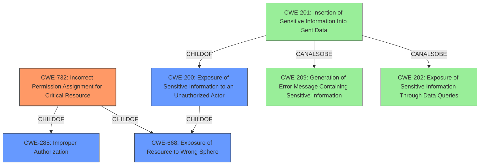

# Analysis for CVE-2020-14335

# Summary
| CWE ID | CWE Name | Confidence | CWE Abstraction Level | CWE Vulnerability Mapping Label | CWE-Vulnerability Mapping Notes |
|---|---|---|---|---|---|
| CWE-732 | Incorrect Permission Assignment for Critical Resource | 0.9 | Class | Allowed-with-Review | Primary CWE |
| CWE-200 | Exposure of Sensitive Information to an Unauthorized Actor | 0.6 | Class | Discouraged | Secondary Candidate |

## Evidence and Confidence

*   **Confidence Score:** 0.75
*   **Evidence Strength:** HIGH

## Relationship Analysis
The primary CWE selected is CWE-732, which is a Class-level CWE. It has hierarchical relationships with CWE-285 (Improper Authorization) and CWE-668 (Exposure of Resource to Wrong Sphere). While CWE-732 itself suggests an assignment of permissions, the mapping guidance indicates it's often misused when permissions are not checked, aligning with authorization weaknesses. Therefore, a child of CWE-285 might be a more appropriate fit. CWE-200, another Class-level CWE, is a parent of CWE-201 (Insertion of Sensitive Information Into Sent Data) and has peer relationships with CWE-209 (Generation of Error Message Containing Sensitive Information) and CWE-202 (Exposure of Sensitive Information Through Data Queries). The decision favors CWE-732 due to the **incorrect** permission assignment being the root cause, rather than a broader information exposure.

## Vulnerability Chain
The vulnerability chain starts with the **incorrect** permission assignment on the OMAPI secret file, making it world-readable. This leads to the exposure of the secret, which then allows an attacker to gain control of DHCP records. The chain can be visualized as:

1.  **Incorrect Permission Assignment (CWE-732)**: The root cause, where the OMAPI secret file has overly permissive access rights.
2.  **Exposure of Sensitive Information (CWE-200)**: The direct consequence of the **incorrect** permission assignment, where the secret is readable by unauthorized actors.
3.  **Control of DHCP Records**: The impact of exploiting the exposed secret, leading to potential system availability issues.

## Summary of Analysis
The initial analysis pointed towards CWE-732 (Incorrect Permission Assignment for Critical Resource) as the primary weakness, supported by the evidence that the OMAPI secret file was world-readable. The retriever results also listed CWE-732 as a potential candidate. The vulnerability description states, "This flaw allows a privileged attacker to read OMAPI secrets through the ISC DHCP of Smart-Proxy." The CVE Reference Links Content Summary confirms this by stating, "The root cause is that the OMAPI (Object Management API) secret for the ISC DHCP server in Red Hat Satellite's Smart-Proxy is world-readable."

While CWE-200 (Exposure of Sensitive Information to an Unauthorized Actor) was considered, the mapping guidance discourages its use as a general catch-all for confidentiality loss. Instead, it suggests identifying the underlying error, which in this case is the **incorrect** permission assignment.

The selection of CWE-732 is at an optimal level of specificity because it directly addresses the root cause of the vulnerability: the **incorrect** configuration of file permissions that allowed unauthorized access to a critical resource. While a more specific child of CWE-732 or CWE-285 might exist, the available evidence does not pinpoint a specific authorization flaw beyond the general **incorrect** assignment of permissions.
Therefore, based on the available evidence, CWE-732 is the most accurate and specific representation of the vulnerability's root cause.

Relevant CWE Information:
# Enhanced Context (25 CWEs)

## CWE-732: Incorrect Permission Assignment for Critical Resource
**Abstraction Level**: Class
**Similarity Score**: 0.103
**Source**: sparse

**Description**:
The product specifies permissions for a security-critical resource in a way that allows that resource to be read or modified by unintended actors.

# Enhanced Query for CVE-2020-14335

## Vulnerability Description
A flaw was found in Red Hat Satellite, which allows a privileged attacker to read OMAPI secrets through the ISC DHCP of Smart-Proxy. This flaw allows an attacker to gain control of DHCP records from the network. The highest threat from this vulnerability is to system availability.

### Vulnerability Description Key Phrases
- **impact:** read OMAPI secrets
- **attacker:** privileged attacker
- **product:** Red Hat Satellite
- **component:** ISC DHCP of Smart-Proxy

## CVE Reference Links Content Summary
Based on the provided content, here's the breakdown of CVE-2020-14335:

**Root Cause of Vulnerability:**
The root cause is that the OMAPI (Object Management API) secret for the ISC DHCP server in Red Hat Satellite's Smart-Proxy is world-readable. By default, the ISC DHCP server listens on all interfaces for OMAPI interaction.

**Weaknesses/Vulnerabilities Present:**
- **World-readable OMAPI secret:** The OMAPI secret, which is meant to be private, is accessible to any local user of the Smart-Proxy system.
- **Default listening on all interfaces:** The ISC DHCP server listens on all interfaces for OMAPI interactions by default, making the secret more easily accessible.

**Impact of Exploitation:**
- **Control of DHCP records:** An attacker who can read the OMAPI secret can gain control of DHCP records on the network.
- **System availability:** The highest threat from this vulnerability is to system availability, as the attacker can manipulate network configurations via DHCP.

**Attack Vectors:**
- **Local Access:** A local user on the Smart-Proxy system is required to exploit this vulnerability.
- **ISC DHCP Server:** Exploitation occurs through the ISC DHCP server by interacting with its OMAPI interface.

**Required Attacker Capabilities/Position:**
- The attacker needs to have local access to the Smart-Proxy system where the ISC DHCP server is running.
- The attacker needs to have the capability to interact with the ISC DHCP server's OMAPI interface.

**Additional Information:**

- The vulnerability was addressed in Red Hat Satellite 6.8 for RHEL 7 via RHSA-2021:1313.
- The bug report mentions that no readily available mitigation met Red Hat's criteria for ease of use, deployment, and stability at the time of discovery.
- The vulnerability was reported by Peter Bray (illumino Pty Ltd, Australia).

## Retriever Results

### Top Combined Results

| Rank | CWE ID | Name | Abstraction | Usage  | Retrievers | Individual Scores |
|------|--------|------|-------------|-------|------------|-------------------|
| 1 | 732 | Incorrect Permission Assignment for Critical Resource | Class | Allowed-with-Review | sparse | 0.103 |
| 2 | 201 | Insertion of Sensitive Information Into Sent Data | Base | Allowed | sparse | 0.100 |
| 3 | 200 | Exposure of Sensitive Information to an Unauthorized Actor | Class | Discouraged | sparse | 0.096 |
| 4 | 532 | Insertion of Sensitive Information into Log File | Base | Allowed | sparse | 0.096 |
| 5 | 285 | Improper Authorization | Class | Discouraged | sparse | 0.095 |
| 6 | 918 | Server-Side Request Forgery (SSRF) | Base | Allowed | dense | 0.536 |
| 7 | 226 | Sensitive Information in Resource Not Removed Before Reuse | Base | Allowed | graph | 0.002 |
| 8 | 863 | Incorrect Authorization | Class | Allowed-with-Review | sparse | 0.095 |
| 9 | 287 | Improper Authentication | Class | Discouraged | sparse | 0.093 |
| 10 | 923 | Improper Restriction of Communication Channel to Intended Endpoints | Class | Allowed-with-Review | sparse | 0.092 |

# Complete CWE Specifications

## CWE-732: Incorrect Permission Assignment for Critical Resource
**Abstraction:** Class
**Status:** Draft

### Description
The product specifies permissions for a security-critical resource in a way that allows that resource to be read or modified by unintended actors.

### Extended Description
When a resource is given a permission setting that provides access to a wider range of actors than required, it could lead to the exposure of sensitive information, or the modification of that resource by unintended parties. This is especially dangerous when the resource is related to program configuration, execution, or sensitive user data. For example, consider a misconfigured storage account for the cloud that can be read or written by a public or anonymous user.

### Alternative Terms
None

### Relationships
ChildOf -> CWE-285
ChildOf -> CWE-668

### Mapping Guidance
**Usage:** Allowed-with-Review
**Rationale:** While the name itself indicates an assignment of permissions for resources, this is often misused for vulnerabilities in which "permissions" are not checked, which is an "authorization" weakness (CWE-285 or descendants) within CWE's model [REF-1287].
**Comments:** Closely analyze the specific mistake that is allowing the resource to be exposed, and perform a CWE mapping for that mistake.
**Reasons:**
- Frequent Misuse

### Additional Notes
**[Maintenance]** The relationships between privileges, permissions, and actors (e.g. users and groups) need further refinement within the Research view. One complication is that these concepts apply to two different pillars, related to control of resources (CWE-664) and protection mechanism failures (CWE-693).

### Observed Examples
- **CVE-2022-29527:** Go application for cloud management creates a world-writable sudoers file that allows local attackers to inject sudo rules and escalate privileges to root by winning a race condition.
- **CVE-2009-3482:** Anti-virus product sets insecure "Everyone: Full Control" permissions for files under the "Program Files" folder, allowing attackers to replace executables with Trojan horses.
- **CVE-2009-3897:** Product creates directories with 0777 permissions at installation, allowing users to gain privileges and access a socket used for authentication.

## CWE-201: Insertion of Sensitive Information Into Sent Data
**Abstraction:** Base
**Status:** Draft

### Description
The code transmits data to another actor, but a portion of the data includes sensitive information that should not be accessible to that actor.

### Extended Description
Not provided

### Alternative Terms
None

### Relationships
ChildOf -> CWE-200
CanAlsoBe -> CWE-209
CanAlsoBe -> CWE-202

### Mapping Guidance
**Usage:** Allowed
**Rationale:** This CWE entry is at the Base level of abstraction, which is a preferred level of abstraction for mapping to the root causes of vulnerabilities.
**Comments:** Carefully read both the name and description to ensure that this mapping is an appropriate fit. Do not try to 'force' a mapping to a lower-level Base/Variant simply to comply with this preferred level of abstraction.
**Reasons:**
- Acceptable-Use

### Additional Notes
**[Other]** Sensitive information could include data that is sensitive in and of itself (such as credentials or private messages), or otherwise useful in the further exploitation of the system (such as internal file system structure).

### Observed Examples
- **CVE-2022-0708:** Collaboration platform does not clear team emails in a response, allowing leak of email addresses

## CWE-200: Exposure of Sensitive Information to an Unauthorized Actor
**Abstraction:** Class
**Status:** Draft

### Description
The product exposes sensitive information to an actor that is not explicitly authorized to have access to that information.

### Extended Description

There are many different kinds of mistakes that introduce information exposures. The severity of the error can range widely, depending on the context in which the product operates, the type of sensitive information that is revealed, and the benefits it may provide to an attacker. Some kinds of sensitive information include:

  - private, personal information, such as personal messages, financial data, health records, geographic location, or contact details

  - system status and environment, such as the operating system and installed packages

  - business secrets and intellectual property

  - network status and configuration

  - the product's own code or internal state

  - metadata, e.g. logging of connections or message headers

  - indirect information, such as a discrepancy between two internal operations that can be observed by an outsider

Information might be sensitive to different parties, each of which may have their own expectations for whether the information should be protected. These parties include:

  - the product's own users

  - people or organizations whose information is created or used by the product, even if they are not direct product users

  - the product's administrators, including the admins of the system(s) and/or networks on which the product operates

  - the developer

Information exposures can occur in different ways:

  - the code  **explicitly inserts**  sensitive information into resources or messages that are intentionally made accessible to unauthorized actors, but should not contain the information - i.e., the information should have been "scrubbed" or "sanitized"

  - a different weakness or mistake  **indirectly inserts**  the sensitive information into resources, such as a web script error revealing the full system path of the program.

  - the code manages resources that intentionally contain sensitive information, but the resources are  **unintentionally made accessible**  to unauthorized actors. In this case, the information exposure is resultant - i.e., a different weakness enabled the access to the information in the first place.

It is common practice to describe any loss of confidentiality as an "information exposure," but this can lead to overuse of CWE-200 in CWE mapping. From the CWE perspective, loss of confidentiality is a technical impact that can arise from dozens of different weaknesses, such as insecure file permissions or out-of-bounds read. CWE-200 and its lower-level descendants are intended to cover the mistakes that occur in behaviors that explicitly manage, store, transfer, or cleanse sensitive information.

### Alternative Terms
Information Disclosure: This term is frequently used in vulnerability advisories to describe a consequence or technical impact, for any vulnerability that has a loss of confidentiality. Often, CWE-200 can be misused to represent the loss of confidentiality, even when the mistake - i.e., the weakness - is not directly related to the mishandling of the information itself, such as an out-of-bounds read that accesses sensitive memory contents; here, the out-of-bounds read is the primary weakness, not the disclosure of the memory. In addition, this phrase is also used frequently in policies and legal documents, but it does not refer to any disclosure of security-relevant information.
Information Leak: This is a frequently used term, however the "leak" term has multiple uses within security. In some cases it deals with the accidental exposure of information from a different weakness, but in other cases (such as "memory leak"), this deals with improper tracking of resources, which can lead to exhaustion. As a result, CWE is actively avoiding usage of the "leak" term.

### Relationships
ChildOf -> CWE-668

### Mapping Guidance
**Usage:** Discouraged
**Rationale:** CWE-200 is commonly misused to represent the loss of confidentiality in a vulnerability, but confidentiality loss is a technical impact - not a root cause error. As of CWE 4.9, over 400 CWE entries can lead to a loss of confidentiality. Other options are often available. [REF-1287].
**Comments:** If an error or mistake causes information to be disclosed, then use the CWE ID for that error. Consider starting with improper authorization (CWE-285), insecure permissions (CWE-732), improper authentication (CWE-287), etc. Also consider children such as Insertion of Sensitive Information Into Sent Data (CWE-201), Observable Discrepancy (CWE-203), Insertion of Sensitive Information into Externally-Accessible File or Directory (CWE-538), or others.
**Reasons:**
- Frequent Misuse

### Additional Notes
**[Maintenance]** As a result of mapping analysis in the 2020 Top 25 and more recent versions, this weakness is under review, since it is frequently misused in mapping to cover many problems that lead to loss of confidentiality. See Mapping Notes, Extended Description, and Alternate Terms.

### Observed Examples
- **CVE-2022-31162:** Rust library leaks Oauth client details in application debug logs
- **CVE-2021-25476:** Digital Rights Management (DRM) capability for mobile platform leaks pointer information, simplifying ASLR bypass
- **CVE-2001-1483:** Enumeration of valid usernames based on inconsistent responses

## CWE-532: Insertion of Sensitive Information into Log File
**Abstraction:** Base
**Status:** Incomplete

### Description
The product writes sensitive information to a log file.

### Extended Description
Not provided

### Alternative Terms
None

### Relationships
ChildOf -> CWE-538
ChildOf -> CWE-200

### Mapping Guidance
**Usage:** Allowed
**Rationale:** This CWE entry is at the Base level of abstraction, which is a preferred level of abstraction for mapping to the root causes of vulnerabilities.
**Comments:** Carefully read both the name and description to ensure that this mapping is an appropriate fit. Do not try to 'force' a mapping to a lower-level Base/Variant simply to comply with this preferred level of abstraction.
**Reasons:**
- Acceptable-Use

### Observed Examples
- **CVE-2017-9615:** verbose logging stores admin credentials in a world-readable log file
- **CVE-2018-1999036:** SSH password for private key stored in build log

## CWE-285: Improper Authorization
**Abstraction:** Class
**Status:** Draft

### Description
The product does not perform or incorrectly performs an authorization check when an actor attempts to access a resource or perform an action.

### Extended Description

Assuming a user with a given identity, authorization is the process of determining whether that user can access a given resource, based on the user's privileges and any permissions or other access-control specifications that apply to the resource.

When access control checks are not applied consistently - or not at all - users are able to access data or perform actions that they should not be allowed to perform. This can lead to a wide range of problems, including information exposures, denial of service, and arbitrary code execution.

### Alternative Terms
AuthZ: "AuthZ" is typically used as an abbreviation of "authorization" within the web application security community. It is distinct from "AuthN" (or, sometimes, "AuthC") which is an abbreviation of "authentication." The use of "Auth" as an abbreviation is discouraged, since it could be used for either authentication or authorization.

### Relationships
ChildOf -> CWE-284
ChildOf -> CWE-284

### Mapping Guidance
**Usage:** Discouraged
**Rationale:** CWE-285 is high-level and lower-level CWEs can frequently be used instead. It is a level-1 Class (i.e., a child of a Pillar).
**Comments:** Look at CWE-285's children and consider mapping to CWEs such as CWE-862: Missing Authorization, CWE-863: Incorrect Authorization, CWE-732: Incorrect Permission Assignment for Critical Resource, or others.
**Reasons:**
- Abstraction
**Suggested Alternatives:**
- CWE-862: Missing Authorization
- CWE-863: Incorrect Authorization
- CWE-732: Incorrect Permission Assignment for Critical Resource

### Observed Examples
- **CVE-2022-24730:** Go-based continuous deployment product does not check that a user has certain privileges to update or create an app, allowing adversaries to read sensitive repository information
- **CVE-2009-3168:** Web application does not restrict access to admin scripts, allowing authenticated users to reset administrative passwords.
- **CVE-2009-2960:** Web application does not restrict access to admin scripts, allowing authenticated users to modify passwords of other users.

## CWE-918: Server-Side Request Forgery (SSRF)
**Abstraction:** Base
**Status:** Incomplete

### Description
The web server receives a URL or similar request from an upstream component and retrieves the contents of this URL, but it does not sufficiently ensure that the request is being sent to the expected destination.

### Extended Description
Not provided

### Alternative Terms
XSPA: Cross Site Port Attack
SSRF: Server-Side Request Forgery

### Relationships
ChildOf -> CWE-441
ChildOf -> CWE-610

### Mapping Guidance
**Usage:** Allowed
**Rationale:** This CWE entry is at the Base level of abstraction, which is a preferred level of abstraction for mapping to the root causes of vulnerabilities.
**Comments:** Carefully read both the name and description to ensure that this mapping is an appropriate fit. Do not try to 'force' a mapping to a lower-level Base/Variant simply to comply with this preferred level of abstraction.
**Reasons:**
- Acceptable-Use

### Additional Notes
**[Relationship]** CWE-918 (SSRF) and CWE-611 (XXE) are closely related, because they both involve web-related technologies and can launch outbound requests to unexpected destinations. However, XXE can be performed client-side, or in other contexts in which the software is not acting directly as a server, so the "Server" portion of the SSRF acronym does not necessarily apply.

### Observed Examples
- **CVE-2023-32786:** Chain: LLM integration framework has prompt injection (CWE-1427) that allows an attacker to force the service to retrieve data from an arbitrary URL, essentially providing SSRF (CWE-918) and potentially injecting content into downstream tasks.
- **CVE-2021-26855:** Server Side Request Forgery (SSRF) in mail server, as exploited in the wild per CISA KEV.
- **CVE-2021-21973:** Server Side Request Forgery in cloud platform, as exploited in the wild per CISA KEV.

## CWE-226: Sensitive Information in Resource Not Removed Before Reuse
**Abstraction:** Base
**Status:** Draft

### Description
The product releases a resource such as memory or a file so that it can be made available for reuse, but it does not clear or "zeroize" the information contained in the resource before the product performs a critical state transition or makes the resource available for reuse by other entities.

### Extended Description

When resources are released, they can be made available for reuse. For example, after memory is de-allocated, an operating system may make the memory available to another process, or disk space may be reallocated when a file is deleted. As removing information requires time and additional resources, operating systems do not usually clear the previously written information.

Even when the resource is reused by the same process, this weakness can arise when new data is not as large as the old data, which leaves portions of the old data still available. Equivalent errors can occur in other situations where the length of data is variable but the associated data structure is not. If memory is not cleared after use, the information may be read by less trustworthy parties when the memory is reallocated.

This weakness can apply in hardware, such as when a device or system switches between power, sleep, or debug states during normal operation, or when execution changes to different users or privilege levels.

### Alternative Terms
None

### Relationships
ChildOf -> CWE-459
ChildOf -> CWE-212
CanPrecede -> CWE-201

### Mapping Guidance
**Usage:** Allowed
**Rationale:** This CWE entry is at the Base level of abstraction, which is a preferred level of abstraction for mapping to the root causes of vulnerabilities.
**Comments:** Carefully read both the name and description to ensure that this mapping is an appropriate fit. Do not try to 'force' a mapping to a lower-level Base/Variant simply to comply with this preferred level of abstraction.
**Reasons:**
- Acceptable-Use

### Additional Notes
**[Relationship]** There is a close association between CWE-226 and CWE-212. The difference is partially that of perspective. CWE-226 is geared towards the final stage of the resource lifecycle, in which the resource is deleted, eliminated, expired, or otherwise released for reuse. Technically, this involves a transfer to a different control sphere, in which the original contents of the resource are no longer relevant. CWE-212, however, is intended for sensitive data in resources that are intentionally shared with others, so they are still active. This distinction is useful from the perspective of the CWE research view (CWE-1000).

**[Maintenance]** This entry needs modification to clarify the differences with CWE-212. The description also combines two problems that are distinct from the CWE research perspective: the inadvertent transfer of information to another sphere, and improper initialization/shutdown. Some of the associated taxonomy mappings reflect these different uses.

**[Research Gap]** This is frequently found for network packets, but it can also exist in local memory allocation, files, etc.

### Observed Examples
- **CVE-2019-3733:** Cryptography library does not clear heap memory before release
- **CVE-2003-0001:** Ethernet NIC drivers do not pad frames with null bytes, leading to infoleak from malformed packets.
- **CVE-2003-0291:** router does not clear information from DHCP packets that have been previously used

## CWE-863: Incorrect Authorization
**Abstraction:** Class
**Status:** Incomplete

### Description
The product performs an authorization check when an actor attempts to access a resource or perform an action, but it does not correctly perform the check.

### Extended Description
Not provided

### Alternative Terms
AuthZ: "AuthZ" is typically used as an abbreviation of "authorization" within the web application security community. It is distinct from "AuthN" (or, sometimes, "AuthC") which is an abbreviation of "authentication." The use of "Auth" as an abbreviation is discouraged, since it could be used for either authentication or authorization.

### Relationships
ChildOf -> CWE-285
ChildOf -> CWE-284

### Mapping Guidance
**Usage:** Allowed-with-Review
**Rationale:** This CWE entry is a Class and might have Base-level children that would be more appropriate
**Comments:** Examine children of this entry to see if there is a better fit
**Reasons:**
- Abstraction

### Additional Notes
**[Terminology]** 

Assuming a user with a given identity, authorization is the process of determining whether that user can access a given resource, based on the user's privileges and any permissions or other access-control specifications that apply to the resource.

### Observed Examples
- **CVE-2021-39155:** Chain: A microservice integration and management platform compares the hostname in the HTTP Host header in a case-sensitive way (CWE-178, CWE-1289), allowing bypass of the authorization policy (CWE-863) using a hostname with mixed case or other variations.
- **CVE-2019-15900:** Chain: sscanf() call is used to check if a username and group exists, but the return value of sscanf() call is not checked (CWE-252), causing an uninitialized variable to be checked (CWE-457), returning success to allow authorization bypass for executing a privileged (CWE-863).
- **CVE-2009-2213:** Gateway uses default "Allow" configuration for its authorization settings.

## CWE-287: Improper Authentication
**Abstraction:** Class
**Status:** Draft

### Description
When an actor claims to have a given identity, the product does not prove or insufficiently proves that the claim is correct.

### Extended Description
Not provided

### Alternative Terms
authentification: An alternate term is "authentification", which appears to be most commonly used by people from non-English-speaking countries.
AuthN: "AuthN" is typically used as an abbreviation of "authentication" within the web application security community. It is also distinct from "AuthZ," which is an abbreviation of "authorization." The use of "Auth" as an abbreviation is discouraged, since it could be used for either authentication or authorization.
AuthC: "AuthC" is used as an abbreviation of "authentication," but it appears to used less frequently than "AuthN."

### Relationships
ChildOf -> CWE-284
ChildOf -> CWE-284

### Mapping Guidance
**Usage:** Discouraged
**Rationale:** This CWE entry might be misused when lower-level CWE entries are likely to be applicable. It is a level-1 Class (i.e., a child of a Pillar).
**Comments:** Consider children or descendants, beginning with CWE-1390: Weak Authentication or CWE-306: Missing Authentication for Critical Function.
**Reasons:**
- Frequent Misuse
**Suggested Alternatives:**
- CWE-1390: Weak Authentication
- CWE-306: Missing Authentication for Critical Function

### Additional Notes
**[Relationship]** This can be resultant from SQL injection vulnerabilities and other issues.

**[Maintenance]** The Taxonomy_Mappings to ISA/IEC 62443 were added in CWE 4.10, but they are still under review and might change in future CWE versions. These draft mappings were performed by members of the "Mapping CWE to 62443" subgroup of the CWE-CAPEC ICS/OT Special Interest Group (SIG), and their work is incomplete as of CWE 4.10. The mappings are included to facilitate discussion and review by the broader ICS/OT community, and they are likely to change in future CWE versions.

### Observed Examples
- **CVE-2022-35248:** Chat application skips validation when Central Authentication Service (CAS) is enabled, effectively removing the second factor from two-factor authentication
- **CVE-2022-36436:** Python-based authentication proxy does not enforce password authentication during the initial handshake, allowing the client to bypass authentication by specifying a 'None' authentication type.
- **CVE-2022-30034:** Chain: Web UI for a Python RPC framework does not use regex anchors to validate user login emails (CWE-777), potentially allowing bypass of OAuth (CWE-1390).

## CWE-923: Improper Restriction of Communication Channel to Intended Endpoints
**Abstraction:** Class
**Status:** Incomplete

### Description
The product establishes a communication channel to (or from) an endpoint for privileged or protected operations, but it does not properly ensure that it is communicating with the correct endpoint.

### Extended Description

Attackers might be able to spoof the intended endpoint from a different system or process, thus gaining the same level of access as the intended endpoint.

While this issue frequently involves authentication between network-based clients and servers, other types of communication channels and endpoints can have this weakness.

### Alternative Terms
None

### Relationships
ChildOf -> CWE-284

### Mapping Guidance
**Usage:** Allowed-with-Review
**Rationale:** This CWE entry is a Class and might have Base-level children that would be more appropriate
**Comments:** Examine children of this entry to see if there is a better fit
**Reasons:**
- Abstraction

### Observed Examples
- **CVE-2022-30319:** S-bus functionality in a home automation product performs access control using an IP allowlist, which can be bypassed by a forged IP address.
- **CVE-2022-22547:** A troubleshooting tool exposes a web server on a random port between 9000-65535 that could be used for information gathering
- **CVE-2022-4390:** A WAN interface on a router has firewall restrictions enabled for IPv4, but it does not for IPv6, which is enabled by default

