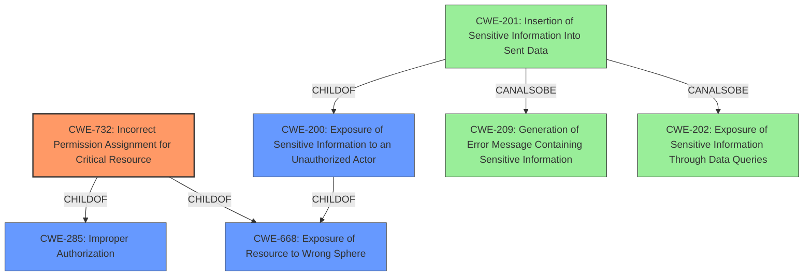

# Analysis Report for CVE-2020-14335

# Vulnerability Analysis Report: CVE-2020-14335

## Description


## Analysis (with Relationship Data)

# Summary
| CWE ID | CWE Name | Confidence | CWE Abstraction Level | CWE Vulnerability Mapping Label | CWE-Vulnerability Mapping Notes |
|---|---|---|---|---|---|
| CWE-732 | Incorrect Permission Assignment for Critical Resource | 0.9 | Class | Allowed-with-Review | Primary CWE |
| CWE-200 | Exposure of Sensitive Information to an Unauthorized Actor | 0.6 | Class | Discouraged | Secondary Candidate |

## Evidence and Confidence

*   **Confidence Score:** 0.75
*   **Evidence Strength:** HIGH

## Relationship Analysis
The primary CWE selected is CWE-732, which is a Class-level CWE. It has hierarchical relationships with CWE-285 (Improper Authorization) and CWE-668 (Exposure of Resource to Wrong Sphere). While CWE-732 itself suggests an assignment of permissions, the mapping guidance indicates it's often misused when permissions are not checked, aligning with authorization weaknesses. Therefore, a child of CWE-285 might be a more appropriate fit. CWE-200, another Class-level CWE, is a parent of CWE-201 (Insertion of Sensitive Information Into Sent Data) and has peer relationships with CWE-209 (Generation of Error Message Containing Sensitive Information) and CWE-202 (Exposure of Sensitive Information Through Data Queries). The decision favors CWE-732 due to the **incorrect** permission assignment being the root cause, rather than a broader information exposure.



## Vulnerability Chain
The vulnerability chain starts with the **incorrect** permission assignment on the OMAPI secret file, making it world-readable. This leads to the exposure of the secret, which then allows an attacker to gain control of DHCP records. The chain can be visualized as:

1.  **Incorrect Permission Assignment (CWE-732)**: The root cause, where the OMAPI secret file has overly permissive access rights.
2.  **Exposure of Sensitive Information (CWE-200)**: The direct consequence of the **incorrect** permission assignment, where the secret is readable by unauthorized actors.
3.  **Control of DHCP Records**: The impact of exploiting the exposed secret, leading to potential system availability issues.

## Summary of Analysis
The initial analysis pointed towards CWE-732 (Incorrect Permission Assignment for Critical Resource) as the primary weakness, supported by the evidence that the OMAPI secret file was world-readable. The retriever results also listed CWE-732 as a potential candidate. The vulnerability description states, "This flaw allows a privileged attacker to read OMAPI secrets through the ISC DHCP of Smart-Proxy." The CVE Reference Links Content Summary confirms this by stating, "The root cause is that the OMAPI (Object Management API) secret for the ISC DHCP server in Red Hat Satellite's Smart-Proxy is world-readable."

While CWE-200 (Exposure of Sensitive Information to an Unauthorized Actor) was considered, the mapping guidance discourages its use as a general catch-all for confidentiality loss. Instead, it suggests identifying the underlying error, which in this case is the **incorrect** permission assignment.

The selection of CWE-732 is at an optimal level of specificity because it directly addresses the root cause of the vulnerability: the **incorrect** configuration of file permissions that allowed unauthorized access to a critical resource. While a more specific child of CWE-732 or CWE-285 might exist, the available evidence does not pinpoint a specific authorization flaw beyond the general **incorrect** assignment of permissions.
Therefore, based on the available evidence, CWE-732 is the most accurate and specific representation of the vulnerability's root cause.

Relevant CWE Information:
# Enhanced Context (25 CWEs)

## CWE-732: Incorrect Permission Assignment for Critical Resource
**Abstraction Level**: Class
**Similarity Score**: 0.103
**Source**: sparse

**Description**:
The product specifies permissions for a security-critical resource in a way that allows that resource to be read or modified by unintended actors.


## CWE Relationship Analysis

Current CWEs represent these abstraction levels: .


### Vulnerability Chain Analysis

**Chain starting from CWE-732:**
- 732 (Incorrect Permission Assignment for Critical Resource) - ROOT


**Chain starting from CWE-201:**
- 201 (Insertion of Sensitive Information Into Sent Data) - ROOT


### CWE Relationship Diagram

```mermaid
graph TD
    classDef primary fill:#f96,stroke:#333,stroke-width:2px
    classDef secondary fill:#69f,stroke:#333
    classDef tertiary fill:#9e9,stroke:#333
```


*Report generated on 2025-04-02 11:27:07*
