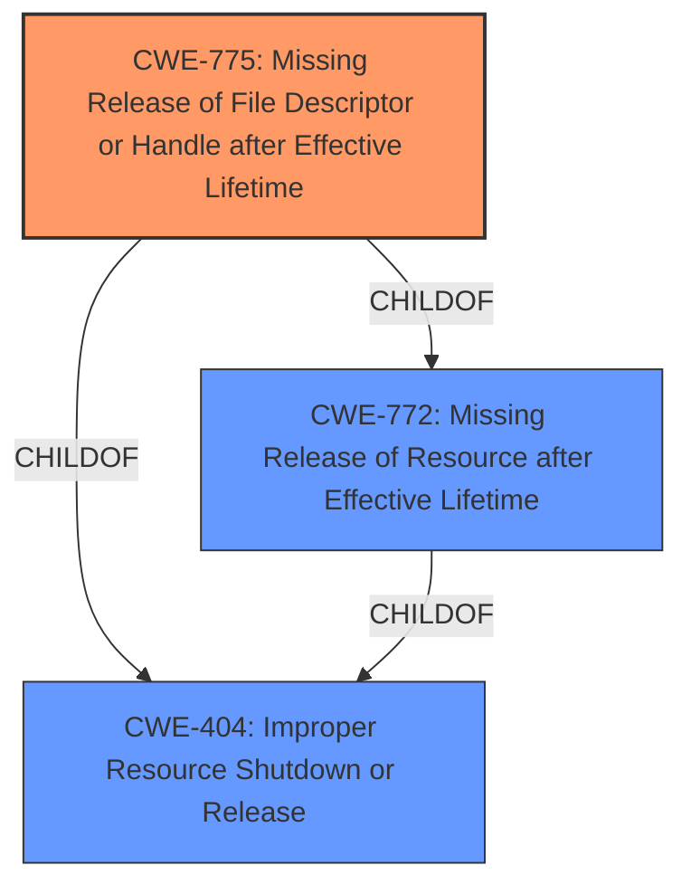

# Analysis for CVE-2020-14340

# Summary
| CWE ID | CWE Name | Confidence | CWE Abstraction Level | CWE Vulnerability Mapping Label | CWE-Vulnerability Mapping Notes |
|---|---|---|---|---|---|
| CWE-775 | Missing Release of File Descriptor or Handle after Effective Lifetime | 0.9 | Variant | Allowed | Primary CWE |
| CWE-404 | Improper Resource Shutdown or Release | 0.7 | Class | Allowed-with-Review | Secondary Candidate |
| CWE-772 | Missing Release of Resource after Effective Lifetime | 0.6 | Base | Allowed | Secondary Candidate |

## Evidence and Confidence

*   **Confidence Score:** 0.9
*   **Evidence Strength:** HIGH

## Relationship Analysis
The primary CWE selected is CWE-775, which is a variant of CWE-772 and CWE-404. The relationships show a clear path from the specific error (missing file descriptor release) to broader resource management issues. The abstraction level was considered carefully to ensure the most specific and relevant classification.

## Vulnerability Chain
The vulnerability chain starts with the **file descriptor leak** (**ROOTCAUSE**) due to the **missing release** of NIO Selector file handles. This leads to resource exhaustion and ultimately a denial of service.

## Summary of Analysis
The initial analysis strongly pointed to a resource management issue, specifically related to file descriptors. The provided evidence clearly indicates a **file descriptor leak** as the root cause, leading to a denial-of-service impact.

The key piece of evidence is from the "CVE Reference Links Content Summary": "File descriptor leak in XNIO due to the increasing number of NIO Selector file handles not being released between garbage collection cycles." This directly supports the selection of CWE-775, which focuses on the **missing release** of file descriptors after their effective lifetime.

CWE-775 is a variant of CWE-772 and CWE-404, providing a hierarchical context. While CWE-404 and CWE-772 are broader, CWE-775 specifically addresses the **missing release** of file descriptors, making it the most accurate and specific classification.

The retriever results also support this decision, with CWE-775 being a top match.

Relevant CWE Information:

# Enhanced Context (25 CWEs)
The following CWEs were identified as potentially relevant to this vulnerability:

## CWE-404: Improper Resource Shutdown or Release
**Abstraction Level**: Class
**Similarity Score**: 0.78
**Source**: dense

**Description**:
The product does not release or incorrectly releases a resource before it is made available for re-use.

**Mapping Guidance**:
- Usage: Allowed-with-Review
- Rationale: This CWE entry is a Class and might have Base-level children that would be more appropriate

**Technical Explanation:**
CWE-404 describes a general failure to release resources, which aligns with the high-level description of the vulnerability. However, it is a Class-level CWE, and more specific variants exist, making it a secondary consideration.

## CWE-775: Missing Release of File Descriptor or Handle after Effective Lifetime
**Abstraction Level**: Variant
**Similarity Score**: 4368.06
**Source**: sparse

**Description**:
The product does not release a file descriptor or handle after its effective lifetime has ended, i.e., after the file descriptor/handle is no longer needed.

**Mapping Guidance**:
- Usage: Allowed
- Rationale: This CWE entry is at the Variant level of abstraction, which is a preferred level of abstraction for mapping to the root causes of vulnerabilities.

**Technical Explanation:**
CWE-775 directly matches the vulnerability description, as it specifies the **missing release** of file descriptors. This leads to resource exhaustion and denial of service. The CWE's description aligns perfectly with the **root cause** identified in the CVE summary.

## CWE-772: Missing Release of Resource after Effective Lifetime
**Abstraction Level**: base
**Similarity Score**: 4.33
**Source**: graph

**Description**:
CWE-772: Missing Release of Resource after Effective Lifetime

**Mapping Guidance**:
- Usage: Allowed
- Rationale: This CWE entry is at the Base level of abstraction, which is a preferred level of abstraction for mapping to the root causes of vulnerabilities.

**Technical Explanation:**
CWE-772 is a broader category that includes the **missing release** of any resource, not specifically file descriptors. While relevant, CWE-775 is more specific and better captures the nature of the vulnerability.

## CWE-401: Missing Release of Memory after Effective Lifetime
**Abstraction Level**: variant
**Similarity Score**: 3.88
**Source**: graph

**Description**:
CWE-401: Missing Release of Memory after Effective Lifetime

**Mapping Guidance**:
- Usage: Allowed
- Rationale: This CWE entry is at the Variant level of abstraction, which is a preferred level of abstraction for mapping to the root causes of vulnerabilities.

**Technical Explanation:**
CWE-401 focuses on memory leaks, whereas the vulnerability is about file descriptor leaks. It is not the right fit.

I am confident that CWE-775 is the most appropriate classification, given the available evidence and the CWE's specific focus on **missing release** of file descriptors, which directly leads to a denial of service.

# Enhanced Query for CVE-2020-14340

## Vulnerability Description
A vulnerability was discovered in XNIO where **file descriptor leak** caused by growing amounts of NIO Selector file handles between garbage collection cycles. It may allow the attacker to cause a denial of service. It affects XNIO versions 3.6.0.Beta1 through 3.8.1.Final.

### Vulnerability Description Key Phrases
- **rootcause:** **file descriptor leak**
- **impact:** denial of service
- **attacker:** attacker
- **product:** XNIO
- **version:** 3.6.0.Beta1 through 3.8.1.Final

## CVE Reference Links Content Summary
Based on the provided content, here's the breakdown of the vulnerability described in CVE-2020-14340:

**Root Cause:**
- File descriptor leak in XNIO due to the increasing number of NIO Selector file handles not being released between garbage collection cycles.

**Weaknesses/Vulnerabilities:**
- Unreleased NIO selector file handles.
- The vulnerability exists in XNIO versions 3.6.0.Beta1 through 3.8.1.Final.

**Impact of Exploitation:**
- Denial of Service (DoS) due to resource exhaustion (file descriptor exhaustion).
- System availability is the highest threat

**Attack Vectors:**
- The content does not specify the exact mechanism for triggering the vulnerability but implies it involves operations that cause an increase in the number of NIO selector file handles.

**Required Attacker Capabilities/Position:**
- The attacker needs to be able to interact with the system in a way that causes the application to create increasing amounts of NIO selector file handles.

**Additional Information:**
- The vulnerability is not within the security support scope for several older JBoss products.
- Patches were issued in xnio versions 3.7.9.Final, xnio 3.8.2.Final, xnio 3.9.0.Final.
-  It has been addressed in various Red Hat products including:
    - Red Hat JBoss Enterprise Application Platform 7.3
    - Red Hat Single Sign-On 7.4.3
    - Red Hat Openshift Application Runtimes
    - Red Hat Fuse 7.9

## Retriever Results

### Top Combined Results

| Rank | CWE ID | Name | Abstraction | Usage  | Retrievers | Individual Scores |
|------|--------|------|-------------|-------|------------|-------------------|
| 1 | 403 | Exposure of File Descriptor to Unintended Control Sphere ('File Descriptor Leak') | Base | Allowed | alternate_terms | 1.000 |
| 2 | 773 | Missing Reference to Active File Descriptor or Handle | Variant | Allowed | sparse | 0.585 |
| 3 | 911 | Improper Update of Reference Count | Base | Allowed | sparse | 0.240 |
| 4 | 775 | Missing Release of File Descriptor or Handle after Effective Lifetime | Variant | Allowed | sparse | 0.237 |
| 5 | 770 | Allocation of Resources Without Limits or Throttling | Base | Allowed | sparse | 0.223 |
| 6 | 401 | Missing Release of Memory after Effective Lifetime | Variant | Allowed | dense | 0.536 |
| 7 | 390 | Detection of Error Condition Without Action | Base | Allowed | graph | 0.002 |
| 8 | 674 | Uncontrolled Recursion | Class | Allowed-with-Review | sparse | 0.217 |
| 9 | 835 | Loop with Unreachable Exit Condition ('Infinite Loop') | Base | Allowed | sparse | 0.216 |
| 10 | 125 | Out-of-bounds Read | Base | Allowed | sparse | 0.213 |

# Complete CWE Specifications

## CWE-403: Exposure of File Descriptor to Unintended Control Sphere ('File Descriptor Leak')
**Abstraction:** Base
**Status:** Draft

### Description
A process does not close sensitive file descriptors before invoking a child process, which allows the child to perform unauthorized I/O operations using those descriptors.

### Extended Description
When a new process is forked or executed, the child process inherits any open file descriptors. When the child process has fewer privileges than the parent process, this might introduce a vulnerability if the child process can access the file descriptor but does not have the privileges to access the associated file.

### Alternative Terms
File descriptor leak: While this issue is frequently called a file descriptor leak, the "leak" term is often used in two different ways - exposure of a resource, or consumption of a resource. Use of this term could cause confusion.

### Relationships
ChildOf -> CWE-402

### Mapping Guidance
**Usage:** Allowed
**Rationale:** This CWE entry is at the Base level of abstraction, which is a preferred level of abstraction for mapping to the root causes of vulnerabilities.
**Comments:** Carefully read both the name and description to ensure that this mapping is an appropriate fit. Do not try to 'force' a mapping to a lower-level Base/Variant simply to comply with this preferred level of abstraction.
**Reasons:**
- Acceptable-Use

### Observed Examples
- **CVE-2003-0740:** Server leaks a privileged file descriptor, allowing the server to be hijacked.
- **CVE-2004-1033:** File descriptor leak allows read of restricted files.
- **CVE-2000-0094:** Access to restricted resource using modified file descriptor for stderr.

## CWE-773: Missing Reference to Active File Descriptor or Handle
**Abstraction:** Variant
**Status:** Incomplete

### Description
The product does not properly maintain references to a file descriptor or handle, which prevents that file descriptor/handle from being reclaimed.

### Extended Description
This can cause the product to consume all available file descriptors or handles, which can prevent other processes from performing critical file processing operations.

### Alternative Terms
None

### Relationships
ChildOf -> CWE-771

### Mapping Guidance
**Usage:** Allowed
**Rationale:** This CWE entry is at the Variant level of abstraction, which is a preferred level of abstraction for mapping to the root causes of vulnerabilities.
**Comments:** Carefully read both the name and description to ensure that this mapping is an appropriate fit. Do not try to 'force' a mapping to a lower-level Base/Variant simply to comply with this preferred level of abstraction.
**Reasons:**
- Acceptable-Use

## CWE-911: Improper Update of Reference Count
**Abstraction:** Base
**Status:** Incomplete

### Description
The product uses a reference count to manage a resource, but it does not update or incorrectly updates the reference count.

### Extended Description
Reference counts can be used when tracking how many objects contain a reference to a particular resource, such as in memory management or garbage collection. When the reference count reaches zero, the resource can be de-allocated or reused because there are no more objects that use it. If the reference count accidentally reaches zero, then the resource might be released too soon, even though it is still in use. If all objects no longer use the resource, but the reference count is not zero, then the resource might not ever be released.

### Alternative Terms
None

### Relationships
ChildOf -> CWE-664
CanPrecede -> CWE-672
CanPrecede -> CWE-772

### Mapping Guidance
**Usage:** Allowed
**Rationale:** This CWE entry is at the Base level of abstraction, which is a preferred level of abstraction for mapping to the root causes of vulnerabilities.
**Comments:** Carefully read both the name and description to ensure that this mapping is an appropriate fit. Do not try to 'force' a mapping to a lower-level Base/Variant simply to comply with this preferred level of abstraction.
**Reasons:**
- Acceptable-Use

### Observed Examples
- **CVE-2002-0574:** chain: reference count is not decremented, leading to memory leak in OS by sending ICMP packets.
- **CVE-2004-0114:** Reference count for shared memory not decremented when a function fails, potentially allowing unprivileged users to read kernel memory.
- **CVE-2006-3741:** chain: improper reference count tracking leads to file descriptor consumption

## CWE-775: Missing Release of File Descriptor or Handle after Effective Lifetime
**Abstraction:** Variant
**Status:** Incomplete

### Description
The product does not release a file descriptor or handle after its effective lifetime has ended, i.e., after the file descriptor/handle is no longer needed.

### Extended Description
When a file descriptor or handle is not released after use (typically by explicitly closing it), attackers can cause a denial of service by consuming all available file descriptors/handles, or otherwise preventing other system processes from obtaining their own file descriptors/handles.

### Alternative Terms
None

### Relationships
ChildOf -> CWE-772
ChildOf -> CWE-404
ChildOf -> CWE-404

### Mapping Guidance
**Usage:** Allowed
**Rationale:** This CWE entry is at the Variant level of abstraction, which is a preferred level of abstraction for mapping to the root causes of vulnerabilities.
**Comments:** Carefully read both the name and description to ensure that this mapping is an appropriate fit. Do not try to 'force' a mapping to a lower-level Base/Variant simply to comply with this preferred level of abstraction.
**Reasons:**
- Acceptable-Use

### Observed Examples
- **CVE-2007-0897:** Chain: anti-virus product encounters a malformed file but returns from a function without closing a file descriptor (CWE-775) leading to file descriptor consumption (CWE-400) and failed scans.

## CWE-770: Allocation of Resources Without Limits or Throttling
**Abstraction:** Base
**Status:** Incomplete

### Description
The product allocates a reusable resource or group of resources on behalf of an actor without imposing any restrictions on the size or number of resources that can be allocated, in violation of the intended security policy for that actor.

### Extended Description

Code frequently has to work with limited resources, so programmers must be careful to ensure that resources are not consumed too quickly, or too easily. Without use of quotas, resource limits, or other protection mechanisms, it can be easy for an attacker to consume many resources by rapidly making many requests, or causing larger resources to be used than is needed. When too many resources are allocated, or if a single resource is too large, then it can prevent the code from working correctly, possibly leading to a denial of service.

### Alternative Terms
None

### Relationships
ChildOf -> CWE-400
ChildOf -> CWE-665
ChildOf -> CWE-400

### Mapping Guidance
**Usage:** Allowed
**Rationale:** This CWE entry is at the Base level of abstraction, which is a preferred level of abstraction for mapping to the root causes of vulnerabilities.
**Comments:** Carefully read both the name and description to ensure that this mapping is an appropriate fit. Do not try to 'force' a mapping to a lower-level Base/Variant simply to comply with this preferred level of abstraction.
**Reasons:**
- Acceptable-Use

### Additional Notes
**[Relationship]** This entry is different from uncontrolled resource consumption (CWE-400) in that there are other weaknesses that are related to inability to control resource consumption, such as holding on to a resource too long after use, or not correctly keeping track of active resources so that they can be managed and released when they are finished (CWE-771).

**[Theoretical]** Vulnerability theory is largely about how behaviors and resources interact. "Resource exhaustion" can be regarded as either a consequence or an attack, depending on the perspective. This entry is an attempt to reflect one of the underlying weaknesses that enable these attacks (or consequences) to take place.

### Observed Examples
- **CVE-2022-21668:** Chain: Python library does not limit the resources used to process images that specify a very large number of bands (CWE-1284), leading to excessive memory consumption (CWE-789) or an integer overflow (CWE-190).
- **CVE-2009-4017:** Language interpreter does not restrict the number of temporary files being created when handling a MIME request with a large number of parts..
- **CVE-2009-2726:** Driver does not use a maximum width when invoking sscanf style functions, causing stack consumption.

## CWE-401: Missing Release of Memory after Effective Lifetime
**Abstraction:** Variant
**Status:** Draft

### Description
The product does not sufficiently track and release allocated memory after it has been used, which slowly consumes remaining memory.

### Extended Description
This is often triggered by improper handling of malformed data or unexpectedly interrupted sessions. In some languages, developers are responsible for tracking memory allocation and releasing the memory. If there are no more pointers or references to the memory, then it can no longer be tracked and identified for release.

### Alternative Terms
Memory Leak

### Relationships
ChildOf -> CWE-772
ChildOf -> CWE-404
ChildOf -> CWE-404

### Mapping Guidance
**Usage:** Allowed
**Rationale:** This CWE entry is at the Variant level of abstraction, which is a preferred level of abstraction for mapping to the root causes of vulnerabilities.
**Comments:** Carefully read both the name and description to ensure that this mapping is an appropriate fit. Do not try to 'force' a mapping to a lower-level Base/Variant simply to comply with this preferred level of abstraction.
**Reasons:**
- Acceptable-Use

### Additional Notes
**[Relationship]** This is often a resultant weakness due to improper handling of malformed data or early termination of sessions.

**[Terminology]** "memory leak" has sometimes been used to describe other kinds of issues, e.g. for information leaks in which the contents of memory are inadvertently leaked (CVE-2003-0400 is one such example of this terminology conflict).

### Observed Examples
- **CVE-2005-3119:** Memory leak because function does not free() an element of a data structure.
- **CVE-2004-0427:** Memory leak when counter variable is not decremented.
- **CVE-2002-0574:** chain: reference count is not decremented, leading to memory leak in OS by sending ICMP packets.

## CWE-390: Detection of Error Condition Without Action
**Abstraction:** Base
**Status:** Draft

### Description
The product detects a specific error, but takes no actions to handle the error.

### Extended Description
Not provided

### Alternative Terms
None

### Relationships
ChildOf -> CWE-755
CanPrecede -> CWE-401

### Mapping Guidance
**Usage:** Allowed
**Rationale:** This CWE entry is at the Base level of abstraction, which is a preferred level of abstraction for mapping to the root causes of vulnerabilities.
**Comments:** Carefully read both the name and description to ensure that this mapping is an appropriate fit. Do not try to 'force' a mapping to a lower-level Base/Variant simply to comply with this preferred level of abstraction.
**Reasons:**
- Acceptable-Use

### Observed Examples
- **CVE-2022-21820:** A GPU data center manager detects an error due to a malformed request but does not act on it, leading to memory corruption.

## CWE-674: Uncontrolled Recursion
**Abstraction:** Class
**Status:** Draft

### Description
The product does not properly control the amount of recursion that takes place,  consuming excessive resources, such as allocated memory or the program stack.

### Extended Description
Not provided

### Alternative Terms
Stack Exhaustion

### Relationships
ChildOf -> CWE-834

### Mapping Guidance
**Usage:** Allowed-with-Review
**Rationale:** This CWE entry is a Class and might have Base-level children that would be more appropriate
**Comments:** Examine children of this entry to see if there is a better fit
**Reasons:**
- Abstraction

### Observed Examples
- **CVE-2007-1285:** Deeply nested arrays trigger stack exhaustion.
- **CVE-2007-3409:** Self-referencing pointers create infinite loop and resultant stack exhaustion.
- **CVE-2016-10707:** Javascript application accidentally changes input in a way that prevents a recursive call from detecting an exit condition.

## CWE-835: Loop with Unreachable Exit Condition ('Infinite Loop')
**Abstraction:** Base
**Status:** Incomplete

### Description
The product contains an iteration or loop with an exit condition that cannot be reached, i.e., an infinite loop.

### Extended Description
Not provided

### Alternative Terms
None

### Relationships
ChildOf -> CWE-834
ChildOf -> CWE-834

### Mapping Guidance
**Usage:** Allowed
**Rationale:** This CWE entry is at the Base level of abstraction, which is a preferred level of abstraction for mapping to the root causes of vulnerabilities.
**Comments:** Carefully read both the name and description to ensure that this mapping is an appropriate fit. Do not try to 'force' a mapping to a lower-level Base/Variant simply to comply with this preferred level of abstraction.
**Reasons:**
- Acceptable-Use

### Observed Examples
- **CVE-2022-22224:** Chain: an operating system does not properly process malformed Open Shortest Path First (OSPF) Type/Length/Value Identifiers (TLV) (CWE-703), which can cause the process to enter an infinite loop (CWE-835)
- **CVE-2022-25304:** A Python machine communication platform did not account for receiving a malformed packet with a null size, causing the receiving function to never update the message buffer and be caught in an infinite loop.
- **CVE-2011-1027:** Chain: off-by-one error (CWE-193) leads to infinite loop (CWE-835) using invalid hex-encoded characters.

## CWE-125: Out-of-bounds Read
**Abstraction:** Base
**Status:** Draft

### Description
The product reads data past the end, or before the beginning, of the intended buffer.

### Extended Description
Not provided

### Alternative Terms
OOB read: Shorthand for "Out of bounds" read

### Relationships
ChildOf -> CWE-119
ChildOf -> CWE-119
ChildOf -> CWE-119
ChildOf -> CWE-119

### Mapping Guidance
**Usage:** Allowed
**Rationale:** This CWE entry is at the Base level of abstraction, which is a preferred level of abstraction for mapping to the root causes of vulnerabilities.
**Comments:** Carefully read both the name and description to ensure that this mapping is an appropriate fit. Do not try to 'force' a mapping to a lower-level Base/Variant simply to comply with this preferred level of abstraction.
**Reasons:**
- Acceptable-Use

### Observed Examples
- **CVE-2023-1018:** The reference implementation code for a Trusted Platform Module does not implement length checks on data, allowing for an attacker to read 2 bytes past the end of a buffer.
- **CVE-2020-11899:** Out-of-bounds read in IP stack used in embedded systems, as exploited in the wild per CISA KEV.
- **CVE-2014-0160:** Chain: "Heartbleed" bug receives an inconsistent length parameter (CWE-130) enabling an out-of-bounds read (CWE-126), returning memory that could include private cryptographic keys and other sensitive data.

