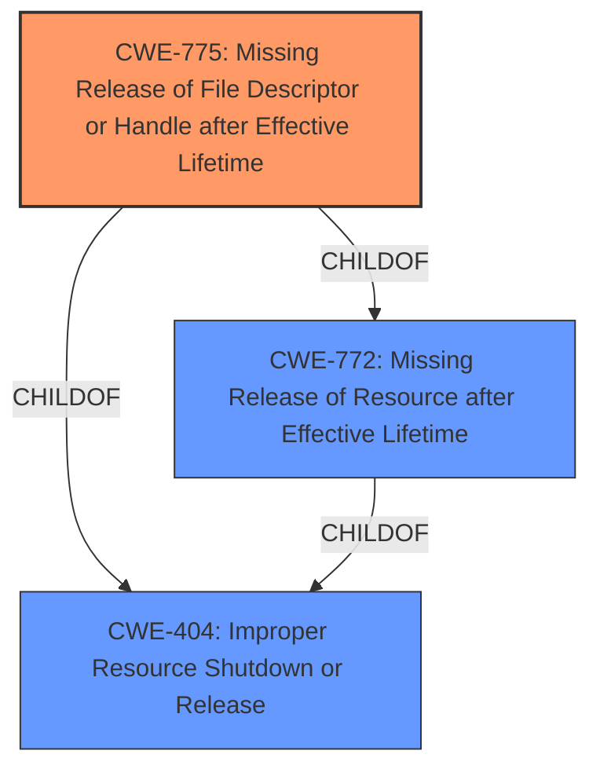

# Analysis Report for CVE-2020-14340

# Vulnerability Analysis Report: CVE-2020-14340

## Description


## Analysis (with Relationship Data)

# Summary
| CWE ID | CWE Name | Confidence | CWE Abstraction Level | CWE Vulnerability Mapping Label | CWE-Vulnerability Mapping Notes |
|---|---|---|---|---|---|
| CWE-775 | Missing Release of File Descriptor or Handle after Effective Lifetime | 0.9 | Variant | Allowed | Primary CWE |
| CWE-404 | Improper Resource Shutdown or Release | 0.7 | Class | Allowed-with-Review | Secondary Candidate |
| CWE-772 | Missing Release of Resource after Effective Lifetime | 0.6 | Base | Allowed | Secondary Candidate |

## Evidence and Confidence

*   **Confidence Score:** 0.9
*   **Evidence Strength:** HIGH

## Relationship Analysis
The primary CWE selected is CWE-775, which is a variant of CWE-772 and CWE-404. The relationships show a clear path from the specific error (missing file descriptor release) to broader resource management issues. The abstraction level was considered carefully to ensure the most specific and relevant classification.



## Vulnerability Chain
The vulnerability chain starts with the **file descriptor leak** (**ROOTCAUSE**) due to the **missing release** of NIO Selector file handles. This leads to resource exhaustion and ultimately a denial of service.

## Summary of Analysis
The initial analysis strongly pointed to a resource management issue, specifically related to file descriptors. The provided evidence clearly indicates a **file descriptor leak** as the root cause, leading to a denial-of-service impact.

The key piece of evidence is from the "CVE Reference Links Content Summary": "File descriptor leak in XNIO due to the increasing number of NIO Selector file handles not being released between garbage collection cycles." This directly supports the selection of CWE-775, which focuses on the **missing release** of file descriptors after their effective lifetime.

CWE-775 is a variant of CWE-772 and CWE-404, providing a hierarchical context. While CWE-404 and CWE-772 are broader, CWE-775 specifically addresses the **missing release** of file descriptors, making it the most accurate and specific classification.

The retriever results also support this decision, with CWE-775 being a top match.

Relevant CWE Information:

# Enhanced Context (25 CWEs)
The following CWEs were identified as potentially relevant to this vulnerability:

## CWE-404: Improper Resource Shutdown or Release
**Abstraction Level**: Class
**Similarity Score**: 0.78
**Source**: dense

**Description**:
The product does not release or incorrectly releases a resource before it is made available for re-use.

**Mapping Guidance**:
- Usage: Allowed-with-Review
- Rationale: This CWE entry is a Class and might have Base-level children that would be more appropriate

**Technical Explanation:**
CWE-404 describes a general failure to release resources, which aligns with the high-level description of the vulnerability. However, it is a Class-level CWE, and more specific variants exist, making it a secondary consideration.

## CWE-775: Missing Release of File Descriptor or Handle after Effective Lifetime
**Abstraction Level**: Variant
**Similarity Score**: 4368.06
**Source**: sparse

**Description**:
The product does not release a file descriptor or handle after its effective lifetime has ended, i.e., after the file descriptor/handle is no longer needed.

**Mapping Guidance**:
- Usage: Allowed
- Rationale: This CWE entry is at the Variant level of abstraction, which is a preferred level of abstraction for mapping to the root causes of vulnerabilities.

**Technical Explanation:**
CWE-775 directly matches the vulnerability description, as it specifies the **missing release** of file descriptors. This leads to resource exhaustion and denial of service. The CWE's description aligns perfectly with the **root cause** identified in the CVE summary.

## CWE-772: Missing Release of Resource after Effective Lifetime
**Abstraction Level**: base
**Similarity Score**: 4.33
**Source**: graph

**Description**:
CWE-772: Missing Release of Resource after Effective Lifetime

**Mapping Guidance**:
- Usage: Allowed
- Rationale: This CWE entry is at the Base level of abstraction, which is a preferred level of abstraction for mapping to the root causes of vulnerabilities.

**Technical Explanation:**
CWE-772 is a broader category that includes the **missing release** of any resource, not specifically file descriptors. While relevant, CWE-775 is more specific and better captures the nature of the vulnerability.

## CWE-401: Missing Release of Memory after Effective Lifetime
**Abstraction Level**: variant
**Similarity Score**: 3.88
**Source**: graph

**Description**:
CWE-401: Missing Release of Memory after Effective Lifetime

**Mapping Guidance**:
- Usage: Allowed
- Rationale: This CWE entry is at the Variant level of abstraction, which is a preferred level of abstraction for mapping to the root causes of vulnerabilities.

**Technical Explanation:**
CWE-401 focuses on memory leaks, whereas the vulnerability is about file descriptor leaks. It is not the right fit.

I am confident that CWE-775 is the most appropriate classification, given the available evidence and the CWE's specific focus on **missing release** of file descriptors, which directly leads to a denial of service.


## CWE Relationship Analysis

Current CWEs represent these abstraction levels: .


### Vulnerability Chain Analysis

**Chain starting from CWE-775:**
- 775 (Missing Release of File Descriptor or Handle after Effective Lifetime) - ROOT


**Chain starting from CWE-772:**
- 772 (Missing Release of Resource after Effective Lifetime) - ROOT


### CWE Relationship Diagram

```mermaid
graph TD
    classDef primary fill:#f96,stroke:#333,stroke-width:2px
    classDef secondary fill:#69f,stroke:#333
    classDef tertiary fill:#9e9,stroke:#333
```


*Report generated on 2025-04-02 04:34:13*
