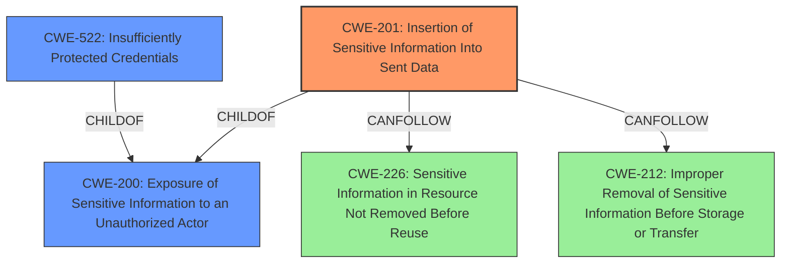

# Analysis Report for CVE-2020-14371

# Vulnerability Analysis Report: CVE-2020-14371

## Description


## Analysis (with Relationship Data)

# Summary
| CWE ID | CWE Name | Confidence | CWE Abstraction Level | CWE Vulnerability Mapping Label | CWE-Vulnerability Mapping Notes |
|---|---|---|---|---|---|
| CWE-201 | Insertion of Sensitive Information Into Sent Data | 1 | Base | Allowed | Primary CWE |
| CWE-200 | Exposure of Sensitive Information to an Unauthorized Actor | 0.7 | Class | Discouraged | Secondary Candidate |
| CWE-522 | Insufficiently Protected Credentials | 0.6 | Class | Allowed-with-Review | Secondary Candidate |

## Evidence and Confidence

*   **Confidence Score:** 0.8
*   **Evidence Strength:** HIGH

## Relationship Analysis
The primary CWE selected is CWE-201, which is a base-level CWE and a child of CWE-200. This relationship indicates that the vulnerability involves a specific case of exposing sensitive information. The CANFOLLOW relationship of CWE-201 with CWE-226 and CWE-212 suggests a potential chain where sensitive data is not properly removed before reuse or storage/transfer, leading to it being inserted into sent data.



## Vulnerability Chain
The vulnerability chain starts with a **credential leak** due to the **weakness** of exposing compute resource credentials through VMs running on these resources in Satellite. This leads to the insertion of sensitive information into sent data (CWE-201), resulting in the exposure of sensitive information to an unauthorized actor (CWE-200). A possible prerequisite involves **insufficient protection of credentials** (CWE-522).

## Summary of Analysis
The initial assessment, based on the vulnerability description and CVE reference, points to a **credential leak** in Red Hat Satellite. The key phrase "credential leak" and the summary indicating a "Plaintext password (credential) leak via JSON" strongly suggest that sensitive information is being exposed.

The Retriever Results list CWE-201 (Insertion of Sensitive Information Into Sent Data) and CWE-200 (Exposure of Sensitive Information to an Unauthorized Actor) as top candidates. CWE-201 aligns well with the vulnerability where compute resource credentials are being exposed through VMs. The CVE Reference Links Content Summary confirms that the **weakness** is a "Plaintext password (credential) leak via JSON (CWE-200)". However, the specific mechanism involves the insertion of this sensitive data into a data stream, making CWE-201 a more precise fit for the root cause.

CWE-200 is considered but classified as a secondary candidate because it describes the impact of exposing sensitive information rather than the direct cause. The mapping guidance for CWE-200 discourages its use when a more specific CWE can be identified.

CWE-522 (Insufficiently Protected Credentials) is a possible contributing factor, if the credentials were not properly protected in the first place. However, the immediate cause is the insertion of the credentials into sent data, so CWE-522 is a secondary consideration.

CWE-201 is at the optimal level of specificity because it directly addresses the **weakness** of inserting sensitive information into sent data, which leads to the **credential leak**. The supporting evidence from the CVE reference summary, specifically "Plaintext password (credential) leak via JSON," confirms this assessment.

Relevant CWE Information:

# Enhanced Context (25 CWEs)
The following CWEs were identified as potentially relevant to this vulnerability:

## CWE-226: Sensitive Information in Resource Not Removed Before Reuse
**Abstraction Level**: Base
**Similarity Score**: 0.79
**Source**: dense

**Description**:
The product releases a resource such as memory or a file so that it can be made available for reuse, but it does not clear or "zeroize" the information contained in the resource before the product performs a critical state transition or makes the resource available for reuse by other entities.

**Mapping Guidance**:
- Usage: Allowed
- Rationale: This CWE entry is at the Base level of abstraction, which is a preferred level of abstraction for mapping to the root causes of vulnerabilities.


## CWE-1391: Use of Weak Credentials
**Abstraction Level**: Class
**Similarity Score**: 0.77
**Source**: dense

**Description**:
The product uses weak credentials (such as a default key or hard-coded password) that can be calculated, derived, reused, or guessed by an attacker.

**Mapping Guidance**:
- Usage: Allowed-with-Review
- Rationale: This CWE entry is a Class and might have Base-level children that would be more appropriate


## CWE-274: Improper Handling of Insufficient Privileges
**Abstraction Level**: Base
**Similarity Score**: 0.77
**Source**: dense

**Description**:
The product does not handle or incorrectly handles when it has insufficient privileges to perform an operation, leading to resultant weaknesses.

**Mapping Guidance**:
- Usage: Discouraged
- Rationale: This CWE entry could be deprecated in a future version of CWE.


## CWE-212: Improper Removal of Sensitive Information Before Storage or Transfer
**Abstraction Level**: Base
**Similarity Score**: 0.77
**Source**: dense

**Description**:
The product stores, transfers, or shares a resource that contains sensitive information, but it does not properly remove that information before the product makes the resource available to unauthorized actors.

**Mapping Guidance**:
- Usage: Allowed
- Rationale: This CWE entry is at the Base level of abstraction, which is a preferred level of abstraction for mapping to the root causes of vulnerabilities.


## CWE-807: Reliance on Untrusted Inputs in a Security Decision
**Abstraction Level**: Base
**Similarity Score**: 0.76
**Source**: dense

**Description**:
The product uses a protection mechanism that relies on the existence or values of an input, but the input can be modified by an untrusted actor in a way that bypasses the protection mechanism.

**Mapping Guidance**:
- Usage: Allowed
- Rationale: This CWE entry is at the Base level of abstraction, which is a preferred level of abstraction for mapping to the root causes of vulnerabilities.


## CWE-668: Exposure of Resource to Wrong Sphere
**Abstraction Level**: Class
**Similarity Score**: 0.76
**Source**: dense

**Description**:
The product exposes a resource to the wrong control sphere, providing unintended actors with inappropriate access to the resource.

**Mapping Guidance**:
- Usage: Discouraged
- Rationale: CWE-668 is high-level and is often misused as a catch-all when lower-level CWE IDs might be applicable. It is sometimes used for low-information vulnerability reports [REF-1287]. It is a level-1 Class (i.e., a child of a Pillar). It is not useful for trend analysis.


## CWE-280: Improper Handling of Insufficient Permissions or Privileges 
**Abstraction Level**: Base
**Similarity Score**: 0.76
**Source**: dense

**Description**:
The product does not handle or incorrectly handles when it has insufficient privileges to access resources or functionality as specified by their permissions. This may cause it to follow unexpected code paths that may leave the product in an invalid state.

**Mapping Guidance**:
- Usage: Allowed
- Rationale: This CWE entry is at the Base level of abstraction, which is a preferred level of abstraction for mapping to the root causes of vulnerabilities.


## CWE-404: Improper Resource Shutdown or Release
**Abstraction Level**: Class
**Similarity Score**: 0.76
**Source**: dense

**Description**:
The product does not release or incorrectly releases a resource before it is made available for re-use.

**Mapping Guidance**:
- Usage: Allowed-with-Review
- Rationale: This CWE entry is a Class and might have Base-level children that would be more appropriate


## CWE-538: Insertion of Sensitive Information into Externally-Accessible File or Directory
**Abstraction Level**: Base
**Similarity Score**: 0.76
**Source**: dense

**Description**:
The product places sensitive information into files or directories that are accessible to actors who are allowed to have access to the files, but


## CWE Relationship Analysis

Current CWEs represent these abstraction levels: .


### Vulnerability Chain Analysis

**Chain starting from CWE-404:**
- 404 (Improper Resource Shutdown or Release) - ROOT


**Chain starting from CWE-201:**
- 201 (Insertion of Sensitive Information Into Sent Data) - ROOT


### CWE Relationship Diagram

```mermaid
graph TD
    classDef primary fill:#f96,stroke:#333,stroke-width:2px
    classDef secondary fill:#69f,stroke:#333
    classDef tertiary fill:#9e9,stroke:#333
```


*Report generated on 2025-04-02 07:53:25*
