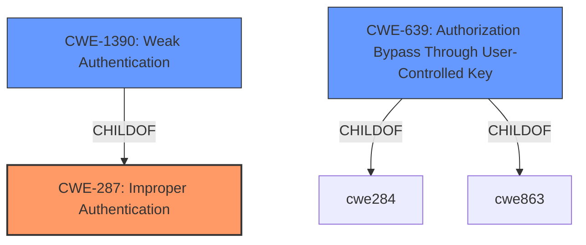

# Enhanced Analysis for CVE-2020-14380

# Summary
| CWE ID | CWE Name | Confidence | CWE Abstraction Level | CWE Vulnerability Mapping Label | CWE-Vulnerability Mapping Notes |
|---|---|---|---|---|---|
| CWE-287 | Improper Authentication | 0.9 | Class | Primary | Discouraged: Consider children or descendants, beginning with CWE-1390: Weak Authentication or CWE-306: Missing Authentication for Critical Function. |
| CWE-1390 | Weak Authentication | 0.8 | Class | Secondary | Allowed-with-Review: Examine children of this entry to see if there is a better fit |
| CWE-639 | Authorization Bypass Through User-Controlled Key | 0.6 | Base | Secondary | Allowed |

## Evidence and Confidence

*   **Confidence Score:** 0.8
*   **Evidence Strength:** HIGH

## Relationship Analysis
The primary relationship influencing the CWE selection is the hierarchical relationship between CWE-287 (Improper Authentication) and its child CWE-1390 (Weak Authentication). CWE-287 is a class-level CWE, and the guidance suggests considering more specific child CWEs like CWE-1390. CWE-639 (Authorization Bypass Through User-Controlled Key) is related to authorization issues, which can stem from authentication problems. The abstraction levels of the chosen CWEs are considered, opting for the class level for primary classification due to the high-level nature of the vulnerability description, with a base-level CWE as a secondary consideration.



## Vulnerability Chain
The vulnerability chain starts with a **flaw** in how Red Hat Satellite handles external authentication (SSO or OpenID Connect) and how it associates them with local user accounts. This **improper authentication** leads to an **account takeover**, where an attacker can claim the privileges of existing local users. The auto-creation of users on login, when enabled, makes this vulnerability exploitable.

## Summary of Analysis
The initial analysis focused on identifying the root cause of the **account takeover flaw** in Red Hat Satellite. The vulnerability description and CVE reference summary clearly indicate an issue with authentication, specifically how external authentication is handled in relation to local user accounts.

The provided evidence states: "A potential attacker with proper authentication to the relevant external authentication source (SSO or Open ID) can claim the privileges of already existing local users of Satellite." This points to a weakness in the authentication process, where an attacker can bypass the intended authentication controls to gain unauthorized access.

The analysis considered the retriever results, which suggested CWE-287 (Improper Authentication), CWE-1390 (Weak Authentication), and CWE-639 (Authorization Bypass Through User-Controlled Key) as potential candidates.

CWE-287 is a class-level CWE that describes a situation where a product does not sufficiently prove that a claimed identity is correct. This aligns with the vulnerability description, where an attacker can use external authentication to claim the identity of an existing local user. However, the mapping guidance for CWE-287 discourages its use and suggests considering more specific child CWEs.

CWE-1390 is a child of CWE-287 and describes a situation where the authentication mechanism is weak. This is a more specific description of the authentication flaw and is therefore a better fit than CWE-287.

CWE-639 describes a situation where the authorization functionality does not prevent one user from gaining access to another user's data by modifying the key value identifying the data. While this is related to the **account takeover**, it is not the primary cause of the vulnerability. The primary cause is the **improper authentication** that allows the attacker to claim the identity of the local user in the first place.

Therefore, CWE-287 (Improper Authentication) is selected as the primary CWE, with CWE-1390 (Weak Authentication) and CWE-639 (Authorization Bypass Through User-Controlled Key) as secondary CWEs. The selection of CWE-287 is influenced by the overall nature of the vulnerability, while the selection of CWE-1390 is based on its closer alignment with the specific authentication flaw, and CWE-639 as a resulting impact. The abstraction levels are chosen to provide a balance between generality and specificity, capturing the essence of the vulnerability while also providing a framework for more detailed analysis.

Relevant CWE Information:

# Enhanced Context (25 CWEs)
The following CWEs were identified as potentially relevant to this vulnerability:

## CWE-303: Incorrect Implementation of Authentication Algorithm
**Abstraction Level**: Base
**Similarity Score**: 0.77
**Source**: dense

**Description**:
The requirements for the product dictate the use of an established authentication algorithm, but the implementation of the algorithm is incorrect.

**Mapping Guidance**:
- Usage: Allowed
- Rationale: This CWE entry is at the Base level of abstraction, which is a preferred level of abstraction for mapping to the root causes of vulnerabilities.

## CWE-1390: Weak Authentication
**Abstraction Level**: Class
**Similarity Score**: 0.76
**Source**: dense

**Description**:
The product uses an authentication mechanism to restrict access to specific users or identities, but the mechanism does not sufficiently prove that the claimed identity is correct.

**Mapping Guidance**:
- Usage: Allowed-with-Review
- Rationale: This CWE entry is a Class and might have Base-level children that would be more appropriate

## CWE-1391: Use of Weak Credentials
**Abstraction Level**: Class
**Similarity Score**: 0.76
**Source**: dense

**Description**:
The product uses weak credentials (such as a default key or hard-coded password) that can be calculated, derived, reused, or guessed by an attacker.

**Mapping Guidance**:
- Usage: Allowed-with-Review
- Rationale: This CWE entry is a Class and might have Base-level children that would be more appropriate

## CWE-807: Reliance on Untrusted Inputs in a Security Decision
**Abstraction Level**: Base
**Similarity Score**: 0.76
**Source**: dense

**Description**:
The product uses a protection mechanism that relies on the existence or values of an input, but the input can be modified by an untrusted actor in a way that bypasses the protection mechanism.

**Mapping Guidance**:
- Usage: Allowed
- Rationale: This CWE entry is at the Base level of abstraction, which is a preferred level of abstraction for mapping to the root causes of vulnerabilities.

## CWE-305: Authentication Bypass by Primary Weakness
**Abstraction Level**: Base
**Similarity Score**: 0.75
**Source**: dense

**Description**:
The authentication algorithm is sound, but the implemented mechanism can be bypassed as the result of a separate weakness that is primary to the authentication error.

**Mapping Guidance**:
- Usage: Allowed
- Rationale: This CWE entry is at the Base level of abstraction, which is a preferred level of abstraction for mapping to the root causes of vulnerabilities.

## CWE-288: Authentication Bypass Using an Alternate Path or Channel
**Abstraction Level**: Base
**Similarity Score**: 0.75
**Source**: dense

**Description**:
The product requires authentication, but the product has an alternate path or channel that does not require authentication.

**Mapping Guidance**:
- Usage: Allowed
- Rationale: This CWE entry is at the Base level of abstraction, which is a preferred level of abstraction for mapping to the root causes of vulnerabilities.

## CWE-289: Authentication Bypass by Alternate Name
**Abstraction Level**: Base
**Similarity Score**: 0.75
**Source**: dense

**Description**:
The product performs authentication based on the name of a resource being accessed, or the name of the actor performing the access, but it does not properly check all possible names for that resource or actor.

**Mapping Guidance**:
- Usage: Allowed
- Rationale: This CWE entry is at the Base level of abstraction, which is a preferred level of abstraction for mapping to the root causes of vulnerabilities.

## CWE-639: Authorization Bypass Through User-Controlled Key
**Abstraction Level**: Base
**Similarity Score**: 0.75
**Source**: dense

**Description**:
The system's authorization functionality does not prevent one user from gaining access to another user's data or record by modifying the key value identifying the data.

**Mapping Guidance**:
- Usage: Allowed
- Rationale: This CWE entry is at the Base level of abstraction, which is a preferred level of abstraction for mapping to the root causes of vulnerabilities.

## CWE-274:


## CWE Relationship Analysis

Current CWEs represent these abstraction levels: .


### Vulnerability Chain Analysis

**Chain starting from CWE-288:**
- 288 (Authentication Bypass Using an Alternate Path or Channel) - ROOT


**Chain starting from CWE-306:**
- 306 (Missing Authentication for Critical Function) - ROOT


### CWE Relationship Diagram

```mermaid
graph TD
    classDef primary fill:#f96,stroke:#333,stroke-width:2px
    classDef secondary fill:#69f,stroke:#333
    classDef tertiary fill:#9e9,stroke:#333
```