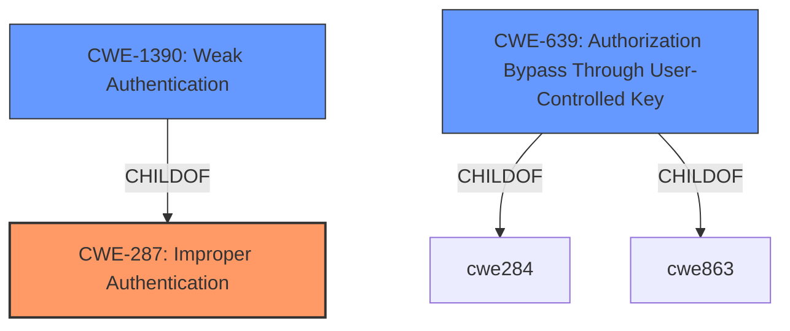

# Analysis for CVE-2020-14380

# Summary
| CWE ID | CWE Name | Confidence | CWE Abstraction Level | CWE Vulnerability Mapping Label | CWE-Vulnerability Mapping Notes |
|---|---|---|---|---|---|
| CWE-287 | Improper Authentication | 0.9 | Class | Primary | Discouraged: Consider children or descendants, beginning with CWE-1390: Weak Authentication or CWE-306: Missing Authentication for Critical Function. |
| CWE-1390 | Weak Authentication | 0.8 | Class | Secondary | Allowed-with-Review: Examine children of this entry to see if there is a better fit |
| CWE-639 | Authorization Bypass Through User-Controlled Key | 0.6 | Base | Secondary | Allowed |

## Evidence and Confidence

*   **Confidence Score:** 0.8
*   **Evidence Strength:** HIGH

## Relationship Analysis
The primary relationship influencing the CWE selection is the hierarchical relationship between CWE-287 (Improper Authentication) and its child CWE-1390 (Weak Authentication). CWE-287 is a class-level CWE, and the guidance suggests considering more specific child CWEs like CWE-1390. CWE-639 (Authorization Bypass Through User-Controlled Key) is related to authorization issues, which can stem from authentication problems. The abstraction levels of the chosen CWEs are considered, opting for the class level for primary classification due to the high-level nature of the vulnerability description, with a base-level CWE as a secondary consideration.

## Vulnerability Chain
The vulnerability chain starts with a **flaw** in how Red Hat Satellite handles external authentication (SSO or OpenID Connect) and how it associates them with local user accounts. This **improper authentication** leads to an **account takeover**, where an attacker can claim the privileges of existing local users. The auto-creation of users on login, when enabled, makes this vulnerability exploitable.

## Summary of Analysis
The initial analysis focused on identifying the root cause of the **account takeover flaw** in Red Hat Satellite. The vulnerability description and CVE reference summary clearly indicate an issue with authentication, specifically how external authentication is handled in relation to local user accounts.

The provided evidence states: "A potential attacker with proper authentication to the relevant external authentication source (SSO or Open ID) can claim the privileges of already existing local users of Satellite." This points to a weakness in the authentication process, where an attacker can bypass the intended authentication controls to gain unauthorized access.

The analysis considered the retriever results, which suggested CWE-287 (Improper Authentication), CWE-1390 (Weak Authentication), and CWE-639 (Authorization Bypass Through User-Controlled Key) as potential candidates.

CWE-287 is a class-level CWE that describes a situation where a product does not sufficiently prove that a claimed identity is correct. This aligns with the vulnerability description, where an attacker can use external authentication to claim the identity of an existing local user. However, the mapping guidance for CWE-287 discourages its use and suggests considering more specific child CWEs.

CWE-1390 is a child of CWE-287 and describes a situation where the authentication mechanism is weak. This is a more specific description of the authentication flaw and is therefore a better fit than CWE-287.

CWE-639 describes a situation where the authorization functionality does not prevent one user from gaining access to another user's data by modifying the key value identifying the data. While this is related to the **account takeover**, it is not the primary cause of the vulnerability. The primary cause is the **improper authentication** that allows the attacker to claim the identity of the local user in the first place.

Therefore, CWE-287 (Improper Authentication) is selected as the primary CWE, with CWE-1390 (Weak Authentication) and CWE-639 (Authorization Bypass Through User-Controlled Key) as secondary CWEs. The selection of CWE-287 is influenced by the overall nature of the vulnerability, while the selection of CWE-1390 is based on its closer alignment with the specific authentication flaw, and CWE-639 as a resulting impact. The abstraction levels are chosen to provide a balance between generality and specificity, capturing the essence of the vulnerability while also providing a framework for more detailed analysis.

Relevant CWE Information:

# Enhanced Context (25 CWEs)
The following CWEs were identified as potentially relevant to this vulnerability:

## CWE-303: Incorrect Implementation of Authentication Algorithm
**Abstraction Level**: Base
**Similarity Score**: 0.77
**Source**: dense

**Description**:
The requirements for the product dictate the use of an established authentication algorithm, but the implementation of the algorithm is incorrect.

**Mapping Guidance**:
- Usage: Allowed
- Rationale: This CWE entry is at the Base level of abstraction, which is a preferred level of abstraction for mapping to the root causes of vulnerabilities.

## CWE-1390: Weak Authentication
**Abstraction Level**: Class
**Similarity Score**: 0.76
**Source**: dense

**Description**:
The product uses an authentication mechanism to restrict access to specific users or identities, but the mechanism does not sufficiently prove that the claimed identity is correct.

**Mapping Guidance**:
- Usage: Allowed-with-Review
- Rationale: This CWE entry is a Class and might have Base-level children that would be more appropriate

## CWE-1391: Use of Weak Credentials
**Abstraction Level**: Class
**Similarity Score**: 0.76
**Source**: dense

**Description**:
The product uses weak credentials (such as a default key or hard-coded password) that can be calculated, derived, reused, or guessed by an attacker.

**Mapping Guidance**:
- Usage: Allowed-with-Review
- Rationale: This CWE entry is a Class and might have Base-level children that would be more appropriate

## CWE-807: Reliance on Untrusted Inputs in a Security Decision
**Abstraction Level**: Base
**Similarity Score**: 0.76
**Source**: dense

**Description**:
The product uses a protection mechanism that relies on the existence or values of an input, but the input can be modified by an untrusted actor in a way that bypasses the protection mechanism.

**Mapping Guidance**:
- Usage: Allowed
- Rationale: This CWE entry is at the Base level of abstraction, which is a preferred level of abstraction for mapping to the root causes of vulnerabilities.

## CWE-305: Authentication Bypass by Primary Weakness
**Abstraction Level**: Base
**Similarity Score**: 0.75
**Source**: dense

**Description**:
The authentication algorithm is sound, but the implemented mechanism can be bypassed as the result of a separate weakness that is primary to the authentication error.

**Mapping Guidance**:
- Usage: Allowed
- Rationale: This CWE entry is at the Base level of abstraction, which is a preferred level of abstraction for mapping to the root causes of vulnerabilities.

## CWE-288: Authentication Bypass Using an Alternate Path or Channel
**Abstraction Level**: Base
**Similarity Score**: 0.75
**Source**: dense

**Description**:
The product requires authentication, but the product has an alternate path or channel that does not require authentication.

**Mapping Guidance**:
- Usage: Allowed
- Rationale: This CWE entry is at the Base level of abstraction, which is a preferred level of abstraction for mapping to the root causes of vulnerabilities.

## CWE-289: Authentication Bypass by Alternate Name
**Abstraction Level**: Base
**Similarity Score**: 0.75
**Source**: dense

**Description**:
The product performs authentication based on the name of a resource being accessed, or the name of the actor performing the access, but it does not properly check all possible names for that resource or actor.

**Mapping Guidance**:
- Usage: Allowed
- Rationale: This CWE entry is at the Base level of abstraction, which is a preferred level of abstraction for mapping to the root causes of vulnerabilities.

## CWE-639: Authorization Bypass Through User-Controlled Key
**Abstraction Level**: Base
**Similarity Score**: 0.75
**Source**: dense

**Description**:
The system's authorization functionality does not prevent one user from gaining access to another user's data or record by modifying the key value identifying the data.

**Mapping Guidance**:
- Usage: Allowed
- Rationale: This CWE entry is at the Base level of abstraction, which is a preferred level of abstraction for mapping to the root causes of vulnerabilities.

## CWE-274:

# Enhanced Query for CVE-2020-14380

## Vulnerability Description
An **account takeover flaw** was found in Red Hat Satellite 6.7.2 onward. A potential attacker with proper authentication to the relevant external authentication source (SSO or Open ID) can claim the privileges of already existing local users of Satellite.

### Vulnerability Description Key Phrases
- **weakness:** **account takeover flaw**
- **impact:** claim privileges of existing local users
- **vector:** proper authentication to external authentication source
- **attacker:** potential attacker
- **product:** Red Hat Satellite
- **version:** 6.7.2 onward

## CVE Reference Links Content Summary
Based on the provided content, here's a breakdown of the vulnerability described in CVE-2020-14380:

**Root Cause of Vulnerability:**
- The vulnerability stems from a flaw in how Red Hat Satellite handles external authentication (SSO or OpenID Connect) in conjunction with local user accounts. Specifically, the auto-creation of users on login, when enabled, allows an authenticated attacker to impersonate an existing local user.

**Weaknesses/Vulnerabilities Present:**
- **Improper User Authentication Handling:** The system incorrectly associates external authentication with existing local users during the auto-creation process.
- **Lack of Authentication Differentiation:** The system fails to differentiate between external and local authentication, leading to potential user impersonation.
- **Auto-creation of users on login:** When enabled, this feature allows for the vulnerability to be exploitable.

**Impact of Exploitation:**
- **Account Takeover:** An attacker can gain full control of existing local user accounts within Red Hat Satellite.
- **Confidentiality Breach:**  Attackers can potentially access sensitive information.
- **Integrity Violation:**  Attackers can modify system configurations or data.
- **System Availability Disruption:** Attackers can potentially disrupt the normal operation of the Satellite server.
- **Privilege Escalation:** An authenticated SSO user can escalate their privileges to that of an existing local user.

**Attack Vectors:**
- **External Authentication:** The attack leverages the external authentication mechanisms (SSO or OpenID Connect) configured in Red Hat Satellite.
- **Auto-creation Feature:** The vulnerability requires that the auto-creation of users on login is enabled.

**Required Attacker Capabilities/Position:**
- **Valid SSO Authentication:** The attacker must have a valid account on the configured external authentication source (SSO or OpenID Connect).
- **Target System:** The attacker targets a Red Hat Satellite system where the auto-creation of users on login is enabled, and has configured external authentication via SSO or OpenID Connect.
- **Knowledge of Existing Local Users:** The attacker must know the existence of local users, although the bug report does not specifically state they need to know the local username.

**Additional Details:**
- The vulnerability was found in Red Hat Satellite 6.7.2 and later versions.
- A hotfix was available for Satellite 6.7.2 and 6.7.3.
- The issue is resolved in RHSA-2020:4366 which is available for Red Hat Satellite 6.7 for RHEL 8.
- A mitigation is to disable the external login if the Satellite user has their authentication set to INTERNAL, or disable auto-creation of users on login.

## Retriever Results

### Top Combined Results

| Rank | CWE ID | Name | Abstraction | Usage  | Retrievers | Individual Scores |
|------|--------|------|-------------|-------|------------|-------------------|
| 1 | 287 | Improper Authentication | Class | Discouraged | sparse | 0.245 |
| 2 | 620 | Unverified Password Change | Base | Allowed | sparse | 0.236 |
| 3 | 201 | Insertion of Sensitive Information Into Sent Data | Base | Allowed | sparse | 0.228 |
| 4 | 639 | Authorization Bypass Through User-Controlled Key | Base | Allowed | sparse | 0.228 |
| 5 | 290 | Authentication Bypass by Spoofing | Base | Allowed | sparse | 0.227 |
| 6 | 250 | Execution with Unnecessary Privileges | Base | Allowed | dense | 0.519 |
| 7 | 226 | Sensitive Information in Resource Not Removed Before Reuse | Base | Allowed | graph | 0.002 |
| 8 | 285 | Improper Authorization | Class | Discouraged | sparse | 0.224 |
| 9 | 863 | Incorrect Authorization | Class | Allowed-with-Review | sparse | 0.224 |
| 10 | 1390 | Weak Authentication | Class | Allowed-with-Review | sparse | 0.221 |

# Complete CWE Specifications

## CWE-287: Improper Authentication
**Abstraction:** Class
**Status:** Draft

### Description
When an actor claims to have a given identity, the product does not prove or insufficiently proves that the claim is correct.

### Extended Description
Not provided

### Alternative Terms
authentification: An alternate term is "authentification", which appears to be most commonly used by people from non-English-speaking countries.
AuthN: "AuthN" is typically used as an abbreviation of "authentication" within the web application security community. It is also distinct from "AuthZ," which is an abbreviation of "authorization." The use of "Auth" as an abbreviation is discouraged, since it could be used for either authentication or authorization.
AuthC: "AuthC" is used as an abbreviation of "authentication," but it appears to used less frequently than "AuthN."

### Relationships
ChildOf -> CWE-284
ChildOf -> CWE-284

### Mapping Guidance
**Usage:** Discouraged
**Rationale:** This CWE entry might be misused when lower-level CWE entries are likely to be applicable. It is a level-1 Class (i.e., a child of a Pillar).
**Comments:** Consider children or descendants, beginning with CWE-1390: Weak Authentication or CWE-306: Missing Authentication for Critical Function.
**Reasons:**
- Frequent Misuse
**Suggested Alternatives:**
- CWE-1390: Weak Authentication
- CWE-306: Missing Authentication for Critical Function

### Additional Notes
**[Relationship]** This can be resultant from SQL injection vulnerabilities and other issues.

**[Maintenance]** The Taxonomy_Mappings to ISA/IEC 62443 were added in CWE 4.10, but they are still under review and might change in future CWE versions. These draft mappings were performed by members of the "Mapping CWE to 62443" subgroup of the CWE-CAPEC ICS/OT Special Interest Group (SIG), and their work is incomplete as of CWE 4.10. The mappings are included to facilitate discussion and review by the broader ICS/OT community, and they are likely to change in future CWE versions.

### Observed Examples
- **CVE-2022-35248:** Chat application skips validation when Central Authentication Service (CAS) is enabled, effectively removing the second factor from two-factor authentication
- **CVE-2022-36436:** Python-based authentication proxy does not enforce password authentication during the initial handshake, allowing the client to bypass authentication by specifying a 'None' authentication type.
- **CVE-2022-30034:** Chain: Web UI for a Python RPC framework does not use regex anchors to validate user login emails (CWE-777), potentially allowing bypass of OAuth (CWE-1390).

## CWE-620: Unverified Password Change
**Abstraction:** Base
**Status:** Draft

### Description
When setting a new password for a user, the product does not require knowledge of the original password, or using another form of authentication.

### Extended Description
This could be used by an attacker to change passwords for another user, thus gaining the privileges associated with that user.

### Alternative Terms
None

### Relationships
ChildOf -> CWE-1390

### Mapping Guidance
**Usage:** Allowed
**Rationale:** This CWE entry is at the Base level of abstraction, which is a preferred level of abstraction for mapping to the root causes of vulnerabilities.
**Comments:** Carefully read both the name and description to ensure that this mapping is an appropriate fit. Do not try to 'force' a mapping to a lower-level Base/Variant simply to comply with this preferred level of abstraction.
**Reasons:**
- Acceptable-Use

### Observed Examples
- **CVE-2007-0681:** Web app allows remote attackers to change the passwords of arbitrary users without providing the original password, and possibly perform other unauthorized actions.
- **CVE-2000-0944:** Web application password change utility doesn't check the original password.

## CWE-201: Insertion of Sensitive Information Into Sent Data
**Abstraction:** Base
**Status:** Draft

### Description
The code transmits data to another actor, but a portion of the data includes sensitive information that should not be accessible to that actor.

### Extended Description
Not provided

### Alternative Terms
None

### Relationships
ChildOf -> CWE-200
CanAlsoBe -> CWE-209
CanAlsoBe -> CWE-202

### Mapping Guidance
**Usage:** Allowed
**Rationale:** This CWE entry is at the Base level of abstraction, which is a preferred level of abstraction for mapping to the root causes of vulnerabilities.
**Comments:** Carefully read both the name and description to ensure that this mapping is an appropriate fit. Do not try to 'force' a mapping to a lower-level Base/Variant simply to comply with this preferred level of abstraction.
**Reasons:**
- Acceptable-Use

### Additional Notes
**[Other]** Sensitive information could include data that is sensitive in and of itself (such as credentials or private messages), or otherwise useful in the further exploitation of the system (such as internal file system structure).

### Observed Examples
- **CVE-2022-0708:** Collaboration platform does not clear team emails in a response, allowing leak of email addresses

## CWE-639: Authorization Bypass Through User-Controlled Key
**Abstraction:** Base
**Status:** Incomplete

### Description
The system's authorization functionality does not prevent one user from gaining access to another user's data or record by modifying the key value identifying the data.

### Extended Description

Retrieval of a user record occurs in the system based on some key value that is under user control. The key would typically identify a user-related record stored in the system and would be used to lookup that record for presentation to the user. It is likely that an attacker would have to be an authenticated user in the system. However, the authorization process would not properly check the data access operation to ensure that the authenticated user performing the operation has sufficient entitlements to perform the requested data access, hence bypassing any other authorization checks present in the system.

For example, attackers can look at places where user specific data is retrieved (e.g. search screens) and determine whether the key for the item being looked up is controllable externally. The key may be a hidden field in the HTML form field, might be passed as a URL parameter or as an unencrypted cookie variable, then in each of these cases it will be possible to tamper with the key value.

One manifestation of this weakness is when a system uses sequential or otherwise easily-guessable session IDs that would allow one user to easily switch to another user's session and read/modify their data.

### Alternative Terms
Insecure Direct Object Reference / IDOR: The "Insecure Direct Object Reference" term, as described in the OWASP Top Ten, is broader than this CWE because it also covers path traversal (CWE-22). Within the context of vulnerability theory, there is a similarity between the OWASP concept and CWE-706: Use of Incorrectly-Resolved Name or Reference.
Broken Object Level Authorization / BOLA: BOLA is used in the 2019 OWASP API Security Top 10 and is said to be the same as IDOR.
Horizontal Authorization: "Horizontal Authorization" is used to describe situations in which two users have the same privilege level, but must be prevented from accessing each other's resources. This is fairly common when using key-based access to resources in a multi-user context.

### Relationships
ChildOf -> CWE-863
ChildOf -> CWE-863
ChildOf -> CWE-284

### Mapping Guidance
**Usage:** Allowed
**Rationale:** This CWE entry is at the Base level of abstraction, which is a preferred level of abstraction for mapping to the root causes of vulnerabilities.
**Comments:** Carefully read both the name and description to ensure that this mapping is an appropriate fit. Do not try to 'force' a mapping to a lower-level Base/Variant simply to comply with this preferred level of abstraction.
**Reasons:**
- Acceptable-Use

### Observed Examples
- **CVE-2021-36539:** An educational application does not appropriately restrict file IDs to a particular user. The attacker can brute-force guess IDs, indicating IDOR.

## CWE-290: Authentication Bypass by Spoofing
**Abstraction:** Base
**Status:** Incomplete

### Description
This attack-focused weakness is caused by incorrectly implemented authentication schemes that are subject to spoofing attacks.

### Extended Description
Not provided

### Alternative Terms
None

### Relationships
ChildOf -> CWE-1390
ChildOf -> CWE-287

### Mapping Guidance
**Usage:** Allowed
**Rationale:** This CWE entry is at the Base level of abstraction, which is a preferred level of abstraction for mapping to the root causes of vulnerabilities.
**Comments:** Carefully read both the name and description to ensure that this mapping is an appropriate fit. Do not try to 'force' a mapping to a lower-level Base/Variant simply to comply with this preferred level of abstraction.
**Reasons:**
- Acceptable-Use

### Additional Notes
**[Relationship]** This can be resultant from insufficient verification.

### Observed Examples
- **CVE-2022-30319:** S-bus functionality in a home automation product performs access control using an IP allowlist, which can be bypassed by a forged IP address.
- **CVE-2009-1048:** VOIP product allows authentication bypass using 127.0.0.1 in the Host header.

## CWE-250: Execution with Unnecessary Privileges
**Abstraction:** Base
**Status:** Draft

### Description
The product performs an operation at a privilege level that is higher than the minimum level required, which creates new weaknesses or amplifies the consequences of other weaknesses.

### Extended Description

New weaknesses can be exposed because running with extra privileges, such as root or Administrator, can disable the normal security checks being performed by the operating system or surrounding environment. Other pre-existing weaknesses can turn into security vulnerabilities if they occur while operating at raised privileges.

Privilege management functions can behave in some less-than-obvious ways, and they have different quirks on different platforms. These inconsistencies are particularly pronounced if you are transitioning from one non-root user to another. Signal handlers and spawned processes run at the privilege of the owning process, so if a process is running as root when a signal fires or a sub-process is executed, the signal handler or sub-process will operate with root privileges.

### Alternative Terms
None

### Relationships
ChildOf -> CWE-269
ChildOf -> CWE-657

### Mapping Guidance
**Usage:** Allowed
**Rationale:** This CWE entry is at the Base level of abstraction, which is a preferred level of abstraction for mapping to the root causes of vulnerabilities.
**Comments:** Carefully read both the name and description to ensure that this mapping is an appropriate fit. Do not try to 'force' a mapping to a lower-level Base/Variant simply to comply with this preferred level of abstraction.
**Reasons:**
- Acceptable-Use

### Additional Notes
**[Relationship]** There is a close association with CWE-653 (Insufficient Separation of Privileges). CWE-653 is about providing separate components for each privilege; CWE-250 is about ensuring that each component has the least amount of privileges possible.

**[Maintenance]** CWE-271, CWE-272, and CWE-250 are all closely related and possibly overlapping. CWE-271 is probably better suited as a category. Both CWE-272 and CWE-250 are in active use by the community. The "least privilege" phrase has multiple interpretations.

**[Maintenance]** The Taxonomy_Mappings to ISA/IEC 62443 were added in CWE 4.10, but they are still under review and might change in future CWE versions. These draft mappings were performed by members of the "Mapping CWE to 62443" subgroup of the CWE-CAPEC ICS/OT Special Interest Group (SIG), and their work is incomplete as of CWE 4.10. The mappings are included to facilitate discussion and review by the broader ICS/OT community, and they are likely to change in future CWE versions.

### Observed Examples
- **CVE-2007-4217:** FTP client program on a certain OS runs with setuid privileges and has a buffer overflow. Most clients do not need extra privileges, so an overflow is not a vulnerability for those clients.
- **CVE-2008-1877:** Program runs with privileges and calls another program with the same privileges, which allows read of arbitrary files.
- **CVE-2007-5159:** OS incorrectly installs a program with setuid privileges, allowing users to gain privileges.

## CWE-226: Sensitive Information in Resource Not Removed Before Reuse
**Abstraction:** Base
**Status:** Draft

### Description
The product releases a resource such as memory or a file so that it can be made available for reuse, but it does not clear or "zeroize" the information contained in the resource before the product performs a critical state transition or makes the resource available for reuse by other entities.

### Extended Description

When resources are released, they can be made available for reuse. For example, after memory is de-allocated, an operating system may make the memory available to another process, or disk space may be reallocated when a file is deleted. As removing information requires time and additional resources, operating systems do not usually clear the previously written information.

Even when the resource is reused by the same process, this weakness can arise when new data is not as large as the old data, which leaves portions of the old data still available. Equivalent errors can occur in other situations where the length of data is variable but the associated data structure is not. If memory is not cleared after use, the information may be read by less trustworthy parties when the memory is reallocated.

This weakness can apply in hardware, such as when a device or system switches between power, sleep, or debug states during normal operation, or when execution changes to different users or privilege levels.

### Alternative Terms
None

### Relationships
ChildOf -> CWE-459
ChildOf -> CWE-212
CanPrecede -> CWE-201

### Mapping Guidance
**Usage:** Allowed
**Rationale:** This CWE entry is at the Base level of abstraction, which is a preferred level of abstraction for mapping to the root causes of vulnerabilities.
**Comments:** Carefully read both the name and description to ensure that this mapping is an appropriate fit. Do not try to 'force' a mapping to a lower-level Base/Variant simply to comply with this preferred level of abstraction.
**Reasons:**
- Acceptable-Use

### Additional Notes
**[Relationship]** There is a close association between CWE-226 and CWE-212. The difference is partially that of perspective. CWE-226 is geared towards the final stage of the resource lifecycle, in which the resource is deleted, eliminated, expired, or otherwise released for reuse. Technically, this involves a transfer to a different control sphere, in which the original contents of the resource are no longer relevant. CWE-212, however, is intended for sensitive data in resources that are intentionally shared with others, so they are still active. This distinction is useful from the perspective of the CWE research view (CWE-1000).

**[Maintenance]** This entry needs modification to clarify the differences with CWE-212. The description also combines two problems that are distinct from the CWE research perspective: the inadvertent transfer of information to another sphere, and improper initialization/shutdown. Some of the associated taxonomy mappings reflect these different uses.

**[Research Gap]** This is frequently found for network packets, but it can also exist in local memory allocation, files, etc.

### Observed Examples
- **CVE-2019-3733:** Cryptography library does not clear heap memory before release
- **CVE-2003-0001:** Ethernet NIC drivers do not pad frames with null bytes, leading to infoleak from malformed packets.
- **CVE-2003-0291:** router does not clear information from DHCP packets that have been previously used

## CWE-285: Improper Authorization
**Abstraction:** Class
**Status:** Draft

### Description
The product does not perform or incorrectly performs an authorization check when an actor attempts to access a resource or perform an action.

### Extended Description

Assuming a user with a given identity, authorization is the process of determining whether that user can access a given resource, based on the user's privileges and any permissions or other access-control specifications that apply to the resource.

When access control checks are not applied consistently - or not at all - users are able to access data or perform actions that they should not be allowed to perform. This can lead to a wide range of problems, including information exposures, denial of service, and arbitrary code execution.

### Alternative Terms
AuthZ: "AuthZ" is typically used as an abbreviation of "authorization" within the web application security community. It is distinct from "AuthN" (or, sometimes, "AuthC") which is an abbreviation of "authentication." The use of "Auth" as an abbreviation is discouraged, since it could be used for either authentication or authorization.

### Relationships
ChildOf -> CWE-284
ChildOf -> CWE-284

### Mapping Guidance
**Usage:** Discouraged
**Rationale:** CWE-285 is high-level and lower-level CWEs can frequently be used instead. It is a level-1 Class (i.e., a child of a Pillar).
**Comments:** Look at CWE-285's children and consider mapping to CWEs such as CWE-862: Missing Authorization, CWE-863: Incorrect Authorization, CWE-732: Incorrect Permission Assignment for Critical Resource, or others.
**Reasons:**
- Abstraction
**Suggested Alternatives:**
- CWE-862: Missing Authorization
- CWE-863: Incorrect Authorization
- CWE-732: Incorrect Permission Assignment for Critical Resource

### Observed Examples
- **CVE-2022-24730:** Go-based continuous deployment product does not check that a user has certain privileges to update or create an app, allowing adversaries to read sensitive repository information
- **CVE-2009-3168:** Web application does not restrict access to admin scripts, allowing authenticated users to reset administrative passwords.
- **CVE-2009-2960:** Web application does not restrict access to admin scripts, allowing authenticated users to modify passwords of other users.

## CWE-863: Incorrect Authorization
**Abstraction:** Class
**Status:** Incomplete

### Description
The product performs an authorization check when an actor attempts to access a resource or perform an action, but it does not correctly perform the check.

### Extended Description
Not provided

### Alternative Terms
AuthZ: "AuthZ" is typically used as an abbreviation of "authorization" within the web application security community. It is distinct from "AuthN" (or, sometimes, "AuthC") which is an abbreviation of "authentication." The use of "Auth" as an abbreviation is discouraged, since it could be used for either authentication or authorization.

### Relationships
ChildOf -> CWE-285
ChildOf -> CWE-284

### Mapping Guidance
**Usage:** Allowed-with-Review
**Rationale:** This CWE entry is a Class and might have Base-level children that would be more appropriate
**Comments:** Examine children of this entry to see if there is a better fit
**Reasons:**
- Abstraction

### Additional Notes
**[Terminology]** 

Assuming a user with a given identity, authorization is the process of determining whether that user can access a given resource, based on the user's privileges and any permissions or other access-control specifications that apply to the resource.

### Observed Examples
- **CVE-2021-39155:** Chain: A microservice integration and management platform compares the hostname in the HTTP Host header in a case-sensitive way (CWE-178, CWE-1289), allowing bypass of the authorization policy (CWE-863) using a hostname with mixed case or other variations.
- **CVE-2019-15900:** Chain: sscanf() call is used to check if a username and group exists, but the return value of sscanf() call is not checked (CWE-252), causing an uninitialized variable to be checked (CWE-457), returning success to allow authorization bypass for executing a privileged (CWE-863).
- **CVE-2009-2213:** Gateway uses default "Allow" configuration for its authorization settings.

## CWE-1390: Weak Authentication
**Abstraction:** Class
**Status:** Incomplete

### Description
The product uses an authentication mechanism to restrict access to specific users or identities, but the mechanism does not sufficiently prove that the claimed identity is correct.

### Extended Description

Attackers may be able to bypass weak authentication faster and/or with less effort than expected.

### Alternative Terms
None

### Relationships
ChildOf -> CWE-287

### Mapping Guidance
**Usage:** Allowed-with-Review
**Rationale:** This CWE entry is a Class and might have Base-level children that would be more appropriate
**Comments:** Examine children of this entry to see if there is a better fit
**Reasons:**
- Abstraction

### Observed Examples
- **CVE-2022-30034:** Chain: Web UI for a Python RPC framework does not use regex anchors to validate user login emails (CWE-777), potentially allowing bypass of OAuth (CWE-1390).
- **CVE-2022-35248:** Chat application skips validation when Central Authentication Service (CAS) is enabled, effectively removing the second factor from two-factor authentication
- **CVE-2021-3116:** Chain: Python-based HTTP Proxy server uses the wrong boolean operators (CWE-480) causing an incorrect comparison (CWE-697) that identifies an authN failure if all three conditions are met instead of only one, allowing bypass of the proxy authentication (CWE-1390)

