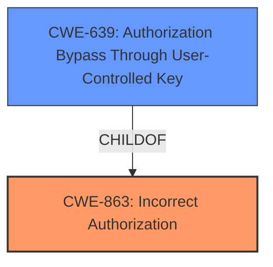

# Raw Analyzer Response for CVE-2020-14388

# Summary
| CWE ID | CWE Name | Confidence | CWE Abstraction Level | CWE Vulnerability Mapping Label | CWE-Vulnerability Mapping Notes |
|---|---|---|---|---|---|
| CWE-863 | Incorrect Authorization | 0.9 | Class | Primary | Allowed-with-Review |
| CWE-639 | Authorization Bypass Through User-Controlled Key | 0.7 | Base | Secondary | Allowed |

## Evidence and Confidence

*   **Confidence Score:** 0.8
*   **Evidence Strength:** HIGH

## Relationship Analysis
The primary CWE is CWE-863, which is a Class-level CWE. CWE-639 is a child of CWE-863, representing a more specific type of authorization bypass. The hierarchical relationship influenced the decision to consider CWE-639 as a secondary CWE, providing a more granular view of the vulnerability.

## Vulnerability Chain
The vulnerability chain starts with **member permissions for an APIs admin portal were not properly enforced**, leading to a bypass of normal account restrictions and unauthorized access to API services.

## Summary of Analysis
The initial analysis identified a **rootcause** related to **member permissions for an APIs admin portal were not properly enforced**, resulting in the ability to bypass account restrictions. This points to an authorization issue.

The provided evidence highlights the **insufficient access control** and **permissions bypass**, supporting the selection of authorization-related CWEs.

The primary CWE selected is CWE-863 (**Incorrect Authorization**), a Class-level CWE. The vulnerability description states that **member permissions for an APIs admin portal were not properly enforced**. This indicates that an authorization check was likely performed, but it was performed incorrectly, leading to the bypass. CWE-863's description states: "The product performs an authorization check when an actor attempts to access a resource or perform an action, but it does not correctly perform the check." This aligns well with the vulnerability.

CWE-639 (**Authorization Bypass Through User-Controlled Key**) was also considered because it provides a more specific view of the vulnerability. The description of CWE-639 states: "The system's authorization functionality does not prevent one user from gaining access to another user's data or record by modifying the key value identifying the data." While the description does not explicitly state that a "user-controlled key" was modified, it is possible that the permissions were tied to a user-controlled identifier, such as a user ID or some other access token. Therefore, CWE-639 is included as a secondary CWE.

CWE-285 (**Improper Authorization**) was considered but not chosen as the primary CWE, because it is too general and discouraged. The mapping guidance for CWE-285 suggests considering children CWEs like CWE-862 or CWE-863, and CWE-863 seems to be a better fit.

CWE-862 (**Missing Authorization**) was considered but not chosen because the vulnerability description specifically states that **member permissions were not properly enforced**, suggesting that there *was* an authorization mechanism in place, but it was implemented incorrectly, rather than being completely missing.

CWE-201 (**Insertion of Sensitive Information Into Sent Data**) was considered, but it describes a different type of vulnerability, where sensitive data is leaked through transmitted data. This does not seem relevant to the described vulnerability.

CWE-269 (**Improper Privilege Management**) was considered but not chosen because it is too general and the mapping guidance discourages its use, especially when more specific CWEs can be identified.

The chosen CWEs are at the optimal level of specificity based on the provided evidence. CWE-863 is a good general representation of the authorization issue, and CWE-639 provides a more granular view, if a user-controlled key can be inferred.