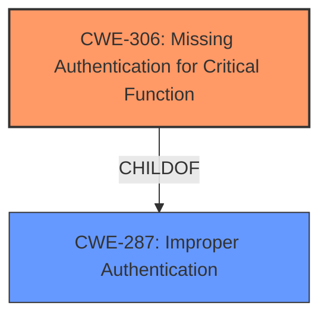

# Analysis for CVE-2020-14504

# Summary
| CWE ID | CWE Name | Confidence | CWE Abstraction Level | CWE Vulnerability Mapping Label | CWE-Vulnerability Mapping Notes |
|---|---|---|---|---|---|
| CWE-306 | Missing Authentication for Critical Function | 1.0 | Base | Primary | Allowed |
| CWE-287 | Improper Authentication | 0.7 | Class | Secondary | Discouraged |

## Evidence and Confidence

*   **Confidence Score:** 0.9
*   **Evidence Strength:** HIGH

## Relationship Analysis
The primary CWE is CWE-306, which is a child of CWE-287. While CWE-287 is a broader class, CWE-306 specifically addresses the scenario where authentication is completely missing for critical functions. This aligns well with the vulnerability description, as the web interface **mishandles authentication** for HTTP POST requests implying authentication is either missing or completely bypassed.

## Vulnerability Chain
The chain of events is as follows:
1.  **Root Cause:** Missing authentication for HTTP POST requests (CWE-306).
2.  **Impact:** Remote unauthenticated attacker can send a crafted request to modify configuration settings.

## Summary of Analysis
The initial assessment, supported by the vulnerability description and CVE summary, points to a clear case of **mishandled authentication** leading to potential modification of configuration settings. The Retriever results also highlight CWE-306 and CWE-287 as top candidates.

The final selection of CWE-306 is based on the following:

*   The vulnerability description explicitly states that the web interface **mishandles authentication** for HTTP POST requests.
*   The CVE summary confirms that the **root cause** is the **mishandling of authentication**, allowing an unauthenticated attacker to send crafted requests.
*   CWE-306 accurately describes the scenario where authentication is missing for critical functions, which aligns with the vulnerability's **root cause**.
*   CWE-287 is a broader class encompassing various authentication issues. While relevant, CWE-306 provides a more precise classification by focusing on the absence of authentication.
*   The evidence provided is sufficient to support the selection of CWE-306 as the primary weakness.

Relevant CWE Information:

# Enhanced Context (25 CWEs)
The following CWEs were identified as potentially relevant to this vulnerability:

## CWE-1391: Use of Weak Credentials
**Abstraction Level**: Class
**Similarity Score**: 0.81
**Source**: dense

**Description**:
The product uses weak credentials (such as a default key or hard-coded password) that can be calculated, derived, reused, or guessed by an attacker.

**Mapping Guidance**:
- Usage: Allowed-with-Review
- Rationale: This CWE entry is a Class and might have Base-level children that would be more appropriate

## CWE-807: Reliance on Untrusted Inputs in a Security Decision
**Abstraction Level**: Base
**Similarity Score**: 0.80
**Source**: dense

**Description**:
The product uses a protection mechanism that relies on the existence or values of an input, but the input can be modified by an untrusted actor in a way that bypasses the protection mechanism.

**Mapping Guidance**:
- Usage: Allowed
- Rationale: This CWE entry is at the Base level of abstraction, which is a preferred level of abstraction for mapping to the root causes of vulnerabilities.

## CWE-798: Use of Hard-coded Credentials
**Abstraction Level**: Base
**Similarity Score**: 0.80
**Source**: dense

**Description**:
The product contains hard-coded credentials, such as a password or cryptographic key.

**Mapping Guidance**:
- Usage: Allowed
- Rationale: This CWE entry is at the Base level of abstraction, which is a preferred level of abstraction for mapping to the root causes of vulnerabilities.

## CWE-303: Incorrect Implementation of Authentication Algorithm
**Abstraction Level**: Base
**Similarity Score**: 0.80
**Source**: dense

**Description**:
The requirements for the product dictate the use of an established authentication algorithm, but the implementation of the algorithm is incorrect.

**Mapping Guidance**:
- Usage: Allowed
- Rationale: This CWE entry is at the Base level of abstraction, which is a preferred level of abstraction for mapping to the root causes of vulnerabilities.

## CWE-345: Insufficient Verification of Data Authenticity
**Abstraction Level**: Class
**Similarity Score**: 0.79
**Source**: dense

**Description**:
The product does not sufficiently verify the origin or authenticity of data, in a way that causes it to accept invalid data.

**Mapping Guidance**:
- Usage: Discouraged
- Rationale: This CWE entry is a level-1 Class (i.e., a child of a Pillar). It might have lower-level children that would be more appropriate

## CWE-302: Authentication Bypass by Assumed-Immutable Data
**Abstraction Level**: Base
**Similarity Score**: 0.78
**Source**: dense

**Description**:
The authentication scheme or implementation uses key data elements that are assumed to be immutable, but can be controlled or modified by the attacker.

**Mapping Guidance**:
- Usage: Allowed
- Rationale: This CWE entry is at the Base level of abstraction, which is a preferred level of abstraction for mapping to the root causes of vulnerabilities.

## CWE-294: Authentication Bypass by Capture-replay
**Abstraction Level**: Base
**Similarity Score**: 0.78
**Source**: dense

**Description**:
A capture-replay flaw exists when the design of the product makes it possible for a malicious user to sniff network traffic and bypass authentication by replaying it to the server in question to the same effect as the original message (or with minor changes).

**Mapping Guidance**:
- Usage: Allowed
- Rationale: This CWE entry is at the Base level of abstraction, which is a preferred level of abstraction for mapping to the root causes of vulnerabilities.

## CWE-472: External Control of Assumed-Immutable Web Parameter
**Abstraction Level**: Base
**Similarity Score**: 0.78
**Source**: dense

**Description**:
The web application does not sufficiently verify inputs that are assumed to be immutable but are actually externally controllable, such as hidden form fields.

**Mapping Guidance**:
- Usage: Allowed
- Rationale: This CWE entry is at the Base level of abstraction, which is a preferred level of abstraction for mapping to the root causes of vulnerabilities.

## CWE-288: Authentication Bypass Using an Alternate Path or Channel
**Abstraction Level**: Base
**Similarity Score**: 0.78
**Source**: dense

**Description**:
The product requires authentication, but the product has an alternate path or channel that does not require authentication.

**Mapping Guidance**:
- Usage: Allowed
- Rationale: This CWE entry is at the Base level of abstraction, which is a preferred level of abstraction for mapping to the root causes of vulnerabilities.

## CWE-330: Use of Insufficiently Random Values
**Abstraction Level**: Class
**Similarity Score**: 0.78
**Source**: dense

**Description**:
The product uses insufficiently random numbers or values in a security context that depends on unpredictable numbers.

**Mapping Guidance**:
- Usage: Discouraged
- Rationale: This CWE entry is a level-1 Class (i.e., a child of a Pillar). It might have lower-level children that would be more appropriate

## CWE-295: Improper Certificate Validation
**Abstraction Level**: Base
**Similarity Score**: 5078.58
**Source**: sparse

**Description**:
The product does not validate, or incorrectly validates, a certificate.

**Mapping Guidance**:
- Usage: Allowed
- Rationale: This CWE entry is at the Base level of abstraction, which is a preferred level of abstraction for mapping to the root causes of vulnerabilities.

## CWE-472: External Control of Assumed-Immutable Web Parameter
**Abstraction Level**: Base
**Similarity Score**: 4914.07
**Source**: sparse

**Description**:
The web application does not sufficiently verify inputs that are assumed to be immutable but are actually externally controllable, such as hidden form fields.

**Mapping Guidance**:
- Usage: Allowed
- Rationale: This CWE entry is at the Base level of abstraction, which is a preferred level of abstraction for mapping to the root causes of vulnerabilities.

## CWE-22: Improper Limitation of a Pathname to a Restricted Directory ('Path Traversal')
**Abstraction Level**: Base
**Similarity Score**: 4839.65
**Source**: sparse

**Description**:
The product uses external input to construct a pathname that is intended to identify a file or directory that is located underneath a restricted parent directory, but the product does not properly neutralize special elements within the pathname that can

# Enhanced Query for CVE-2020-14504

## Vulnerability Description
The web interface of the 1734-AENTR communication module **mishandles authentication** for HTTP POST requests. A remote, unauthenticated attacker can send a crafted request that may allow for modification of the configuration settings.

### Vulnerability Description Key Phrases
- **rootcause:** **mishandles authentication**
- **impact:** modification of the configuration settings
- **vector:** crafted request
- **attacker:** remote unauthenticated attacker
- **product:** 1734-AENTR communication module
- **component:** web interface

## CVE Reference Links Content Summary
### Summary of CVE-2020-14504 based on the provided content:

*   **Vulnerability:** Improper Access Control
*   **CWE:** CWE-284
*   **Affected Product:** Rockwell Automation 1734-AENTR Series B and Series C
*   **Affected Versions:**
    *   Series B, Versions 4.001 to 4.005, and 5.011 to 5.017
    *   Series C, Versions 6.011 and 6.012
*   **Root Cause:** The web interface of the 1734-AENTR communication module mishandles authentication for HTTP POST requests.
*   **Attack Vector:** A remote, unauthenticated attacker can send a crafted request.
*   **Impact:** Successful exploitation can allow for modification of the configuration settings.
*   **CVSS Score:** 7.5 (AV:N/AC:L/PR:N/UI:N/S:U/C:N/I:H/A:N)
*   **Mitigation:** Update to firmware Version 5.018 for 1734-AENTR Series B and Version 6.013 for 1734-AENTR Series C. Employ network infrastructure controls like firewalls, minimize network exposure, isolate control system networks, and use secure remote access methods like VPNs.

## Retriever Results

### Top Combined Results

| Rank | CWE ID | Name | Abstraction | Usage  | Retrievers | Individual Scores |
|------|--------|------|-------------|-------|------------|-------------------|
| 1 | 287 | Improper Authentication | Class | Discouraged | sparse | 0.232 |
| 2 | 306 | Missing Authentication for Critical Function | Base | Allowed | sparse | 0.231 |
| 3 | 295 | Improper Certificate Validation | Base | Allowed | sparse | 0.224 |
| 4 | 472 | External Control of Assumed-Immutable Web Parameter | Base | Allowed | sparse | 0.220 |
| 5 | 290 | Authentication Bypass by Spoofing | Base | Allowed | sparse | 0.219 |
| 6 | 291 | Reliance on IP Address for Authentication | Variant | Allowed | dense | 0.524 |
| 7 | 322 | Key Exchange without Entity Authentication | Base | Allowed | graph | 0.002 |
| 8 | 285 | Improper Authorization | Class | Discouraged | sparse | 0.209 |
| 9 | 23 | Relative Path Traversal | Base | Allowed | sparse | 0.208 |
| 10 | 321 | Use of Hard-coded Cryptographic Key | Variant | Allowed | sparse | 0.206 |

# Complete CWE Specifications

## CWE-287: Improper Authentication
**Abstraction:** Class
**Status:** Draft

### Description
When an actor claims to have a given identity, the product does not prove or insufficiently proves that the claim is correct.

### Extended Description
Not provided

### Alternative Terms
authentification: An alternate term is "authentification", which appears to be most commonly used by people from non-English-speaking countries.
AuthN: "AuthN" is typically used as an abbreviation of "authentication" within the web application security community. It is also distinct from "AuthZ," which is an abbreviation of "authorization." The use of "Auth" as an abbreviation is discouraged, since it could be used for either authentication or authorization.
AuthC: "AuthC" is used as an abbreviation of "authentication," but it appears to used less frequently than "AuthN."

### Relationships
ChildOf -> CWE-284
ChildOf -> CWE-284

### Mapping Guidance
**Usage:** Discouraged
**Rationale:** This CWE entry might be misused when lower-level CWE entries are likely to be applicable. It is a level-1 Class (i.e., a child of a Pillar).
**Comments:** Consider children or descendants, beginning with CWE-1390: Weak Authentication or CWE-306: Missing Authentication for Critical Function.
**Reasons:**
- Frequent Misuse
**Suggested Alternatives:**
- CWE-1390: Weak Authentication
- CWE-306: Missing Authentication for Critical Function

### Additional Notes
**[Relationship]** This can be resultant from SQL injection vulnerabilities and other issues.

**[Maintenance]** The Taxonomy_Mappings to ISA/IEC 62443 were added in CWE 4.10, but they are still under review and might change in future CWE versions. These draft mappings were performed by members of the "Mapping CWE to 62443" subgroup of the CWE-CAPEC ICS/OT Special Interest Group (SIG), and their work is incomplete as of CWE 4.10. The mappings are included to facilitate discussion and review by the broader ICS/OT community, and they are likely to change in future CWE versions.

### Observed Examples
- **CVE-2022-35248:** Chat application skips validation when Central Authentication Service (CAS) is enabled, effectively removing the second factor from two-factor authentication
- **CVE-2022-36436:** Python-based authentication proxy does not enforce password authentication during the initial handshake, allowing the client to bypass authentication by specifying a 'None' authentication type.
- **CVE-2022-30034:** Chain: Web UI for a Python RPC framework does not use regex anchors to validate user login emails (CWE-777), potentially allowing bypass of OAuth (CWE-1390).

## CWE-306: Missing Authentication for Critical Function
**Abstraction:** Base
**Status:** Draft

### Description
The product does not perform any authentication for functionality that requires a provable user identity or consumes a significant amount of resources.

### Extended Description
Not provided

### Alternative Terms
None

### Relationships
ChildOf -> CWE-287
ChildOf -> CWE-287

### Mapping Guidance
**Usage:** Allowed
**Rationale:** This CWE entry is at the Base level of abstraction, which is a preferred level of abstraction for mapping to the root causes of vulnerabilities.
**Comments:** Carefully read both the name and description to ensure that this mapping is an appropriate fit. Do not try to 'force' a mapping to a lower-level Base/Variant simply to comply with this preferred level of abstraction.
**Reasons:**
- Acceptable-Use

### Observed Examples
- **CVE-2022-31260:** Chain: a digital asset management program has an undisclosed backdoor in the legacy version of a PHP script (CWE-912) that could allow an unauthenticated user to export metadata (CWE-306)
- **CVE-2022-29951:** TCP-based protocol in Programmable Logic Controller (PLC) has no authentication.
- **CVE-2022-29952:** Condition Monitor firmware uses a protocol that does not require authentication.

## CWE-295: Improper Certificate Validation
**Abstraction:** Base
**Status:** Draft

### Description
The product does not validate, or incorrectly validates, a certificate.

### Extended Description
When a certificate is invalid or malicious, it might allow an attacker to spoof a trusted entity by interfering in the communication path between the host and client. The product might connect to a malicious host while believing it is a trusted host, or the product might be deceived into accepting spoofed data that appears to originate from a trusted host.

### Alternative Terms
None

### Relationships
ChildOf -> CWE-287
ChildOf -> CWE-287
PeerOf -> CWE-322

### Mapping Guidance
**Usage:** Allowed
**Rationale:** This CWE entry is at the Base level of abstraction, which is a preferred level of abstraction for mapping to the root causes of vulnerabilities.
**Comments:** Carefully read both the name and description to ensure that this mapping is an appropriate fit. Do not try to 'force' a mapping to a lower-level Base/Variant simply to comply with this preferred level of abstraction.
**Reasons:**
- Acceptable-Use

### Observed Examples
- **CVE-2019-12496:** A Go framework for robotics, drones, and IoT devices skips verification of root CA certificates by default.
- **CVE-2014-1266:** chain: incorrect "goto" in Apple SSL product bypasses certificate validation, allowing Adversary-in-the-Middle (AITM) attack (Apple "goto fail" bug). CWE-705 (Incorrect Control Flow Scoping) -> CWE-561 (Dead Code) -> CWE-295 (Improper Certificate Validation) -> CWE-393 (Return of Wrong Status Code) -> CWE-300 (Channel Accessible by Non-Endpoint).
- **CVE-2021-22909:** Chain: router's firmware update procedure uses curl with "-k" (insecure) option that disables certificate validation (CWE-295), allowing adversary-in-the-middle (AITM) compromise with a malicious firmware image (CWE-494).

## CWE-472: External Control of Assumed-Immutable Web Parameter
**Abstraction:** Base
**Status:** Draft

### Description
The web application does not sufficiently verify inputs that are assumed to be immutable but are actually externally controllable, such as hidden form fields.

### Extended Description

If a web product does not properly protect assumed-immutable values from modification in hidden form fields, parameters, cookies, or URLs, this can lead to modification of critical data. Web applications often mistakenly make the assumption that data passed to the client in hidden fields or cookies is not susceptible to tampering. Improper validation of data that are user-controllable can lead to the application processing incorrect, and often malicious, input.

For example, custom cookies commonly store session data or persistent data across sessions. This kind of session data is normally involved in security related decisions on the server side, such as user authentication and access control. Thus, the cookies might contain sensitive data such as user credentials and privileges. This is a dangerous practice, as it can often lead to improper reliance on the value of the client-provided cookie by the server side application.

### Alternative Terms
Assumed-Immutable Parameter Tampering

### Relationships
ChildOf -> CWE-642
ChildOf -> CWE-471

### Mapping Guidance
**Usage:** Allowed
**Rationale:** This CWE entry is at the Base level of abstraction, which is a preferred level of abstraction for mapping to the root causes of vulnerabilities.
**Comments:** Carefully read both the name and description to ensure that this mapping is an appropriate fit. Do not try to 'force' a mapping to a lower-level Base/Variant simply to comply with this preferred level of abstraction.
**Reasons:**
- Acceptable-Use

### Additional Notes
**[Relationship]** This is a primary weakness for many other weaknesses and functional consequences, including XSS, SQL injection, path disclosure, and file inclusion.

**[Theoretical]** This is a technology-specific MAID problem.

### Observed Examples
- **CVE-2002-0108:** Forum product allows spoofed messages of other users via hidden form fields for name and e-mail address.
- **CVE-2000-0253:** Shopping cart allows price modification via hidden form field.
- **CVE-2000-0254:** Shopping cart allows price modification via hidden form field.

## CWE-290: Authentication Bypass by Spoofing
**Abstraction:** Base
**Status:** Incomplete

### Description
This attack-focused weakness is caused by incorrectly implemented authentication schemes that are subject to spoofing attacks.

### Extended Description
Not provided

### Alternative Terms
None

### Relationships
ChildOf -> CWE-1390
ChildOf -> CWE-287

### Mapping Guidance
**Usage:** Allowed
**Rationale:** This CWE entry is at the Base level of abstraction, which is a preferred level of abstraction for mapping to the root causes of vulnerabilities.
**Comments:** Carefully read both the name and description to ensure that this mapping is an appropriate fit. Do not try to 'force' a mapping to a lower-level Base/Variant simply to comply with this preferred level of abstraction.
**Reasons:**
- Acceptable-Use

### Additional Notes
**[Relationship]** This can be resultant from insufficient verification.

### Observed Examples
- **CVE-2022-30319:** S-bus functionality in a home automation product performs access control using an IP allowlist, which can be bypassed by a forged IP address.
- **CVE-2009-1048:** VOIP product allows authentication bypass using 127.0.0.1 in the Host header.

## CWE-291: Reliance on IP Address for Authentication
**Abstraction:** Variant
**Status:** Incomplete

### Description
The product uses an IP address for authentication.

### Extended Description
IP addresses can be easily spoofed. Attackers can forge the source IP address of the packets they send, but response packets will return to the forged IP address. To see the response packets, the attacker has to sniff the traffic between the victim machine and the forged IP address. In order to accomplish the required sniffing, attackers typically attempt to locate themselves on the same subnet as the victim machine. Attackers may be able to circumvent this requirement by using source routing, but source routing is disabled across much of the Internet today. In summary, IP address verification can be a useful part of an authentication scheme, but it should not be the single factor required for authentication.

### Alternative Terms
None

### Relationships
ChildOf -> CWE-290
ChildOf -> CWE-923
ChildOf -> CWE-471

### Mapping Guidance
**Usage:** Allowed
**Rationale:** This CWE entry is at the Variant level of abstraction, which is a preferred level of abstraction for mapping to the root causes of vulnerabilities.
**Comments:** Carefully read both the name and description to ensure that this mapping is an appropriate fit. Do not try to 'force' a mapping to a lower-level Base/Variant simply to comply with this preferred level of abstraction.
**Reasons:**
- Acceptable-Use

### Observed Examples
- **CVE-2022-30319:** S-bus functionality in a home automation product performs access control using an IP allowlist, which can be bypassed by a forged IP address.

## CWE-322: Key Exchange without Entity Authentication
**Abstraction:** Base
**Status:** Draft

### Description
The product performs a key exchange with an actor without verifying the identity of that actor.

### Extended Description
Performing a key exchange will preserve the integrity of the information sent between two entities, but this will not guarantee that the entities are who they claim they are. This may enable an attacker to impersonate an actor by modifying traffic between the two entities. Typically, this involves a victim client that contacts a malicious server that is impersonating a trusted server. If the client skips authentication or ignores an authentication failure, the malicious server may request authentication information from the user. The malicious server can then use this authentication information to log in to the trusted server using the victim's credentials, sniff traffic between the victim and trusted server, etc.

### Alternative Terms
None

### Relationships
ChildOf -> CWE-306
CanPrecede -> CWE-923
PeerOf -> CWE-295

### Mapping Guidance
**Usage:** Allowed
**Rationale:** This CWE entry is at the Base level of abstraction, which is a preferred level of abstraction for mapping to the root causes of vulnerabilities.
**Comments:** Carefully read both the name and description to ensure that this mapping is an appropriate fit. Do not try to 'force' a mapping to a lower-level Base/Variant simply to comply with this preferred level of abstraction.
**Reasons:**
- Acceptable-Use

## CWE-285: Improper Authorization
**Abstraction:** Class
**Status:** Draft

### Description
The product does not perform or incorrectly performs an authorization check when an actor attempts to access a resource or perform an action.

### Extended Description

Assuming a user with a given identity, authorization is the process of determining whether that user can access a given resource, based on the user's privileges and any permissions or other access-control specifications that apply to the resource.

When access control checks are not applied consistently - or not at all - users are able to access data or perform actions that they should not be allowed to perform. This can lead to a wide range of problems, including information exposures, denial of service, and arbitrary code execution.

### Alternative Terms
AuthZ: "AuthZ" is typically used as an abbreviation of "authorization" within the web application security community. It is distinct from "AuthN" (or, sometimes, "AuthC") which is an abbreviation of "authentication." The use of "Auth" as an abbreviation is discouraged, since it could be used for either authentication or authorization.

### Relationships
ChildOf -> CWE-284
ChildOf -> CWE-284

### Mapping Guidance
**Usage:** Discouraged
**Rationale:** CWE-285 is high-level and lower-level CWEs can frequently be used instead. It is a level-1 Class (i.e., a child of a Pillar).
**Comments:** Look at CWE-285's children and consider mapping to CWEs such as CWE-862: Missing Authorization, CWE-863: Incorrect Authorization, CWE-732: Incorrect Permission Assignment for Critical Resource, or others.
**Reasons:**
- Abstraction
**Suggested Alternatives:**
- CWE-862: Missing Authorization
- CWE-863: Incorrect Authorization
- CWE-732: Incorrect Permission Assignment for Critical Resource

### Observed Examples
- **CVE-2022-24730:** Go-based continuous deployment product does not check that a user has certain privileges to update or create an app, allowing adversaries to read sensitive repository information
- **CVE-2009-3168:** Web application does not restrict access to admin scripts, allowing authenticated users to reset administrative passwords.
- **CVE-2009-2960:** Web application does not restrict access to admin scripts, allowing authenticated users to modify passwords of other users.

## CWE-23: Relative Path Traversal
**Abstraction:** Base
**Status:** Draft

### Description
The product uses external input to construct a pathname that should be within a restricted directory, but it does not properly neutralize sequences such as ".." that can resolve to a location that is outside of that directory.

### Extended Description
This allows attackers to traverse the file system to access files or directories that are outside of the restricted directory.

### Alternative Terms
Zip Slip: "Zip slip" is an attack that uses file archives (e.g., ZIP, tar, rar, etc.) that contain filenames with path traversal sequences that cause the files to be written outside of the directory under which the archive is expected to be extracted [REF-1282]. It is most commonly used for relative path traversal (CWE-23) and link following (CWE-59).

### Relationships
ChildOf -> CWE-22
ChildOf -> CWE-22
ChildOf -> CWE-22

### Mapping Guidance
**Usage:** Allowed
**Rationale:** This CWE entry is at the Base level of abstraction, which is a preferred level of abstraction for mapping to the root causes of vulnerabilities.
**Comments:** Carefully read both the name and description to ensure that this mapping is an appropriate fit. Do not try to 'force' a mapping to a lower-level Base/Variant simply to comply with this preferred level of abstraction.
**Reasons:**
- Acceptable-Use

### Observed Examples
- **CVE-2024-37032:** Large language model (LLM) management tool does not validate the format of a digest value (CWE-1287) from a private, untrusted model registry, enabling relative path traversal (CWE-23), a.k.a. Probllama
- **CVE-2022-45918:** Chain: a learning management tool debugger uses external input to locate previous session logs (CWE-73) and does not properly validate the given path (CWE-20), allowing for filesystem path traversal using "../" sequences (CWE-24)
- **CVE-2019-20916:** Python package manager does not correctly restrict the filename specified in a Content-Disposition header, allowing arbitrary file read using path traversal sequences such as "../"

## CWE-321: Use of Hard-coded Cryptographic Key
**Abstraction:** Variant
**Status:** Draft

### Description
The use of a hard-coded cryptographic key significantly increases the possibility that encrypted data may be recovered.

### Extended Description
Not provided

### Alternative Terms
None

### Relationships
ChildOf -> CWE-798
ChildOf -> CWE-798
ChildOf -> CWE-798

### Mapping Guidance
**Usage:** Allowed
**Rationale:** This CWE entry is at the Variant level of abstraction, which is a preferred level of abstraction for mapping to the root causes of vulnerabilities.
**Comments:** Carefully read both the name and description to ensure that this mapping is an appropriate fit. Do not try to 'force' a mapping to a lower-level Base/Variant simply to comply with this preferred level of abstraction.
**Reasons:**
- Acceptable-Use

### Additional Notes
**[Other]** The main difference between the use of hard-coded passwords and the use of hard-coded cryptographic keys is the false sense of security that the former conveys. Many people believe that simply hashing a hard-coded password before storage will protect the information from malicious users. However, many hashes are reversible (or at least vulnerable to brute force attacks) -- and further, many authentication protocols simply request the hash itself, making it no better than a password.

**[Maintenance]** The Taxonomy_Mappings to ISA/IEC 62443 were added in CWE 4.10, but they are still under review and might change in future CWE versions. These draft mappings were performed by members of the "Mapping CWE to 62443" subgroup of the CWE-CAPEC ICS/OT Special Interest Group (SIG), and their work is incomplete as of CWE 4.10. The mappings are included to facilitate discussion and review by the broader ICS/OT community, and they are likely to change in future CWE versions.

### Observed Examples
- **CVE-2022-29960:** Engineering Workstation uses hard-coded cryptographic keys that could allow for unathorized filesystem access and privilege escalation
- **CVE-2022-30271:** Remote Terminal Unit (RTU) uses a hard-coded SSH private key that is likely to be used by default.
- **CVE-2020-10884:** WiFi router service has a hard-coded encryption key, allowing root access

